# 隐蔽 (TA0005)

## 一句话理解

攻击者像小偷一样隐藏自己的行踪——擦掉指纹、改监控录像、把工具伪装成普通物品，让你发现不了有人来过。

## 战术概述

隐蔽（原名防御规避）是MITRE ATT&CK框架中攻击者进入系统后使用的战术，编号为TA0005。

**通俗解释：**
就像小偷入室盗窃——他们不仅偷东西，还会戴手套不留指纹、关掉监控摄像头、把撬锁工具藏起来、假装自己是维修工。攻击者做同样的事：他们删除日志（擦指纹）、禁用杀毒软件（关摄像头）、把恶意软件伪装成正常文件（藏工具）、用合法账户登录（假扮维修工）。

**在攻击中的作用：**
隐蔽战术贯穿整个攻击链的全过程。从初始访问到数据窃取，攻击者在每一个环节都需要隐藏自己。如果没有隐蔽手段，攻击者很快就会被安全系统发现并清除。隐蔽做得越好，攻击者在网络中存活的时间就越长，造成的危害也就越大。

**包含的技术类型：**
该战术包含25种技术，涵盖10个主要方向：隐藏痕迹（隐藏文件/进程/账户）、混淆代码（加密/加壳/编码）、伪装身份（伪造签名/冒充系统工具）、破坏防御（禁用杀毒/EDR/日志）、清除证据（删日志/改时间戳）、劫持执行流（DLL劫持/进程注入）、利用系统工具（LOLBins/白名单绕过）、修改认证过程（万能密码/绕过MFA）、供应链攻击（污染软件更新）以及虚拟化/沙箱规避。

## 战术在攻击链中的位置

### 攻击链全景图

```mermaid
graph LR
    A["侦察<br/>TA0043"] --> B["资源开发<br/>TA0042"]
    B --> C["初始访问<br/>TA0001"]
    C --> D["执行<br/>TA0002"]
    D --> E["持久化<br/>TA0003"]
    E --> F["权限提升<br/>TA0004"]
    F --> G["隐蔽<br/>TA0005"]
    G --> H["防御削弱<br/>TA0112"]
    H --> I["凭证访问<br/>TA0006"]
    I --> J["发现<br/>TA0007"]
    J --> K["横向移动<br/>TA0008"]
    K --> L["收集<br/>TA0009"]
    L --> M["命令与控制<br/>TA0011"]
    M --> N["数据窃取<br/>TA0010"]
    N --> O["影响<br/>TA0040"]

    style G fill:#ff6b6b,stroke:#333,stroke-width:2px,color:#fff
```

### 当前战术的角色

隐蔽战术是攻击者的"保护伞"。在获得初始访问权限后，攻击者必须立即开始隐藏自己的存在，否则任何后续操作都可能被发现。隐蔽措施做得越好，攻击者在网络中的活动时间就越长。现代APT攻击平均潜伏时间超过200天，这很大程度上归功于精心的隐蔽策略。

### 前置战术

- **执行 (TA0002)**：攻击者需要先执行恶意代码，然后才能开始隐藏自己的活动
- **持久化 (TA0003)**：建立持久化机制后，需要隐藏这些机制不被发现
- **权限提升 (TA0004)**：获得高权限后，才能更深入地破坏安全防御机制

### 后续战术

- **防御削弱 (TA0112)**：隐蔽自身后，进一步破坏安全系统的检测能力
- **凭证访问 (TA0006)**：在隐藏状态下窃取更多账户凭证
- **发现 (TA0007)**：隐蔽地探索网络环境，寻找高价值目标

## 技术索引表

| 技术ID                                                        | 中文名称        | 难度  | 子技术数 | 一句话理解                                | 文档状态  |
| ----------------------------------------------------------- | ----------- | :-: | :--: | ------------------------------------ | :---: |
| [T1014](./T1014-Rootkit.md)                                 | Rootkit     | ⭐⭐⭐ |  0   | 像系统里的"隐身衣"，让恶意软件对杀毒软件完全不可见           | ✅ 已完成 |
| [T1027](./T1027-Obfuscated-Files-or-Info.md)                | 混淆文件或信息     | ⭐⭐  |  18  | 把恶意代码伪装成普通数据，像把偷来的东西藏在玩具盒里           | ✅ 已完成 |
| [T1036](./T1036-Masquerading.md)                            | 伪装          | ⭐⭐  |  9   | 把恶意程序改名成系统文件的名字，好比小偷穿上保安制服           | ✅ 已完成 |
| [T1055](./T1055-Process-Injection.md)                       | 进程注入        | ⭐⭐⭐ |  12  | 把恶意代码藏到合法程序里面运行，好比把偷来的东西藏在别人包里       | ✅ 已完成 |
| [T1056](./T1056-Input-Capture.md)                           | 输入捕获        | ⭐⭐  |  6   | 偷偷记录你敲的每个键，像在你身后看你输入密码               | ✅ 已完成 |
| [T1059](./T1059-Command-and-Scripting-Interpreter.md)       | 命令和脚本解释器    | ⭐⭐  |  9   | 用系统自带的工具（如PowerShell）执行恶意命令，不用额外安装软件 | ✅ 已完成 |
| [T1070](./T1070-Indicator-Removal.md)                       | 清除痕迹        | ⭐⭐  |  10  | 删除操作日志和临时文件，像罪犯擦掉指纹和脚印               | ✅ 已完成 |
| [T1078](./T1078-Valid-Accounts.md)                          | 有效账户        | ⭐⭐  |  4   | 用偷来的账号密码登录系统，像捡到别人的门禁卡进大楼            | ✅ 已完成 |
| [T1098](./T1098-Account-Manipulation.md)                    | 账户操纵        | ⭐⭐  |  7   | 修改账户设置（如添加备用邮箱），让偷来的账户变成自己的          | ✅ 已完成 |
| [T1134](./T1134-Access-Token-Manipulation.md)               | 访问令牌操纵      | ⭐⭐⭐ |  6   | 偷取系统的"通行证"，冒充高级用户执行操作                | ✅ 已完成 |
| [T1140](./T1140-Deobfuscate-Decode-Files-or-Information.md) | 去混淆/解码文件或信息 | ⭐⭐  |  0   | 把加密或编码的恶意代码还原为原始可执行内容                | ✅ 已完成 |
| [T1195](./T1195-Supply-Chain-Compromise.md)                 | 供应链攻击       | ⭐⭐⭐ |  3   | 在软件更新中植入后门，好比在快递包裹里藏窃听器              | ✅ 已完成 |
| [T1202](./T1202-Indirect-Command-Execution.md)              | 间接命令执行      | ⭐⭐  |  0   | 用系统信任的工具间接执行恶意命令，让保安信任的人帮你做事         | ✅ 已完成 |
| [T1218](./T1218-System-Binary-Proxy-Execution.md)           | 系统二进制代理执行   | ⭐⭐  |  15  | 利用微软签名的合法程序（如rundll32）运行恶意代码         | ✅ 已完成 |
| [T1480](./T1480-Execution-Guardrails.md)                    | 执行护栏        | ⭐⭐⭐ |  2   | 设置检查条件，只在真实目标上运行恶意代码，不在沙箱中暴露         | ✅ 已完成 |
| [T1497](./T1497-Virtualization-Sandbox-Evasion.md)          | 虚拟化/沙箱规避    | ⭐⭐⭐ |  3   | 检测自己是否在分析环境中，如果是就假装无害                | ✅ 已完成 |
| [T1542](./T1542-Pre-OS-Boot.md)                             | 操作系统启动前     | ⭐⭐⭐ |  5   | 在操作系统加载前植入恶意代码，重置系统也无法清除             | ✅ 已完成 |
| [T1546](./T1546-Event-Triggered-Execution.md)               | 事件触发执行      | ⭐⭐⭐ |  15  | 设置特定事件（如用户登录）触发恶意代码，平时保持静默           | ✅ 已完成 |
| [T1548](./T1548-Abuse-Elevation-Control-Mechanism.md)       | 滥用提升控制机制    | ⭐⭐  |  4   | 绕过权限提升的提示，悄悄获得管理员权限                  | ✅ 已完成 |
| [T1553](./T1553-Subvert-Trust-Controls.md)                  | 颠覆信任控制      | ⭐⭐⭐ |  5   | 伪造数字签名或安装假证书，让系统信任恶意软件               | ✅ 已完成 |
| [T1556](./T1556-Modify-Authentication-Process.md)           | 修改认证过程      | ⭐⭐⭐ |  5   | 在登录系统中开后门，用一个万能密码就能登录任何账户            | ✅ 已完成 |
| [T1562](./T1562-Impair-Defenses.md)                         | 削弱防御        | ⭐⭐⭐ |  13  | 禁用杀毒软件、防火墙等安全工具，让系统"裸奔"              | ✅ 已完成 |
| [T1564](./T1564-Hide-Artifacts.md)                          | 隐藏痕迹        | ⭐⭐  |  14  | 用各种方法隐藏文件、进程、网络连接等存在痕迹               | ✅ 已完成 |
| [T1574](./T1574-Hijack-Execution-Flow.md)                   | 劫持执行流       | ⭐⭐⭐ |  11  | 劫持合法程序的加载过程，让它们加载恶意代码                | ✅ 已完成 |
| [T1610](./T1610-Deploy-Container.md)                        | 部署容器        | ⭐⭐  |  0   | 在容器中运行恶意活动，利用容器隔离隐藏踪迹                | ✅ 已完成 |

## 子技术索引

| 子技术ID | 名称 | 难度 | 一句话理解 | 文档状态 |
|----------|------|:----:|-----------|:--------:|
| [T1027.001](./T1027/T1027.001-Binary-Padding.md) | 二进制填充 | ⭐⭐ | 在恶意文件末尾添加大量无用的垃圾数据，增大文件体积逃避检测 | ✅ 已完成 |
| [T1027.002](./T1027/T1027.002-Software-Packing.md) | 软件加壳 | ⭐⭐ | 用压缩工具把恶意程序打包，像把衣服真空压缩节省空间 | ✅ 已完成 |
| [T1027.003](./T1027/T1027.003-Steganography.md) | 隐写术 | ⭐⭐ | 把恶意代码藏在图片或音频的像素/声音数据中 | ✅ 已完成 |
| [T1027.004](./T1027/T1027.004-Compile-After-Delivery.md) | 交付后编译 | ⭐⭐ | 发送源代码文件，在目标系统上编译执行（绕过可执行文件检测） | ✅ 已完成 |
| [T1027.005](./T1027/T1027.005-Indicator-Removal-from-Tools.md) | 工具中的指示器移除 | ⭐⭐ | 删除或修改恶意工具中的特征标识，隐藏其真实身份 | ✅ 已完成 |
| [T1027.006](./T1027/T1027.006-HTML-Smuggling.md) | HTML走私 | ⭐⭐ | 在HTML中嵌入加密的恶意代码，通过浏览器解密执行 | ✅ 已完成 |
| [T1027.007](./T1027/T1027.007-Dynamic-API-Resolution.md) | 动态API解析 | ⭐⭐ | 运行时才计算API地址，避免在导入表中留下痕迹 | ✅ 已完成 |
| [T1027.008](./T1027/T1027.008-Obfuscated-Payload-Segmentation.md) | 基于混淆的载荷分段 | ⭐⭐ | 把恶意代码切成多段分别混淆，组合起来才是完整代码 | ✅ 已完成 |
| [T1027.009](./T1027/T1027.009-Plaintext-Obfuscated-Payload.md) | 明文混淆的载荷 | ⭐⭐ | 使用简单的字符串操作（反转、替换）混淆命令 | ✅ 已完成 |
| [T1027.010](./T1027/T1027.010-Command-Obfuscation.md) | 命令混淆 | ⭐⭐ | 将命令通过变量替换、字符串拼接等方式打乱 | ✅ 已完成 |
| [T1027.011](./T1027/T1027.011-XOR-XOR.md) | XOR | ⭐⭐ | 使用XOR（异或）运算加密数据，简单但有效 | ✅ 已完成 |
| [T1027.012](./T1027/T1027.012-LZNT1-LZNT1.md) | LZNT1 | ⭐⭐ | 使用Windows内置的LZNT1压缩算法压缩恶意负载 | ✅ 已完成 |
| [T1027.013](./T1027/T1027.013-Encryption-Encoding-加密.md) | 加密/编码 | ⭐⭐ | 使用AES、RC4等标准加密算法保护恶意代码 | ✅ 已完成 |
| [T1027.014](./T1027/T1027.014-Junk-Data.md) | 垃圾数据 | ⭐⭐ | 在代码中插入大量无用指令，混淆分析工具 | ✅ 已完成 |
| [T1036.001](./T1036/T1036.001-Invalid-Code-Signature.md) | 无效代码签名 | ⭐⭐ | 为恶意软件伪造或盗用数字签名 | ✅ 已完成 |
| [T1036.002](./T1036/T1036.002-Right-to-Left-Override.md) | 从右至左覆盖 | ⭐⭐ | 用特殊字符让文件名"反过来"显示，如evilcod.exe显示为evil.doc | ✅ 已完成 |
| [T1036.003](./T1036/T1036.003-Rename-System-Utilities.md) | 重命名系统工具 | ⭐⭐ | 把恶意程序命名为系统工具名，如svchost.exe | ✅ 已完成 |
| [T1036.004](./T1036/T1036.004-Masquerade-Task-Service-伪装任务.md) | 伪装任务/服务 | ⭐⭐ | 创建名称像Windows Update一样的恶意服务 | ✅ 已完成 |
| [T1036.005](./T1036/T1036.005-Match-Legitimate-Name-Location-匹配合法名称.md) | 匹配合法名称/位置 | ⭐⭐ | 在合法软件的安装目录放置恶意文件 | ✅ 已完成 |
| [T1036.006](./T1036/T1036.006-Space-After-Filename.md) | 文件名后加空格 | ⭐⭐ | 在文件名后加空格隐藏真实扩展名 | ✅ 已完成 |
| [T1036.007](./T1036/T1036.007-Double-Extension.md) | 双扩展名 | ⭐⭐ | 文件命名为document.pdf.exe，系统隐藏exe后显示为pdf | ✅ 已完成 |
| [T1036.008](./T1036/T1036.008-Masquerade-File-Type.md) | 伪装文件类型 | ⭐⭐ | 修改文件头部信息，使exe文件看起来像图片或文档 | ✅ 已完成 |
| [T1036.009](./T1036/T1036.009-Break-Parent-Image-Path.md) | 破坏父映像路径 | ⭐⭐ | 在路径中用特殊字符混淆进程树关系 | ✅ 已完成 |
| [T1055.001](./T1055/T1055.001-DLL-Injection.md) | DLL注入 | ⭐⭐⭐ | 让目标进程加载恶意DLL文件 | ✅ 已完成 |
| [T1055.002](./T1055/T1055.002-PE-Injection.md) | PE注入 | ⭐⭐⭐ | 把完整的可执行文件注入到目标进程中 | ✅ 已完成 |
| [T1055.003](./T1055/T1055.003-Thread-Execution-Hijacking.md) | 线程执行劫持 | ⭐⭐⭐ | 劫持目标进程中已有的线程来执行恶意代码 | ✅ 已完成 |
| [T1055.004](./T1055/T1055.004-Asynchronous-Procedure-Call.md) | 异步过程调用 | ⭐⭐⭐ | 利用APC机制让目标线程执行恶意代码 | ✅ 已完成 |
| [T1055.005](./T1055/T1055.005-Thread-Local-Storage.md) | 线程本地存储 | ⭐⭐⭐ | 利用TLS回调在目标进程中执行代码 | ✅ 已完成 |
| [T1055.006](./T1055/T1055.006-Ptrace-System-Calls.md) | Ptrace系统调用 | ⭐⭐⭐ | Linux下使用ptrace附加到目标进程 | ✅ 已完成 |
| [T1055.007](./T1055/T1055.007-Proc-Memory.md) | Proc内存 | ⭐⭐⭐ | 通过/proc文件系统操作进程内存 | ✅ 已完成 |
| [T1055.008](./T1055/T1055.008-VDSO-Hijacking.md) | VDSO劫持 | ⭐⭐⭐ | 在Linux中劫持VDSO区域注入代码 | ✅ 已完成 |
| [T1055.009](./T1055/T1055.009-Proc-Memory.md) | Proc内存 | ⭐⭐⭐ | 通过/proc/`&lt;pid&gt;`/mem写入恶意代码 | ✅ 已完成 |
| [T1055.010](./T1055/T1055.010-Extra-Window-Memory-Injection.md) | 额外窗口内存注入 | ⭐⭐⭐ | 利用Windows窗口内存存储恶意代码 | ✅ 已完成 |
| [T1055.011](./T1055/T1055.011-Process-Hollowing.md) | 进程镂空 | ⭐⭐⭐ | 创建合法进程后替换其内存为恶意代码 | ✅ 已完成 |
| [T1055.012](./T1055/T1055.012-Process-Doppelganging.md) | 进程双胞胎 | ⭐⭐⭐ | 挂起合法进程，修改其内存后恢复执行 | ✅ 已完成 |
| [T1056.001](./T1056/T1056.001-Keylogging.md) | 键盘记录 | ⭐⭐ | 记录用户敲击的每个键 | ✅ 已完成 |
| [T1056.002](./T1056/T1056.002-GUI-Input-Capture.md) | GUI输入捕获 | ⭐⭐ | 伪造登录界面骗取密码 | ✅ 已完成 |
| [T1056.003](./T1056/T1056.003-Web-Portal-CAPTCHA.md) | Web门户CAPTCHA | ⭐⭐ | 用验证码过滤安全分析工具 | ✅ 已完成 |
| [T1056.004](./T1056/T1056.004-Credential-API-Hooking.md) | 凭证API挂钩 | ⭐⭐ | 拦截系统凭证验证API | ✅ 已完成 |
| [T1056.005](./T1056/T1056.005-Password-Manager-Discovery.md) | 密码管理器 | ⭐⭐ | 从密码管理器中提取凭证 | ✅ 已完成 |
| [T1056.006](./T1056/T1056.006-Email-Plugin-Input-Capture.md) | 邮件插件输入捕获 | ⭐⭐ | 通过恶意邮件插件记录信息 | ✅ 已完成 |
| [T1059.001](./T1059/T1059.001-PowerShell-PowerShell.md) | PowerShell | ⭐⭐ | 利用PowerShell执行恶意脚本，最常用的子技术 | ✅ 已完成 |
| [T1059.002](./T1059/T1059.002-AppleScript-AppleScript.md) | AppleScript | ⭐⭐ | macOS上的脚本语言，用于自动化操作 | ✅ 已完成 |
| [T1059.003](./T1059/T1059.003-Windows-Command-Shell.md) | Windows命令Shell | ⭐⭐ | 使用cmd.exe执行批处理命令 | ✅ 已完成 |
| [T1059.004](./T1059/T1059.004-Unix-Shell-Unix-Shell.md) | Unix Shell | ⭐⭐ | 使用Bash/sh执行Linux命令 | ✅ 已完成 |
| [T1059.005](./T1059/T1059.005-Visual-Basic-Visual-Basic.md) | Visual Basic | ⭐⭐ | 通过VBScript执行恶意脚本 | ✅ 已完成 |
| [T1059.006](./T1059/T1059.006-Python-Python.md) | Python | ⭐⭐ | 使用Python解释器执行恶意代码 | ✅ 已完成 |
| [T1059.007](./T1059/T1059.007-JavaScript-JavaScript.md) | JavaScript | ⭐⭐ | 在Windows脚本宿主中执行JS代码 | ✅ 已完成 |
| [T1059.008](./T1059/T1059.008-Network-Device-CLI-Network-Device-CLI.md) | Network Device CLI | ⭐⭐ | 在网络设备（如路由器）上执行命令 | ✅ 已完成 |
| [T1059.009](./T1059/T1059.009-Cloud-API-Cloud-API.md) | Cloud API | ⭐⭐ | 利用云平台的API执行命令 | ✅ 已完成 |
| [T1070.001](./T1070/T1070.001-Clear-Application-Event-Log.md) | 清除应用事件日志 | ⭐⭐ | 删除特定应用程序的事件日志 | ✅ 已完成 |
| [T1070.002](./T1070/T1070.002-Clear-Windows-Event-Logs.md) | 清除Windows事件日志 | ⭐⭐ | 使用wevtutil删除Windows系统事件日志 | ✅ 已完成 |
| [T1070.003](./T1070/T1070.003-Clear-Command-History.md) | 清除命令行历史 | ⭐⭐ | 删除cmd/PowerShell的命令历史记录 | ✅ 已完成 |
| [T1070.004](./T1070/T1070.004-File-Deletion.md) | 文件删除 | ⭐⭐ | 删除使用的恶意文件、工具和脚本 | ✅ 已完成 |
| [T1070.005](./T1070/T1070.005-Network-Connection-History-Clear.md) | 网络连接历史清除 | ⭐⭐ | 删除网络连接记录 | ✅ 已完成 |
| [T1070.006](./T1070/T1070.006-Timestomp-Timestomp.md) | Timestomp | ⭐⭐ | 修改文件创建/修改/访问时间戳 | ✅ 已完成 |
| [T1070.007](./T1070/T1070.007-Clear-System-Logs.md) | 清除系统日志 | ⭐⭐ | 删除系统日志文件 | ✅ 已完成 |
| [T1070.008](./T1070/T1070.008-Clear-Mail-Logs.md) | 邮件日志清除 | ⭐⭐ | 删除邮件服务日志 | ✅ 已完成 |
| [T1070.009](./T1070/T1070.009-Clear-Cloud-Audit-Logs.md) | 清除云审计日志 | ⭐⭐ | 删除云平台的审计记录 | ✅ 已完成 |
| [T1070.010](./T1070/T1070.010-Clear-PowerShell-History.md) | 清除PowerShell历史 | ⭐⭐ | 删除PowerShell控制台历史文件 | ✅ 已完成 |
| [T1078.001](./T1078/T1078.001-Default-Accounts.md) | 默认账户 | ⭐ | 使用系统默认的账户（如Guest、Administrator）登录 | ✅ 已完成 |
| [T1078.002](./T1078/T1078.002-Domain-Account.md) | 域账户 | ⭐ | 使用域管理员或普通域用户账户 | ✅ 已完成 |
| [T1078.003](./T1078/T1078.003-Local-Account.md) | 本地账户 | ⭐ | 使用本机管理员或普通用户账户 | ✅ 已完成 |
| [T1078.004](./T1078/T1078.004-Cloud-Account.md) | 云账户 | ⭐ | 使用云服务（如AWS IAM、Azure AD）的账户 | ✅ 已完成 |
| [T1078.005](./T1078/T1078.005-Application-Accounts.md) | 应用程序账户 | ⭐ | 使用应用程序的服务账户或机器人账户 | ✅ 已完成 |
| [T1098.001](./T1098/T1098.001-额外云凭证.md) | 额外云凭证 | ⭐⭐ | 为云用户创建额外的API密钥 | ✅ 已完成 |
| [T1098.002](./T1098/T1098.002-Add-Email-Forwarding-Rule.md) | 添加邮箱转发规则 | ⭐⭐ | 设置自动转发将邮件发送给攻击者 | ✅ 已完成 |
| [T1098.003](./T1098/T1098.003-New-SSH-Authorized-Key.md) | 新增SSH授权密钥 | ⭐⭐ | 将自己的公钥添加到目标用户的authorized_keys | ✅ 已完成 |
| [T1098.004](./T1098/T1098.004-Modify-Authentication-Policy.md) | 修改认证策略 | ⭐⭐ | 降低密码复杂度要求，方便破解 | ✅ 已完成 |
| [T1098.005](./T1098/T1098.005-Device-Registration.md) | 设备注册 | ⭐⭐ | 将攻击者设备注册到域中 | ✅ 已完成 |
| [T1098.006](./T1098/T1098.006-Add-Group-Members.md) | 添加组成员 | ⭐⭐ | 将账号添加到高权限组 | ✅ 已完成 |
| [T1098.007](./T1098/T1098.007-Additional-Container-Roles.md) | 额外容器角色 | ⭐⭐ | 在Kubernetes中添加容器角色绑定 | ✅ 已完成 |
| [T1134.001](./T1134/T1134.001-Token-Theft-Duplication-令牌窃取.md) | 令牌窃取/复制 | ⭐⭐⭐ | 复制高权限进程的令牌给自己用 | ✅ 已完成 |
| [T1134.002](./T1134/T1134.002-Create-Process-with-Token.md) | 创建进程带令牌 | ⭐⭐⭐ | 用窃取的令牌启动一个新进程 | ✅ 已完成 |
| [T1134.003](./T1134/T1134.003-Token-Impersonation.md) | 模拟令牌 | ⭐⭐⭐ | 模拟其他用户的身份执行操作 | ✅ 已完成 |
| [T1134.004](./T1134/T1134.004-Parent-PID-Spoofing.md) | 父进程PID欺骗 | ⭐⭐⭐ | 让恶意进程伪装成合法进程的子进程 | ✅ 已完成 |
| [T1134.005](./T1134/T1134.005-SID-History注入-SID.md) | SID-History注入 | ⭐⭐⭐ | 在令牌中添加历史SID来获得额外权限 | ✅ 已完成 |
| [T1134.006](./T1134/T1134.006-Elevate-Token-Privileges.md) | 提权令牌 | ⭐⭐⭐ | 启用令牌中的特权（如SeDebugPrivilege） | ✅ 已完成 |
| [T1195.001](./T1195/T1195.001-Software-Supply-Chain-Compromise.md) | 篡改软件供应链 | ⭐⭐⭐ | 在软件构建或分发过程中植入恶意代码 | ✅ 已完成 |
| [T1195.002](./T1195/T1195.002-Hardware-Supply-Chain-Compromise.md) | 篡改硬件供应链 | ⭐⭐⭐ | 在硬件制造过程中植入后门 | ✅ 已完成 |
| [T1195.003](./T1195/T1195.003-Code-Signing-Certificate-Compromise.md) | 篡改代码签名证书 | ⭐⭐⭐ | 盗用或伪造代码签名证书给恶意软件签名 | ✅ 已完成 |
| [T1218.001](./T1218/T1218.001-Mshta-Mshta.md) | Mshta | ⭐⭐ | 利用mshta.exe执行HTA文件中的恶意脚本 | ✅ 已完成 |
| [T1218.002](./T1218/T1218.002-Rundll32-Rundll32.md) | Rundll32 | ⭐⭐ | 利用rundll32.exe执行DLL导出函数或JavaScript | ✅ 已完成 |
| [T1218.003](./T1218/T1218.003-Regsvr32-Regsvr32.md) | Regsvr32 | ⭐⭐ | 利用regsvr32.exe注册或加载远程DLL | ✅ 已完成 |
| [T1218.004](./T1218/T1218.004-InstallUtil-InstallUtil.md) | InstallUtil | ⭐⭐ | 利用InstallUtil.exe执行.NET安装程序代码 | ✅ 已完成 |
| [T1218.005](./T1218/T1218.005-Msiexec-Msiexec.md) | Msiexec | ⭐⭐ | 利用msiexec.exe安装恶意MSI包 | ✅ 已完成 |
| [T1218.007](./T1218/T1218.007-Msiexec-Msiexec.md) | Msiexec | ⭐⭐ | 利用Msiexec执行远程安装 | ✅ 已完成 |
| [T1218.008](./T1218/T1218.008-BITSAdmin-BITSAdmin.md) | BITSAdmin | ⭐⭐ | 利用bitsadmin.exe下载和上传文件 | ✅ 已完成 |
| [T1218.009](./T1218/T1218.009-Certutil-Certutil.md) | Certutil | ⭐⭐ | 利用certutil下载文件和解码Base64 | ✅ 已完成 |
| [T1218.011](./T1218/T1218.011-WMIC-WMIC.md) | WMIC | ⭐⭐ | 利用wmic执行WMI查询和命令 | ✅ 已完成 |
| [T1218.014](./T1218/T1218.014-MMC-MMC.md) | MMC | ⭐⭐ | 利用mmc.exe加载恶意管理单元 | ✅ 已完成 |
| [T1480.001](./T1480/T1480.001-Environmental-Keying.md) | 环境密钥 | ⭐⭐ | 利用目标环境的特定信息作为解密密钥 | ✅ 已完成 |
| [T1480.002](./T1480/T1480.002-Timed-Delay-Execution.md) | 时间段延迟执行 | ⭐⭐ | 延迟到特定时间或满足特定条件才执行 | ✅ 已完成 |
| [T1497.001](./T1497/T1497.001-System-Time-Detection.md) | 系统时间检测 | ⭐⭐ | 检查系统运行时间来判断是否在沙箱中 | ✅ 已完成 |
| [T1497.002](./T1497/T1497.002-User-Activity-Detection.md) | 用户活动检测 | ⭐⭐ | 检查是否有用户交互（鼠标、键盘事件） | ✅ 已完成 |
| [T1497.003](./T1497/T1497.003-Time-based-Evasion.md) | 基于时间的规避 | ⭐⭐ | 延时执行或休眠规避沙箱时间限制 | ✅ 已完成 |
| [T1542.001](./T1542/T1542.001-System-Firmware.md) | 系统固件 | ⭐⭐⭐ | 在系统固件（BIOS/UEFI）中植入恶意代码 | ✅ 已完成 |
| [T1542.002](./T1542/T1542.002-Component-Firmware.md) | 组件固件 | ⭐⭐⭐ | 在硬件设备固件（硬盘、网卡）中植入后门 | ✅ 已完成 |
| [T1542.003](./T1542/T1542.003-Master-Boot-Record.md) | 主引导记录 | ⭐⭐⭐ | 改写硬盘MBR，在操作系统之前获得控制权 | ✅ 已完成 |
| [T1542.004](./T1542/T1542.004-Boot-Sector.md) | 引导扇区 | ⭐⭐⭐ | 感染卷引导记录（VBR），在分区加载时执行 | ✅ 已完成 |
| [T1542.005](./T1542/T1542.005-Disk-Area-Wipe.md) | 磁盘区域擦除 | ⭐⭐⭐ | 使用磁盘上的隐藏区域存储持久化恶意负载 | ✅ 已完成 |
| [T1546.001](./T1546/T1546.001-Change-Default-File-Association.md) | 更改默认文件关联 | ⭐⭐ | 修改.txt/.doc等文件类型的默认打开方式 | ✅ 已完成 |
| [T1546.002](./T1546/T1546.002-Screensaver.md) | 屏幕保护程序 | ⭐⭐ | 将屏幕保护程序替换为恶意程序 | ✅ 已完成 |
| [T1546.003](./T1546/T1546.003-Windows管理规范事件订阅.md) | Windows管理规范事件订阅 | ⭐⭐ | 创建WMI事件，满足条件时自动执行 | ✅ 已完成 |
| [T1546.004](./T1546/T1546.004-Unix-Shell-Configuration-Modification.md) | Unix Shell配置修改 | ⭐⭐ | 修改.bashrc/.profile，Shell启动时执行 | ✅ 已完成 |
| [T1546.005](./T1546/T1546.005-Image-File-Execution-Options.md) | 映像劫持 | ⭐⭐ | 修改程序启动路径，在程序启动前执行恶意代码 | ✅ 已完成 |
| [T1546.006](./T1546/T1546.006-LD_PRELOAD-LD_PRELOAD.md) | LD_PRELOAD | ⭐⭐ | Linux下利用LD_PRELOAD加载恶意共享库 | ✅ 已完成 |
| [T1546.007](./T1546/T1546.007-Netsh助手DLL.md) | Netsh助手DLL | ⭐⭐ | 在Netsh中添加助手DLL | ✅ 已完成 |
| [T1546.008](./T1546/T1546.008-Accessibility特性.md) | Accessibility特性 | ⭐⭐ | 利用Windows辅助功能（粘滞键）后门 | ✅ 已完成 |
| [T1546.009](./T1546/T1546.009-AppCert-DLL-AppCert-DLL.md) | AppCert DLL | ⭐⭐ | 注册AppCert DLL，进程启动时自动加载 | ✅ 已完成 |
| [T1546.010](./T1546/T1546.010-AppInit-DLL-AppInit-DLL.md) | AppInit DLL | ⭐⭐ | 注册AppInit DLL，所有进程加载user32.dll时自动加载 | ✅ 已完成 |
| [T1546.011](./T1546/T1546.011-Application-Shutdown.md) | 应用关闭 | ⭐⭐ | 利用Windows关机事件执行代码 | ✅ 已完成 |
| [T1546.012](./T1546/T1546.012-Image-Loading.md) | 图片加载 | ⭐⭐ | 利用Windows图片加载机制执行代码 | ✅ 已完成 |
| [T1546.013](./T1546/T1546.013-PowerShell-Profile.md) | PowerShell配置文件 | ⭐⭐ | 修改PowerShell配置文件，启动时自动加载 | ✅ 已完成 |
| [T1546.014](./T1546/T1546.014-Emond-Emond.md) | Emond | ⭐⭐ | macOS的Event Monitor守护进程执行 | ✅ 已完成 |
| [T1546.015](./T1546/T1546.015-Component-Object-Model-Hijacking.md) | 组件对象模型劫持 | ⭐⭐ | 劫持COM对象的注册信息 | ✅ 已完成 |
| [T1548.001](./T1548/T1548.001-Bypass-User-Account-Control.md) | Windows UAC绕过 | ⭐⭐ | 利用系统信任的程序绕过UAC | ✅ 已完成 |
| [T1548.002](./T1548/T1548.002-LC_LOAD_DYLIB-Addition.md) | LC_LOAD_DYLIB添加 | ⭐⭐ | macOS上利用动态库注入提升权限 | ✅ 已完成 |
| [T1548.003](./T1548/T1548.003-Sudo-and-Sudo-Caching.md) | Sudo和Sudo缓存 | ⭐⭐ | 利用sudo缓存或sudo配置漏洞 | ✅ 已完成 |
| [T1548.004](./T1548/T1548.004-Setuid-and-Setgid.md) | Setuid和Setgid | ⭐⭐ | 利用配置不当的suid/sgid可执行文件 | ✅ 已完成 |
| [T1553.001](./T1553/T1553.001-Code-Signing.md) | 代码签名 | ⭐⭐⭐ | 为恶意软件获取合法代码签名证书 | ✅ 已完成 |
| [T1553.002](./T1553/T1553.002-Install-Root-Certificate.md) | 安装根证书 | ⭐⭐⭐ | 将恶意的CA证书安装到系统受信任的根证书中 | ✅ 已完成 |
| [T1553.003](./T1553/T1553.003-Use-Trusted-Identity.md) | 利用被信任的身份 | ⭐⭐⭐ | 利用已签名的第三方程序执行恶意操作 | ✅ 已完成 |
| [T1553.004](./T1553/T1553.004-Security-Feature-Bypass.md) | 安全功能绕过 | ⭐⭐⭐ | 绕过Windows Defender等安全软件的特征检测 | ✅ 已完成 |
| [T1553.005](./T1553/T1553.005-Signed-Driver-Abuse.md) | 利用签名驱动 | ⭐⭐⭐ | 使用合法签名的驱动加载恶意代码（BYOVD） | ✅ 已完成 |
| [T1556.001](./T1556/T1556.001-Domain-Trust-Modification.md) | 域控制信任修改 | ⭐⭐⭐ | 添加恶意的域控制器 | ✅ 已完成 |
| [T1556.002](./T1556/T1556.002-Password-Filter-DLL.md) | 密码过滤器DLL | ⭐⭐⭐ | 记录用户更改的新密码 | ✅ 已完成 |
| [T1556.003](./T1556/T1556.003-Pluggable认证模块.md) | Pluggable认证模块 | ⭐⭐⭐ | Linux下修改PAM模块实现万能密码 | ✅ 已完成 |
| [T1556.004](./T1556/T1556.004-Network-Device-Authentication.md) | 网络设备认证 | ⭐⭐⭐ | 修改路由器/交换机的认证过程 | ✅ 已完成 |
| [T1556.005](./T1556/T1556.005-可重用凭证重用.md) | 可重用凭证重用 | ⭐⭐⭐ | 重用之前捕获的凭证 | ✅ 已完成 |
| [T1562.001](./T1562/T1562.001-Disable-or-Modify-Tools.md) | 禁用或修改工具 | ⭐⭐ | 禁用安全软件或修改其配置 | ✅ 已完成 |
| [T1562.002](./T1562/T1562.002-Disable-Windows-Event-Logging.md) | 禁用Windows事件记录 | ⭐⭐ | 停止或禁用事件日志服务 | ✅ 已完成 |
| [T1562.003](./T1562/T1562.003-Shellcode-Obfuscation.md) | Shellcode混淆 | ⭐⭐ | 对Shellcode进行混淆以逃避检测 | ✅ 已完成 |
| [T1562.004](./T1562/T1562.004-Disable-Security-Tool-Indicators.md) | 禁用安全工具指示器 | ⭐⭐ | 禁用安全软件的状态提示 | ✅ 已完成 |
| [T1562.005](./T1562/T1562.005-Indicator-Blocking.md) | 指示器阻止 | ⭐⭐ | 在主机上阻止IOC相关的网络连接 | ✅ 已完成 |
| [T1562.006](./T1562/T1562.006-Security-Scan-Indicator-Blocking.md) | 安全扫描指示器阻止 | ⭐⭐ | 阻止EDR/XDR的安全扫描 | ✅ 已完成 |
| [T1562.007](./T1562/T1562.007-Disable-Cloud-Service-Logs.md) | 禁用云服务日志 | ⭐⭐ | 禁用云环境中的审计日志 | ✅ 已完成 |
| [T1562.008](./T1562/T1562.008-Disable-Windows-Security-Center.md) | 禁用Windows安全中心 | ⭐⭐ | 禁用或绕过Windows安全中心通知 | ✅ 已完成 |
| [T1562.009](./T1562/T1562.009-Clear-Forensic-Data.md) | 清除取证数据 | ⭐⭐ | 清除内存和磁盘中的取证证据 | ✅ 已完成 |
| [T1562.010](./T1562/T1562.010-Disable-AMSI.md) | 禁用AMSI | ⭐⭐ | 禁用Windows的反恶意软件扫描接口 | ✅ 已完成 |
| [T1562.011](./T1562/T1562.011-Disable-ETW.md) | 禁用ETW | ⭐⭐ | 禁用Windows事件追踪（ETW） | ✅ 已完成 |
| [T1562.012](./T1562/T1562.012-Disable-Security-Tool-Components.md) | 禁用安全工具组件 | ⭐⭐ | 禁用安全工具的特定组件 | ✅ 已完成 |
| [T1564.001](./T1564/T1564.001-Hide-Files-and-Directories.md) | 隐藏文件和目录 | ⭐⭐ | 设置隐藏文件属性或文件名以"."开头让用户看不到 | ✅ 已完成 |
| [T1564.002](./T1564/T1564.002-Hide-Users.md) | 隐藏用户 | ⭐⭐ | 创建隐藏用户账号（用户名以$结尾） | ✅ 已完成 |
| [T1564.003](./T1564/T1564.003-Hide-Window.md) | 隐藏窗口 | ⭐⭐ | 运行程序时不显示窗口 | ✅ 已完成 |
| [T1564.004](./T1564/T1564.004-NTFS-File-Attributes.md) | NTFS文件属性 | ⭐⭐ | 使用NTFS的特殊属性隐藏数据 | ✅ 已完成 |
| [T1564.005](./T1564/T1564.005-Hidden-File-System.md) | 隐藏文件系统 | ⭐⭐ | 创建隐藏的分区或文件系统 | ✅ 已完成 |
| [T1564.006](./T1564/T1564.006-Run-Virtual-Instance.md) | 运行虚拟实例 | ⭐⭐ | 在虚拟机或容器中运行恶意代码以隐藏活动 | ✅ 已完成 |
| [T1564.007](./T1564/T1564.007-VBA-Stomping.md) | VBA隐藏 | ⭐⭐ | 在VBA宏代码中隐藏字符串 | ✅ 已完成 |
| [T1564.008](./T1564/T1564.008-Email-Hidden-Rules.md) | 邮箱隐藏规则 | ⭐⭐ | 隐藏邮件规则或邮箱文件夹 | ✅ 已完成 |
| [T1564.009](./T1564/T1564.009-Resource-Fork.md) | 资源派生 | ⭐⭐ | macOS上的资源派生隐藏数据 | ✅ 已完成 |
| [T1564.010](./T1564/T1564.010-Process-Argument-Spoofing.md) | 进程参数欺骗 | ⭐⭐ | 隐藏或伪造进程的命令行参数 | ✅ 已完成 |
| [T1564.011](./T1564/T1564.011-Ignore-Process-Interrupt.md) | 忽略进程中断 | ⭐⭐ | 在进程列表中隐藏指定进程 | ✅ 已完成 |
| [T1564.012](./T1564/T1564.012-File-Path-Exclusion-文件.md) | 文件/路径排除 | ⭐⭐ | 利用杀毒软件的文件排除路径隐藏恶意文件 | ✅ 已完成 |
| [T1574.001](./T1574/T1574.001-Search-Order-Hijacking.md) | 搜索顺序劫持 | ⭐⭐ | 利用DLL搜索顺序加载恶意DLL | ✅ 已完成 |
| [T1574.002](./T1574/T1574.002-DLL侧载.md) | DLL侧载 | ⭐⭐ | 利用WinSxS侧载恶意DLL | ✅ 已完成 |
| [T1574.003](./T1574/T1574.003-DLL-Hijacking.md) | DLL劫持 | ⭐⭐ | 替换程序要加载的DLL为恶意版本 | ✅ 已完成 |
| [T1574.004](./T1574/T1574.004-Dylib-Hijacking.md) | Dylib劫持 | ⭐⭐ | macOS上的动态库劫持 | ✅ 已完成 |
| [T1574.005](./T1574/T1574.005-Execution-Flow-Hijacking.md) | 执行流劫持 | ⭐⭐ | 修改进程执行路径 | ✅ 已完成 |
| [T1574.006](./T1574/T1574.006-LD_PRELOAD-Hijacking.md) | LD_PRELOAD劫持 | ⭐⭐ | Linux下利用LD_PRELOAD加载恶意库 | ✅ 已完成 |
| [T1574.007](./T1574/T1574.007-PATH环境变量劫持.md) | PATH环境变量劫持 | ⭐⭐ | 修改PATH环境变量 | ✅ 已完成 |
| [T1574.008](./T1574/T1574.008-Service-Hijacking.md) | 服务劫持 | ⭐⭐ | 修改服务的可执行文件路径 | ✅ 已完成 |
| [T1574.009](./T1574/T1574.009-COR_PROFILER-COR_PROFILER.md) | COR_PROFILER | ⭐⭐ | 劫持.NET Profiler接口 | ✅ 已完成 |
| [T1574.010](./T1574/T1574.010-NET-Runtime-Modification.md) | .NET运行时修改 | ⭐⭐ | 修改.NET运行时配置 | ✅ 已完成 |
| [T1574.011](./T1574/T1574.011-Service-File-Path-Modification.md) | 服务文件路径修改 | ⭐⭐ | 替换服务注册表中的文件路径 | ✅ 已完成 |

| [T1564.013](./T1564/T1564.013-Email-Quarantine-Bypass.md) | 邮件隔离绕过 | ⭐⭐ | 攻击者通过各种技术绕过电子邮件隔离系统，使恶意邮件能够到达目标用户收件箱 | ✅ 已完成 |

| [T1564.014](./T1564/T1564.014-Passbook-Entry.md) | 通行证条目 | ⭐⭐ | 攻击者在iOS设备的钱包应用中创建恶意通行证条目，用于隐藏恶意活动或分发恶意内容 | ✅ 已完成 |

### 统计信息

- **技术总数**：25 个
- **子技术总数**：167 个
- **已完成文档**：167 个
- **进行中文档**：0 个
- **待编写文档**：0 个

## 推荐阅读顺序

### 入门阶段（第1-2周）

> 适合零基础的安全爱好者，从最简单、最直观的技术开始。

**前置知识：** 了解基本的操作系统概念（文件、进程、账户），会使用浏览器搜索。

**推荐阅读：**

1. **[伪装 (T1036)](./T1036-Masquerading.md)** - 最容易理解——就像给恶意软件"换马甲"，生活化的类比让你快速上手
2. **[有效账户 (T1078)](./T1078-Valid-Accounts.md)** - 概念简单——用偷来的账号登录，你每天都在用账号登录，很容易理解
3. **[清除痕迹 (T1070)](./T1070-Indicator-Removal.md)** - 直觉性强——删除日志就好比擦掉指纹，几乎没有技术门槛
4. **[隐藏痕迹 (T1564)](./T1564-Hide-Artifacts.md)** - 有趣又直观——隐藏文件的各种"花招"，像玩捉迷藏

**学习建议：**
- 先理解每个技术的"一句话概括"，建立整体认知
- 不要纠结技术细节，先搞清楚"攻击者在干什么"
- 可以结合影视作品中的黑客情节来加深理解

### 进阶阶段（第3-4周）

> 适合有一定基础的学习者，开始接触需要操作系统知识的技术。

**前置知识：** 了解Windows/Linux基本操作、进程和文件系统概念。

**推荐阅读：**

1. **[命令和脚本解释器 (T1059)](./T1059-Command-and-Scripting-Interpreter.md)** - 学会理解攻击者如何用PowerShell和CMD执行命令
2. **[系统二进制代理执行 (T1218)](./T1218-System-Binary-Proxy-Execution.md)** - 理解攻击者如何利用合法的系统工具"借刀杀人"
3. **[削弱防御 (T1562)](./T1562-Impair-Defenses.md)** - 了解攻击者如何禁用杀毒软件和EDR
4. **[混淆文件或信息 (T1027)](./T1027-Obfuscated-Files-or-Info.md)** - 学习代码混淆和加密的基本原理

**学习建议：**
- 在虚拟机中搭建实验环境，动手尝试这些技术
- 使用Process Monitor、Wireshark等工具观察攻击行为
- 配合MITRE ATT&CK官网查阅更多子技术细节

### 高级阶段（第5-6周）

> 适合有较好技术基础的学习者，深入理解复杂的底层技术原理。

**前置知识：** 了解操作系统内核概念、网络协议、编译原理基础知识。

**推荐阅读：**

1. **[Rootkit (T1014)](./T1014-Rootkit.md)** - 深入系统内核，理解最底层的隐藏技术
2. **[进程注入 (T1055)](./T1055-Process-Injection.md)** - 学习恶意代码如何在合法进程中"寄生"
3. **[供应链攻击 (T1195)](./T1195-Supply-Chain-Compromise.md)** - 理解最高级的隐蔽攻击方式
4. **[操作系统启动前 (T1542)](./T1542-Pre-OS-Boot.md)** - 了解固件和引导级的持久化技术

**学习建议：**
- 使用WinDbg、GDB等调试工具分析恶意软件行为
- 阅读安全厂商的APT分析报告，理解真实世界的攻击
- 在CTF比赛中练习相关技术的检测与防御

## 参考资料

### 官方文档

- [MITRE ATT&CK - Defense Evasion](https://attack.mitre.org/tactics/TA0005/)
- [MITRE ATT&CK Enterprise Matrix](https://attack.mitre.org/matrices/enterprise/)
- [MITRE ATT&CK STIX Data](https://github.com/mitre-attack/attack-stix-data)

### 学习资源

- [Atomic Red Team](https://atomicredteam.io/) - 可执行的检测测试库，每个技术都有对应的测试用例
- [LOLBAS Project](https://lolbas-project.github.io/) - Windows系统"生活在陆地"的二进制文件列表
- [GTFOBins](https://gtfobins.github.io/) - Linux系统的类似项目
- [MITRE ATT&CK Navigator](https://mitre-attack.github.io/attack-navigator/) - 可视化ATT&CK矩阵的工具

### 检测工具

- [Sysinternals Suite](https://docs.microsoft.com/en-us/sysinternals/downloads/sysinternals-suite) - Windows系统诊断和监控工具集
- [Sigma Rules](https://github.com/SigmaHQ/sigma) - 通用的检测规则格式
- [YARA](https://virustotal.github.io/yara/) - 恶意软件识别和分类工具
- [Velociraptor](https://github.com/Velocidex/velociraptor) - 开源端点监控和取证平台

### 相关工具

- [BloodHound](https://github.com/BloodHoundAD/BloodHound) - Active Directory攻击路径分析
- [Mimikatz](https://github.com/gentilkiwi/mimikatz) - Windows凭证提取工具（仅用于合法测试）
- [Cobalt Strike](https://www.cobaltstrike.com/) - 对手模拟和红队工具
- [Impacket](https://github.com/SecureAuthCorp/impacket) - 网络协议工具集
