# 隐蔽 (TA0005)

## 一句话理解

攻击者像小偷一样隐藏自己的行踪——擦掉指纹、改监控录像、把工具伪装成普通物品，让你发现不了有人来过。

## 战术概述

隐蔽（原名防御规避）是MITRE ATT&CK框架中攻击者进入系统后使用的战术，编号为TA0005。

**通俗解释：**
就像小偷入室盗窃——他们不仅偷东西，还会戴手套不留指纹、关掉监控摄像头、把撬锁工具藏起来、假装自己是维修工。攻击者做同样的事：他们删除日志（擦指纹）、禁用杀毒软件（关摄像头）、把恶意软件伪装成正常文件（藏工具）、用合法账户登录（假扮维修工）。

**在攻击中的作用：**
隐蔽战术贯穿整个攻击链的全过程。从初始访问到数据窃取，攻击者在每一个环节都需要隐藏自己。如果没有隐蔽手段，攻击者很快就会被安全系统发现并清除。隐蔽做得越好，攻击者在网络中存活的时间就越长，造成的危害也就越大。

**包含的技术类型：**
该战术包含25种技术，涵盖10个主要方向：隐藏痕迹（隐藏文件/进程/账户）、混淆代码（加密/加壳/编码）、伪装身份（伪造签名/冒充系统工具）、破坏防御（禁用杀毒/EDR/日志）、清除证据（删日志/改时间戳）、劫持执行流（DLL劫持/进程注入）、利用系统工具（LOLBins/白名单绕过）、修改认证过程（万能密码/绕过MFA）、供应链攻击（污染软件更新）以及虚拟化/沙箱规避。

## 战术在攻击链中的位置

### 攻击链全景图

```mermaid
graph LR
    A["侦察<br/>TA0043"] --> B["资源开发<br/>TA0042"]
    B --> C["初始访问<br/>TA0001"]
    C --> D["执行<br/>TA0002"]
    D --> E["持久化<br/>TA0003"]
    E --> F["权限提升<br/>TA0004"]
    F --> G["隐蔽<br/>TA0005"]
    G --> H["防御削弱<br/>TA0112"]
    H --> I["凭证访问<br/>TA0006"]
    I --> J["发现<br/>TA0007"]
    J --> K["横向移动<br/>TA0008"]
    K --> L["收集<br/>TA0009"]
    L --> M["命令与控制<br/>TA0011"]
    M --> N["数据窃取<br/>TA0010"]
    N --> O["影响<br/>TA0040"]

    style G fill:#ff6b6b,stroke:#333,stroke-width:2px,color:#fff
```

### 当前战术的角色

隐蔽战术是攻击者的"保护伞"。在获得初始访问权限后，攻击者必须立即开始隐藏自己的存在，否则任何后续操作都可能被发现。隐蔽措施做得越好，攻击者在网络中的活动时间就越长。现代APT攻击平均潜伏时间超过200天，这很大程度上归功于精心的隐蔽策略。

### 前置战术

- **执行 (TA0002)**：攻击者需要先执行恶意代码，然后才能开始隐藏自己的活动
- **持久化 (TA0003)**：建立持久化机制后，需要隐藏这些机制不被发现
- **权限提升 (TA0004)**：获得高权限后，才能更深入地破坏安全防御机制

### 后续战术

- **防御削弱 (TA0112)**：隐蔽自身后，进一步破坏安全系统的检测能力
- **凭证访问 (TA0006)**：在隐藏状态下窃取更多账户凭证
- **发现 (TA0007)**：隐蔽地探索网络环境，寻找高价值目标

## 技术索引表

| 技术ID                                                        | 中文名称        | 难度  | 子技术数 | 一句话理解                                | 文档状态  |
| ----------------------------------------------------------- | ----------- | :-: | :--: | ------------------------------------ | :---: |
| [T1014](./T1014-Rootkit.md)                                 | Rootkit     | ⭐⭐⭐ |  0   | 像系统里的"隐身衣"，让恶意软件对杀毒软件完全不可见           | ✅ 已完成 |
| [T1027](./T1027-Obfuscated-Files-or-Info.md)                | 混淆文件或信息     | ⭐⭐  |  18  | 把恶意代码伪装成普通数据，像把偷来的东西藏在玩具盒里           | ✅ 已完成 |
| [T1036](./T1036-Masquerading.md)                            | 伪装          | ⭐⭐  |  9   | 把恶意程序改名成系统文件的名字，好比小偷穿上保安制服           | ✅ 已完成 |
| [T1055](./T1055-Process-Injection.md)                       | 进程注入        | ⭐⭐⭐ |  12  | 把恶意代码藏到合法程序里面运行，好比把偷来的东西藏在别人包里       | ✅ 已完成 |
| [T1056](./T1056-Input-Capture.md)                           | 输入捕获        | ⭐⭐  |  6   | 偷偷记录你敲的每个键，像在你身后看你输入密码               | ✅ 已完成 |
| [T1059](./T1059-Command-and-Scripting-Interpreter.md)       | 命令和脚本解释器    | ⭐⭐  |  9   | 用系统自带的工具（如PowerShell）执行恶意命令，不用额外安装软件 | ✅ 已完成 |
| [T1070](./T1070-Indicator-Removal.md)                       | 清除痕迹        | ⭐⭐  |  10  | 删除操作日志和临时文件，像罪犯擦掉指纹和脚印               | ✅ 已完成 |
| [T1078](./T1078-Valid-Accounts.md)                          | 有效账户        | ⭐⭐  |  4   | 用偷来的账号密码登录系统，像捡到别人的门禁卡进大楼            | ✅ 已完成 |
| [T1098](./T1098-Account-Manipulation.md)                    | 账户操纵        | ⭐⭐  |  7   | 修改账户设置（如添加备用邮箱），让偷来的账户变成自己的          | ✅ 已完成 |
| [T1134](./T1134-Access-Token-Manipulation.md)               | 访问令牌操纵      | ⭐⭐⭐ |  6   | 偷取系统的"通行证"，冒充高级用户执行操作                | ✅ 已完成 |
| [T1140](./T1140-Deobfuscate-Decode-Files-or-Information.md) | 去混淆/解码文件或信息 | ⭐⭐  |  0   | 把加密或编码的恶意代码还原为原始可执行内容                | ✅ 已完成 |
| [T1195](./T1195-Supply-Chain-Compromise.md)                 | 供应链攻击       | ⭐⭐⭐ |  3   | 在软件更新中植入后门，好比在快递包裹里藏窃听器              | ✅ 已完成 |
| [T1202](./T1202-Indirect-Command-Execution.md)              | 间接命令执行      | ⭐⭐  |  0   | 用系统信任的工具间接执行恶意命令，让保安信任的人帮你做事         | ✅ 已完成 |
| [T1218](./T1218-System-Binary-Proxy-Execution.md)           | 系统二进制代理执行   | ⭐⭐  |  15  | 利用微软签名的合法程序（如rundll32）运行恶意代码         | ✅ 已完成 |
| [T1480](./T1480-Execution-Guardrails.md)                    | 执行护栏        | ⭐⭐⭐ |  2   | 设置检查条件，只在真实目标上运行恶意代码，不在沙箱中暴露         | ✅ 已完成 |
| [T1497](./T1497-Virtualization-Sandbox-Evasion.md)          | 虚拟化/沙箱规避    | ⭐⭐⭐ |  3   | 检测自己是否在分析环境中，如果是就假装无害                | ✅ 已完成 |
| [T1542](./T1542-Pre-OS-Boot.md)                             | 操作系统启动前     | ⭐⭐⭐ |  5   | 在操作系统加载前植入恶意代码，重置系统也无法清除             | ✅ 已完成 |
| [T1546](./T1546-Event-Triggered-Execution.md)               | 事件触发执行      | ⭐⭐⭐ |  15  | 设置特定事件（如用户登录）触发恶意代码，平时保持静默           | ✅ 已完成 |
| [T1548](./T1548-Abuse-Elevation-Control-Mechanism.md)       | 滥用提升控制机制    | ⭐⭐  |  4   | 绕过权限提升的提示，悄悄获得管理员权限                  | ✅ 已完成 |
| [T1553](./T1553-Subvert-Trust-Controls.md)                  | 颠覆信任控制      | ⭐⭐⭐ |  5   | 伪造数字签名或安装假证书，让系统信任恶意软件               | ✅ 已完成 |
| [T1556](./T1556-Modify-Authentication-Process.md)           | 修改认证过程      | ⭐⭐⭐ |  5   | 在登录系统中开后门，用一个万能密码就能登录任何账户            | ✅ 已完成 |
| [T1562](./T1562-Impair-Defenses.md)                         | 削弱防御        | ⭐⭐⭐ |  13  | 禁用杀毒软件、防火墙等安全工具，让系统"裸奔"              | ✅ 已完成 |
| [T1564](./T1564-Hide-Artifacts.md)                          | 隐藏痕迹        | ⭐⭐  |  12  | 用各种方法隐藏文件、进程、网络连接等存在痕迹               | ✅ 已完成 |
| [T1574](./T1574-Hijack-Execution-Flow.md)                   | 劫持执行流       | ⭐⭐⭐ |  11  | 劫持合法程序的加载过程，让它们加载恶意代码                | ✅ 已完成 |
| [T1610](./T1610-Deploy-Container.md)                        | 部署容器        | ⭐⭐  |  0   | 在容器中运行恶意活动，利用容器隔离隐藏踪迹                | ✅ 已完成 |

### 统计信息

- **技术总数**：25 个
- **子技术总数**：172 个
- **已完成文档**：25 个
- **进行中文档**：0 个
- **待编写文档**：0 个

## 推荐阅读顺序

### 入门阶段（第1-2周）

> 适合零基础的安全爱好者，从最简单、最直观的技术开始。

**前置知识：** 了解基本的操作系统概念（文件、进程、账户），会使用浏览器搜索。

**推荐阅读：**

1. **[伪装 (T1036)](./T1036-Masquerading.md)** - 最容易理解——就像给恶意软件"换马甲"，生活化的类比让你快速上手
2. **[有效账户 (T1078)](./T1078-Valid-Accounts.md)** - 概念简单——用偷来的账号登录，你每天都在用账号登录，很容易理解
3. **[清除痕迹 (T1070)](./T1070-Indicator-Removal.md)** - 直觉性强——删除日志就好比擦掉指纹，几乎没有技术门槛
4. **[隐藏痕迹 (T1564)](./T1564-Hide-Artifacts.md)** - 有趣又直观——隐藏文件的各种"花招"，像玩捉迷藏

**学习建议：**
- 先理解每个技术的"一句话概括"，建立整体认知
- 不要纠结技术细节，先搞清楚"攻击者在干什么"
- 可以结合影视作品中的黑客情节来加深理解

### 进阶阶段（第3-4周）

> 适合有一定基础的学习者，开始接触需要操作系统知识的技术。

**前置知识：** 了解Windows/Linux基本操作、进程和文件系统概念。

**推荐阅读：**

1. **[命令和脚本解释器 (T1059)](./T1059-Command-and-Scripting-Interpreter.md)** - 学会理解攻击者如何用PowerShell和CMD执行命令
2. **[系统二进制代理执行 (T1218)](./T1218-System-Binary-Proxy-Execution.md)** - 理解攻击者如何利用合法的系统工具"借刀杀人"
3. **[削弱防御 (T1562)](./T1562-Impair-Defenses.md)** - 了解攻击者如何禁用杀毒软件和EDR
4. **[混淆文件或信息 (T1027)](./T1027-Obfuscated-Files-or-Info.md)** - 学习代码混淆和加密的基本原理

**学习建议：**
- 在虚拟机中搭建实验环境，动手尝试这些技术
- 使用Process Monitor、Wireshark等工具观察攻击行为
- 配合MITRE ATT&CK官网查阅更多子技术细节

### 高级阶段（第5-6周）

> 适合有较好技术基础的学习者，深入理解复杂的底层技术原理。

**前置知识：** 了解操作系统内核概念、网络协议、编译原理基础知识。

**推荐阅读：**

1. **[Rootkit (T1014)](./T1014-Rootkit.md)** - 深入系统内核，理解最底层的隐藏技术
2. **[进程注入 (T1055)](./T1055-Process-Injection.md)** - 学习恶意代码如何在合法进程中"寄生"
3. **[供应链攻击 (T1195)](./T1195-Supply-Chain-Compromise.md)** - 理解最高级的隐蔽攻击方式
4. **[操作系统启动前 (T1542)](./T1542-Pre-OS-Boot.md)** - 了解固件和引导级的持久化技术

**学习建议：**
- 使用WinDbg、GDB等调试工具分析恶意软件行为
- 阅读安全厂商的APT分析报告，理解真实世界的攻击
- 在CTF比赛中练习相关技术的检测与防御

## 参考资料

### 官方文档

- [MITRE ATT&CK - Defense Evasion](https://attack.mitre.org/tactics/TA0005/)
- [MITRE ATT&CK Enterprise Matrix](https://attack.mitre.org/matrices/enterprise/)
- [MITRE ATT&CK STIX Data](https://github.com/mitre-attack/attack-stix-data)

### 学习资源

- [Atomic Red Team](https://atomicredteam.io/) - 可执行的检测测试库，每个技术都有对应的测试用例
- [LOLBAS Project](https://lolbas-project.github.io/) - Windows系统"生活在陆地"的二进制文件列表
- [GTFOBins](https://gtfobins.github.io/) - Linux系统的类似项目
- [MITRE ATT&CK Navigator](https://mitre-attack.github.io/attack-navigator/) - 可视化ATT&CK矩阵的工具

### 检测工具

- [Sysinternals Suite](https://docs.microsoft.com/en-us/sysinternals/downloads/sysinternals-suite) - Windows系统诊断和监控工具集
- [Sigma Rules](https://github.com/SigmaHQ/sigma) - 通用的检测规则格式
- [YARA](https://virustotal.github.io/yara/) - 恶意软件识别和分类工具
- [Velociraptor](https://github.com/Velocidex/velociraptor) - 开源端点监控和取证平台

### 相关工具

- [BloodHound](https://github.com/BloodHoundAD/BloodHound) - Active Directory攻击路径分析
- [Mimikatz](https://github.com/gentilkiwi/mimikatz) - Windows凭证提取工具（仅用于合法测试）
- [Cobalt Strike](https://www.cobaltstrike.com/) - 对手模拟和红队工具
- [Impacket](https://github.com/SecureAuthCorp/impacket) - 网络协议工具集
