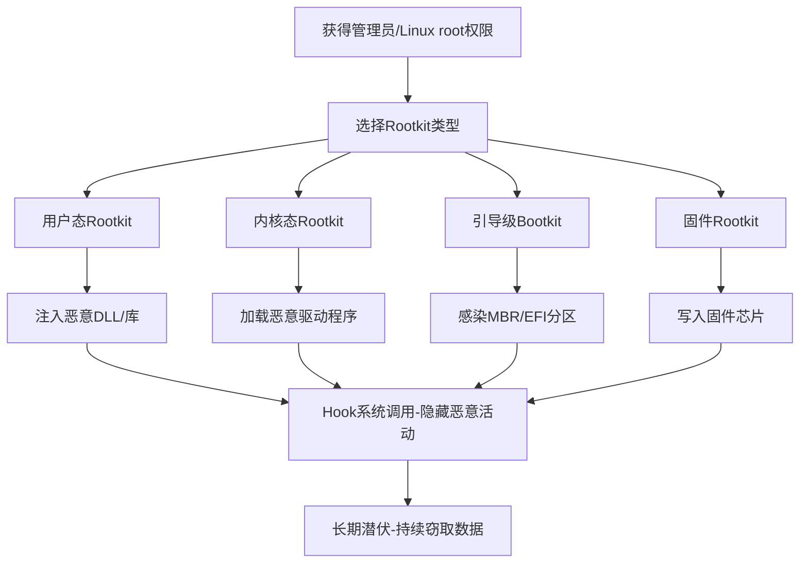

# Rootkit (T1014)

## 一句话通俗理解

Rootkit就像给恶意软件穿上了"隐身衣"——它能让病毒文件、恶意进程在网络里完全消失，杀毒软件和系统管理员都发现不了。

## 难度等级

⭐⭐⭐ 高级（需要深入技术知识）

## 技术描述

Rootkit（T1014）是MITRE ATT&CK框架中隐蔽战术的一种高级技术。

**通俗解释：**
想象一下，你家里进了小偷，但这个小偷有一套"隐身装备"——监控摄像头拍不到他，你回家也看不到他，甚至连警犬都闻不到他的气味。Rootkit就像这个隐身装备，它躲在操作系统的最底层，拦截所有的"查看"请求。当你用任务管理器看进程时，Rootkit把恶意进程从列表中"抹掉"了；当你搜索病毒文件时，Rootkit把文件"藏起来"了。本质上，Rootkit就是操作系统级别的"信息过滤器"。

**技术原理：**
Rootkit通过修改操作系统内核或关键系统调用来实现隐藏。具体步骤如下：

1. **获得高权限**：攻击者首先需要获得管理员或系统级权限，因为修改内核需要最高权限
2. **注入恶意代码**：将恶意代码加载到操作系统内核空间（如作为驱动程序加载）或关键系统进程中
3. **拦截系统调用**：Hook（挂钩）文件系统、进程列表、注册表等关键系统函数的调用入口
4. **过滤返回结果**：当安全工具或管理员查询系统状态时，Rootkit拦截查询结果，删除与恶意活动相关的信息
5. **伪装正常行为**：将过滤后的"干净"结果返回给查询者，一切看起来完全正常

**用途与影响：**
攻击者使用Rootkit的主要目的是长期隐藏高级恶意活动，如APT攻击、数据窃取、间谍活动。Rootkit的危害极大：一旦成功安装，传统的杀毒软件和系统检测工具基本失效，即使重装操作系统也不一定能清除（特别是固件级别的Rootkit）。Rootkit常用于国家级APT组织的高级攻击活动中。

## 子技术列表

**该技术没有定义子技术。**

Rootkit作为一种综合性的隐藏技术，其不同类型（用户态、内核态、引导级、虚拟化、固件）可以通过技术描述中的分类来理解。

## 攻击流程

### 典型攻击流程

```
获得高权限 --> 选择Rootkit类型 --> 安装Rootkit --> 隐藏活动 --> 长期潜伏
```



**步骤详解：**

1. **获得高权限**
   - 通俗描述：攻击者先通过漏洞或钓鱼获得管理员权限
   - 技术细节：利用系统漏洞、社会工程或窃取的凭证提升到SYSTEM/root权限
   - 常用工具：漏洞利用工具包、Mimikatz

2. **选择和安装Rootkit**
   - 通俗描述：根据目标系统选择合适类型的Rootkit并安装
   - 技术细节：通过驱动加载（Windows）或LKM加载（Linux）将Rootkit注入内核
   - 常用工具：自定义驱动、DKOM（直接内核对象操纵）工具

3. **隐藏恶意活动**
   - 通俗描述：Rootkit开始拦截系统查询，隐藏文件、进程和网络连接
   - 技术细节：Hook系统服务调度表（SSDT）、修改内核函数指针
   - 常用工具：System Call Hooking框架

4. **长期潜伏**
   - 通俗描述：攻击者在受害者系统中长期隐藏，持续窃取数据或执行恶意操作
   - 技术细节：定期与C2通信，根据指令执行数据窃取或横向移动
   - 常用工具：自定义后门、Cobalt Strike

## 真实案例

### 案例1：Turla 使用 VBoxDrv.sys Rootkit 隐藏恶意活动（2014-2020）

- **时间**: 2014年-2020年
- **目标**: 政府机构、外交部门、大使馆
- **攻击组织**: Turla（Snake、Uroburos）
- **手法**: Turla开发了极其复杂的Rootkit，利用Oracle VirtualBox的合法签名内核驱动VBoxDrv.sys来隐藏活动。他们将合法签名驱动植入系统目录，将恶意代码注入到驱动加载过程中。Rootkit钩住了文件系统、网络连接和进程列表的内核调用，当管理员使用任务管理器或netstat查看系统时，所有与Turla相关的活动都被过滤掉。这种利用合法签名的策略使Rootkit多年来未被检测到，因为安全产品通常信任VirtualBox的签名驱动。
- **影响**: 多个政府机构数据被窃取，攻击持续数年未被发现
- **参考链接**: [ESET - Turla Light Neuron Project](https://www.welivesecurity.com/2020/05/21/new-turla-light-neuron-project/)

### 案例2：Lazarus 的 Bootkit 持久化技术（2017-2021）

- **时间**: 2017年-2021年
- **目标**: 全球金融机构、加密货币交易所
- **攻击组织**: Lazarus（Hidden Cobra）
- **手法**: Lazarus开发了基于MBR感染的Bootkit，在操作系统启动的早期阶段加载恶意代码。他们通过钓鱼获得初始访问后，修改主引导记录（MBR），将Bootkit代码写入MBR+1到MBR+63扇区。系统重启后，Bootkit在Windows内核加载前获得控制权，挂接系统服务调度表。由于MBR位于磁盘0号扇区（不在系统分区范围内），格式化C盘无法清除此Bootkit。
- **影响**: 长期窃取金融数据，逃避检测多年
- **参考链接**: [ESET - Lazarus Bootkit](https://www.welivesecurity.com/2017/04/04/lazarus-uses-bootkit-to-hide-malware/)

### 案例3：Sony BMG XCP Rootkit 争议（2005年）

- **时间**: 2005年
- **目标**: Sony BMG音乐CD消费者
- **攻击组织**: Sony BMG（合法公司，非APT组织）
- **手法**: Sony BMG在其音乐CD中植入了XCP（Extended Copy Protection）Rootkit，用于防止CD被非法复制。当用户在Windows上播放这些CD时，XCP作为内核级驱动自动安装，隐藏与XCP相关的所有文件、进程和注册表项。虽然初衷是DRM（数字版权管理），但它的行为与恶意Rootkit无异。更严重的是，其不安全驱动为其他恶意软件提供了攻击入口。最终Sony BMG面临多起集体诉讼，被迫召回数百万张CD。
- **影响**: 数百万用户的系统安全受到威胁，Sony BMG声誉严重受损
- **参考链接**: [Wikipedia - Sony BMG copy protection rootkit scandal](https://en.wikipedia.org/wiki/Sony_BMG_copy_protection_rootkit_scandal)

### 案例4：BlackCat/ALPHV 使用内核驱动禁用EDR（2024年）

- **时间**: 2024年
- **目标**: 全球企业
- **攻击组织**: BlackCat (ALPHV)
- **手法**: BlackCat勒索软件团伙在2024年的攻击活动中，使用了签名的恶意内核驱动程序来禁用端点检测与响应（EDR）系统。他们利用了BYOVD（Bring Your Own Vulnerable Driver）技术，将自己携带的带有漏洞但已被签名的内核驱动加载到系统中，然后通过该驱动在内核级别终止EDR进程。由于驱动具有有效的数字签名，Windows加载时不会阻止。这种技术在勒索软件攻击中越来越常见。
- **影响**: 企业EDR系统被禁用后，勒索软件成功加密大量数据
- **参考链接**: [BleepingComputer - BlackCat uses kernel driver to disable EDR](https://www.bleepingcomputer.com/news/security/)

## 红队视角

> ⚠️ **免责声明**：以下内容仅用于合法的安全测试、渗透测试和教育目的。未经授权对他人系统进行测试是违法行为。

### 实战技巧

1. **选择合适的Rootkit类型**
   对于红队测试，推荐从用户态Rootkit开始（如使用LD_PRELOAD或Windows API Hooking），因为设置简单且风险较低。内核态Rootkit需要驱动签名，建议在测试环境中使用测试签名模式。

2. **利用合法签名驱动**
   参考Turla的手法，使用已知的合法签名驱动（如VirtualBox、Wireshark的驱动）作为载体，避免加载自己开发的需要签名的驱动。

3. **结合多种隐藏技术**
   Rootkit应同时隐藏文件、进程、注册表项、网络连接和服务，防止被单一的检测手段发现。

### 常用工具

| 工具名称 | 用途 | 平台 | 链接 |
|----------|------|------|------|
| Meterpreter | 内置Rootkit功能的渗透测试框架 | 跨平台 | https://www.metasploit.com/ |
| DKOM | 直接内核对象操纵，隐藏进程 | Windows | https://github.com/ionescu007/dkom |
| Rootkit Arsenal | Rootkit开发和测试工具集 | Windows | 书籍+代码 |
| rkmit | Linux内核模块Rootkit | Linux | https://github.com/hacksysteam/rkmit |

### 注意事项

- Rootkit开发和测试必须在隔离的虚拟机环境中进行
- 加载未签名内核驱动需要禁用Windows Driver Signature Enforcement
- 部分Rootkit技术会影响系统稳定性，测试前做好快照
- 真实的Rootkit攻击通常需要配合凭证窃取和漏洞利用

## 蓝队视角

### 检测要点

1. **检测内核级别的钩子**
   - 日志来源：Sysmon驱动加载事件、内核完整性检查工具
   - 关注字段：未签名的驱动加载、系统服务调度表（SSDT）修改
   - 异常特征：未知或可疑的驱动加载，特别是来自非标准路径的驱动

2. **跨层级信息比对**
   - 日志来源：操作系统API调用结果 vs 直接磁盘/内存读取
   - 关注字段：文件列表、进程列表、注册表项的差异
   - 异常特征：通过Win32 API看不到但直接读取磁盘存在的文件或进程

3. **检测引导级别感染**
   - 日志来源：UEFI固件测量日志（TPM）、安全启动状态
   - 关注字段：MBR/VBR内容变更、EFI分区文件修改
   - 异常特征：安全启动失败、TPM测量值与基线不符

### 监控建议

- 部署具有内核级别监控能力的EDR解决方案（如通过内核驱动监控驱动加载）
- 启用Windows Defender System Guard运行时监控
- 定期使用Microsoft Defender Offline进行离线扫描
- 使用基于虚拟化的安全技术（VBS）保护内核完整性

## 检测建议

### 网络层检测

**检测方法：** 监控异常的DNS查询和C2通信模式，Rootkit通常需要与外部的C2服务器通信。

**具体规则/命令示例：**
```
# 监控异常的内核驱动下载行为
# 监控网络流量中隐藏的C2通信
```

**示例（Snort/Suricata规则）：**
```
alert tcp $HOME_NET any -> $EXTERNAL_NET any (msg:"可能的Rootkit C2通信 - 异常的驱动相关流量"; content:"|00 00 00 00|"; sid:1014001; rev:1;)
```

### 主机层检测

**检测方法：** 使用专业工具检测内核钩子和隐藏进程。

**Windows事件ID：**
- 事件ID 7045：新服务创建（驱动加载）
- 事件ID 1006：安全中心检测到恶意驱动
- 事件ID 3001：Windows Defender检测到Rootkit

**Linux日志：**
- 日志文件：`/var/log/kern.log`、`/var/log/messages`
- 关键字段：`insmod`、`modprobe`、`init_module` 等模块加载操作

**具体命令示例：**
```bash
# 检测Linux内核模块加载
lsmod | head -20
# 检查异常内核模块
dmesg | grep -i "loading"
# 使用chkrootkit检测Rootkit
chkrootkit
```

### 应用层检测

**检测方法：** 使用行为分析和跨层级信息比对检测Rootkit隐藏行为。

**Sigma规则示例：**
```yaml
title: 可疑内核驱动加载事件
status: experimental
description: 检测来自非标准路径的内核驱动加载
logsource:
    category: driver_load
    product: windows
detection:
    selection:
        ImagePath|contains:
            - '\Temp\'
            - '\Users\'
            - '\AppData\'
    condition: selection
level: high
tags:
    - attack.t1014
```

## 缓解措施

### 优先级1：关键措施

**措施名称：** 启用安全启动（Secure Boot）和可信启动（Trusted Boot）

**具体实施步骤：**
1. 进入BIOS/UEFI设置，启用Secure Boot
2. 确保Windows Trusted Boot功能已启用
3. 使用TPM进行启动完整性度量

**配置示例：**
```
# 检查Secure Boot状态
Confirm-SecureBootUEFI
# 启用Secure Boot（如果支持）
# 在UEFI固件设置中启用 -> 在Windows中使用PowerShell验证
```

### 优先级2：重要措施

**措施名称：** 实施内核完整性保护

**具体实施步骤：**
1. 启用Windows Defender System Guard
2. 配置虚拟化安全（VBS）和Hypervisor Code Integrity（HVCI）
3. 启用驱动程序签名强制（DSE）

### 优先级3：建议措施

**措施名称：** 定期进行Rootkit扫描

**具体实施步骤：**
1. 使用Microsoft Defender Offline定期离线扫描
2. 使用Sysinternals Autoruns检查自动启动
3. 使用GMER或RootkitRevealer进行主动扫描

### MITRE ATT&CK 缓解措施映射

| 缓解措施ID | 缓解措施名称 | 适用性 | 说明 |
|------------|-------------|--------|------|
| M1045 | 代码签名 | 部分适用 | 要求所有驱动程序都有有效签名 |
| M1047 | 审计 | 适用 | 定期审计驱动加载事件 |
| M1018 | 用户账户管理 | 适用 | 最小权限原则，限制驱动安装权限 |

## 动手实验

> ⚠️ **重要提示**：所有实验必须在隔离的实验室环境中进行，禁止对未授权的真实系统进行测试。

### 实验环境准备

**推荐靶场/实验平台：**

| 平台名称 | 类型 | 难度 | 链接 |
|----------|------|------|------|
| HackTheBox | 虚拟靶场 | 高级 | https://www.hackthebox.com/ |
| TryHackMe - Rootkit房间 | CTF | 中级 | https://tryhackme.com/ |

**所需工具：**
- Windows/Linux虚拟机：实验目标系统
- Process Explorer：查看进程和DLL信息
- WinDbg：Windows内核调试器
- chkrootkit/rkhunter：Linux Rootkit检测工具

### 实验1：检测用户态Rootkit（初级）

**实验目标：** 学习如何检测基于LD_PRELOAD的用户态Rootkit

**实验步骤：**
1. 在Linux虚拟机中安装一个简单的LD_PRELOAD Rootkit（如Jynx）
2. 观察正常系统命令（如ps、ls）的输出
3. 启用LD_PRELOAD Rootkit后，再次执行相同命令
4. 使用`ldd`命令查看可执行文件加载的共享库

**预期结果：** Rootkit激活后，ps命令不再显示特定进程，ls不再显示特定文件

**学习要点：** 理解用户态Rootkit的工作原理和检测方法

### 实验2：分析内核态Rootkit（中级）

**实验目标：** 使用调试工具分析内核模块的加载

**实验步骤：**
1. 在Windows虚拟机中加载一个测试内核驱动
2. 使用WinDbg连接到内核调试
3. 使用`lm`命令查看已加载的模块
4. 检查系统服务调度表（SSDT）的完整性

**预期结果：** 可以观察到SSDT表中被修改的函数入口

### 实验3：Rootkit检测挑战（高级）

**实验目标：** 在含有Rootkit的系统中进行取证分析

**实验步骤：**
1. 下载包含Rootkit的CTF挑战镜像
2. 使用多种检测工具（chkrootkit、GMER、Autoruns）进行全面扫描
3. 对比不同检测工具的结果差异
4. 使用内存取证工具（Volatility）分析Rootkit的行为

**预期结果：** 识别出隐藏的进程、文件和注册表项

## 术语解释

| 术语 | 英文原名 | 通俗解释 |
|------|----------|----------|
| Rootkit | Rootkit | 一套工具组合，能让攻击者获得系统的最高权限并隐藏自己的存在，像"隐身衣+万能钥匙" |
| 内核 | Kernel | 操作系统的核心部分，管理所有硬件和软件资源，就像一家公司的总经理 |
| 系统调用 | System Call | 应用程序请求操作系统服务的标准方式，好比去政府部门办事需要填的申请表 |
| SSDT | System Service Dispatch Table | 系统服务调度表，Windows内核中记录所有系统服务地址的表，Rootkit常修改此表来拦截请求 |
| Hook | Hooking | 挂钩技术，在正常函数执行路径上插入自己的代码，像在快递配送路上设置一个检查站 |
| 驱动签名 | Driver Signature | 微软对驱动程序的身份认证，确保驱动来自可信的开发者和未被篡改 |
| DKOM | Direct Kernel Object Manipulation | 直接内核对象操纵，直接修改内核内存中的数据结构来隐藏信息 |
| Bootkit | Bootkit | 引导级的Rootkit，在操作系统启动前就获得控制权，比普通Rootkit更难检测和清除 |

## 参考资料

### 官方文档

- [MITRE ATT&CK - T1014 Rootkit](https://attack.mitre.org/techniques/T1014/)

### 安全报告

- [Turla VBoxDrv Rootkit - ESET](https://www.welivesecurity.com/2020/05/21/new-turla-light-neuron-project/)
- [Lazarus Bootkit Analysis - ESET](https://www.welivesecurity.com/2017/04/04/lazarus-uses-bootkit-to-hide-malware/)
- [ESPecter UEFI Bootkit - ESET](https://www.welivesecurity.com/2021/10/05/uespecter-bootkit-uefi-especter/)
- [MosaicRegressor UEFI Malware - Kaspersky](https://securelist.com/mosaicregressor/98849/)

### 工具与资源

- [GMER - Rootkit检测工具](http://www.gmer.net/)
- [Microsoft - Secure Boot Overview](https://docs.microsoft.com/en-us/windows/security/information-protection/secure-boot/secure-boot-overview)
- [Kernel Rootkit Detection - CrowdStrike](https://www.crowdstrike.com/blog/kernel-rootkit-detection-techniques/)

### 学习资料

- [Windows Internals 7th Edition - 深入了解Windows内核](https://docs.microsoft.com/en-us/sysinternals/learn/windows-internals)
- [Rootkit Arsenal: Escape and Evasion - 书籍](https://www.amazon.com/Rootkit-Arsenal-Escape-Evasion-Corners/dp/144962636X)
