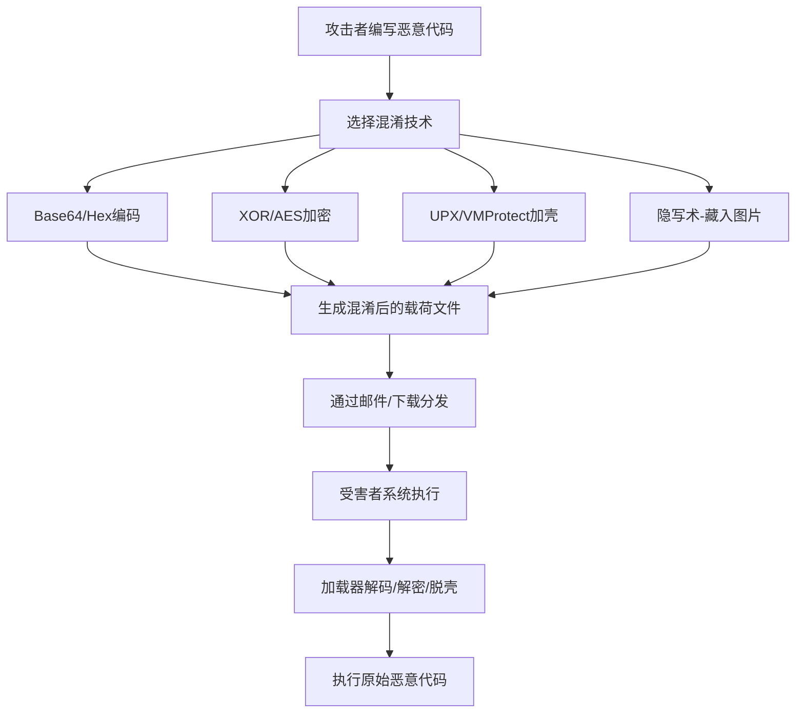

# 混淆文件或信息 (T1027)

## 一句话通俗理解

攻击者把恶意代码包装成普通文件的样子，就像把偷来的东西藏在玩具盒里，即使保安打开盒子也只看到玩具，看不到赃物。

## 难度等级

⭐⭐ 中级（需要一定基础）

## 技术描述

混淆文件或信息（T1027）是MITRE ATT&CK框架中隐蔽战术的一种技术，也是攻击链中使用最广泛的技术之一，几乎所有的恶意软件都会使用某种形式的混淆。

**通俗解释：**
想象你要寄一个危险品，但快递公司会检查包裹内容。你会怎么做？把危险品藏在玩具熊肚子里、用锡纸包裹防扫描、在包装上写"易碎品"让人不敢打开——这就是混淆。在网络安全中，攻击者用类似的方法：把恶意代码进行Base64编码（像用暗号写日记）、用加壳工具压缩（像真空打包）、隐藏在图片里（像隐写术），让安全软件"看到"的是一堆无害的乱码，而不是真正的恶意代码。

**技术原理：**
混淆的基本原理是改变数据的表现形式而不改变其本质。具体方法包括：

1. **编码**：用Base64、Hex等方式将二进制数据转换为文本格式，逃避基于内容的过滤
2. **加密**：使用XOR、AES等算法加密恶意负载，只有加载器才能解密执行
3. **加壳**：使用UPX、VMProtect等工具压缩和混淆可执行文件
4. **隐写术**：将恶意数据隐藏在图片、音频或其他媒体文件中
5. **动态解析**：在运行时才解析API函数地址，避免静态分析发现恶意API调用
6. **HTML走私**：将恶意负载加密嵌入HTML中，在浏览器端解密组装

**用途与影响：**
混淆技术使基于签名检测的传统杀毒软件变得几乎无效。攻击者通过混淆可以：绕过邮件网关的附件扫描、逃避Web应用防火墙的检测、延缓安全分析人员的逆向工程。混淆是攻击者最常用的隐蔽手段之一，99%的恶意软件都使用了某种形式的混淆。

## 子技术列表

**该技术共有 18 个子技术：**

| 子技术ID | 中文名称 | 通俗解释 |
|----------|----------|----------|
| T1027.001 | 二进制填充 | 在恶意文件末尾添加大量无用的垃圾数据，增大文件体积逃避检测 |
| T1027.002 | 软件加壳 | 用压缩工具把恶意程序打包，像把衣服真空压缩节省空间 |
| T1027.003 | 隐写术 | 把恶意代码藏在图片或音频的像素/声音数据中 |
| T1027.004 | 交付后编译 | 发送源代码文件，在目标系统上编译执行（绕过可执行文件检测） |
| T1027.005 | 工具中的指示器移除 | 删除或修改恶意工具中的特征标识，隐藏其真实身份 |
| T1027.006 | HTML走私 | 在HTML中嵌入加密的恶意代码，通过浏览器解密执行 |
| T1027.007 | 动态API解析 | 运行时才计算API地址，避免在导入表中留下痕迹 |
| T1027.008 | 基于混淆的载荷分段 | 把恶意代码切成多段分别混淆，组合起来才是完整代码 |
| T1027.009 | 明文混淆的载荷 | 使用简单的字符串操作（反转、替换）混淆命令 |
| T1027.010 | 命令混淆 | 将命令通过变量替换、字符串拼接等方式打乱 |
| T1027.011 | XOR | 使用XOR（异或）运算加密数据，简单但有效 |
| T1027.012 | LZNT1 | 使用Windows内置的LZNT1压缩算法压缩恶意负载 |
| T1027.013 | 加密/编码 | 使用AES、RC4等标准加密算法保护恶意代码 |
| T1027.014 | 垃圾数据 | 在代码中插入大量无用指令，混淆分析工具 |

## 攻击流程

### 典型攻击流程

```
编写恶意代码 --> 选择混淆方式 --> 生成混淆载荷 --> 分发执行 --> 运行时解码
```



**步骤详解：**

1. **编写恶意代码**
   - 通俗描述：攻击者先写好真正的恶意程序
   - 技术细节：编写DLL、可执行文件或Shellcode
   - 常用工具：Visual Studio、MSFvenom

2. **选择混淆方式**
   - 通俗描述：根据目标环境选择最合适的混淆方法
   - 技术细节：不同的混淆方式有不同的检测回避效果
   - 常用工具：混淆器、加壳器、加密库

3. **生成并分发混淆载荷**
   - 通俗描述：将混淆后的文件通过钓鱼邮件或下载链接发送给受害者
   - 技术细节：将混淆载荷附着在文档或邮件附件中
   - 常用工具：钓鱼工具包、恶意文档生成器

4. **运行时解码执行**
   - 通俗描述：受害者的电脑执行混淆文件时，加载器先解码再运行真正的恶意代码
   - 技术细节：加载器先调用解密函数还原原始代码，再在内存中执行
   - 常用工具：PowerShell反射加载、自定义加载器

## 真实案例

### 案例1：APT41 使用隐写术隐藏恶意负载（2019-2021）

- **时间**: 2019年-2021年
- **目标**: 全球科技公司、游戏行业
- **攻击组织**: APT41（Wicked Panda、Barium）
- **手法**: APT41使用隐写术（T1027.003）将恶意Shellcode嵌入BMP和PNG图片的像素数据中。他们通过自定义加载器从图片文件中提取并执行恶意代码，还使用交错排列技术将恶意代码分散到多张看似无害的图片中，使单张图片的分析无法发现完整恶意内容。该技术用于Bisonal和ShadowPad后门的部署过程。
- **影响**: 多家科技公司数据被窃取，攻击长期未被发现
- **参考链接**: [MITRE - APT41](https://attack.mitre.org/groups/G0096/)

### 案例2：Lazarus 使用多层加壳和XOR混淆（2017-2022）

- **时间**: 2017年-2022年
- **目标**: 金融机构、加密货币交易所
- **攻击组织**: Lazarus
- **手法**: Lazarus广泛使用UPX、ASPack、VMProtect等加壳工具（T1027.002）多次压缩和混淆恶意二进制文件。在WannaCry攻击中，恶意软件经过多层加壳和XOR加密（T1027.011）。Lazarus还使用自定义XOR算法对C2通信加密，每次通信使用动态生成的密钥。
- **影响**: 大量金融数据被盗，全球范围造成巨大经济损失
- **参考链接**: [MITRE - Lazarus](https://attack.mitre.org/groups/G0032/)

### 案例3：TA505 使用HTML走私分发恶意软件（2020-2023）

- **时间**: 2020年-2023年
- **目标**: 全球金融机构、医疗机构
- **攻击组织**: TA505（Clop和LockBit传播者）
- **手法**: TA505广泛使用HTML走私技术（T1027.006）分发FlawedAmmyy RAT、DanaBot等恶意软件。他们将加密的恶意负载嵌入HTML文件，通过JavaScript在浏览器端解密并组装成可执行文件。由于恶意负载在传输过程中是加密的，邮件网关和网络代理的文件扫描无法检测到恶意内容。
- **影响**: 全球数千家企业受到感染
- **参考链接**: [MITRE - T1027.006](https://attack.mitre.org/techniques/T1027/006/)

### 案例4：Black Basta 使用加密和混淆逃避检测（2024-2025）

- **时间**: 2024年-2025年
- **目标**: 全球企业和医疗机构
- **攻击组织**: Black Basta
- **手法**: Black Basta勒索软件团伙在2024-2025年的攻击中，采用了多层混淆技术来逃避EDR检测。他们使用定制的加密算法对勒索软件二进制文件进行加密，只有第一阶段加载器在内存中解密后才暴露出真正的恶意代码。同时，他们在PowerShell脚本中使用复杂的字符串拼接和变量替换混淆技术，使基于签名的检测规则完全失效。
- **影响**: 多家大型企业被加密，勒索金额高达数百万美元
- **参考链接**: [BleepingComputer - Black Basta analysis](https://www.bleepingcomputer.com/)

## 红队视角

> ⚠️ **免责声明**：以下内容仅用于合法的安全测试、渗透测试和教育目的。未经授权对他人系统进行测试是违法行为。

### 实战技巧

1. **分层混淆增加检测难度**
   组合使用编码+加密+加壳的多层混淆方式。例如：先用AES加密载荷，再用Base64编码，最后用UPX加壳。安全产品每破解一层都需要不同的技术。

2. **使用动态API解析逃避导入表检测**
   在运行前不声明要调用的API函数地址，而是通过GetProcAddress动态获取。这样安全工具无法通过静态分析你的导入表来判断你要做什么。

3. **根据目标选择混淆强度**
   针对高安全环境（如银行、政府），使用更强的混淆（如VMProtect + 自定义加密）；针对普通用户，使用基础混淆即可。

### 常用工具

| 工具名称 | 用途 | 平台 | 链接 |
|----------|------|------|------|
| UPX | 可执行文件加壳工具 | 跨平台 | https://upx.github.io/ |
| ConfuserEx | .NET混淆器 | Windows | https://github.com/mkaring/ConfuserEx |
| Shellter | PE文件动态混淆 | Windows | https://www.shellterproject.com/ |
| Invoke-Obfuscation | PowerShell混淆框架 | Windows | https://github.com/danielbohannon/Invoke-Obfuscation |

### 注意事项

- 混淆不是万能的，行为分析EDR仍然可以检测运行时行为
- 过度的混淆可能触发安全产品的"过度混淆"告警
- 确保编码/加密后的载荷能正确解码，否则会导致攻击失败

## 蓝队视角

### 检测要点

1. **检测异常的编码/加密操作**
   - 日志来源：Sysmon进程创建、PowerShell日志
   - 关注字段：命令行中出现Base64长字符串、powershell -EncodedCommand
   - 异常特征：非交互式进程（如word.exe）调用PowerShell执行编码命令

2. **检测加壳可执行文件**
   - 日志来源：文件创建事件、PE解析日志
   - 关注字段：UPX、VMProtect等加壳工具的PE特征
   - 异常特征：文件熵值（随机性）过高，表示经过了加密或压缩

3. **检测HTML走私**
   - 日志来源：浏览器日志、进程创建、网络代理日志
   - 关注字段：浏览器创建可执行文件、JS解密操作
   - 异常特征：浏览器下载HTML后启动PowerShell或生成exe文件

### 监控建议

- 启用AMSI（反恶意软件扫描接口）对所有脚本内容进行实时扫描
- 配置攻面减少（ASR）规则阻止Office应用创建子进程
- 监控PowerShell的ScriptBlock日志记录
- 部署支持行为分析的EDR而非仅依赖签名检测

## 检测建议

### 网络层检测

**检测方法：** 监控网络流量中的高熵值内容（加密/压缩数据的特征）。

**具体规则/命令示例：**
```
# 检测base64编码的PowerShell下载命令
suricata规则示例：
alert http any any -> $HOME_NET any (msg:"可能的Base64编码恶意代码"; content:"|2f|e|2f|"; within:50; sid:1027001; rev:1;)
```

### 主机层检测

**Windows事件ID：**
- 事件ID 4688：进程创建（关注powershell -EncodedCommand）
- 事件ID 4104：PowerShell ScriptBlock日志
- 事件ID 1 (Sysmon)：进程创建，关注父进程为Office应用的脚本执行

**具体命令示例：**
```bash
# 检测高熵值文件（可能被加密或加壳）
# 使用PowerShell检测高熵文件
Get-ChildItem -Path C:\Users\ -Recurse -Filter *.exe | 
    Select-Object FullName, Length | 
    Where-Object {$_.Length -gt 500KB}
```

### 应用层检测

**Sigma规则示例：**
```yaml
title: PowerShell 编码命令执行
status: experimental
description: 检测使用-EncodedCommand参数的PowerShell执行
logsource:
    category: process_creation
    product: windows
detection:
    selection:
        CommandLine|contains: '-EncodedCommand'
    condition: selection
level: medium
tags:
    - attack.t1027
```

## 缓解措施

### 优先级1：关键措施

**措施名称：** 启用AMSI和脚本内容扫描

**具体实施步骤：**
1. 确保Windows Defender的AMSI功能已启用
2. 配置组策略强制启用PowerShell ScriptBlock日志
3. 启用攻面减少（ASR）规则

### 优先级2：重要措施

**措施名称：** 实施应用程序白名单

**具体实施步骤：**
1. 配置Windows Defender Application Control（WDAC）
2. 限制脚本解释器（PowerShell、WScript）的使用
3. 禁用Office宏或仅允许签名的宏执行

### 优先级3：建议措施

**措施名称：** 网络层面内容过滤

**具体实施步骤：**
1. 配置邮件网关对附件进行深度内容分析
2. 部署网络代理对HTTPS流量进行解密检查
3. 使用沙箱技术分析可疑文件

### MITRE ATT&CK 缓解措施映射

| 缓解措施ID | 缓解措施名称 | 适用性 | 说明 |
|------------|-------------|--------|------|
| M1040 | 终端上防止感染 | 适用 | AMSI实时扫描脚本内容，阻止混淆载荷执行 |
| M1045 | 软件限制策略 | 适用 | AppLocker限制未授权脚本和可执行文件运行 |
| M1021 | 限制基于Web的内容 | 部分适用 | 邮件网关深度内容分析，检测附件混淆 |
| M1037 | 过滤网络流量 | 部分适用 | 网络代理对HTTPS流量解密检查 |

## 动手实验

> ⚠️ **重要提示**：所有实验必须在隔离的实验室环境中进行，禁止对未授权的真实系统进行测试。

### 实验环境准备

**推荐靶场/实验平台：**

| 平台名称 | 类型 | 难度 | 链接 |
|----------|------|------|------|
| TryHackMe - Obfuscation Principles | CTF | 初级 | https://tryhackme.com/ |

**所需工具：**
- Kali Linux虚拟机：攻击方
- Windows虚拟机：目标方
- CyberChef：编码/解码工具

### 实验1：Base64编码绕过基础检测（初级）

**实验目标：** 学习如何使用Base64编码混淆命令

**实验步骤：**
1. 在Kali中执行 `echo "恶意命令" | base64` 编码一个命令
2. 在Windows中使用PowerShell解码执行：`powershell -EncodedCommand <base64字符串>`
3. 观察Process Monitor中该进程的创建事件

**预期结果：** 编码后的命令在命令行参数中显示为乱码，绕过基于关键词的检测

### 实验2：使用XOR加密解密恶意载荷（中级）

**实验目标：** 学习使用XOR加密保护载荷

**实验步骤：**
1. 编写一个简单的C程序，对一条消息进行XOR加密
2. 将加密后的数据保存为文件
3. 编写加载器程序，运行时解密并执行
4. 使用静态分析工具（如PE Studio）检查加密前后的差异

**预期结果：** 加密后的文件中没有明显的恶意字符串

## 术语解释

| 术语 | 英文原名 | 通俗解释 |
|------|----------|----------|
| 混淆 | Obfuscation | 故意把代码写得复杂难懂，就像用密码写日记，别人看不懂但你明白 |
| 加壳 | Packing | 把程序压缩打包，像把衣服真空压缩，需要解压后才能看到原貌 |
| Base64 | Base64 Encoding | 一种将二进制数据转换为文本的编码方式，像把中文拼音转成英文字母 |
| XOR | XOR Encryption | 一种简单的加密方法，用同一个密钥加密和解密，像用密码本加密信息 |
| 隐写术 | Steganography | 把秘密信息藏在普通文件中，像把密信用隐形墨水写在报纸上 |
| 熵值 | Entropy | 衡量数据随机程度的指标，加密/压缩过的数据熵值很高，像是"看起来很乱"的程度 |
| AMSI | Anti-Malware Scan Interface | Windows的反恶意软件扫描接口，能在脚本执行前扫描内容 |
| HTML走私 | HTML Smuggling | 在HTML中隐藏恶意代码，利用JavaScript在浏览器端解密执行 |

## 参考资料

### 官方文档

- [MITRE ATT&CK - T1027 Obfuscated Files or Information](https://attack.mitre.org/techniques/T1027/)

### 安全报告

- [HTML Smuggling Surges - Microsoft](https://www.microsoft.com/security/blog/2021/01/20/html-smuggling-surges/)
- [APT41 - Mandiant Report](https://www.mandiant.com/resources/apt41-global-cyber-espionage)

### 工具与资源

- [CyberChef - 在线编码/解码工具](https://gchq.github.io/CyberChef/)
- [Invoke-Obfuscation - PowerShell混淆工具](https://github.com/danielbohannon/Invoke-Obfuscation)
- [LOLBAS Project](https://lolbas-project.github.io/)
