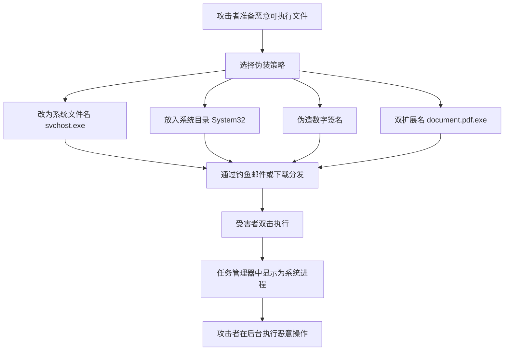

# 伪装 (T1036)

## 一句话通俗理解

攻击者把恶意程序改名成系统文件的名字，就像小偷穿上保安制服混进大楼，门卫会以为他是自己人。

## 30秒速查卡

| 维度 | 你需要知道的 |
|------|-------------|
| 这是什么？ | 把恶意程序改名成系统文件名、放在系统目录、伪造签名，让安全软件以为它是合法文件 |
| 为什么危险？ | 基于文件名和路径的白名单检测完全失效，攻击者能在眼皮底下活动 |
| 谁需要关心？ | 安全运维人员、EDR工程师、恶意软件分析师 |
| 你的第一步防御 | 检查系统目录外是否存在系统进程名（如非System32下的svchost.exe） |
| 如果只做一件事 | 监控进程创建事件，比对进程名与实际路径是否匹配 |

## 难度等级

⭐⭐ 中级（需要一定基础）

## 技术描述

伪装（T1036）是MITRE ATT&CK框架中隐蔽战术的一种技术，也是最常见的防御规避手段之一。

**通俗解释：**
想象一个小偷想进入一栋办公楼。如果他直接穿着黑衣蒙面闯入，保安立刻会发现。但如果他穿上和保安一样的制服、戴上有公司logo的工牌、拿着文件夹假装在打电话，保安可能还会向他敬礼。伪装技术就是这个道理——攻击者把自己的恶意程序改名成系统文件的名字（如svchost.exe）、放在系统目录下、甚至伪造数字签名，让安全软件以为它是合法文件。

**技术原理：**
伪装的核心是利用了系统对已知合法文件的信任。当安全软件扫描文件时，通常会信任签名过的系统文件。攻击者利用这一点：

1. **文件名伪装**：把恶意exe改名为svchost.exe、rundll32.exe等系统文件名
2. **路径伪装**：把恶意文件放在C:\Windows\System32\等系统目录下
3. **签名伪装**：使用盗取的数字证书给恶意文件签名，让它看起来来自可信厂商
4. **扩展名伪装**：使用双扩展名（如document.pdf.exe），Windows默认隐藏已知扩展名

**用途与影响：**
伪装技术让攻击者能绕过基于文件名和路径的白名单检测。在真实的网络攻击中，几乎所有的恶意软件都会使用某种形式的伪装。当安全产品和系统管理员看到的是"svchost.exe"（合法系统进程）而不是"malware.exe"时，攻击者就能在眼皮底下自由活动。

## 子技术列表

**该技术共有 9 个子技术：**

| 子技术ID | 中文名称 | 通俗解释 |
|----------|----------|----------|
| T1036.001 | 无效代码签名 | 为恶意软件伪造或盗用数字签名 |
| T1036.002 | 从右至左覆盖 | 用特殊字符让文件名"反过来"显示，如evilcod.exe显示为evil.doc |
| T1036.003 | 重命名系统工具 | 把恶意程序命名为系统工具名，如svchost.exe |
| T1036.004 | 伪装任务/服务 | 创建名称像Windows Update一样的恶意服务 |
| T1036.005 | 匹配合法名称/位置 | 在合法软件的安装目录放置恶意文件 |
| T1036.006 | 文件名后加空格 | 在文件名后加空格隐藏真实扩展名 |
| T1036.007 | 双扩展名 | 文件命名为document.pdf.exe，系统隐藏exe后显示为pdf |
| T1036.008 | 伪装文件类型 | 修改文件头部信息，使exe文件看起来像图片或文档 |
| T1036.009 | 破坏父映像路径 | 在路径中用特殊字符混淆进程树关系 |

## 攻击流程

### 典型攻击流程

```
准备恶意文件 --> 伪装文件名/位置 --> 分发执行 --> 混入正常进程
```



**步骤详解：**

1. **准备恶意文件**
   - 通俗描述：攻击者创建后门或木马程序
   - 技术细节：使用MSFvenom或自定义开发后门
   - 常用工具：MSFvenom、Cobalt Strike

2. **伪装策略**
   - 通俗描述：把恶意文件伪装成合法系统文件
   - 技术细节：改名、改路径、伪造签名
   - 常用工具：文件重命名脚本、签名伪造工具

3. **分发并执行**
   - 通俗描述：通过钓鱼邮件或恶意网站发送给受害者
   - 技术细节：用户双击后，恶意程序以系统文件名运行
   - 常用工具：钓鱼框架、恶意文档

## 真实案例

### 案例1：NotPetya 伪装为CHKDSK磁盘检查工具（2017）

- **时间**: 2017年6月
- **目标**: 全球企业，特别是乌克兰
- **攻击组织**: Sandworm
- **手法**: NotPetya勒索软件在加密过程中将自己伪装成Windows磁盘检查工具（CHKDSK）。当被感染系统重启时，显示一个看似合法的CHKDSK界面和进度条，实际上在后台执行硬盘加密操作。许多IT管理员将这个界面误认为是正常的系统维护，没有采取任何阻止措施。
- **影响**: 全球损失超过100亿美元
- **参考链接**: [CrowdStrike - NotPetya](https://www.crowdstrike.com/blog/meet-notpetya-a-wiper-not-a-ransomware/)

### 案例2：Lazarus 使用双扩展名钓鱼银行员工（2018-2020）

- **时间**: 2018年-2020年
- **目标**: 全球金融机构员工
- **攻击组织**: Lazarus
- **手法**: Lazarus发送钓鱼邮件，附件名为Salary_Structure.pdf.exe（T1036.007双扩展名）或2020_Bonus.xls.js。当收件人打开附件时，恶意JavaScript或可执行文件被执行，下载并安装远程访问木马。Windows默认隐藏已知扩展名，用户只看到Salary_Structure.pdf。
- **影响**: 多家银行资金被盗
- **参考链接**: [CISA - Lazarus Advisory](https://www.cisa.gov/news-events/cybersecurity-advisories/aa20-239a)

### 案例3：APT29 使用伪装系统工具进行后门活动（2020-2021）

- **时间**: 2020年-2021年
- **目标**: 美国政府机构、科技公司
- **攻击组织**: APT29（Cozy Bear）
- **手法**: APT29在SolarWinds攻击的后渗透阶段，使用多种伪装技术隐藏工具。他们将后门命名为与合法服务相似的名字，如"Windows Update Service"或"Microsoft Security Essentials"。后门文件放在C:\Windows\System32\Tasks\等系统目录下（T1036.005），与正常系统任务混在一起，管理人员很难发现异常。
- **影响**: 美国政府多个部门数据泄露
- **参考链接**: [CrowdStrike - SUNBURST Analysis](https://www.crowdstrike.com/blog/sunspot-malware-technical-analysis/)

### 案例4：BlackCat 使用伪造的Windows更新进行伪装（2024年）

- **时间**: 2024年
- **目标**: 全球企业
- **攻击组织**: BlackCat (ALPHV)
- **手法**: BlackCat勒索软件在2024年的攻击活动中，将其恶意负载命名为MicrosoftWindowsUpdate.exe，并将其放置在C:\Windows\Temp目录下。当受害者检查任务管理器时，看到的进程名看起来像是合法的Windows更新进程。同时，他们还使用了从代码签名商店窃取的证书来签名恶意驱动程序（T1036.001）。
- **影响**: 多家大型企业被勒索
- **参考链接**: [BleepingComputer - BlackCat TTPs](https://www.bleepingcomputer.com/)

## 红队视角

> ⚠️ **免责声明**：以下内容仅用于合法的安全测试、渗透测试和教育目的。未经授权对他人系统进行测试是违法行为。

> ⚠️ **免责声明**：以下内容仅用于合法的安全测试和渗透测试。

### 实战技巧

1. **选择不易被怀疑的伪装名**
   避免使用svchost.exe等高度知名的系统进程名（EDR会专门监控），推荐使用第三方软件的进程名如chrome.exe、java.exe、wlmail.exe。

2. **路径和名称要一致**
   如果命名为svchost.exe，就要放在C:\Windows\System32\下，而不是放在桌面上。否则反而会引起怀疑。

3. **时间戳也要伪装**
   修改文件的时间戳，使其创建时间和修改时间与同目录下的其他合法文件一致。

### 常用工具

| 工具名称 | 用途 | 平台 | 链接 |
|----------|------|------|------|
| ChangeTimestamp | 修改文件时间戳 | Windows | https://github.com/0x90d/ChangeTimestamp |
| SigThief | 从合法文件中提取签名 | Windows | https://github.com/secretsquirrel/SigThief |
| Metasploit | 内置多种伪装技术 | 跨平台 | https://www.metasploit.com/ |

### 注意事项

- 合法签名提取后附加到恶意文件，虽然可以绕过部分检测，但无法通过严格的签名验证
- 在部署前测试伪装后的文件能否正常运行，避免因兼容性问题导致失败

## 蓝队视角

### 检测要点

1. **检测文件路径不一致**
   - 日志来源：Sysmon事件ID 1（进程创建）
   - 关注字段：进程路径与进程名是否匹配
   - 异常特征：svchost.exe不在C:\Windows\System32\下运行

2. **检测签名异常**
   - 日志来源：文件创建事件、代码完整性日志
   - 关注字段：数字签名是否有效、签名者信息
   - 异常特征：显示为谷歌签名的程序却在执行系统级别的操作

3. **检测双扩展名**
   - 日志来源：文件创建事件、邮件附件日志
   - 关注字段：文件名中的多个扩展名
   - 异常特征：.pdf.exe、.doc.js等可疑扩展名组合

### 监控建议

- 配置Windows显示完整的文件扩展名（不隐藏已知扩展名）
- 使用Sysmon监控所有进程创建事件，关注异常路径的"系统进程"
- 部署EDR解决方案监控进程树和文件完整性

## 检测建议

**用人话说：** 伪装检测就像检查身份证和真人是否对得上。如果一个叫"svchost.exe"的进程不在C:\Windows\System32目录下，或者一个文件的数字签名是假的，那就很可疑。正常系统文件不会到处乱跑，只有伪装的才会。

### 网络层检测

**检测方法：** 监控网络流量中的文件下载，检测具有可疑文件名的可执行文件。

### 主机层检测

**Windows事件ID：**
- 事件ID 4688 (Windows安全审计)：进程创建
- 事件ID 1 (Sysmon)：进程创建
- 事件ID 7 (Sysmon)：DLL加载

**具体命令示例：**
```bash
# 使用PowerShell查找系统目录外的"svchost.exe"
Get-WmiObject Win32_Process | Where-Object {$_.Name -eq "svchost.exe" -and $_.ExecutablePath -notlike "C:\Windows\System32\*"}
```

### 应用层检测

**Sigma规则示例：**
```yaml
title: 系统目录外的系统进程
status: experimental
description: 检测在非标准路径运行的系统进程名
logsource:
    category: process_creation
    product: windows
detection:
    selection:
        Image|endswith: '\svchost.exe'
    filter:
        Image|startswith: 'C:\Windows\System32\'
    condition: selection and not filter
level: high
tags:
    - attack.t1036
```

## 缓解措施

### 优先级1：关键措施

**措施名称：** 实施应用程序白名单（WDAC/AppLocker）

### 优先级2：重要措施

**措施名称：** 启用增强型安全配置

**具体实施步骤：**
1. 配置Windows显示完整文件扩展名
2. 启用攻面减少（ASR）规则阻止Office创建子进程

### 优先级3：建议措施

**措施名称：** 定期审计系统进程和服务

### MITRE ATT&CK 缓解措施映射

| 缓解措施ID | 缓解措施名称 | 适用性 | 说明 |
|------------|-------------|--------|------|
| M1045 | 软件限制策略 | 适用 | AppLocker/WDAC阻止非授权程序执行，防止文件名伪装绕过 |
| M1038 | 执行预防 | 适用 | 攻面减少（ASR）规则阻止Office创建子进程 |
| M1047 | 审计 | 适用 | 启用进程创建审计（事件ID 4688），监控异常路径的系统进程 |
| M1029 | 远程数据存储 | 部分适用 | 限制可移动介质上的程序执行 |

## 动手实验

> ⚠️ **重要提示**：所有实验必须在隔离的实验室环境中进行，禁止对未授权的真实系统进行测试。

### 实验环境准备

**所需工具：** Windows虚拟机、Process Explorer、Sysmon

### 实验1：创建并检测伪装进程（初级）

**实验步骤：**
1. 复制cmd.exe到桌面，改名为svchost.exe
2. 运行这个"假"的svchost.exe
3. 使用Process Explorer查看进程路径

**预期结果：** Process Explorer显示svchost.exe运行在桌面上而非System32目录下

## 术语解释

| 术语 | 英文原名 | 通俗解释 |
|------|----------|----------|
| 伪装 | Masquerading | 给恶意软件"换马甲"，让它看起来像合法程序 |
| LOLBin | Living Off the Land Binary | 系统自带的合法程序，攻击者利用它们来做坏事 |
| RTLO | Right-to-Left Override | 一个看不见的特殊字符，能让文件名倒着显示 |
| 双扩展名 | Double Extension | 如file.pdf.exe，利用系统隐藏扩展名显示为pdf |

## 参考资料

- [MITRE ATT&CK - T1036 Masquerading](https://attack.mitre.org/techniques/T1036/)
- [CISA - Lazarus Malware Analysis](https://www.cisa.gov/news-events/cybersecurity-advisories/aa20-239a)
- [LOLBAS Project](https://lolbas-project.github.io/)
