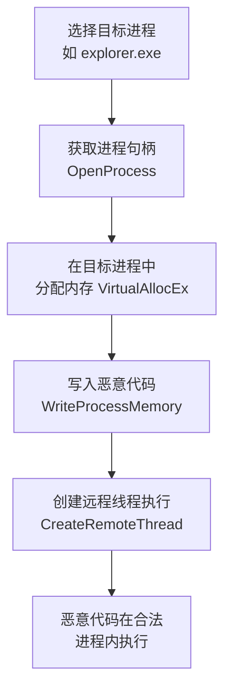

# 进程注入 (T1055)

## 一句话通俗理解

攻击者把恶意代码藏到合法程序（如浏览器、杀毒软件）的内部运行，就像小偷躲进你的车里，警察查车时看到的是你而不是小偷。

## 难度等级

⭐⭐⭐ 高级（需要深入技术知识）

## 技术描述

进程注入（T1055）是MITRE ATT&CK框架中隐蔽战术的一种高级技术。

**通俗解释：**
假设你开车进入一个安保严密的军事基地。门口的保安会检查你的身份——你是合法登记的访客，可以进入。但如果你的后备箱里藏了一个人，保安不会检查后备箱。进程注入就是这个道理：攻击者不创建自己的进程（容易被发现），而是把恶意代码注入到已经运行的合法进程中（如svchost.exe、explorer.exe）。安全软件检查进程列表时，看到的只是合法的系统进程。

**技术原理：**
Windows提供了多个API来操作其他进程的内存空间。攻击者利用这些API实现注入：

1. **打开目标进程**：使用OpenProcess获取目标进程的句柄
2. **在目标进程分配内存**：使用VirtualAllocEx在对方进程空间中分配内存
3. **写入恶意代码**：使用WriteProcessMemory将恶意代码写入分配的内存
4. **创建远程线程执行**：使用CreateRemoteThread让目标进程执行恶意代码

**用途与影响：**
进程注入可以让攻击者绕过应用程序白名单、以高权限进程的身份执行操作、逃避EDR的行为监控。它是高级恶意软件和APT组织的核心武器。

## 子技术列表

**该技术共有 12 个子技术：**

| 子技术ID | 中文名称 | 通俗解释 |
|----------|----------|----------|
| T1055.001 | DLL注入 | 让目标进程加载恶意DLL文件 |
| T1055.002 | PE注入 | 把完整的可执行文件注入到目标进程中 |
| T1055.003 | 线程执行劫持 | 劫持目标进程中已有的线程来执行恶意代码 |
| T1055.004 | 异步过程调用 | 利用APC机制让目标线程执行恶意代码 |
| T1055.005 | 线程本地存储 | 利用TLS回调在目标进程中执行代码 |
| T1055.006 | Ptrace系统调用 | Linux下使用ptrace附加到目标进程 |
| T1055.007 | Proc内存 | 通过/proc文件系统操作进程内存 |
| T1055.008 | VDSO劫持 | 在Linux中劫持VDSO区域注入代码 |
| T1055.009 | Proc内存 | 通过/proc/`<pid>`/mem写入恶意代码 |
| T1055.010 | 额外窗口内存注入 | 利用Windows窗口内存存储恶意代码 |
| T1055.011 | 进程镂空 | 创建合法进程后替换其内存为恶意代码 |
| T1055.012 | 进程双胞胎 | 挂起合法进程，修改其内存后恢复执行 |

## 攻击流程

### 典型攻击流程

```
选择目标进程 --> 获取进程权限 --> 分配内存 --> 写入代码 --> 远程执行
```



**步骤详解：**

1. **选择目标进程**
   - 通俗描述：找一个不会引起怀疑的进程作为"宿主"
   - 技术细节：通常选择系统进程（svchost.exe）或常用软件进程（explorer.exe）
   - 常用工具：Process Explorer查看可用进程

2. **获取权限并写入代码**
   - 通俗描述：获得目标进程的操作权限，把恶意代码写进去
   - 技术细节：使用OpenProcess获取PROCESS_ALL_ACCESS权限，VirtualAllocEx分配内存
   - 常用工具：自定义注入工具、Cobalt Strike

3. **远程执行**
   - 通俗描述：让目标进程运行你的恶意代码
   - 技术细节：CreateRemoteThread创建远程线程执行
   - 常用工具：Metasploit的migrate命令

## 真实案例

### 案例1：FIN7 使用进程注入部署后门（2018-2020）

- **时间**: 2018年-2020年
- **目标**: 全球餐饮、酒店和零售行业
- **攻击组织**: FIN7（Carbanak）
- **手法**: FIN7使用PowerShell脚本将Shellcode注入到explorer.exe和svchost.exe中，绕过应用程序白名单和终端检测。工具集包含多个注入模块，能够执行DLL注入和PE注入，在目标网络中长期驻留窃取支付卡数据。
- **参考链接**: [MITRE - FIN7](https://attack.mitre.org/groups/G0046/)

### 案例2：Lazarus 使用进程镂空技术（2019-2022）

- **时间**: 2019年-2022年
- **目标**: 加密货币交易所、金融机构
- **攻击组织**: Lazarus
- **手法**: Lazarus使用进程镂空（Process Hollowing，T1055.011）执行恶意代码。他们将svchost.exe以挂起状态创建，用恶意代码替换该进程的内存，然后恢复执行。安全产品难以区分恶意进程与合法系统进程。
- **参考链接**: [MITRE - Lazarus](https://attack.mitre.org/groups/G0032/)

### 案例3：APT29 使用APC注入（2020-2021）

- **时间**: 2020年-2021年
- **目标**: 美国政府机构、智库
- **攻击组织**: APT29（Cozy Bear）
- **手法**: APT29使用异步过程调用（APC，T1055.004）注入技术。利用QueueUserAPC函数将恶意代码排队到合法线程中，当目标线程进入可警报等待状态时执行恶意负载。这种注入方式不会产生新的进程或线程，隐蔽性极高。
- **参考链接**: [MITRE - APT29](https://attack.mitre.org/groups/G0016/)

### 案例4：Black Basta 使用进程注入逃避EDR（2024年）

- **时间**: 2024年
- **目标**: 全球企业
- **攻击组织**: Black Basta
- **手法**: Black Basta勒索软件团伙在2024年的攻击中大量使用进程注入技术。他们首先通过系统二进制代理执行（T1218）启动合法进程，然后使用CreateRemoteThread将勒索软件负载注入到该进程的内存空间中。所有加密操作都在合法进程的上下文中执行，EDR看到的只是正常进程的读写操作。
- **参考链接**: [Trend Micro - Black Basta](https://www.trendmicro.com/)

## 红队视角

> ⚠️ **免责声明**：以下内容仅用于合法的安全测试、渗透测试和教育目的。未经授权对他人系统进行测试是违法行为。

### 实战技巧

1. **选择目标进程有讲究**
   避免注入到高知名度进程（如lsass.exe），EDR会重点监控。建议注入到第三方软件进程或不太受关注的服务进程。

2. **内存权限要及时修改**
   注入后及时将内存权限从RWX改回RX，避免被内存扫描检测到可写可执行的异常内存区域。

### 常用工具

| 工具名称 | 用途 | 平台 | 链接 |
|----------|------|------|------|
| Cobalt Strike | 内置多种注入技术 | Windows | https://www.cobaltstrike.com/ |
| Meterpreter | migrate命令注入到其他进程 | Windows | https://www.metasploit.com/ |
| PowerSploit | PowerShell注入模块 | Windows | https://github.com/PowerShellMafia/PowerSploit |

### 注意事项

- 注入到受保护进程（如PPL）需要额外的驱动或内核级操作，风险极高
- 某些EDR会拦截CreateRemoteThread，可以考虑使用APC注入或线程劫持替代
- 内存中的恶意代码在系统重启后会丢失，需配合持久化机制

## 蓝队视角

### 检测要点

1. **监控远程线程创建**
   - 日志来源：Sysmon事件ID 8（CreateRemoteThread）
   - 异常特征：非管理员工具创建远程线程

2. **检测异常内存分配**
   - 日志来源：ETW内存分配日志
   - 关注字段：VirtualAllocEx被跨进程调用

### 监控建议

- 使用Sysmon事件ID 8监控CreateRemoteThread的跨进程调用
- 监控WriteProcessMemory和VirtualAllocEx的组合使用
- 检测进程以挂起状态创建后内存被修改（进程镂空特征）
- 部署支持内存扫描的EDR解决方案，定期扫描进程内存中的异常代码段
- 关注异常的内存权限变化（从RWX到RX的修改）

## 检测建议

### 网络层检测

**检测方法：** 监控被注入进程的异常网络连接行为，特别是非浏览器进程发起HTTP/S通信、或系统进程（如svchost.exe、lsass.exe）建立到外部IP的出站连接。

**具体规则/命令示例：**
```
# 检测系统进程发起异常HTTP请求
suricata -r traffic.pcap --rule "alert tcp $HOME_NET any -> $EXTERNAL_NET $HTTP_PORTS (msg:\"Suspicious svchost.exe HTTP\"; flow:to_server; content:\"svchost\"; nocase; sid:1000010;)"

# 检测非浏览器进程的HTTPS beacon行为
zeek -r traffic.pcap ssl.log | grep -v "browser.exe" | grep "SSL"
```

### 主机层检测

**Windows事件ID：**
- 事件ID 8 (Sysmon)：CreateRemoteThread远程线程创建
- 事件ID 10 (Sysmon)：进程内存访问
- 事件ID 4688：进程创建（监控以挂起状态创建的进程）
- 事件ID 1653 (ETW)：内存分配事件

**具体命令示例：**
```bash
# 使用PowerShell查询Sysmon事件ID 8（远程线程创建）
Get-WinEvent -FilterHashtable @{LogName='Microsoft-Windows-Sysmon/Operational';Id=8} | 
    Select-Object TimeCreated, Message
```

### 应用层检测

**Sigma规则示例：**
```yaml
title: 检测CreateRemoteThread跨进程注入
status: experimental
description: 检测非标准进程创建远程线程的可疑行为
logsource:
    category: process_creation
    product: windows
detection:
    selection:
        EventID: 8
        StartModule|endswith:
            - '\rundll32.exe'
            - '\svchost.exe'
            - '\explorer.exe'
        SourceProcessId|endswith:
            - 'winword.exe'
            - 'excel.exe'
            - 'outlook.exe'
            - 'powershell.exe'
    condition: selection
level: high
tags:
    - attack.t1055
```

## 缓解措施

### 优先级1：关键措施

**措施名称：** 启用Sysmon和ETW监控

**具体实施步骤：**
1. 部署Sysmon并启用事件ID 8（CreateRemoteThread）监控
2. 配置ETW（Event Tracing for Windows）监控内存分配API调用
3. 部署支持内存扫描的EDR解决方案

### 优先级2：重要措施

**措施名称：** 实施应用程序白名单

**具体实施步骤：**
1. 使用WDAC（Windows Defender Application Control）限制未授权程序运行
2. 配置攻面减少（ASR）规则阻止Office应用创建子进程
3. 限制PowerShell和WScript的执行环境

### 优先级3：建议措施

**措施名称：** 加固系统配置

**具体实施步骤：**
1. 启用Credential Guard保护LSASS进程
2. 配置受保护的进程轻量级（PPL）保护关键系统进程
3. 定期更新系统补丁和EDR规则

### MITRE ATT&CK 缓解措施映射

| 缓解措施ID | 缓解措施名称 | 适用性 | 说明 |
|------------|-------------|--------|------|
| M1040 | 终端上防止感染 | 适用 | EDR内存扫描检测注入代码 |
| M1045 | 软件限制策略 | 适用 | WDAC/AppLocker限制未授权程序 |
| M1026 | 权限审计 | 部分适用 | 限制SeDebugPrivilege等敏感权限 |
| M1038 | 执行预防 | 适用 | ASR规则阻止Office创建子进程 |

## 动手实验

> ⚠️ **重要提示**：所有实验必须在隔离的实验室环境中进行，禁止对未授权的真实系统进行测试。

### 实验1：使用Meterpreter进行进程注入（中级）

**实验步骤：**
1. 在Kali中启动MSF并生成Payload
2. 在Windows目标上执行获得Meterpreter会话
3. 使用`migrate`命令将会话注入到explorer.exe
4. 观察Process Explorer中进程的变化

## 术语解释

| 术语 | 英文原名 | 通俗解释 |
|------|----------|----------|
| 进程注入 | Process Injection | 把恶意代码放到合法程序里运行，像把偷来的东西藏在别人的包里 |
| 进程镂空 | Process Hollowing | 创建一个空白的新进程，然后填入恶意代码，像做个假人换掉真人 |
| APC | Asynchronous Procedure Call | 异步过程调用，一种让线程在特定时刻执行代码的机制 |

## 参考资料

- [MITRE ATT&CK - T1055 Process Injection](https://attack.mitre.org/techniques/T1055/)
- [Elastic - Process Injection Detection](https://www.elastic.co/blog/process-injection-detection)
