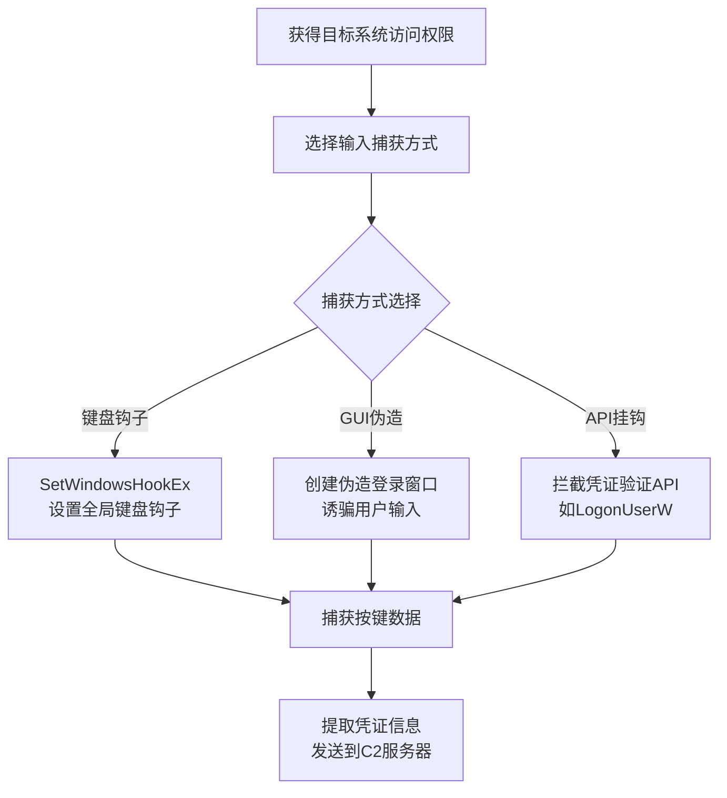

# 输入捕获 (T1056)

## 一句话通俗理解

攻击者在你电脑上装了一个"偷看器"，你敲的每一个键（包括密码）都被悄悄记录下来，就像有人在你背后看你输入银行卡密码。

## 30秒速查卡

| 维度 | 你需要知道的 |
|------|-------------|
| 这是什么？ | 通过键盘记录、屏幕截图、GUI欺骗等方式窃取用户输入的密码、账号等敏感信息 |
| 为什么危险？ | 直接获取用户输入的明文凭证，绕过加密传输的安全措施 |
| 谁需要关心？ | 安全运维人员、SOC分析师、恶意软件分析师 |
| 你的第一步防御 | 监控异常的键盘钩子（SetWindowsHookEx）和屏幕捕获API调用 |
| 如果只做一件事 | 检查是否有进程注册了全局键盘钩子，或频繁截屏但无正当理由 |

## 难度等级

⭐⭐ 中级（需要一定基础）

## 技术描述

输入捕获（T1056）是MITRE ATT&CK框架中隐蔽战术的一种技术。

**通俗解释：**
想象你在ATM机上取钱时，身后有人偷看你的密码——这就是"肩窥"。输入捕获就是这个原理的电子版：攻击者在你的电脑上安装一个程序，记录你敲的每一个键，包括登录密码、银行卡号、聊天内容。高级一点的还可以记录你点击了屏幕的哪个位置（如屏幕键盘上的密码）、甚至捕获你在网页表单中输入的内容。

**技术原理：**
攻击者通过以下方式捕获输入：

1. **键盘钩子**：使用SetWindowsHookEx设置全局键盘钩子，记录按键
2. **API挂钩**：修改系统API函数，在输入数据传给应用程序之前截获
3. **表单捕获**：注入恶意JavaScript到浏览器中，提交表单前复制数据
4. **伪造界面**：显示和真实登录界面一模一样的假窗口，骗你输入密码

**用途与影响：**
输入捕获是窃取凭证的最直接方式。银行木马（如TrickBot、Emotet）的核心功能就是键盘记录。通过输入捕获，攻击者可以获得登录密码、信用卡信息、甚至MFA的一次性密码。

## 子技术列表

| 子技术ID | 中文名称 | 通俗解释 |
|----------|----------|----------|
| T1056.001 | 键盘记录 | 记录用户敲击的每个键 |
| T1056.002 | GUI输入捕获 | 伪造登录界面骗取密码 |
| T1056.003 | Web门户CAPTCHA | 用验证码过滤安全分析工具 |
| T1056.004 | 凭证API挂钩 | 拦截系统凭证验证API |
| T1056.005 | 密码管理器 | 从密码管理器中提取凭证 |
| T1056.006 | 邮件插件输入捕获 | 通过恶意邮件插件记录信息 |

## 攻击流程



**步骤详解：**
1. **获得访问权限**：通过恶意文档或钓鱼邮件获得目标系统执行权限
2. **选择捕获方式**：根据目标环境选择键盘记录、GUI伪造或API挂钩
3. **部署捕获模块**：安装钩子或注入恶意代码到目标进程
4. **窃取凭证**：收集按键数据并回传到攻击者控制的服务器

## 真实案例

### 案例1：TrickBot 键盘记录窃取银行凭证（2016-2022）

- **时间**: 2016-2022年
- **目标**: 全球金融机构客户
- **攻击组织**: Wizard Spider
- **手法**: TrickBot安装SetWindowsHookEx钩子(T1056.001)，记录用户在特定银行网站上的按键，并能智能识别目标——仅在用户访问银行网站时启动记录，非目标网站保持静默。
- **参考链接**: [MITRE - TrickBot](https://attack.mitre.org/software/S0266/)

### 案例2：APT28 使用CAPTCHA保护的钓鱼页面（2022）

- **时间**: 2022年
- **目标**: 乌克兰政府官员
- **攻击组织**: APT28
- **手法**: 在钓鱼页面之前增加Google reCAPTCHA验证（T1056.003），过滤自动扫描爬虫，同时建立受害者心理预期。
- **参考链接**: [Microsoft - APT28](https://www.microsoft.com/en-us/security/blog/)

### 案例3：Lazarus 针对密码管理器的攻击（2021）

- **时间**: 2021年
- **目标**: 加密货币公司员工
- **攻击组织**: Lazarus
- **手法**: 专门扫描KeePass和1Password等密码管理器，通过内存dump提取主密钥。
- **参考链接**: [ESET - Lazarus](https://www.welivesecurity.com/2021/02/25/lazarus-targeting-cryptocurrency-companies/)

## 红队视角

> ⚠️ **免责声明**：以下内容仅用于合法的安全测试、渗透测试和教育目的。未经授权对他人系统进行测试是违法行为。

### 常用工具

| 工具名称 | 用途 | 平台 | 链接 |
|----------|------|------|------|
| SetWindowsHookEx | 设置全局键盘钩子 | Windows | Windows SDK |
| Rubber Ducky | USB按键注入器 | 硬件 | https://shop.hak5.org/ |

## 蓝队视角

### 检测要点

- 监控SetWindowsHookEx的异常使用
- 检测非交互式进程安装的键盘钩子
- 监控LSASS进程的非常规访问

## 检测建议

**用人话说：** 键盘记录就像有人在你键盘下面放了一张纸，你按什么键都会被印下来。检测关键是看有没有进程注册了全局键盘钩子（就像在键盘上"搭便车"），或者有没有进程不停截屏。正常程序不会这样干。

### 网络层检测

**检测方法：** 监控键盘记录数据外传的异常网络连接，特别是小数据包以固定间隔发送到外部IP的beacon行为，以及DNS TXT查询中编码的键盘记录数据。

**具体规则/命令示例：**
```
# 检测小包固定间隔发送（键盘记录数据外传特征）
tcpdump -i eth0 'tcp and greater 50 and less 200' | grep -v "ssh" | awk '{print $3}' | sort | uniq -c

# 检测DNS TXT查询异常（数据外传通道）
zeek -r traffic.pcap dns.log | grep "TXT" | grep -v "google.com"
```

**主机层：**
- 监控SetWindowsHookEx的调用（特别是从Office应用和非交互式进程）
- 检测全局键盘钩子（WH_KEYBOARD_LL）的异常安装
- Windows事件ID 4698（计划任务创建）和4688（进程创建）关联分析
- 监控进程注入LSASS的行为（Event ID 4656）

**网络层：**
- 检测键盘记录数据外传的异常网络连接
- 监控DNS查询异常域名（可能的数据外传通道）

**Sigma规则：**
```yaml
title: 全局键盘钩子安装
status: experimental
description: 检测通过SetWindowsHookEx安装全局键盘钩子（键盘记录器）
logsource:
    category: process_creation
    product: windows
detection:
    selection:
        Image|endswith:
            - '\powershell.exe'
            - '\cscript.exe'
            - '\wscript.exe'
        CommandLine|contains: 'SetWindowsHookEx'
    condition: selection
level: high
tags:
    - attack.t1056
```

## 缓解措施

### 优先级1：关键措施
**键盘钩子防护：**
- 启用Windows Defender Exploit Guard（攻击面减少规则）阻止SetWindowsHookEx
- 使用WDAC（Windows Defender Application Control）限制非授权代码执行
- 启用Credential Guard保护LSASS进程

### 优先级2：重要措施
**进程隔离：**
- 配置ASR规则阻止Office应用创建子进程
- 启用基于虚拟化的安全（VBS）隔离敏感进程
- 使用PPL（Protected Process Light）保护关键进程

### 优先级3：建议措施
**用户培训：**
- 培训用户识别钓鱼页面和伪造登录窗口
- 实施MFA减少凭证窃取的影响
- 定期审查已安装的浏览器扩展和插件

### MITRE ATT&CK缓解措施映射

| 缓解措施ID | 缓解措施名称 | 适用性 | 说明 |
|------------|-------------|--------|------|
| M1040 | 防篡改 | 适用 | 启用Credential Guard保护LSASS凭证 |
| M1032 | 多因素认证 | 适用 | 即使密码被捕获，MFA可阻止账户接管 |
| M1041 | 警惕社会工程 | 适用 | 培训用户识别钓鱼页面和伪造登录窗口 |
| M1024 | 限制系统进程创建 | 适用 | 配置ASR规则阻止Office创建子进程 |

## 动手实验

> ⚠️ **重要提示**：所有实验必须在隔离的实验室环境中进行，禁止对未授权的真实系统进行测试。

### 实验环境准备

**所需工具：** Windows虚拟机、Process Monitor、Python、Visual Studio

### 实验1：使用PowerShell注册全局键盘钩子（初级）

**实验步骤：**
1. 在Windows虚拟机中以管理员身份打开PowerShell
2. 执行以下命令注册一个EngineEvent钩子：`Register-EngineEvent -SourceIdentifier PowerShell.Exiting -Action { Write-Host "Hook triggered" }`
3. 打开记事本输入一些文字，观察钩子行为
4. 使用Process Monitor搜索SetWindowsHookEx调用记录

**预期结果：** Process Monitor中显示钩子注册的API调用记录，键盘输入事件被拦截

**学习要点：** 理解全局键盘钩子的工作原理，以及如何通过Sysmon事件监控钩子的创建

### 实验2：使用SetWindowsHookEx编写键盘记录器（中级）

**实验步骤：**
1. 在Visual Studio中创建一个新的C++控制台应用程序
2. 调用SetWindowsHookEx函数注册WH_KEYBOARD_LL全局钩子
3. 在钩子回调函数中将按键转换为字符并写入日志文件
4. 编译运行后，在记事本中输入内容，查看生成的日志文件

**预期结果：** 日志文件中记录了所有按键的序列，包括字母、数字和功能键

**学习要点：** 理解SetWindowsHookEx API的参数含义，以及EDR如何通过检测钩子DLL的来源来发现键盘记录器

## 术语解释

| 术语 | 英文原名 | 通俗解释 |
|------|----------|----------|
| 键盘记录 | Keylogging | 偷偷记录你敲的每个键 |
| 钩子 | Hook | 在正常函数的执行路径上"挂"一个拦截点 |
| MFA疲劳攻击 | MFA Fatigue | 不断发验证请求，直到用户因烦而批准 |

## 参考资料

- [MITRE ATT&CK - T1056 Input Capture](https://attack.mitre.org/techniques/T1056/)
