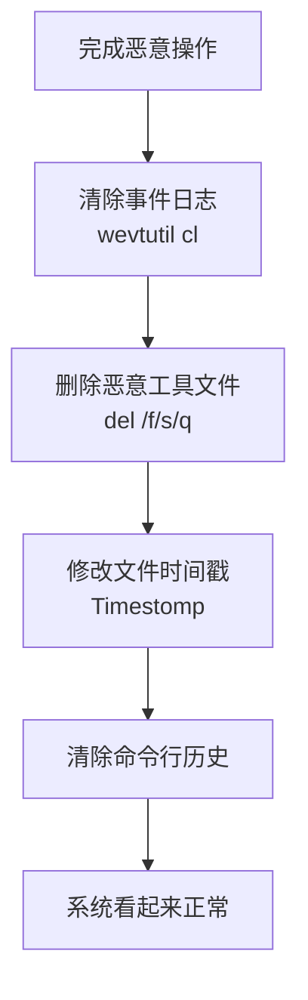

# 指示器移除 (T1070)

## 一句话通俗理解

攻击者在干完坏事后清理现场，就像小偷离开前擦掉指纹、抹掉脚印，让警察找不到任何线索。

## 难度等级

⭐⭐ 中级（需要一定基础）

## 技术描述

指示器移除（T1070）是MITRE ATT&CK框架中隐蔽战术的一种技术。

**通俗解释：**
想象一下，小偷入室盗窃后，会用抹布擦掉他碰过的所有地方，消除指纹。在网络攻击中，攻击者们也需要这样做。他们运行恶意软件时会在系统里留下各种痕迹——日志文件、临时文件、注册表修改记录等。如果不清理，安全人员就可能通过这些痕迹追踪到攻击者的行动。所以，攻击者会删除日志、清除命令历史、关闭日志记录功能，让安全团队无从下手。

**技术原理：**
1. **清除事件日志**：使用wevtutil cl或PowerShell Clear-EventLog删除Windows事件日志
2. **清除命令历史**：删除PowerShell历史记录、Linux .bash_history
3. **清除浏览器痕迹**：删除下载历史、缓存文件
4. **删除文件创建痕迹**：使用Timestomp修改文件时间戳，使其看起来像旧文件
5. **关闭日志记录**：临时禁用日志服务或修改日志策略

**用途与影响：**
指示器移除是攻击者在"毁尸灭迹"阶段的重要手段。没有攻击痕迹，安全团队无法确定攻击时间、攻击路径、被盗数据范围。这也是许多攻击在被发现之前能够潜伏数月甚至数年的原因之一。

## 子技术列表

| 子技术ID | 中文名称 | 通俗解释 |
|----------|----------|----------|
| T1070.001 | 清除应用事件日志 | 删除特定应用程序的事件日志 |
| T1070.002 | 清除Windows事件日志 | 使用wevtutil删除Windows系统事件日志 |
| T1070.003 | 清除命令行历史 | 删除cmd/PowerShell的命令历史记录 |
| T1070.004 | 文件删除 | 删除使用的恶意文件、工具和脚本 |
| T1070.005 | 网络连接历史清除 | 删除网络连接记录 |
| T1070.006 | Timestomp | 修改文件创建/修改/访问时间戳 |
| T1070.007 | 清除系统日志 | 删除系统日志文件 |
| T1070.008 | 邮件日志清除 | 删除邮件服务日志 |
| T1070.009 | 清除云审计日志 | 删除云平台的审计记录 |
| T1070.010 | 清除PowerShell历史 | 删除PowerShell控制台历史文件 |

## 攻击流程



## 真实案例

### 案例1：SolarWinds 攻击中的日志清除（2020）

- **时间**: 2020年
- **目标**: 美国政府机构
- **攻击组织**: APT29
- **手法**: APT29在完成数据窃取后，使用Teardrop工具清除SolarWinds服务器上的事件日志和取证痕迹。有选择性地仅删除与攻击相关的日志条目，而非清空所有日志。
- **参考链接**: [CISA - SolarWinds](https://www.cisa.gov/solarwinds)

### 案例2：Ryuk 勒索软件删除系统日志（2019-2021）

- **时间**: 2019-2021年
- **目标**: 全球医疗机构
- **攻击组织**: Wizard Spider
- **手法**: Ryuk使用`wevtutil cl`和`fsutil`命令在加密前删除事件日志，延缓安全团队的检测响应时间。批量删除System、Security和Application日志。
- **参考链接**: [CrowdStrike - Ryuk](https://www.crowdstrike.com/blog/)

### 案例3：BlackCat 使用文件覆盖技术消除痕迹（2023-2024）

- **时间**: 2023-2024年
- **目标**: 全球企业
- **攻击组织**: BlackCat
- **手法**: BlackCat使用Cipher.exe覆盖删除的文件区域，防止文件恢复工具找回删除的恶意工具。同时修改被加密文件的最后访问时间，使其看起来像长期未访问的旧文件。
- **参考链接**: [BleepingComputer - BlackCat](https://www.bleepingcomputer.com/)

## 红队视角

> ⚠️ **免责声明**：以下内容仅用于合法的安全测试、渗透测试和教育目的。未经授权对他人系统进行测试是违法行为。

### 常用工具

| 工具名称 | 用途 | 平台 | 链接 |
|----------|------|------|------|
| wevtutil | Windows事件日志管理工具 | Windows | 系统自带 |
| Timestomp | 修改文件时间戳 | Windows | Metasploit内置 |
| slui.exe | 清除PowerShell历史记录 | Windows | 系统自带 |

## 蓝队视角

### 检测要点

- 监控事件日志服务被停止或禁用的事件（Event ID 1102）
- 检测短时间内大量日志被清除
- 监控wevtutil cl命令的非常规使用
- 检测文件时间戳被批量修改

## 检测建议

### 网络层检测

**检测方法：** 监控清除痕迹操作后突然停止的网络通信（日志清除导致告警缺失），以及删除日志前的大量数据外传或C2通信。

**具体规则/命令示例：**
```
# 检测日志服务停止前后的网络活动突变
zeek -r traffic.pcap | awk '{print $1}' | sort | uniq -c | head

# 检测wevtutil执行后的网络静默
suricata -r traffic.pcap --rule "alert tcp $HOME_NET any -> $EXTERNAL_NET $HTTP_PORTS (msg:\"Pre-Log-Clear Network Burst\"; flow:to_server; sid:1000018;)"
```

**Sigma规则：**
```yaml
title: 事件日志被清除
status: experimental
description: 检测使用wevtutil清除Windows事件日志
logsource:
    category: process_creation
    product: windows
detection:
    selection:
        Image|endswith: '\wevtutil.exe'
        CommandLine|contains: 'cl'
    condition: selection
level: high
tags:
    - attack.t1070
```

## 缓解措施

### 优先级1：关键措施
**日志集中管理：**
- 将Windows事件日志实时转发到SIEM（如Splunk、ELK），即使本地日志被清除也能保留
- 启用Windows Event Forwarding（WEF）实现日志集中收集
- 配置日志保留策略，确保日志在删除前已被备份

### 优先级2：重要措施
**防篡改配置：**
- 启用Sysmon监控日志服务的停止和日志清除行为
- 配置Windows事件日志文件权限，限制非管理员删除权限
- 使用Critical Process Protection保护日志服务进程

### 优先级3：建议措施
**时间戳保护：**
- 监控文件时间戳批量修改行为
- 配置SACL审计文件属性修改
- 使用File System Audit策略监控可疑文件操作

### MITRE ATT&CK缓解措施映射

| 缓解措施ID | 缓解措施名称 | 适用性 | 说明 |
|------------|-------------|--------|------|
| M1041 | 集中日志管理 | 适用 | 将日志实时转发到SIEM，防止本地删除导致证据丢失 |
| M1025 | 文件完整性监控 | 适用 | 监控日志文件的非预期修改和删除 |
| M1047 | 审计 | 适用 | 启用进程创建、日志清除和时间戳修改的审计策略 |
| M1028 | 操作系统配置 | 适用 | 配置日志保留策略和文件权限保护日志 |

## 动手实验

> ⚠️ **重要提示**：所有实验必须在隔离的实验室环境中进行，禁止对未授权的真实系统进行测试。

### 实验环境准备

**所需工具：** Windows虚拟机、Sysinternals Suite、PowerShell、Event Viewer

### 实验1：使用wevtutil清除事件日志（初级）

**实验步骤：**
1. 在Windows虚拟机中打开事件查看器，浏览安全日志中的事件记录
2. 以管理员身份打开命令提示符，执行`wevtutil cl security`清除安全日志
3. 重新打开事件查看器，观察安全日志的状态变化
4. 检查系统日志中是否记录了Event ID 1102（安全日志被清除）

**预期结果：** 安全日志被完全清空，系统日志中留下了一条日志清除事件的记录

**学习要点：** 理解日志清除的基本原理，以及为何集中式日志管理（SIEM）是防止证据被销毁的关键措施

### 实验2：使用Timestomp修改文件时间戳（中级）

**实验步骤：**
1. 在Windows虚拟机中创建一个测试文件，记下其创建、修改和访问时间
2. 从Sysinternals Suite中获取timestomp.exe工具
3. 执行`timestomp.exe test.txt -c "01-01-2020 00:00:00"`修改文件创建时间
4. 使用`dir /tc`和`Get-ItemProperty`验证文件时间戳的变化

**预期结果：** 文件的创建时间被修改为2020年，与实际创建时间不符，文件属性中的时间信息出现逻辑矛盾

**学习要点：** 理解Timestomp的攻击原理，以及如何通过检测文件时间的异常逻辑关系（如修改时间早于创建时间）来发现篡改行为

## 术语解释

| 术语 | 英文原名 | 通俗解释 |
|------|----------|----------|
| Timestomp | Timestomp | 故意修改文件的时间戳来掩盖文件真实创建/修改时间 |
| 取证痕迹 | Forensic Evidence | 攻击后留下的数字痕迹，如日志、临时文件 |
| 覆盖删除 | Overwrite Deletion | 多次写入随机数据覆盖文件区域，防止恢复 |

## 参考资料

- [MITRE ATT&CK - T1070 Indicator Removal](https://attack.mitre.org/techniques/T1070/)
- [Atomic Red Team - T1070](https://atomicredteam.io/atomic-red-team/T1070/)
