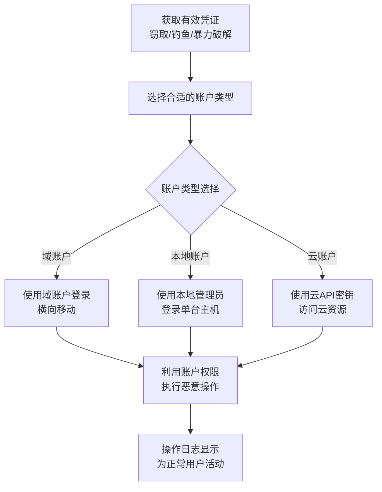

# 合法账户 (T1078)

## 一句话通俗理解

攻击者直接偷用合法用户的账号密码登录系统，这样看起来完全像正常用户，根本不需要破解什么漏洞。

## 难度等级

⭐ 初级

## 技术描述

合法账户（T1078）是MITRE ATT&CK框架中隐蔽战术的一种技术。

**通俗解释：**
想象一下，一个黑客不翻墙、不砸窗，而是偷偷配了一把你的大门钥匙，然后大摇大摆从正门走进来。保安看到他穿着正常的衣服、有门禁卡，不会觉得有任何异常。合法账户攻击就是这个道理——攻击者通过偷来的账号密码直接登录系统，看起来和正常员工完全一样。因为用的是真实有效的凭证，所有的安全系统都会认为这是合法操作。

**技术原理：**
攻击者通过多种方式获取合法账户凭证：
1. **凭证窃取**：通过键盘记录、内存Dump获取密码
2. **暴力破解**：尝试常见的弱密码
3. **凭证转储**：从LSASS进程中提取密码Hash
4. **社交工程**：钓鱼邮件诱导用户提供密码
5. **暗网购买**：购买已泄露的数据库凭证

**用途与影响：**
合法账户是最隐蔽的攻击方式。攻击者使用合法账户后，所有的操作日志看起来都是正常用户的日常操作，安全监控系统很难发现异常。2020年SolarWinds攻击中，攻击者就使用了合法的API令牌和证书进行横向移动。

## 子技术列表

| 子技术ID | 中文名称 | 通俗解释 |
|----------|----------|----------|
| T1078.001 | 默认账户 | 使用系统默认的账户（如Guest、Administrator）登录 |
| T1078.002 | 域账户 | 使用域管理员或普通域用户账户 |
| T1078.003 | 本地账户 | 使用本机管理员或普通用户账户 |
| T1078.004 | 云账户 | 使用云服务（如AWS IAM、Azure AD）的账户 |
| T1078.005 | 应用程序账户 | 使用应用程序的服务账户或机器人账户 |

## 攻击流程



**步骤详解：**
1. **获取凭证**：通过键盘记录、钓鱼、凭证转储或暴力破解获取有效凭证
2. **选择账户**：根据目标环境选择合适的账户类型（本地/域/云）
3. **登录系统**：使用合法凭证通过正常认证流程登录
4. **隐蔽操作**：利用账户权限进行数据窃取或横向移动

## 真实案例

### 案例1：SolarWinds 使用合法API令牌（2020）

- **时间**: 2020年
- **目标**: 美国联邦政府、科技公司
- **攻击组织**: APT29
- **手法**: 使用窃取的数字证书伪装成SolarWinds公司身份，利用合法的API令牌访问Office 365环境。这些合法令牌使攻击者能够绕过MFA并访问电子邮件数据长达数月。
- **参考链接**: [CISA - SolarWinds](https://www.cisa.gov/solarwinds)

### 案例2：Lapsus$ 窃取VPN凭证远程登录（2021-2022）

- **时间**: 2021-2022年
- **目标**: Microsoft、NVIDIA、三星等科技巨头
- **攻击组织**: Lapsus$
- **手法**: 通过社交工程获取目标员工的VPN凭证和MFA会话令牌，直接通过合法VPN通道远程登录公司内网。使用合法账户在内部系统中自由活动，下载源代码。
- **参考链接**: [Microsoft - Lapsus$](https://www.microsoft.com/security/blog/2022/03/22/)

### 案例3：Scattered Spider 使用本地账户进行横向移动（2023-2024）

- **时间**: 2023-2024年
- **目标**: 多家电信和游戏公司
- **攻击组织**: Scattered Spider (UNC3944)
- **手法**: 使用窃取的本地管理员密码在内部网络中横向移动，通过RDP登录到多台服务器，每个登录看起来都是合法的管理员操作。
- **参考链接**: [CrowdStrike - Scattered Spider](https://www.crowdstrike.com/blog/)

## 红队视角

> ⚠️ **免责声明**：以下内容仅用于合法的安全测试、渗透测试和教育目的。未经授权对他人系统进行测试是违法行为。

### 常用工具

| 工具名称 | 用途 | 平台 | 链接 |
|----------|------|------|------|
| Mimikatz | 从内存中提取凭证 | Windows | https://github.com/gentilkiwi/mimikatz |
| BloodHound | 映射域内账号权限关系 | Windows | https://github.com/BloodHoundAD/BloodHound |
| CrackMapExec | 使用凭证批量登录测试 | Windows/Linux | https://github.com/byt3bl33d3r/CrackMapExec |

## 蓝队视角

### 检测要点

- 监控异常的登录时间和登录地点
- 检测AdminSDHolder对象的变化
- 监控高权限账户的非常规使用
- 检测短时间内大量的登录失败和成功

## 检测建议

### 网络层检测

**检测方法：** 监控异常的认证流量模式，特别是针对VPN、RDP、SSH等远程服务的暴力破解和凭据填充攻击，以及从非常规地理位置登录后的横向移动流量。

**具体规则/命令示例：**
```
# 检测短时间内大量认证失败后的成功认证
zeek -r traffic.pcap | grep "SSH\|RDP" | awk '{print $3}' | sort | uniq -c | sort -nr | head

# 检测从非常规地理位置的首次认证
geoip-lookup $LOGIN_IP | grep -v $EXPECTED_COUNTRY && alert
```

**Sigma规则示例：**
```yaml
title: 异常的域管理员登录
status: experimental
description: 检测域管理员账号在非工作时间从非管理工作站登录
logsource:
    product: windows
    service: security
detection:
    selection:
        EventID: 4624
        AccountName|endswith: '$'
        LogonType: 3
    condition: selection
level: medium
tags:
    - attack.t1078
```

## 缓解措施

### 优先级1：关键措施
**凭证保护：**
- 启用Windows Defender Credential Guard保护LSASS凭证
- 实施MFA（多因素认证）在所有关键系统上
- 禁用不必要的默认账户（Guest等）和过期账户

### 优先级2：重要措施
**账户监控：**
- 监控异常登录行为（异常时间、地理位置、登录类型）
- 检测Service Principal Name（SPN）的异常修改
- 监控高权限组（Domain Admins、Enterprise Admins）的成员变更

### 优先级3：建议措施
**凭证管理：**
- 实施最小权限原则，减少高权限账户数量
- 定期审查和轮换服务账户密码
- 使用特权身份管理（PIM）系统管理高权限账户

### MITRE ATT&CK缓解措施映射

| 缓解措施ID | 缓解措施名称 | 适用性 | 说明 |
|------------|-------------|--------|------|
| M1032 | 多因素认证 | 适用 | MFA可显著降低凭证窃取后的账户滥用风险 |
| M1026 | 特权账户管理 | 适用 | 限制高权限账户数量和权限范围 |
| M1018 | 用户账户管理 | 适用 | 定期审查和禁用不必要的账户 |
| M1027 | 密码策略 | 适用 | 实施强密码策略并定期轮换 |

## 动手实验

> ⚠️ **重要提示**：所有实验必须在隔离的实验室环境中进行，禁止对未授权的真实系统进行测试。

### 实验1：使用Mimikatz提取凭证（中级）

**实验步骤：**
1. 在Windows VM中以管理员身份运行Mimikatz
2. 使用`privilege::debug`启用调试权限
3. 使用`sekurlsa::logonpasswords`提取当前登录用户的密码Hash
4. 观察输出的凭证信息

## 术语解释

| 术语 | 英文原名 | 通俗解释 |
|------|----------|----------|
| 凭证 | Credential | 用于证明身份的凭据，如用户名+密码、数字证书 |
| MFA | Multi-Factor Authentication | 多因素认证，需要密码+手机验证码等两种以上验证方式 |
| Pass-the-Hash | PtH | 直接用密码Hash登录，不需要知道明文密码 |
| Token | Token | 身份验证令牌，每次登录后系统颁发的"通行证" |

## 参考资料

- [MITRE ATT&CK - T1078 Valid Accounts](https://attack.mitre.org/techniques/T1078/)
- [Mimikatz Wiki](https://github.com/gentilkiwi/mimikatz/wiki)
- [BloodHound Wiki](https://bloodhound.readthedocs.io/)
