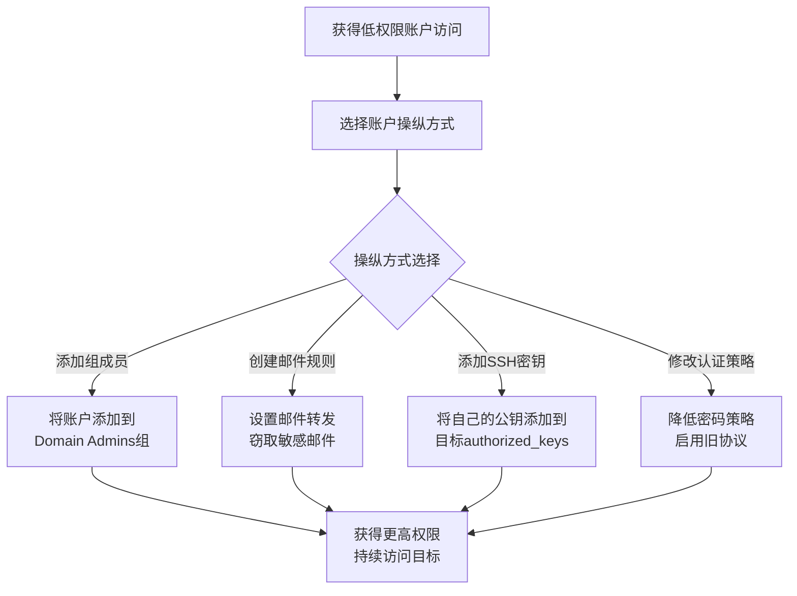

# 账户操纵 (T1098)

## 一句话通俗理解

攻击者在拿到一个低权限账号后，偷偷把它升级成管理员，就像公司里一个新员工自己把自己提拔成总经理。

## 难度等级

⭐⭐ 中级（需要一定基础）

## 技术描述

账户操纵（T1098）是MITRE ATT&CK框架中隐蔽战术的一种技术。

**通俗解释：**
攻击者通过钓鱼或漏洞获得了一个普通员工的账号。这个账号权限很低，访问不了机密数据。但攻击者发现这个账号有"添加组成员"的权限，于是他把这个普通账号添加到了"域管理员"组中。从此，这个普通账号变成了超级管理员。账户操纵就是攻击者对账号进行各种"手脚"，包括修改权限、创建隐藏账号、修改邮箱规则等。

**技术原理：**
1. **添加组成员**：将控制下的账户添加到高权限组
2. **创建隐藏账号**：在系统中创建不易发现的隐藏账户
3. **修改邮箱规则**：设置邮件转发规则窃取邮件
4. **修改SSH密钥**：添加自己的SSH公钥到authorized_keys
5. **修改认证策略**：更改密码策略、启用旧认证协议

## 子技术列表

| 子技术ID | 中文名称 | 通俗解释 |
|----------|----------|----------|
| T1098.001 | 额外云凭证 | 为云用户创建额外的API密钥 |
| T1098.002 | 添加邮箱转发规则 | 设置自动转发将邮件发送给攻击者 |
| T1098.003 | 新增SSH授权密钥 | 将自己的公钥添加到目标用户的authorized_keys |
| T1098.004 | 修改认证策略 | 降低密码复杂度要求，方便破解 |
| T1098.005 | 设备注册 | 将攻击者设备注册到域中 |
| T1098.006 | 添加组成员 | 将账号添加到高权限组 |
| T1098.007 | 额外容器角色 | 在Kubernetes中添加容器角色绑定 |

## 攻击流程



**步骤详解：**
1. **获得初始访问**：通过钓鱼或漏洞获取一个低权限账户
2. **提升权限**：将账户添加到高权限组或创建额外凭证
3. **建立持久化**：通过邮件转发或SSH密钥建立长期访问
4. **隐蔽操作**：在合法操作中隐藏恶意账户操纵行为

## 真实案例

### 案例1：Nobelium 修改邮箱规则窃取邮件（2021）

- **时间**: 2021年
- **目标**: 全球政府机构、NGO
- **攻击组织**: Nobelium (APT29)
- **手法**: 攻破邮件账号后，创建邮件转发规则自动将特定关键词邮件转发到外部邮箱。这种攻击在Exchange环境中非常隐蔽。
- **参考链接**: [Microsoft - NOBELIUM](https://www.microsoft.com/security/blog/2021/05/27/)

### 案例2：Lapsus$ 添加开发者账号提升权限（2022）

- **时间**: 2022年
- **目标**: Microsoft、NVIDIA
- **攻击组织**: Lapsus$
- **手法**: 获取低权限员工凭证后，通过社交工程欺骗IT管理员为账号添加Azure管理员角色，最终获得源代码仓库的完全访问权限。
- **参考链接**: [Microsoft - Lapsus$](https://www.microsoft.com/security/blog/2022/03/22/)

## 红队视角

> ⚠️ **免责声明**：以下内容仅用于合法的安全测试、渗透测试和教育目的。未经授权对他人系统进行测试是违法行为。

> ⚠️ **免责声明**：以下内容仅用于合法的安全测试、教育和研究目的。

**实战技巧：**
1. 添加组成员是最直接的权限提升方式，但会产生Event ID 4728/4732等明显日志
2. 创建邮件转发规则可以长期窃取目标邮件，且用户很难察觉
3. 修改认证策略（如启用NTLM）可为后续Pass-the-Hash攻击铺路

**常用工具：**
- net group：Windows域组管理命令
- PowerView：PowerShell域渗透工具集
- mailflow：邮件规则检查工具

**注意事项：**
- 添加高权限组成员会触发严格的安全审计，建议使用临时组成员身份
- 邮件转发规则在Exchange Admin Center中可见，需配合其他隐蔽手段

## 蓝队视角

**防御重点：**
1. 监控敏感组的成员变更（Domain Admins、Enterprise Admins等）
2. 定期审计邮箱转发规则和SSH authorized_keys文件
3. 对高权限操作实施审批流程（PIM/PAM）

**检测要点：**
- 监控Event ID 4728（全局组添加成员）、4732（本地组添加成员）、4756（通用组添加成员）
- 检测Exchange邮箱转发规则的异常创建
- 监控SSH authorized_keys文件的非预期修改
- 检测认证策略（如NTLM启用）的异常变更

## 检测建议

### 网络层检测

**检测方法：** 监控账户操纵后产生的异常网络认证流量，如新建特权账户发起的RDP/WinRM连接、SSH密钥添加后的远程登录尝试。

**具体规则/命令示例：**
```
# 检测新建管理员账户的远程登录
zeek -r traffic.pcap rdp.log | grep "Administrator" | grep -v "known_admin"

# 检测SSH密钥添加后的远程连接
tcpdump -i eth0 port 22 | grep -A 2 "SSH2_MSG_NEWKEYS" | grep "authentication"
```

**主机层：**
- 监控组成员变更（Event ID 4728, 4732, 4756）
- 检测异常邮件转发规则创建
- 监控SSH authorized_keys的非预期修改
- 监控认证策略的异常修改（Event ID 4739）

**应用层：**
- 检测Azure AD中异常的角色分配提升
- 监控Kubernetes RBAC配置的变更
- 审查云平台的API密钥创建记录

**Sigma规则：**
```yaml
title: 敏感组成员添加
status: experimental
description: 检测将用户添加到高权限组（如Domain Admins）
logsource:
    product: windows
    service: security
detection:
    selection:
        EventID:
            - 4728
            - 4732
            - 4756
        TargetGroupName|contains:
            - 'Domain Admins'
            - 'Enterprise Admins'
            - 'Administrators'
    condition: selection
level: high
tags:
    - attack.t1098
```

## 缓解措施

### 优先级1：关键措施
**权限管理：**
- 实施最小权限原则，严格控制高权限组的成员资格
- 使用Privileged Identity Management（PIM）进行临时权限提升
- 启用Azure AD Privileged Identity Management监控云角色

### 优先级2：重要措施
**变更监控：**
- 配置实时告警监控敏感组的成员变更
- 监控Exchange邮箱转发规则的创建和修改
- 定期审计SSH authorized_keys文件的完整性

### 优先级3：建议措施
**加固配置：**
- 限制谁可以修改认证策略
- 禁止使用旧认证协议（NTLM v1等）
- 实施变更审批流程管理账户操纵

### MITRE ATT&CK缓解措施映射

| 缓解措施ID | 缓解措施名称 | 适用性 | 说明 |
|------------|-------------|--------|------|
| M1026 | 特权账户管理 | 适用 | 使用PIM/PAM管理高权限账户和组成员资格 |
| M1018 | 用户账户管理 | 适用 | 定期审查用户账户权限和组成员关系 |
| M1047 | 审计 | 适用 | 监控和审计敏感组的成员变更 |
| M1032 | 多因素认证 | 适用 | 对高权限操作实施MFA验证 |

## 动手实验

> ⚠️ **重要提示**：所有实验必须在隔离的实验室环境中进行，禁止对未授权的真实系统进行测试。

### 实验1：查看组成员信息（初级）

**实验步骤：**
1. 使用net命令查看本地管理员组成员：`net localgroup Administrators`
2. 使用PowerShell查看域组成员：`Get-ADGroupMember -Identity "Domain Admins"`
3. 检查当前用户的组成员关系：`whoami /groups`

### 实验2：模拟邮件转发规则检测（中级）

**实验步骤：**
1. 在Exchange环境中查看邮箱规则：`Get-Mailbox | Get-InboxRule`
2. 检查可疑的转发规则（转发到外部地址）
3. 设置告警监控自动转发规则创建

## 术语解释

| 术语 | 英文原名 | 通俗解释 |
|------|----------|----------|
| 权限提升 | Privilege Escalation | 从低权限升级到高权限，像从普通员工变成经理 |
| 邮件转发 | Mail Forwarding | 自动把收到的邮件发送到另一个邮箱 |

## 参考资料

- [MITRE ATT&CK - T1098 Account Manipulation](https://attack.mitre.org/techniques/T1098/)
