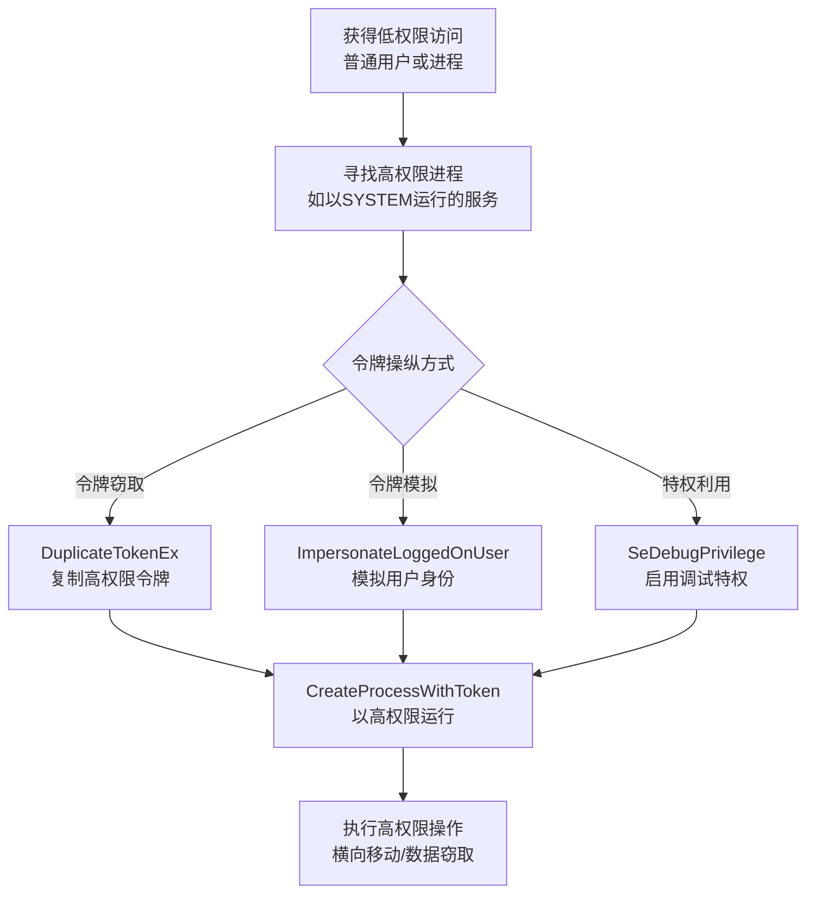

# 访问令牌操纵 (T1134)

## 一句话通俗理解

攻击者盗用别人的"电子通行证"来冒充高权限用户，就像拿着别人的VIP卡进入贵宾室，保安只认卡不认人。

## 难度等级

⭐⭐⭐ 高级（需要深入技术知识）

## 技术描述

访问令牌操纵（T1134）是MITRE ATT&CK框架中隐蔽战术的一种高级技术。

**通俗解释：**
想象一下，你进入一栋大楼需要刷工牌。工牌上有你的身份信息——姓名、部门、权限等级。攻击者不偷你的工牌，而是直接复制你工牌上的"信息"，做一张假工牌贴在别人的照片上。Windows的访问令牌就是这个"电子工牌"，它包含了用户的安全身份信息和权限。攻击者可以窃取、复制或伪造令牌来获得高权限。

**技术原理：**
Windows系统中，每个进程都有一个访问令牌，令牌包含用户身份和权限。攻击者通过以下方式操纵令牌：
1. **令牌窃取**：使用DuplicateTokenEx复制高权限进程的令牌
2. **令牌模拟**：使用ImpersonateLoggedOnUser模拟其他用户身份
3. **创建进程**：使用CreateProcessWithToken以窃取的令牌启动进程
4. **令牌特权利用**：启用已禁用的特殊权限（如SeDebugPrivilege）

## 子技术列表

| 子技术ID | 中文名称 | 通俗解释 |
|----------|----------|----------|
| T1134.001 | 令牌窃取/复制 | 复制高权限进程的令牌给自己用 |
| T1134.002 | 创建进程带令牌 | 用窃取的令牌启动一个新进程 |
| T1134.003 | 模拟令牌 | 模拟其他用户的身份执行操作 |
| T1134.004 | 父进程PID欺骗 | 让恶意进程伪装成合法进程的子进程 |
| T1134.005 | SID-History注入 | 在令牌中添加历史SID来获得额外权限 |
| T1134.006 | 提权令牌 | 启用令牌中的特权（如SeDebugPrivilege） |

## 攻击流程



**步骤详解：**
1. **寻找目标进程**：查找以SYSTEM或管理员身份运行的高权限进程
2. **窃取/复制令牌**：使用DuplicateTokenEx API复制目标进程令牌
3. **模拟用户身份**：使用ImpersonateLoggedOnUser模拟其他用户
4. **创建高权限进程**：以窃取的令牌启动恶意进程执行操作

## 真实案例

### 案例1：Mimikatz 令牌窃取横向移动（2017-2022）

- **时间**: 2017-2022年
- **目标**: 全球政府、金融、能源行业
- **攻击组织**: 多个APT组织
- **手法**: 使用Mimikatz的sekurlsa::pth或token::duplicate功能窃取域管理员的令牌。使用窃取的管理员令牌连接远程服务器，无需知道密码。
- **参考链接**: [MITRE - T1134](https://attack.mitre.org/techniques/T1134/)

### 案例2：APT29 使用令牌模拟在域控制器间移动（2020）

- **时间**: 2020年
- **目标**: 美国政府机构
- **攻击组织**: APT29
- **手法**: 使用窃取的特权令牌在域控制器之间横向移动，执行命令和收集数据。
- **参考链接**: [MITRE - APT29](https://attack.mitre.org/groups/G0016/)

## 红队视角

> ⚠️ **免责声明**：以下内容仅用于合法的安全测试、渗透测试和教育目的。未经授权对他人系统进行测试是违法行为。

> ⚠️ **免责声明**：以下内容仅用于合法的安全测试、教育和研究目的。

**实战技巧：**
1. 令牌窃取需要SeDebugPrivilege权限（通常为管理员），可通过提权先获取
2. 使用Mimikatz的token::duplicate功能快速复制高权限令牌
3. 父进程PID欺骗（T1134.004）可以绕过部分基于父进程的检测规则

**常用工具：**
- Mimikatz：令牌窃取和凭证提取工具
- Incognito：Metasploit中的令牌窃取扩展
- Rubeus：Kerberos令牌操作工具

**注意事项：**
- 令牌窃取操作会在Event ID 4672（特殊权限登录）中留下记录
- 现代Windows中，Winlogon等关键进程受PPL保护，无法直接访问令牌

## 蓝队视角

### 检测要点

- 监控DuplicateTokenEx和ImpersonateLoggedOnUser的非常规使用
- 检测令牌特权被启用（Event ID 4672）
- 检测异常的用户模拟行为
- 监控lsass.exe进程的访问尝试

## 检测建议

### 网络层检测

**检测方法：** 监控令牌窃取后的高权限进程产生的异常网络连接，特别是以SYSTEM或管理员权限运行的进程连接外部C2服务器。

**具体规则/命令示例：**
```
# 检测SYSTEM账户进程的异常出站连接
suricata -r traffic.pcap --rule "alert tcp $HOME_NET any -> $EXTERNAL_NET $HTTP_PORTS (msg:\"SYSTEM Token Network Connection\"; flow:to_server; content:\"NT AUTHORITY\"; nocase; sid:1000013;)"

# 检测令牌模拟后的SMB远程连接
zeek -r traffic.pcap smb.log | grep -f high_risk_accounts.txt
```

**主机层：**
- 监控DuplicateTokenEx和ImpersonateLoggedOnUser API的非常规调用
- 检测令牌特权启用事件（Event ID 4672）
- 监控lsass.exe进程的异常访问（Event ID 4656）
- 检测异常的令牌模拟行为（Event ID 4648）

**进程层：**
- 监控以高权限运行的异常子进程创建
- 检测父进程与子进程之间的异常关系（如cmd.exe作为Winword.exe的子进程）
- 监控SeDebugPrivilege和SeTakeOwnershipPrivilege的启用

**Sigma规则：**
```yaml
title: 启用特殊权限
status: experimental
description: 检测用户登录时被分配特殊权限（通常只有管理员）
logsource:
    product: windows
    service: security
detection:
    selection:
        EventID: 4672
        PrivilegeList|contains:
            - 'SeDebugPrivilege'
            - 'SeTakeOwnershipPrivilege'
    condition: selection
level: medium
tags:
    - attack.t1134
```

## 缓解措施

### 优先级1：关键措施
**权限保护：**
- 启用Windows Defender Credential Guard防止令牌窃取
- 配置PPL（Protected Process Light）保护关键系统进程
- 限制SeDebugPrivilege和SeTakeOwnershipPrivilege的分配

### 优先级2：重要措施
**监控与审计：**
- 启用高级审计策略监控令牌操纵API的调用
- 配置Sysmon监控进程创建和令牌访问
- 定期审查具有特殊权限的用户账户

### 优先级3：建议措施
**系统加固：**
- 实施最小权限原则，减少高权限进程的运行数量
- 使用服务账户而非用户账户运行关键服务
- 限制RDP和管理员远程登录

### MITRE ATT&CK缓解措施映射

| 缓解措施ID | 缓解措施名称 | 适用性 | 说明 |
|------------|-------------|--------|------|
| M1026 | 特权账户管理 | 适用 | 限制SeDebugPrivilege等特殊权限的分配 |
| M1040 | 防篡改 | 适用 | 启用Credential Guard防止令牌窃取 |
| M1025 | 权限提升保护 | 适用 | 使用PPL保护关键系统进程 |
| M1047 | 审计 | 适用 | 启用令牌操纵相关的审计策略 |

## 动手实验

> ⚠️ **重要提示**：所有实验必须在隔离的实验室环境中进行，禁止对未授权的真实系统进行测试。

### 实验环境准备

**所需工具：** Windows虚拟机、Process Explorer（Sysinternals）、PowerShell、Visual Studio

### 实验1：使用Process Explorer查看令牌信息（初级）

**实验步骤：**
1. 下载并运行Process Explorer（以管理员身份）
2. 右键点击任意进程，选择"Properties"，切换到"Security"选项卡
3. 查看该进程的访问令牌中包含的用户组和权限列表
4. 分别查看System进程和普通用户进程的令牌，对比差异

**预期结果：** System进程的令牌中包含SeDebugPrivilege等特殊权限，而普通用户进程的令牌不包含这些高权限

**学习要点：** 理解Windows访问令牌的结构，以及高权限令牌和低权限令牌在安全审计中的关键区别

### 实验2：使用PowerShell模拟令牌执行命令（中级）

**实验步骤：**
1. 在Windows虚拟机中以管理员身份打开PowerShell
2. 使用`Invoke-Command -ComputerName localhost -ScriptBlock { whoami }`验证当前身份
3. 查找以SYSTEM权限运行的进程，使用`Get-Process -Name "winlogon"`获取进程ID
4. 编写PowerShell脚本调用Windows API（OpenProcessToken、DuplicateTokenEx、CreateProcessWithTokenW）模拟令牌创建新进程

**预期结果：** 通过模拟系统进程的令牌创建的新进程具有SYSTEM权限，可执行高权限操作

**学习要点：** 理解DuplicateTokenEx和CreateProcessWithTokenW API的调用原理，以及如何通过监控Event ID 4672（特殊权限登录）来检测令牌滥用

## 术语解释

| 术语 | 英文原名 | 通俗解释 |
|------|----------|----------|
| 访问令牌 | Access Token | Windows里的"电子身份证"，包含用户身份和权限信息 |
| 令牌模拟 | Token Impersonation | 假装成另一个用户执行操作 |
| LSASS | Local Security Authority Subsystem Service | Windows中管理用户登录和安全的进程 |

## 参考资料

- [MITRE ATT&CK - T1134 Access Token Manipulation](https://attack.mitre.org/techniques/T1134/)
- [SANS - Token Stealing](https://www.sans.org/blog/)
