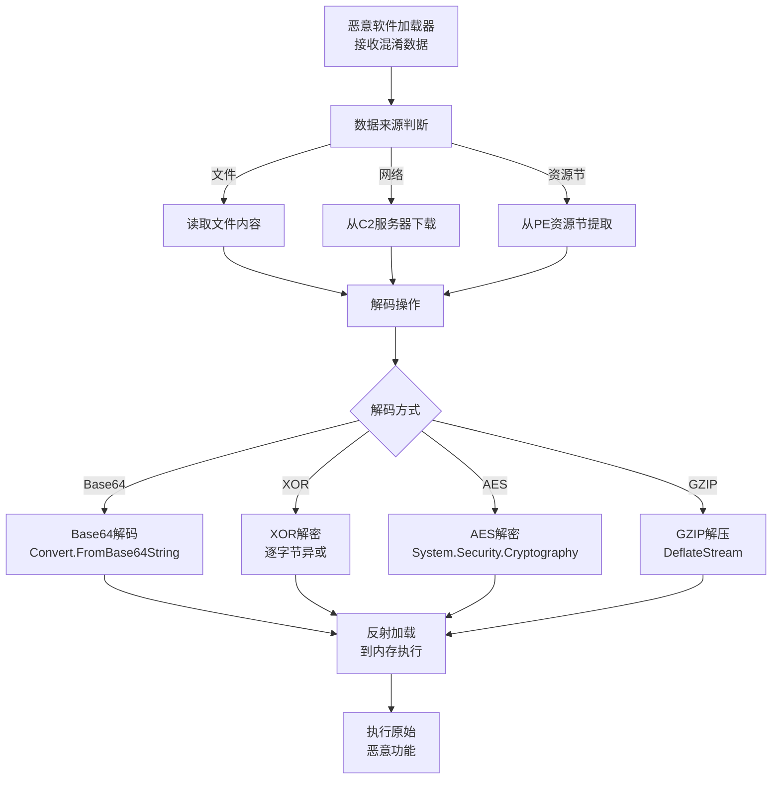

# 去混淆/解码文件或信息 (T1140)

## 一句话通俗理解

攻击者把经过加密或混淆的恶意代码还原成可执行的原始形式——就像把一封密信翻译成明文，让埋伏在系统里的恶意软件"活"过来。

## 难度等级

⭐⭐ 中级（需要一定基础）

## 技术描述

去混淆/解码文件或信息（T1140）是MITRE ATT&CK框架中隐蔽战术的一种技术。

**通俗解释：**
恶意软件的开发者知道安全软件会检测已知的恶意代码特征，所以他们把恶意代码进行混淆（加密、编码、压缩），让安全软件认不出来。当恶意软件到达目标系统后，它自己再执行"去混淆"操作——把混淆后的代码还原成原始恶意代码并执行。这就像间谍把情报藏在密码本里通过海关检查，到了目的地再翻出密码本解密。

**技术原理：**
1. **反射式加载**：从加密的二进制文件中加载PE文件到内存执行，不写入磁盘
2. **解密壳**：使用简单的XOR、RC4或AES算法解密存储在文件中的payload
3. **Base64解码**：将Base64编码的恶意代码解码后通过`IEX`（Invoke-Expression）执行
4. **压缩解压**：使用GZIP/Deflate解压缩被压缩的恶意代码
5. **动态API解析**：运行时动态解析API地址，避免导入表中出现恶意API特征

**用途与影响：**
去混淆是恶意软件绕过静态检测的核心技术。几乎所有现代恶意软件（包括勒索软件、信息窃取木马、APT后门）都在某种程度上使用了混淆和去混淆技术。没有去混淆能力，恶意软件的payload在传输和存储过程中就容易被安全产品检测。

## 子技术列表

该技术没有子技术。

## 攻击流程

### 典型攻击流程

```
接收混淆payload --> 加载到内存 --> 解码/解密 --> 解析API --> 执行原始恶意代码
```



**步骤详解：**

1. **接收混淆payload**
   - 通俗描述：恶意软件收到经过加密/编码的恶意代码
   - 技术细节：payload可能嵌入在文件资源节、从C2下载、或隐藏在图片中（隐写术）
   - 常用工具：加载器（Loader）阶段

2. **解码/解密操作**
   - 通俗描述：用预置的算法把混淆的数据还原
   - 技术细节：Base64解码、XOR异或解密、AES解密、RC4解密、GZIP解压
   - 常用工具：PowerShell的`IEX`、`System.Convert`、`System.Security.Cryptography`

3. **反射加载到内存**
   - 通俗描述：将还原后的恶意代码直接加载到内存执行，不写入文件
   - 技术细节：使用`LoadLibrary`、反射式DLL注入、进程镂空等技术
   - 常用工具：Cobalt Strike的反射式加载器

4. **执行恶意功能**
   - 通俗描述：去混淆完成后，执行真正的恶意操作
   - 技术细节：解密出的shellcode执行C2连接、勒索加密等
   - 常用工具：最终阶段payload

## 真实案例

### 案例1：Cobalt Strike Beacon 的反射式加载（持续活跃）

- **时间**: 持续活跃
- **目标**: 各类红队测试和恶意攻击活动
- **攻击组织**: 各种APT和犯罪团伙
- **手法**: Cobalt Strike的Beacon使用反射式DLL注入技术。Beacon以加密形式存储在文件或网络中，加载时通过反射加载器（Reflective Loader）在内存中解密并加载Beacon DLL。整个加载过程不调用标准的`LoadLibrary` API，避免了API监控检测。
- **影响**: Cobalt Strike是最流行的C2框架之一，被广泛用于红队和恶意攻击
- **参考链接**: [Cobalt Strike Reflective Loading](https://www.cobaltstrike.com/)

### 案例2：PowerShell 无文件恶意软件的IEX解码（2018-至今）

- **时间**: 2018年至今
- **目标**: 全球Windows用户
- **攻击组织**: 未知攻击组织（疑似APT相关）
- **手法**: 大量恶意软件使用PowerShell执行Base64编码的命令行。攻击者将恶意PowerShell代码进行Base64编码后，通过`powershell -enc &lt;Base64&gt;`或`IEX ([System.Text.Encoding]::UTF8.GetString([System.Convert]::FromBase64String("...")))`执行解码后的代码。这种技术完全无文件，仅驻留在内存中。
- **影响**: 无文件攻击成为主流，传统的文件扫描失效
- **参考链接**: [PowerShell Exploit - MITRE](https://attack.mitre.org/techniques/T1059/001/)

### 案例3：Houdini 使用多层加密去混淆（2023-2024）

- **时间**: 2023-2024年
- **手法**: Houdini worm使用多层去混淆技术：第一层使用Base64解码，第二层使用XOR密钥解密，第三层使用GZIP解压。最终解码出的VBScript代码执行信息窃取功能。每层去混淆分步执行，只有上一层的输出才是下一层的输入。
- **影响**: 多层混淆使得静态检测极为困难
- **参考链接**: [Houdini Worm Analysis](https://unit42.paloaltonetworks.com/)

## 红队视角

> ⚠️ **免责声明**：以下内容仅用于合法的安全测试、渗透测试和教育目的。未经授权对他人系统进行测试是违法行为。

### 实战技巧

1. **使用C#反射加载器**
   编写自定义C#加载器，使用`Assembly.Load(byte[])`反射加载加密的.NET程序集。这种方式无需调用Win32 API，不易被API监控检测。

2. **AES加密配合动态密钥**
   使用AES加密Payload，密钥从系统环境中动态生成（如结合主机名+用户名+时间戳计算哈希），使每个受害者机器的加密payload都不同。

3. **XOR混淆最小化特征**
   XOR是最简单的混淆方式，但单一字节XOR容易被破解。使用多字节XOR密钥（16-32字节）并配合随机插入垃圾数据，大幅增加分析难度。

### 常用工具

| 工具名称 | 用途 | 平台 | 链接 |
|----------|------|------|------|
| PowerShell IEX | 内存执行混淆脚本 | Windows | 系统内置 |
| Cobalt Strike | 反射式Payload加载 | 跨平台 | https://www.cobaltstrike.com/ |
| Donut | Shellcode生成器 | 跨平台 | https://github.com/TheWover/donut |
| sRDI | 反射式DLL注入 | Windows | https://github.com/monoxgas/sRDI |

### 注意事项

- 反射加载会在内存中留下明文payload，内存取证（如Volatility）可以恢复
- 现代EDR也开始监控反射式加载的API调用模式
- 强加密（如AES-256）会增加payload的解密延迟

## 蓝队视角

### 检测要点

1. **反射式加载检测**
   - 日志来源：Sysmon Event ID 8（CreateRemoteThread）、EDR API监控
   - 关注字段：异常的内存分配（`VirtualAlloc`）、线程创建（`CreateRemoteThread`）
   - 异常特征：进程在短时间内分配RWX内存并创建远程线程

2. **PowerShell IEX解码检测**
   - 日志来源：PowerShell Event ID 4104（Script Block Logging）
   - 关注字段：`IEX`、`FromBase64String`、`Invoke-Expression`关键字
   - 异常特征：编码后的长字符串与`IEX`的组合使用

3. **API调用异常检测**
   - 日志来源：Sysmon Event ID 10（进程访问）
   - 关注字段：`LoadLibrary`、`GetProcAddress`、`VirtualProtect`的异常调用序列
   - 异常特征：非标准DLL的加载和API地址的动态解析

### 监控建议

- 启用PowerShell Script Block Logging（Event ID 4104）捕获解码命令
- 监控进程的异常内存操作（VirtualAlloc + VirtualProtect + CreateRemoteThread序列）
- 使用AMSI（反恶意软件扫描接口）拦截解码后的恶意脚本

## 检测建议

### 网络层检测

**检测方法：** 监控网络流量中的混淆/解码活动，包括检测HTTP请求中的Base64编码Payload、识别PowerShell远程下发解码命令的特征、分析Certutil/Bitsadmin等工具的可疑下载行为、检测混淆JavaScript代码在Web流量中的传输。

**具体命令/规则示例：**

```bash
# 使用tcpdump捕获包含PowerShell IEX解码特征的HTTP流量
tcpdump -i eth0 -A 'tcp port 80 and (tcp[((tcp[12:1] & 0xf0) >> 2):4] = 0x504f5354)' | grep -i 'IEX\|FromBase64String\|powershell.*-enc'
```

**示例（Suricata规则）：**
```
# 规则1：检测HTTP请求中PowerShell Base64解码+执行特征
alert http $EXTERNAL_NET any -> $HOME_NET any (
    msg:"T1140 - 检测PowerShell IEX Base64解码下发";
    flow:established,to_server;
    http.uri;
    content:"powershell"; nocase;
    content:"IEX"; nocase; distance:0;
    content:"FromBase64String"; nocase; distance:0;
    classtype:trojan-activity;
    sid:10011401;
    rev:1;
)

# 规则2：检测Certutil下载并解码Base64编码的恶意文件
alert http $EXTERNAL_NET any -> $HOME_NET any (
    msg:"T1140 - Certutil Base64解码下载可疑文件";
    flow:established,to_server;
    http.uri;
    content:"certutil"; nocase;
    content:"-decode"; nocase; distance:0;
    classtype:trojan-activity;
    sid:10011402;
    rev:1;
)

# 规则3：检测HTTP响应中的长Base64字符串（可疑Payload传输）
alert http $HOME_NET any -> $EXTERNAL_NET any (
    msg:"T1140 - HTTP响应中检测到可疑Base64编码内容";
    flow:established,from_server;
    http.response_body;
    content:"AAAA";
    pcre:"/[A-Za-z0-9+/]{200,}=?=/";
    classtype:trojan-activity;
    sid:10011403;
    rev:1;
)
```

**Zeek检测示例：**
通过自定义Zeek脚本监控HTTP请求中的PowerShell IEX与Base64组合特征：
```
event http_request(c: connection, method: string, uri: string)
{
    if (/IEX/ in uri && /FromBase64String|powershell.*-enc/ in uri)
    {
        print fmt("[T1140] 检测到可疑PowerShell解码请求: %s -> %s",
                  c$id$orig_h, uri);
    }
}
```

### 主机层检测

**Windows事件ID：**
- Sysmon Event ID 1：进程创建
- Sysmon Event ID 8：CreateRemoteThread（检测反射加载）
- PowerShell Event ID 4104：Script Block Logging
- Event ID 4688：进程创建

**具体命令示例：**
```bash
# 检测PowerShell中Base64解码后的IEX执行
Get-WinEvent -FilterHashtable @{LogName='Microsoft-Windows-PowerShell/Operational'; ID=4104} |
    Where-Object { $_.Message -match 'FromBase64String' -and $_.Message -match 'IEX' }
```

### 应用层检测

**Sigma规则示例：**
```yaml
title: PowerShell Base64解码执行检测
status: experimental
description: 检测通过Base64解码后使用IEX执行的恶意PowerShell命令
logsource:
    category: process_creation
    product: windows
detection:
    selection:
        CommandLine|contains|all:
            - 'powershell'
            - 'FromBase64String'
            - 'IEX'
    condition: selection
level: high
tags:
    - attack.t1140
    - attack.defense_evasion
    - attack.execution
```

## 缓解措施

### 优先级1：关键措施

**措施名称：** 启用AMSI和Script Block Logging

**具体实施步骤：**
1. 为所有Windows系统启用AMSI
2. 启用PowerShell Script Block Logging（Event ID 4104）
3. 配置PowerShell执行策略限制脚本执行

### 优先级2：重要措施

**措施名称：** 内存保护

**具体实施步骤：**
1. 启用Windows Defender Credential Guard
2. 配置EDR监控异常的内存操作
3. 部署支持内存扫描的反病毒产品

### 优先级3：建议措施

**措施名称：** 应用程序控制

**具体实施步骤：**
1. 使用AppLocker限制PowerShell的使用范围
2. 对非管理员的PS执行设置约束语言模式
3. 配置Windows Defender Attack Surface Reduction规则

### MITRE ATT&CK 缓解措施映射

| 缓解措施ID | 缓解措施名称 | 适用性 | 说明 |
|------------|-------------|--------|------|
| M1040 | 行为检测 | 适用 | 监控异常的反射加载行为 |
| M1038 | 执行防护 | 适用 | 限制PowerShell脚本执行 |
| M1042 | 禁用功能 | 部分适用 | 在非管理终端上禁用PowerShell |
| M1021 | 限制API调用 | 部分适用 | 监控VirtualAlloc/VirtualProtect调用 |

## 动手实验

> ⚠️ **重要提示**：所有实验必须在隔离的实验室环境中进行，禁止对未授权的真实系统进行测试。

### 实验环境准备

**所需工具：**
- Windows VM
- Python3
- PowerShell ISE

### 实验1：PowerShell Base64去混淆（初级）

**实验目标：** 理解攻击者如何使用PowerShell解码并内存执行恶意代码

**实验步骤：**
1. 编写一个简单的PowerShell脚本（如输出系统信息）
2. 使用Base64编码该脚本
3. 使用IEX解码并执行编码后的脚本
4. 观察PowerShell Event ID 4104日志的记录

**预期结果：** 编码执行的PowerShell命令被Script Block Logging捕获

**学习要点：** 理解无文件攻击的基础——内存中去混淆并执行

### 实验2：PCAP中提取并解码Base64编码的PowerShell Payload（中级）

**实验目标：** 学习从网络流量中提取Base64编码的恶意PowerShell命令并手动解码分析

**实验步骤：**
1. 使用Wireshark或tcpdump捕获包含PowerShell下载特征的HTTP流量
2. 过滤HTTP请求，找到包含`powershell -enc`或`IEX`与`FromBase64String`组合的流量包
3. 从HTTP URI或请求体中提取Base64编码的Payload字符串
4. 使用CyberChef（`From Base64`操作）或PowerShell命令（`[System.Text.Encoding]::UTF8.GetString([System.Convert]::FromBase64String("..."))`）解码
5. 分析解码后的脚本内容，识别其恶意功能（如C2连接、下载器、反向Shell等）

**预期结果：** 成功从网络流量中还原出原始PowerShell恶意脚本，观察解码后内容与编码前流量的对应关系

**学习要点：** 掌握通过网络流量分析识别和还原混淆攻击载荷的实战方法，理解网络层检测对T1140的重要性

### 实验3：Python模拟多层去混淆流程（中级）

**实验目标：** 使用Python编写脚本模拟恶意软件的多层去混淆过程（Base64 → XOR → GZIP），理解为什么静态检测难以应对多层混淆

**实验步骤：**
1. 准备一段简单的原始Payload文本（如`"This is a simulated malicious payload"`）
2. 模拟攻击者的混淆过程：先GZIP压缩，再XOR加密（密钥`0xAB`），最后Base64编码
3. 编写去混淆脚本还原上述过程：Base64解码 → XOR解密 → GZIP解压
4. 验证还原结果是否与原始Payload一致

**参考代码框架：**
```python
import base64
import gzip

# 去混淆：将Base64编码数据还原为原始Payload
def deobfuscate(encoded_data: str, xor_key: int = 0xAB) -> bytes:
    # 第一层：Base64解码
    step1 = base64.b64decode(encoded_data)
    # 第二层：XOR解密
    step2 = bytes([b ^ xor_key for b in step1])
    # 第三层：GZIP解压
    step3 = gzip.decompress(step2)
    return step3

# 模拟的三层混淆数据（实际场景中来自网络或文件）
sample = "H4sIAAAAAAAA/8vPyUitKEgtKs7Mz9NNSq1UAAALQtQjHAAAAA=="
result = deobfuscate(sample)
print(f"解码后的Payload: {result.decode()}")
```

**预期结果：** 理解恶意软件如何通过编码+加密+压缩的三层组合绕过静态检测，掌握多层去混淆的编程实现

**学习要点：** 掌握常见的去混淆技术组合原理，理解为何需要多层检测（网络层+主机层+应用层）才能有效防御T1140

## 术语解释

| 术语 | 英文原名 | 通俗解释 |
|------|----------|----------|
| 混淆 | Obfuscation | 把代码变得难以理解但不改变其功能的技术 |
| 反射加载 | Reflective Loading | 将DLL从内存中直接加载执行，不通过系统加载器 |
| Payload | Payload | 恶意软件中执行核心功能的代码部分 |
| AMSI | Anti-Malware Scan Interface | Windows的反恶意软件扫描接口 |
| 无文件攻击 | Fileless Attack | 不在磁盘上写入文件，仅在内存中执行的攻击技术 |

## 参考资料

### 官方文档

- [MITRE ATT&CK - T1140 Deobfuscate/Decode Files or Information](https://attack.mitre.org/techniques/T1140/)

### 安全报告

- [Reflective DLL Injection - Harmj0y](https://www.harmj0y.net/blog/redteaming/reflective-dll-injection/)
- [PowerShell Attack Detection - Microsoft](https://docs.microsoft.com/en-us/windows-server/identity/ad-ds/manage/component-updates/powershell-logging)

### 工具与资源

- [Donut - Shellcode生成器](https://github.com/TheWover/donut)
- [sRDI - 反射式DLL注入](https://github.com/monoxgas/sRDI)
- [CyberChef - 在线加解密工具](https://gchq.github.io/CyberChef/)
