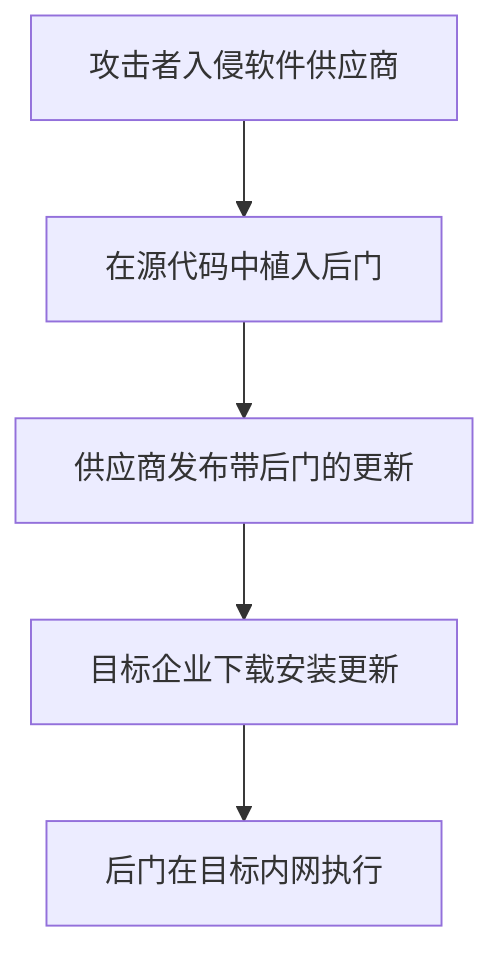

# 供应链攻陷 (T1195)

## 一句话通俗理解

攻击者不直接攻击目标，而是在目标使用的软件或硬件中提前埋入后门，就像在汽车出厂前就在刹车片上做了手脚，车主怎么检查也发现不了。

## 难度等级

⭐⭐⭐ 高级（需要深入技术知识）

## 技术描述

供应链攻陷（T1195）是MITRE ATT&CK框架中隐蔽战术的一种高级技术。

**通俗解释：**
如果你是一家大公司的保安，你会非常警惕陌生人进入大楼。但如果是快递员每天来送快递，你可能就不会每次都仔细检查。供应链攻击就是这个道理——攻击者不直接攻击目标（因为防御太强），而是攻击目标"信任"的第三方：软件供应商、硬件厂商、代码库维护者。目标公司每天正常使用这些供应商的产品，完全信任它们，但产品里已经被攻击者做了手脚。

**技术原理：**
1. **攻破软件供应商**：入侵软件开发商的构建环境，在源代码中植入后门
2. **篡改更新通道**：劫持软件更新服务器，推送带后门的更新
3. **注入开源库**：向开源项目提交恶意代码（如"依赖混淆"攻击）
4. **硬件植入**：在设备生产过程中植入恶意硬件或固件

## 子技术列表

| 子技术ID | 中文名称 | 通俗解释 |
|----------|----------|----------|
| T1195.001 | 篡改软件供应链 | 在软件构建或分发过程中植入恶意代码 |
| T1195.002 | 篡改硬件供应链 | 在硬件制造过程中植入后门 |
| T1195.003 | 篡改代码签名证书 | 盗用或伪造代码签名证书给恶意软件签名 |

## 攻击流程



## 真实案例

### 案例1：SolarWinds 供应链攻击（2020）

- **时间**: 2020年（发现时间）
- **目标**: 美国政府机构、科技公司
- **攻击组织**: APT29 (Nobelium)
- **手法**: 入侵SolarWinds的构建系统，在Orion产品的合法更新文件中植入SUNBURST后门。约18,000家SolarWinds客户下载了带后门的更新包，攻击者通过后门进入目标系统。
- **影响**: 美国国务院、国土安全部、财政部等多家政府机构数据泄露
- **参考链接**: [CISA - SolarWinds](https://www.cisa.gov/solarwinds)

### 案例2：NotPetya 通过M.E.Doc更新通道传播（2017）

- **时间**: 2017年6月
- **目标**: 乌克兰及全球企业
- **攻击组织**: Sandworm
- **手法**: 攻破乌克兰会计软件M.E.Doc的更新服务器，通过自动更新通道向用户推送NotPetya恶意软件。由于M.E.Doc是乌克兰政府的强制使用软件，几乎所有的乌克兰政府机构都受到影响。
- **影响**: 全球损失超100亿美元
- **参考链接**: [CrowdStrike - NotPetya](https://www.crowdstrike.com/blog/meet-notpetya/)

### 案例3：Kaseya VSA 供应链勒索攻击（2021）

- **时间**: 2021年7月
- **目标**: 全球MSP服务商及其客户
- **攻击组织**: REvil
- **手法**: 利用Kaseya VSA远程管理软件的零日漏洞，通过VSA的自动更新机制向MSP客户的终端推送REvil勒索软件。一次攻击感染了超过1,500家企业。
- **影响**: 全球数千家企业被加密勒索
- **参考链接**: [CISA - Kaseya](https://www.cisa.gov/kaseya-vsa)

### 案例4：3CX 软件供应链攻击（2023）

- **时间**: 2023年3月
- **目标**: 全球3CX客户（超过60万家企业）
- **攻击组织**: UNC4736 (Lazarus关联)
- **手法**: 攻入3CX的构建系统，在3CXDesktopApp的安装包中植入恶意代码。用户安装更新后，恶意代码以合法签名的3CX进程身份运行。这是少有的影响macOS、Windows和Linux三大平台的供应链攻击。
- **影响**: 超过60万家企业受到影响
- **参考链接**: [CrowdStrike - 3CX Supply Chain](https://www.crowdstrike.com/blog/)

### 案例5：UltraVNC 供应链投毒（2024年）

- **时间**: 2024年
- **目标**: UltraVNC用户（主要为IT运维人员和企业）
- **攻击组织**: 未知APT组织
- **手法**: 攻击者入侵了UltraVNC的官方下载服务器，将原版的安装包替换为植入后门的版本。由于安装包拥有合法的数字签名，杀毒软件无法检测到异常。受感染的版本在官方渠道存在了超过2个月，大量IT运维人员因工作需要下载安装，导致后门在企业内网中扩散。
- **影响**: 大量企业内网被入侵
- **参考链接**: [BleepingComputer - UltraVNC](https://www.bleepingcomputer.com/)

## 红队视角

> ⚠️ **免责声明**：以下内容仅用于合法的安全测试、渗透测试和教育目的。未经授权对他人系统进行测试是违法行为。

### 常用工具

| 工具名称 | 用途 | 平台 | 链接 |
|----------|------|------|------|
| Dependency Confusion | 依赖混淆攻击工具 | 跨平台 | https://github.com/visma-prodsec/confused |
| PE-sieve | 检测进程是否被修改 | Windows | https://github.com/hasherezade/pe-sieve |

## 蓝队视角

### 检测要点

- 实施软件物料清单（SBOM）管理，了解使用的所有第三方组件
- 监控软件更新的哈希值和签名一致性
- 对第三方软件实施沙箱隔离
- 监控异常的出站网络连接（即使来自签名软件的进程）

## 检测建议

### 网络层检测

**检测方法：** 监控软件更新服务器的异常DNS解析、CDN来源的流量变化，以及第三方依赖包的版本变更导致的网络请求目标切换。

**具体规则/命令示例：**
```
# 检测CDN来源变更（潜在的供应链劫持）
dig +short cdn.legitimate-software.com | diff - expected_ip.txt

# 检测NPM/PyPI包源的异常请求
tcpdump -i eth0 port 443 -A | grep -E "registry.npmjs|pypi.org" | grep -v "trusted-package"
```

**主机层：**
- 监控文件哈希值与官方发布值的差异
- 检测签名证书的异常变化（不同版本间的签名不一致）
- 监控软件更新后的异常进程活动和网络连接
- 使用完整性监控工具（如Tripwire）检测关键文件的篡改

**网络层：**
- 监控软件更新服务器的异常DNS解析
- 检测证书透明日志中的异常证书签发
- 审查第三方依赖包的版本和来源

**Sigma规则：**
```yaml
title: 软件安装包签名不一致
status: experimental
description: 检测同一软件不同版本的签名证书异常变化（潜在供应链攻击）
logsource:
    category: process_creation
    product: windows
detection:
    selection:
        EventID: 4688
        ProcessName|endswith:
            - '\msiexec.exe'
            - '\setup.exe'
            - '\installer.exe'
    condition: selection
level: medium
tags:
    - attack.t1195
```

## 缓解措施

### 优先级1：关键措施
**供应链安全管理：**
- 建立并维护软件物料清单（SBOM），了解所有第三方组件及其版本
- 要求供应商提供软件构建的完整性和来源证明（SLSA框架）
- 对关键系统实施二进制完整性验证

### 优先级2：重要措施
**更新管理：**
- 使用内部镜像仓库镜像并审查第三方软件更新
- 验证软件安装包的签名和哈希值后再部署
- 对第三方软件实施隔离执行环境

### 优先级3：建议措施
**监控与响应：**
- 建立供应链攻击应急响应预案
- 监控安全公告中关于供应链攻击的威胁情报
- 定期审计第三方依赖的安全状态

### MITRE ATT&CK缓解措施映射

| 缓解措施ID | 缓解措施名称 | 适用性 | 说明 |
|------------|-------------|--------|------|
| M1053 | 软件完整性验证 | 适用 | 验证软件更新的签名和哈希值 |
| M1017 | 软件供应链管理 | 适用 | 建立SBOM和管理第三方依赖 |
| M1045 | 软件隔离 | 适用 | 对第三方软件实施沙箱隔离 |
| M1046 | 二进制完整性扫描 | 适用 | 使用完整性监控检测文件篡改 |

## 动手实验

> ⚠️ **重要提示**：所有实验必须在隔离的实验室环境中进行，禁止对未授权的真实系统进行测试。

### 实验1：依赖混淆攻击复现（中级）

**实验步骤：**
1. 搭建私有npm镜像和公共npm仓库
2. 创建一个名称与内部包相同的公共包
3. 配置项目测试依赖解析的优先级
4. 观察包被替换的过程

## 术语解释

| 术语 | 英文原名 | 通俗解释 |
|------|----------|----------|
| 供应链 | Supply Chain | 产品从原材料到交付给用户的完整链条 |
| SBOM | Software Bill of Materials | 软件物料清单，一份列出软件中所有组件的清单 |
| 依赖混淆 | Dependency Confusion | 利用包管理器从公共仓库获取而不是私有仓库的漏洞 |

## 参考资料

- [MITRE ATT&CK - T1195 Supply Chain Compromise](https://attack.mitre.org/techniques/T1195/)
- [CISA - Supply Chain Security](https://www.cisa.gov/supply-chain)
- [SolarWinds Attack Timeline](https://www.crowdstrike.com/blog/sunspot-malware-technical-analysis/)
