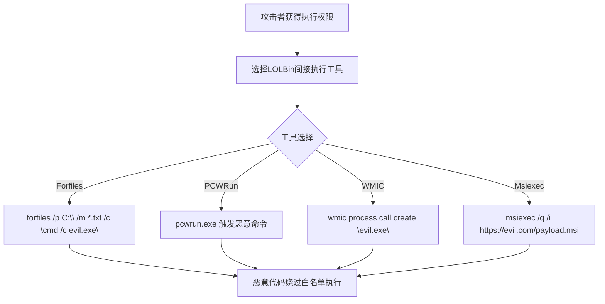

# 间接命令执行 (T1202)

## 一句话通俗理解

> **攻击者不直接运行恶意命令，而是利用系统自带的合法工具（如Forfiles、PCWRun）来"代劳"执行，就像你让快递员帮忙带句话，而不是你自己去说。**

## 30秒速查卡

| 维度 | 你需要知道的 |
|------|-------------|
| 这是什么？ | 攻击者用系统自带的合法工具间接执行恶意命令，让安全产品只看到合法工具在运行 |
| 为什么危险？ | 通过合法工具执行的命令很难被检测，因为安全产品通常对系统工具有白名单策略 |
| 谁需要关心？ | SOC分析师、终端安全工程师、威胁猎手 |
| 你的第一步防御 | 监控系统工具的异常命令行参数 |
| 如果只做一件事 | 检测forfiles、pcwrun等工具执行的异常命令 |

## 难度等级

⭐⭐ 中级（需要一定基础）

## 技术描述

间接命令执行（T1202）是MITRE ATT&CK框架中隐蔽战术的一种技术。

**通俗解释：**
在Windows中有很多"老工具"——它们本来是系统管理员用来做维护的合法工具。攻击者发现，这些工具可以"代执行"恶意命令。比如，Forfiles.exe是一个文件搜索工具，它可以在找到文件后执行一个命令。攻击者就会说："找一下桌面上是否有记事本文件，如果有，就顺便运行一下恶意程序.exe。" 这样，安全软件只看到Forfiles.exe在运行（合法工具），没有看到恶意程序本身在执行。

**技术原理：**
Windows中内置了多个可以间接执行命令的实用工具：
1. **Forfiles**：文件搜索工具，支持在找到匹配文件后执行命令
2. **PCWRun**：Windows性能计数器工具
3. **WMIC**：Windows管理规范工具
4. **Msiexec**：Windows安装包管理工具

## 子技术列表

该技术暂无子技术分类。

## 攻击流程



**步骤详解：**
1. **选择工具**：攻击者根据目标环境选择合适的LOLBin工具
2. **构造命令**：利用工具的合法功能参数，嵌入恶意命令
3. **触发执行**：通过Forfiles的文件匹配、PCWRun的性能计数器触发等方式间接执行
4. **绕过检测**：安全软件只看到合法工具运行，未识别恶意命令

## 真实案例

### 案例1：攻击者利用Forfiles执行代理命令（2019-2022）

- **时间**: 2019-2022年
- **手法**: 攻击者使用`forfiles /p C:\ /m *.txt /c "cmd /c evil.exe"`绕过应用程序白名单。
- **参考链接**: [LOLBAS Project](https://lolbas-project.github.io/)

## 红队视角

> ⚠️ **免责声明**：以下内容仅用于合法的安全测试、渗透测试和教育目的。未经授权对他人系统进行测试是违法行为。

> ⚠️ **免责声明**：以下内容仅用于合法的安全测试、教育和研究目的。

**实战技巧：**
1. Forfiles是应用白名单绕过中最稳定的工具之一，适合在受限环境中执行命令
2. 结合PowerShell和Forfiles可以实现无文件落地攻击
3. PCWRun在较新的Windows版本中已被移除，使用前需确认目标系统版本

**常用工具：**
- Forfiles.exe：Windows内置文件搜索工具
- PCWRun.exe：Windows性能计数器工具（已弃用）
- WMIC.exe：Windows管理规范命令行工具
- Msiexec.exe：Windows安装包管理工具

**注意事项：**
- Forfiles的/c参数执行的命令以cmd.exe为基础，注意命令长度限制
- WMIC在Windows 11中被默认禁用，需要启用后才能使用
- Msiexec远程安装需要目标系统能够访问远程URL

## 蓝队视角

**防御重点：**
1. **应用白名单**：配置AppLocker或WDAC限制非授权工具的运行
2. **命令行审计**：启用命令行审计策略，记录所有进程创建的命令行参数
3. **权限控制**：限制普通用户使用WMIC、Msiexec等高权限工具

**检测要点：**
- 监控Forfiles.exe的异常使用（Event ID 4688，命令行包含/c参数）
- 检测非管理员用户使用WMIC创建进程
- 监控Msiexec从远程URL安装包的行为
- 关注PCWRun.exe的执行记录（Event ID 4688）

## 检测建议

### 网络层检测

**检测方法：** 监控Msiexec从非可信URL的安装请求、WMIC的异常远程连接，以及Certutil等工具从远程服务器下载载荷的网络流量。

**具体规则/命令示例：**
```
# 检测Msiexec从外部URL安装MSI
suricata -r traffic.pcap --rule "alert tcp $HOME_NET any -> $EXTERNAL_NET $HTTP_PORTS (msg:\"Msiexec Remote Install\"; content:\"msiexec\"; nocase; sid:1000014;)"

# 检测WMIC远程连接
zeek -r traffic.pcap | grep "wmic" | grep "135|445"
```

**主机层：**
- Sysmon事件ID 1（进程创建）监控Forfiles、PCWRun等间接执行工具的调用
- 启用Windows命令行审计（Event ID 4688）记录完整的命令行参数
- 监控进程创建链，检测父进程与子进程关系是否异常
- 检测非管理员用户使用Forfiles、WMIC等高权限工具

**网络层：**
- 监控Msiexec从非可信URL的安装请求
- 检测WMIC的异常远程连接

**用人话说：** 这条规则在监控forfiles.exe是否执行了命令。正常情况下，forfiles只用于搜索文件，如果它开始执行命令（/c参数），很可能是在间接执行恶意代码。攻击者用forfiles当"中间人"，让安全产品只看到合法工具在运行。

**Sigma规则：**
```yaml
title: Indirect Command Execution via Forfiles
status: experimental
description: Detects use of forfiles.exe to execute commands indirectly
logsource:
    category: process_creation
    product: windows
detection:
    selection:
        Image|endswith: '\forfiles.exe'
        CommandLine|contains: '/c'
    condition: selection
level: high
tags:
    - attack.t1202
```

## 缓解措施

### 优先级1：关键措施
**应用白名单控制：**
- 使用AppLocker或Windows Defender Application Control（WDAC）限制非授权工具的执行
- 配置默认拒绝策略，仅允许经过批准的二进制文件运行

### 优先级2：重要措施
**命令行审计与监控：**
- 启用进程创建事件审计（Event ID 4688），记录所有命令行参数
- 配置Sysmon监控Forfiles、WMIC等LOLBin工具的异常使用

### 优先级3：建议措施
**权限最小化：**
- 限制普通用户对WMIC、Msiexec等高权限工具的使用权限
- 定期审查工具的白名单策略，移除不再需要的工具

### MITRE ATT&CK缓解措施映射

| 缓解措施ID | 缓解措施名称 | 适用性 | 说明 |
|------------|-------------|--------|------|
| M1038 | 执行防护 | 适用 | 使用AppLocker/WDAC限制间接命令执行工具 |
| M1029 | 远程访问限制 | 适用 | 限制Msiexec远程安装来源 |
| M1026 | 特权账户管理 | 适用 | 限制普通用户使用高权限管理工具 |

## 动手实验

> ⚠️ **重要提示**：所有实验必须在隔离的实验室环境中进行，禁止对未授权的真实系统进行测试。

### 实验环境准备

**所需工具：** Windows虚拟机、Sysmon（配置命令⾏日志）、Process Monitor

### 实验1：使用Forfiles间接执行命令（初级）

**实验步骤：**
1. 在Windows虚拟机的C:\temp目录下创建一些测试文本文件
2. 以命令提示符运行`forfiles /p C:\temp /m *.txt /c "cmd /c whoami > C:\temp\output.txt"`
3. 检查output.txt文件中的命令执行结果
4. 使用Sysmon Event ID 1查看进程树，确认forfiles.exe启动了cmd.exe

**预期结果：** output.txt中显示当前用户名，Sysmon事件显示forfiles.exe→cmd.exe的进程链

**学习要点：** 理解Forfiles如何被恶意利用来绕过应用白名单，以及通过监控进程树中非预期的父-子进程关系来检测此类攻击

### 实验2：使用Msiexec远程安装MSI包（中级）

**实验步骤：**
1. 使用WiX Toolset创建一个简单的测试MSI安装包
2. 将MSI包放置在本地HTTP服务器上（如python -m http.server）
3. 在目标虚拟机上执行`msiexec /q /i http://localhost:8000/test.msi`
4. 使用Process Monitor监控msiexec.exe的文件系统和网络活动

**预期结果：** msiexec从远程URL下载MSI包并静默安装，Process Monitor和Windows防火墙日志记录该网络连接

**学习要点：** 理解Msiexec远程安装可能被攻击者滥用的风险，以及如何通过URL白名单和网络出站规则来限制此类行为

## 术语解释

| 术语 | 英文原名 | 通俗解释 |
|------|----------|----------|
| LOLBin | Living Off the Land Binary | 系统自带的合法二进制工具，被攻击者利用 |

## 参考资料

- [MITRE ATT&CK - T1202 Indirect Command Execution](https://attack.mitre.org/techniques/T1202/)
- [LOLBAS - Forfiles](https://lolbas-project.github.io/lolbas/Binaries/Forfiles/)
