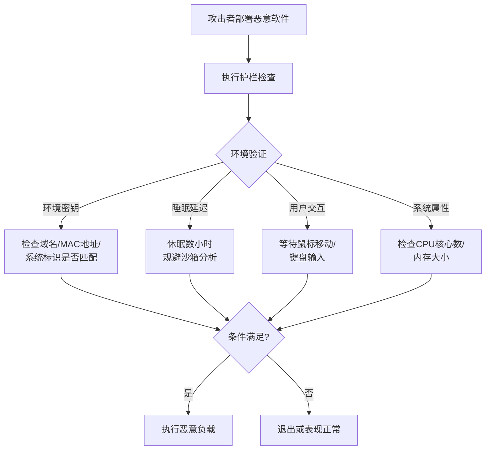

# 执行护栏 (T1480)

## 一句话通俗理解

攻击者给恶意软件加了一道"安全锁"，确保它只在目标电脑上运行，如果发现是分析环境（沙箱或蜜罐）就自动退出，像特工只给接头人看密信，其他人打开是白纸。

## 难度等级

⭐⭐ 中级（需要一定基础）

## 技术描述

执行护栏（T1480）是MITRE ATT&CK框架中隐蔽战术的一种技术。

**通俗解释：**
假设你设计了一个只有特定人才能打开的保险箱——指纹不对、日期不对、地点不对都不会打开。攻击者也会给自己的恶意软件加上类似的"检查点"：只有在目标电脑上、在特定时间、由特定用户运行时才执行恶意行为。如果安全分析人员把恶意软件放到沙箱里分析，沙箱环境不符合条件，恶意软件就表现得很正常，不会暴露恶意功能。

**技术原理：**
1. **环境密钥**：使用环境中的特定信息作为解密密钥（如域名、MAC地址）
2. **睡眠技术**：延迟执行几小时甚至几天，规避沙箱分析（沙箱通常只运行几分钟）
3. **用户交互**：只有在检测到真正的用户交互时才执行（如鼠标移动、键盘输入）
4. **系统属性**：检查CPU核心数、内存大小、是否安装特定软件等

## 攻击流程



**步骤详解：**
1. **设置护栏条件**：攻击者预设恶意软件运行的环境条件
2. **环境检测**：恶意软件启动时检测当前环境是否匹配预设条件
3. **条件判断**：如果条件满足则执行恶意行为，不满足则退出或伪装正常
4. **延迟执行**：部分恶意软件先休眠一段时间再检查环境，规避动态分析

## 子技术列表

| 子技术ID | 中文名称 | 通俗解释 |
|----------|----------|----------|
| T1480.001 | 环境密钥 | 利用目标环境的特定信息作为解密密钥 |
| T1480.002 | 时间段延迟执行 | 延迟到特定时间或满足特定条件才执行 |

## 真实案例

### 案例1：Emotet 使用睡眠技术规避沙箱分析（2018-2022）

- **时间**: 2018-2022年
- **手法**: Emotet的加载器使用Sleep函数随机延迟10分钟到2小时。沙箱通常只运行恶意软件5-10分钟，延迟执行使沙箱无法捕获后续恶意行为。
- **参考链接**: [MITRE - Emotet](https://attack.mitre.org/software/S0367/)

### 案例2：Dridex 使用环境密钥保护恶意负载（2019-2021）

- **时间**: 2019-2021年
- **手法**: Dridex使用目标计算机的特定信息（如Windows产品ID）作为解密密钥。只有在正确的目标电脑上才能正确解密和执行恶意负载。
- **参考链接**: [MITRE - Dridex](https://attack.mitre.org/software/S0384/)

### 案例3：QakBot 使用用户交互护栏（2022-2024）

- **时间**: 2022-2024年
- **目标**: 全球金融机构
- **攻击组织**: QakBot
- **手法**: QakBot的加载器在执行恶意操作前等待鼠标移动或键盘输入，规避无交互的自动化分析环境。同时还检查窗口标题，确保不在安全工具的虚拟机中运行。
- **参考链接**: [BleepingComputer - QakBot](https://www.bleepingcomputer.com/)

### 案例4：2025年勒索软件使用地理护栏规避特定国家（2025年）

- **时间**: 2025年
- **目标**: 全球范围
- **手法**: 多个2025年活跃的勒索软件家族（如BlackSuit、Akira变种）在加密前检查系统语言和地理位置。如果检测到目标位于独联体（CIS）国家，勒索软件会跳过加密并退出，避免引发执法机构关注。这种基于地理的护栏确保攻击者只在"允许"区域触发破坏性载荷。
- **参考链接**: [CISA - #StopRansomware 2025 Advisory](https://www.cisa.gov/stopransomware)

## 红队视角

> ⚠️ **免责声明**：以下内容仅用于合法的安全测试、渗透测试和教育目的。未经授权对他人系统进行测试是违法行为。

> ⚠️ **免责声明**：以下内容仅用于合法的安全测试、教育和研究目的。

**实战技巧：**
1. 环境密钥使用目标域名的哈希值作为解密密钥，避免硬编码密钥被发现
2. 睡眠时间随机化（如10-30分钟随机间隔），避免固定模式被检测
3. 用户交互检测应模拟真实操作模式，而非仅检测鼠标移动

**常用工具：**
- Sleep定时器：延迟执行的标准API
- GetSystemInfo：获取CPU、内存等系统信息的API
- GetCursorPos：检测鼠标位置的API

**注意事项：**
- 过多的环境检查会增加恶意软件的分析特征
- 沙箱技术也在不断进步，简单的环境检测可能被绕过
- 动态分析环境可能模拟用户操作，需结合多种检测方法

## 蓝队视角

**防御重点：**
1. **沙箱环境改进**：增加沙箱分析时间，模拟真实用户操作
2. **行为分析**：关注进程长时间休眠后的突然活跃行为
3. **环境探测检测**：监控恶意软件执行前的系统信息查询

**检测要点：**
- 监控进程执行前的系统信息探测行为（CPU核心数、内存大小查询）
- 检测长时间休眠后突然执行的进程
- 关注异常的时间延迟执行模式
- 分析进程行为链中的环境检查痕迹

## 检测建议

### 主机层检测

**检测方法：** 监控进程执行前的异常系统信息探测行为和长时间休眠后的进程活跃。

**Windows事件ID：**
- 事件ID 4688：监控长时间休眠后突然活跃的新进程创建
- Sysmon事件ID 1：监控进程创建链中的异常延迟模式

**Linux日志：**
- 日志文件：`/var/log/syslog` 或 `/var/log/messages`
- 关键字段：进程启动时间戳、父进程与子进程的时间间隔

**具体命令示例：**
```bash
# 查询最近1小时内创建的进程，标记父进程已运行超过30分钟的异常延迟
powershell -Command "Get-WinEvent -FilterHashtable @{LogName='Security';Id=4688} | Where-Object { \$_.TimeCreated -gt (Get-Date).AddHours(-1) } | Format-Table TimeCreated, ProcessName, ParentProcessName"
```

**检测要点：**
- 监控恶意软件执行前的环境探测行为（如查询CPU核心数、内存大小）
- 关注从睡眠唤醒后的异常网络连接
- 检测进程启动前频繁调用系统信息查询API（GetSystemInfo、WMI查询等）的行为序列

### 网络层检测

**检测方法：** 分析网络流量中的异常模式，关注环境检查失败后仍存在的通信行为。

**具体规则/命令示例：**
```
# Suricata规则 - 检测沙箱环境中常见的系统信息探测流量
alert ip $HOME_NET any -> $EXTERNAL_NET any (msg:"T1480 - Potential Guardrail Environment Check"; content:"GetSystemInfo"; classtype:attempted-recon; sid:1001480; rev:1;)
```

**检测要点：**
- 检测环境检查失败后仍存在的持续网络连接（正常行为应在检查失败后断开）
- 关注沙箱环境中不应出现的特定网络流量特征
- 分析DNS查询中的异常模式，检测针对特定域名的环境密钥验证行为
- 监控非标准端口的持续加密通信（可能为环境检查通过后的C2通道）

### 应用层检测

**检测方法：** 通过进程行为分析、API调用监控和日志分析，检测执行护栏技术的应用层特征。

**Sigma规则示例1 - 环境探测检测：**
```yaml
title: Execution Guardrails - Environment Detection
status: experimental
description: Detects process environment detection activities before payload execution
logsource:
    category: process_creation
    product: windows
detection:
    selection:
        CommandLine|contains:
            - 'GetSystemInfo'
            - 'Select-Object NumberOfCores'
            - 'Win32_ComputerSystem'
    condition: selection
level: medium
tags:
    - attack.t1480
```

**Sigma规则示例2 - 睡眠与用户交互检测：**
```yaml
title: Execution Guardrails - Sleep and User Interaction Checks
status: experimental
description: Detects delayed execution patterns and user interaction checks used by guardrail techniques
logsource:
    category: process_creation
    product: windows
detection:
    selection_sleep:
        CommandLine|contains:
            - 'Start-Sleep'
            - 'Sleep('
            - 'WaitForSingleObject'
    selection_interaction:
        CommandLine|contains:
            - 'GetCursorPos'
            - 'GetAsyncKeyState'
    condition: selection_sleep or selection_interaction
level: medium
tags:
    - attack.t1480
```

**EDR查询示例（Microsoft 365 Defender KQL）：**
```kusto
// 检测执行护栏模式：环境探测 + 睡眠延迟 + 用户交互检测
DeviceProcessEvents
| where Timestamp > ago(7d)
| where ProcessCommandLine has_any ("GetSystemInfo", "NumberOfCores", "Win32_ComputerSystem",
                                    "GetCursorPos", "GetAsyncKeyState", "Start-Sleep")
| project Timestamp, DeviceName, ProcessCommandLine, ParentProcessFileName
| order by Timestamp desc
```

**Web应用检测：**
- 监控API调用序列中异常的时间间隔模式（如收到请求后长时间无响应，然后突然活跃）
- 检测请求中携带的环境指纹信息（User-Agent异常、HTTP头缺失等）

## 缓解措施

### 优先级1：关键措施
**沙箱和分析环境改进：**
- 增加沙箱分析运行时间（建议至少30分钟以上）
- 模拟真实的用户交互行为（鼠标移动、键盘输入）
- 使用多阶段动态分析捕获延迟执行的恶意行为

### 优先级2：重要措施
**行为监控：**
- 配置Sysmon监控长时间休眠后的进程活跃
- 检测异常的环境探测API调用序列
- 关注进程启动前的环境检查行为模式

### 优先级3：建议措施
**威胁情报共享：**
- 参与威胁情报共享，获取最新的护栏绕过技术信息
- 持续更新沙箱环境的指纹特征

### MITRE ATT&CK缓解措施映射

| 缓解措施ID | 缓解措施名称 | 适用性 | 说明 |
|------------|-------------|--------|------|
| M1040 | 防篡改 | 适用 | 改进沙箱环境模拟真实用户行为 |
| M1029 | 远程访问限制 | 适用 | 限制环境检查过程中的异常网络连接 |
| M1013 | 应用程序开发者指南 | 适用 | 安全开发实践中加入护栏检测机制 |

## 动手实验

> ⚠️ **重要提示**：所有实验必须在隔离的实验室环境中进行，禁止对未授权的真实系统进行测试。建议使用VMware/VirtualBox虚拟机或Docker容器搭建实验环境。

### 实验环境准备

**推荐靶场/实验平台：**

| 平台名称 | 类型 | 难度 | 链接 |
|----------|------|------|------|
| TryHackMe - Malware Analysis | 在线靶场 | 初级 | https://tryhackme.com/module/malware-analysis |
| REMnux | Linux工具集 | 中级 | https://remnux.org/ |
| Flare VM | Windows分析环境 | 中级 | https://github.com/mandiant/flare-vm |

**所需工具：**
- **Python 3.8+**：编写和测试护栏模拟脚本
- **Wireshark / tcpdump**：抓包分析沙箱环境中的网络行为
- **Process Monitor (procmon)**：监控进程行为和环境探测API调用
- **VMware Workstation / VirtualBox**：搭建隔离实验环境

**环境搭建：**
```bash
# 安装Python依赖（用于实验1和实验2）
pip install psutil requests geoip2
```

### 实验1：Python地理围栏模拟（初级）

**实验目标：** 用Python实现一个简单的基于地理位置的执行护栏，模拟2025年勒索软件案例——当检测到系统位于特定国家时，程序跳过恶意行为并退出。

**实验步骤：**

1. **创建地理围栏脚本**
   新建文件 `geo_guardrail.py`，编写以下代码：

   ```python
   #!/usr/bin/env python3
   """
   实验1：地理围栏执行护栏模拟
   当检测到系统位于独联体（CIS）国家时，跳过恶意行为
   """
   import os
   import sys
   import json
   import urllib.request

   # 定义"禁止攻击"的国家列表
   RESTRICTED_COUNTRIES = ['RU', 'BY', 'KZ', 'UZ', 'KG', 'TJ', 'AM', 'AZ', 'MD']

   def check_geo_location():
       """通过IP地理位置服务检测当前所在国家"""
       try:
           # 使用免费的地理位置API
           with urllib.request.urlopen('http://ip-api.com/json/', timeout=5) as response:
               data = json.loads(response.read().decode())
               country_code = data.get('countryCode', '')
               print(f"[*] 检测到当前地理位置: {data.get('country', '未知')} ({country_code})")
               return country_code
       except Exception as e:
           print(f"[!] 地理位置检测失败: {e}")
           return None

   def execute_payload():
       """模拟恶意负载（仅供实验演示）"""
       print("[!] 恶意负载执行中...")
       print("[!] 警告：这是一个模拟，仅用于安全研究目的！")

   def main():
       print("[*] 执行护栏 - 地理围栏检查")
       print("-" * 40)

       country = check_geo_location()

       if country and country.upper() in RESTRICTED_COUNTRIES:
           print(f"[*] 检测到禁止目标区域（{country}），跳过恶意负载")
           print("[*] 程序正常退出（无恶意行为）")
           sys.exit(0)
       else:
           print("[*] 目标区域验证通过")
           execute_payload()

   if __name__ == '__main__':
       main()
   ```

2. **运行脚本观察护栏行为**
   ```bash
   python3 geo_guardrail.py
   ```

3. **修改脚本模拟不同地理位置**
   将 `RESTRICTED_COUNTRIES` 列表改为你自己的国家代码，观察护栏如何阻止执行。

**预期结果：**
- 正常情况下，脚本输出地理位置信息并执行模拟负载
- 当检测到位于"禁止"国家时，脚本跳过负载执行并安全退出
- 日志中可清晰看到护栏检查点及判断结果

**学习要点：**
- 理解攻击者如何利用地理位置API实现定向攻击
- 学习环境检查（IP查询）在恶意软件中的典型实现方式
- 掌握检测此类行为的方法：监控对外部地理位置API的访问

### 实验2：沙箱环境检测器（中级）

**实验目标：** 编写一个Python脚本，通过检查多种系统特征（CPU核心数、内存大小、磁盘容量、MAC地址、进程列表等）来判断当前是否运行在沙箱/虚拟机中，模拟恶意软件的沙箱规避护栏。

**实验步骤：**

1. **创建沙箱检测脚本**
   新建文件 `sandbox_detector.py`，编写以下代码：

   ```python
   #!/usr/bin/env python3
   """
   实验2：沙箱环境检测器
   通过多种系统特征检测是否在沙箱/虚拟机中运行
   """
   import os
   import sys
   import psutil
   import platform
   import subprocess

   class SandboxDetector:
       def __init__(self):
           self.suspicious_score = 0
           self.checks = []

       def check_cpu_cores(self):
           """检查CPU核心数（沙箱通常分配较少核心）"""
           cores = psutil.cpu_count(logical=True)
           if cores <= 2:
               self.suspicious_score += 2
               self.checks.append(f"[!] CPU核心数异常: {cores}（沙箱特征）")
           else:
               self.checks.append(f"[✓] CPU核心数正常: {cores}")

       def check_memory(self):
           """检查内存大小（沙箱通常内存较小）"""
           mem = psutil.virtual_memory()
           total_gb = mem.total / (1024 ** 3)
           if total_gb < 4:
               self.suspicious_score += 2
               self.checks.append(f"[!] 内存异常: {total_gb:.1f}GB（沙箱特征）")
           else:
               self.checks.append(f"[✓] 内存正常: {total_gb:.1f}GB")

       def check_disk_size(self):
           """检查磁盘容量"""
           disk = psutil.disk_usage('/')
           total_gb = disk.total / (1024 ** 3)
           if total_gb < 60:
               self.suspicious_score += 2
               self.checks.append(f"[!] 磁盘容量异常: {total_gb:.1f}GB（沙箱特征）")
           else:
               self.checks.append(f"[✓] 磁盘容量正常: {total_gb:.1f}GB")

       def check_mac_vendor(self):
           """检查MAC地址是否属于常见虚拟机厂商"""
           virtual_vendors = ['00:0c:29', '00:50:56', '00:05:69',  # VMware
                             '08:00:27', '0a:00:27',              # VirtualBox
                             '00:15:5d',                           # Hyper-V
                             '52:54:00']                           # QEMU/KVM
           for interface, addrs in psutil.net_if_addrs().items():
               for addr in addrs:
                   if addr.family == -1:  # AF_PACKET / MAC地址
                       mac = addr.address.upper()
                       for vendor in virtual_vendors:
                           if mac.startswith(vendor.upper()):
                               self.suspicious_score += 1
                               self.checks.append(f"[!] MAC地址 {mac} 属于虚拟化厂商")
                               return
           self.checks.append("[✓] MAC地址未检测到虚拟机特征")

       def check_running_processes(self):
           """检查是否在分析工具环境（沙箱进程检测）"""
           analysis_tools = [
               'procmon.exe', 'procmon64.exe', 'wireshark.exe',
               'dumpcap.exe', 'fiddler.exe', 'vmtoolsd.exe',
               'vboxservice.exe', 'vboxtray.exe'
           ]
           for proc in psutil.process_iter(['name']):
               try:
                   name = proc.info['name'].lower()
                   if name in analysis_tools:
                       self.suspicious_score += 1
                       self.checks.append(f"[!] 检测到分析工具: {proc.info['name']}")
               except (psutil.NoSuchProcess, psutil.AccessDenied):
                   pass

       def check_username(self):
           """检查当前用户名（沙箱常用默认用户名）"""
           sandbox_users = ['admin', 'administrator', 'sandbox',
                          'malware', 'test', 'user', 'vmuser']
           current_user = os.getlogin().lower()
           if current_user in sandbox_users:
               self.suspicious_score += 1
               self.checks.append(f"[!] 用户名 '{current_user}' 常见于沙箱环境")

       def run_all_checks(self):
           """执行所有沙箱检测"""
           print("[*] 执行护栏 - 沙箱环境检测")
           print("=" * 50)
           self.check_cpu_cores()
           self.check_memory()
           self.check_disk_size()
           self.check_mac_vendor()
           self.check_running_processes()
           self.check_username()
           print("=" * 50)

           # 输出检测结果
           for check in self.checks:
               print(check)
           print("=" * 50)
           print(f"[*] 总体可疑评分: {self.suspicious_score}/9")

           # 护栏判断
           threshold = 3
           if self.suspicious_score >= threshold:
               print(f"[!] 判定：检测到沙箱环境（评分 {self.suspicious_score} >= {threshold}）")
               print("[*] 执行护栏触发：跳过恶意负载，伪装正常")
               return False
           else:
               print(f"[✓] 判定：未检测到沙箱环境（评分 {self.suspicious_score} < {threshold}）")
               print("[*] 执行护栏通过：运行恶意负载")
               return True

   def main():
       detector = SandboxDetector()
       result = detector.run_all_checks()

       # 模拟护栏决策
       if result:
           print("\n[!] 恶意负载执行中...（仅供实验演示）")
       else:
           print("\n[✓] 程序正常退出（无恶意行为）")

   if __name__ == '__main__':
       main()
   ```

2. **运行沙箱检测脚本**
   ```bash
   python3 sandbox_detector.py
   ```

3. **分别在物理机和虚拟机中运行对比**
   - 在物理机（本机）运行一次
   - 在虚拟机（VMware/VirtualBox）中运行一次
   - 观察两次输出的评分差异

4. **可选进阶：添加更多检测方法**
   - 检测屏幕分辨率是否为常见沙箱分辨率（1024x768）
   - 检测系统运行时间（沙箱通常刚启动不久）
   - 检测鼠标移动（模拟真实用户交互检测）

**预期结果：**
- 物理机运行：评分较低（通常0-2分），护栏判定为"真实环境"，进入恶意负载执行
- 虚拟机运行：评分较高（通常3-6分），护栏判定为"沙箱/分析环境"，跳过负载执行
- 输出清晰的检测日志，展示每条检查的结果和最终判定

**学习要点：**
- 理解恶意软件如何通过多重环境特征综合判断沙箱环境
- 掌握攻击者规避自动化分析环境的典型手法（多维度检测比单维度更可靠）
- 学习防御方如何强化沙箱模拟环境（增加CPU核心数、内存、模拟真实用户等）
- 理解"评分加权"设计：不同检测项的权重不同，提高检测精度

## 术语解释

| 术语 | 英文原名 | 通俗解释 |
|------|----------|----------|
| 护栏 | Guardrail | 恶意软件中的条件检查，确保只在目标环境中执行 |
| 沙箱 | Sandbox | 安全分析专用的隔离环境，用来运行恶意软件 |
| 环境密钥 | Environment Keying | 用目标环境的特征信息作为解密条件 |

## 参考资料

### 官方文档

- [MITRE ATT&CK - T1480 Execution Guardrails](https://attack.mitre.org/techniques/T1480/)
- [MITRE ATT&CK - T1480.001 Environment Keying](https://attack.mitre.org/techniques/T1480/001/)
- [MITRE ATT&CK - T1480.002 Delayed Execution](https://attack.mitre.org/techniques/T1480/002/)

### 安全报告

- [CISA - #StopRansomware 2025 Advisory: Ransomware Geo-Fencing Techniques](https://www.cisa.gov/stopransomware) - CISA关于2025年勒索软件地理围栏技术的官方警报
- [Mandiant - In Search of Execution Guardrails: Evasive Malware Behaviors](https://www.mandiant.com/resources/execution-guardrails-evasive-malware) - Mandiant对恶意软件执行护栏技术的深度分析
- [SANS - Sandbox Evasion Techniques: A Deep Dive into Guardrail Implementation](https://www.sans.org/white-papers/sandbox-evasion/) - SANS白皮书关于沙箱规避和护栏实现的技术分析

### 工具与资源

- [Atomic Red Team - T1480 Test Cases](https://github.com/redcanaryco/atomic-red-team/tree/master/atomics/T1480) - Atomic Red Team提供的T1480可执行测试用例
- [Sigma Rules Repository - Execution Guardrails](https://github.com/SigmaHQ/sigma/tree/master/rules/windows/process_creation) - SigmaHQ社区提供的执行护栏检测规则集
