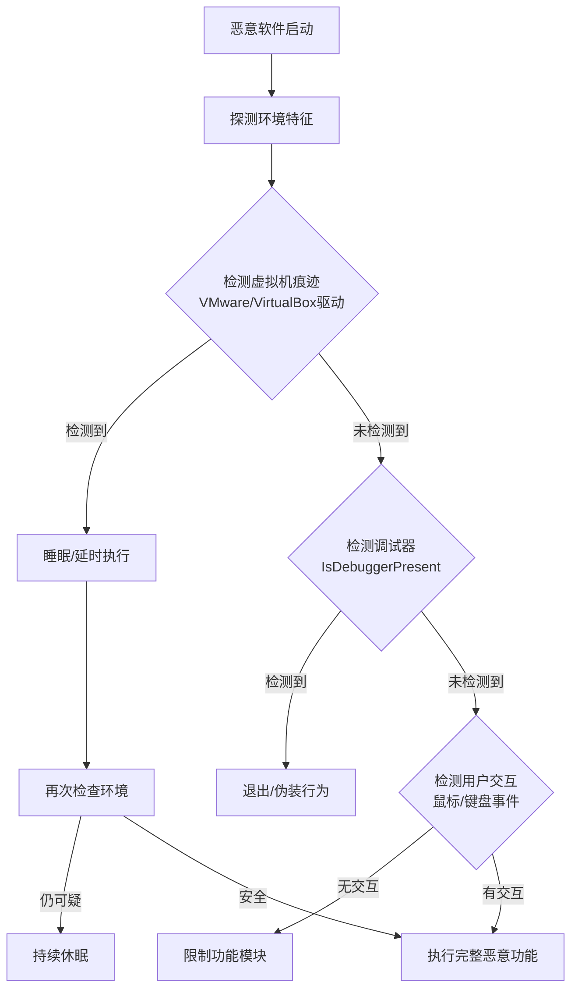

# 虚拟化/沙箱规避 (T1497)

## 一句话通俗理解

恶意软件先检查自己是否在分析师的"显微镜"下运行，如果是就装死不动，让分析师以为它是个普通的文件。

## 难度等级

⭐⭐ 中级（需要一定基础）

## 技术描述

虚拟化/沙箱规避（T1497）是MITRE ATT&CK框架中隐蔽战术的一种技术。

**通俗解释：**
安全分析师会把可疑文件放到沙箱（一个隔离的虚拟机）里运行，观察它会做什么。攻击者为了不被分析，给恶意软件加了一个"反侦察模块"：运行前先检查自己是否在虚拟机里，检查CPU核心数、内存大小、是否存在特定驱动、是否在调试器中运行。如果发现可疑环境，恶意软件立刻停止活动，表现得像普通文件一样。

**技术原理：**
1. **检测虚拟机特征**：检查VMware/VirtualBox的特定驱动、注册表项、进程
2. **检测调试环境**：检查是否有调试器附加、断点指令
3. **检测沙箱特征**：检查CPU核心数（沙箱通常只有1-2核）、内存大小、磁盘大小
4. **检测分析工具**：查找是否安装了Wireshark、Process Monitor等分析工具
5. **时间失真检测**：计算两个时间点之间的真实时间差（沙箱常加速时间）

## 子技术列表

| 子技术ID | 中文名称 | 通俗解释 |
|----------|----------|----------|
| T1497.001 | 系统时间检测 | 检查系统运行时间来判断是否在沙箱中 |
| T1497.002 | 用户活动检测 | 检查是否有用户交互（鼠标、键盘事件） |
| T1497.003 | 基于时间的规避 | 延时执行或休眠规避沙箱时间限制 |

## 攻击流程

### 典型攻击流程

```
探测环境特征 --> 检测虚拟机痕迹 --> 检测调试器 --> 判断是否为分析环境 --> 选择行为路径
```



**步骤详解：**

1. **探测环境特征**
   - 通俗描述：恶意软件先查看电脑的"硬件配置"
   - 技术细节：检查CPU核心数（沙箱通常≤2核）、内存大小（沙箱通常≤4GB）、磁盘大小、MAC地址前缀
   - 常用工具：`GetSystemInfo`、`NtQuerySystemInformation`

2. **检测虚拟机痕迹**
   - 通俗描述：查找虚拟机的"身份证"——特定驱动、注册表项、进程
   - 技术细节：检查VMware(VMTools)、VirtualBox(VBoxGuest)的进程/服务/注册表键
   - 常用工具：`CreateToolhelp32Snapshot`、`RegOpenKeyEx`

3. **检测调试器**
   - 通俗描述：检查是否有人在用调试器"偷看"恶意软件运行
   - 技术细节：调用`IsDebuggerPresent`、`NtQueryInformationProcess`、检查PEB的`BeingDebugged`标志
   - 常用工具：Windows API调试函数

4. **判断环境并选择行为**
   - 通俗描述：根据检测结果决定是"装死"还是"干活"
   - 技术细节：真实环境执行恶意功能，分析环境则休眠/退出/执行非恶意代码
   - 常用工具：条件分支逻辑

## 红队视角

> ⚠️ **免责声明**：以下内容仅用于合法的安全测试、渗透测试和教育目的。未经授权对他人系统进行测试是违法行为。

### 实战技巧

1. **多层检测组合提高准确性**
   不要依赖单一的检测指标（如只检查CPU核心数），组合5-8个检测指标综合判断。例如同时检查：CPU核心数+内存大小+磁盘大小+MAC地址前缀+特定注册表键+运行时间+鼠标移动记录。

2. **基于时间的规避技巧**
   使用`Sleep`函数随机延迟5-30分钟再执行恶意代码，避开沙箱的短时间分析窗口。更高级的做法是使用`NtDelayExecution`直接调用内核API，绕过对`Sleep`的hook监控。

3. **用户交互检测**
   检查系统正常运行时间（Uptime），如果<15分钟则可能是沙箱刚启动。检查是否有鼠标移动事件、窗口焦点变化等用户活动迹象。

### 常用工具

| 工具名称 | 用途 | 平台 | 链接 |
|----------|------|------|------|
| VMDetect | 虚拟机检测库 | Windows | https://github.com/LordNoteworthy/al-khaser |
| pafish | 反分析检测工具 | Windows | https://github.com/a0rtega/pafish |
| Al-Khaser | 反调试/反虚拟机检测 | Windows | https://github.com/LordNoteworthy/al-khaser |
| NtQuerySystemInformation | 系统信息查询API | Windows | Windows原生API |

### 注意事项

- 过度反检测可能导致合法用户环境中误触发，降低恶意软件感染率
- EDR产品也会检测反虚拟机行为作为恶意指标
- 多层检测会增加恶意软件体积和复杂度

## 蓝队视角

### 检测要点

1. **环境探测API调用**
   - 日志来源：Sysmon Event ID 10（进程访问）、API监控
   - 关注字段：`NtQuerySystemInformation`、`IsDebuggerPresent`、`GetSystemInfo`调用
   - 异常特征：非调试工具的进程频繁调用系统信息查询API

2. **异常的进程休眠行为**
   - 日志来源：进程监控、EDR行为分析
   - 关注字段：进程执行模式、CPU使用率
   - 异常特征：可疑进程在启动后陷入长时间休眠（Sleep），休眠结束后突然执行网络连接

3. **虚拟机驱动检测**
   - 日志来源：Sysmon Event ID 11（文件创建）、注册表监控
   - 关注字段：查询VMware/VirtualBox驱动路径的注册表操作
   - 异常特征：非虚拟机管理进程查询VMTools/VBoxGuest相关注册表键

### 监控建议

- 在沙箱/分析环境中增加反规避措施（修改虚拟机特征）
- 监控系统信息API的异常调用频率和调用进程
- 使用行为分析检测"休眠后突然活跃"的恶意模式

## 检测建议

### 网络层检测

**检测方法：** 监控恶意软件逃避检测时产生的网络指纹特征，如向已知VMware/VirtualBox IP发送探测请求、识别沙箱网络环境的DNS查询模式。

**具体规则/命令示例：**
```
# 检测向沙箱/VM检测端点的连接
suricata -r traffic.pcap --rule "alert tcp $HOME_NET any -> $EXTERNAL_NET any (msg:\"VM Detection Probe\"; content:\"www.vmware.com\"; nocase; sid:1000011;)"

# 检测异常的DNS查询（沙箱环境指纹）
tcpdump -i eth0 port 53 -A | grep -E "isatap|wpad|msftncsi" | alert
```

### 主机层检测

**Windows事件ID：**
- Sysmon Event ID 1：进程创建
- Sysmon Event ID 10：进程访问（检测调试器附加）
- Event ID 4688：进程创建
- Event ID 4104：PowerShell Script Block Logging

**具体命令示例：**
```bash
# 检测进程查询系统信息的行为
Get-WinEvent -FilterHashtable @{LogName='Microsoft-Windows-Sysmon/Operational'; ID=1} |
    Where-Object { $_.Message -match 'NtQuerySystemInformation' }
```

### 应用层检测

**Sigma规则示例：**
```yaml
title: 虚拟机检测行为
status: experimental
description: 检测恶意软件通过API查询虚拟机特征的行为
logsource:
    category: process_creation
    product: windows
detection:
    selection:
        CommandLine|contains:
            - 'IsDebuggerPresent'
            - 'NtQuerySystemInformation'
            - 'VBoxGuest'
            - 'VMware'
    condition: selection
level: medium
tags:
    - attack.t1497
    - attack.defense_evasion
```

## 缓解措施

### 优先级1：关键措施

**措施名称：** 沙箱/分析环境增强

**具体实施步骤：**
1. 修改虚拟机默认特征（CPU核心数、内存、MAC地址）
2. 安装完整的VMware Tools/VirtualBox Guest Additions
3. 添加模拟的用户活动（鼠标移动、键盘操作）

### 优先级2：重要措施

**措施名称：** 时间分析窗口扩展

**具体实施步骤：**
1. 延长沙箱分析时间至30分钟以上
2. 使用内存快照对比技术检测延时执行的恶意行为
3. 配合网络流量分析捕获休眠后的C2通信

### 优先级3：建议措施

**措施名称：** 行为分析补充

**具体实施步骤：**
1. 部署行为检测引擎，监控"环境探测+休眠+执行"的行为链
2. 在网络层检测针对沙箱规避的异常行为模式

### MITRE ATT&CK 缓解措施映射

| 缓解措施ID | 缓解措施名称 | 适用性 | 说明 |
|------------|-------------|--------|------|
| M1049 | 沙箱分析 | 适用 | 使用增强沙箱检测恶意行为 |
| M1031 | 网络入侵检测 | 部分适用 | 检测环境探测后的C2通信 |
| M1040 | 行为检测 | 适用 | 监控异常的环境探测API调用 |

## 真实案例

### 案例1：TrickBot 使用虚拟机检测沙箱规避（2019-2022）

- **时间**: 2019-2022年
- **手法**: TrickBot检查是否存在VMware Tools、VirtualBox Guest Additions等虚拟机工具。发现VMware进程立即停止执行。
- **参考链接**: [MITRE - TrickBot](https://attack.mitre.org/software/S0266/)

### 案例2：Emotet 使用延迟执行规避沙箱（2020-2023）

- **时间**: 2020-2023年
- **手法**: Emotet加入随机延迟执行（2-30分钟），检查系统正常运行时间（Uptime），如果系统运行时间少于15分钟则停止执行。
- **参考链接**: [MITRE - Emotet](https://attack.mitre.org/software/S0367/)

### 案例3：FormBook 使用反调试和反虚拟机技术（2022-2024）

- **时间**: 2022-2024年
- **手法**: 使用NtQueryInformationProcess检查是否处于调试模式，检查.net框架版本、处理器数量、可移动磁盘等环境特征。
- **参考链接**: [Fortinet - FormBook](https://www.fortinet.com/blog/)

## 动手实验

> ⚠️ **重要提示**：所有实验必须在隔离的实验室环境中进行，禁止对未授权的真实系统进行测试。

### 实验环境准备

**所需工具：** Windows虚拟机、Visual Studio（或MinGW）、Process Monitor、pafish工具

### 实验1：运行pafish检测虚拟机环境（初级）

**实验步骤：**
1. 从GitHub下载pafish（反分析检测工具）的预编译版本
2. 在Windows虚拟机中运行pafish.exe
3. 观察pafish检测到的虚拟机特征列表（如VMware驱动、MAC地址前缀、硬件配置等）
4. 记录pafish报告的所有检测项，对比物理机上的运行结果（如有条件）

**预期结果：** pafish报告检测到多个虚拟机环境特征，包括特定驱动程序、注册表键值和硬件配置

**学习要点：** 理解恶意软件检测虚拟机的常见手段，以及安全分析师如何通过修改虚拟机配置（增加CPU核心数、隐藏驱动等）来规避检测

### 实验2：编写环境探测程序检测沙箱特征（中级）

**实验步骤：**
1. 使用C语言编写一个小程序，调用GetSystemInfo获取CPU核心数和内存大小
2. 调用NtQuerySystemInformation查询系统运行时间
3. 调用IsDebuggerPresent检测调试器附加状态
4. 调用GetModuleHandle检查常见分析工具DLL（如dbghelp.dll、sbieDll.dll）
5. 根据检测结果输出"安全环境"或"疑似分析环境"

**预期结果：** 在标准虚拟机中CPU核心数通常为1-2，系统运行时间较短，程序判断为"疑似分析环境"

**学习要点：** 理解常见环境探测API的调用方式，以及如何通过EDR的行为分析来监控这类探测行为

## 术语解释

| 术语 | 英文原名 | 通俗解释 |
|------|----------|----------|
| 沙箱 | Sandbox | 用于安全分析的隔离环境 |
| 反调试 | Anti-Debug | 检测是否被调试器附加的技术 |
| 虚拟机检测 | VM Detection | 检测是否运行在虚拟机中 |

## 参考资料

- [MITRE ATT&CK - T1497 Virtualization/Sandbox Evasion](https://attack.mitre.org/techniques/T1497/)
- [The "Art of Anti-Detection" Series](https://www.elastic.co/blog/)
