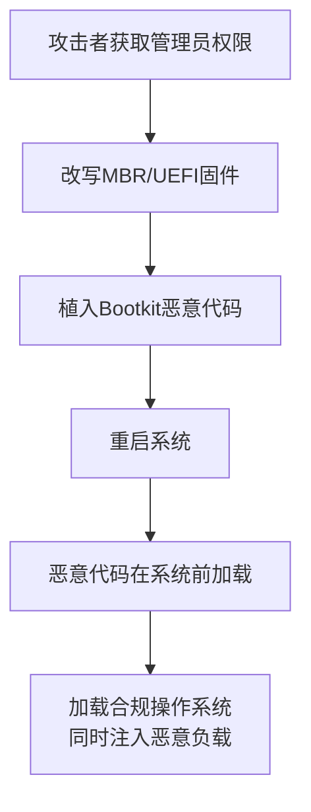

# 操作系统启动前 (T1542)

## 一句话通俗理解

攻击者在Windows系统启动之前就把恶意代码植入到主板或硬盘的固件中，就像在手机出厂前就把窃听器焊在主板上——重装系统都没用。

## 难度等级

⭐⭐⭐ 高级（需要深入技术知识）

## 技术描述

操作系统启动前（T1542）是MITRE ATT&CK框架中隐蔽战术的一种高级技术。

**通俗解释：**
当你的电脑启动时，系统是从"基础输入输出系统"（BIOS/UEFI）引导的，然后加载操作系统。攻击者可以在系统启动前——在BIOS/UEFI、硬盘主引导记录（MBR）或引导扇区中植入恶意代码。因为这些东西在操作系统加载之前就运行了，杀毒软件和EDR根本无法检测到它们。更可怕的是，即使你格式化硬盘、重装系统，这些恶意代码仍然存在——它们不在操作系统里，而在底层硬件中。

**技术原理：**
1. **MBR/VBR感染**：改写硬盘的主引导记录（MBR）或卷引导记录（VBR），在系统启动时第一个执行
2. **UEFI固件感染**：在UEFI固件中植入恶意代码，绕过Secure Boot保护
3. **Bootkit**：在引导过程中加载的恶意驱动程序，在操作系统之前获取控制权
4. **固件植入**：在硬盘、网卡或其他硬件设备的固件中植入后门

## 子技术列表

| 子技术ID | 中文名称 | 通俗解释 |
|----------|----------|----------|
| T1542.001 | 系统固件 | 在系统固件（BIOS/UEFI）中植入恶意代码 |
| T1542.002 | 组件固件 | 在硬件设备固件（硬盘、网卡）中植入后门 |
| T1542.003 | 主引导记录 | 改写硬盘MBR，在操作系统之前获得控制权 |
| T1542.004 | 引导扇区 | 感染卷引导记录（VBR），在分区加载时执行 |
| T1542.005 | 磁盘区域擦除 | 使用磁盘上的隐藏区域存储持久化恶意负载 |

## 攻击流程



## 真实案例

### 案例1：HackingTeam UEFI Bootkit (VectorEDK)（2015-2018）

- **时间**: 2015-2018年
- **目标**: 全球特定目标的监控
- **攻击组织**: HackingTeam
- **手法**: 将恶意代码植入UEFI固件中，每次系统启动时Bootkit会预先加载，向操作系统注入恶意DLL。即使重装系统也无法清除。
- **参考链接**: [HackingTeam UEFI Bootkit](https://www.wired.com/2015/07/hacking-team-uefi-bootkit/)

### 案例2：Sednit (APT28) LoJax UEFI Bootkit（2018）

- **时间**: 2018年
- **目标**: 东欧政府机构
- **攻击组织**: APT28
- **手法**: 首个在野发现的UEFI Bootkit。APT28将恶意代码写入系统固件，在每次启动时加载恶意驱动。即使硬盘完全格式化，恶意代码仍然存在。
- **参考链接**: [ESET - LoJax](https://www.welivesecurity.com/2018/10/11/lojax-first-uefi-rootkit/)

### 案例3：BlackLotus UEFI Bootkit（2023）

- **时间**: 2023年
- **目标**: Windows系统，全球用户
- **攻击组织**: 未知
- **手法**: BlackLotus是首个能够绕过UEFI Secure Boot的Bootkit。利用CVE-2022-21894漏洞，即使在完全更新的Windows 11上也能绕过Secure Boot保护，在系统启动前获得控制权。
- **影响**: 展示即使是Secure Boot也并非绝对安全
- **参考链接**: [ESET - BlackLotus](https://www.welivesecurity.com/2023/03/01/blacklotus-uefi-bootkit/)

### 案例4：Bootkitty UEFI检测绕过（2024年）

- **时间**: 2024年
- **手法**: Bootkitty是一种概念验证的UEFI Bootkit，专门设计用于绕过2024年Windows Boot Manager的加固措施。它展示了即使微软不断增强安全防护，固件级攻击仍然有突破空间。
- **参考链接**: [BleepingComputer - Bootkitty](https://www.bleepingcomputer.com/)

## 红队视角

> ⚠️ **免责声明**：以下内容仅用于合法的安全测试、渗透测试和教育目的。未经授权对他人系统进行测试是违法行为。

### 常用工具

| 工具名称 | 用途 | 平台 | 链接 |
|----------|------|------|------|
| EfiGuard | UEFI引导保护绕过工具 | UEFI | https://github.com/Mattiwatti/EfiGuard |

## 蓝队视角

### 检测要点

- 启用Secure Boot和TPM 2.0
- 监控MBR/VBR的修改（Sysmon事件ID 13）
- 定期检查UEFI固件完整性
- 使用硬件安全模块（HSM）保护引导流程

## 检测建议

### 网络层检测

**检测方法：** 监控Bootkit和固件级恶意软件的C2通信，通常在系统启动后立即产生异常的网络连接，或在固件更新过程中向非可信源发起连接。

**具体规则/命令示例：**
```
# 检测系统启动后立即产生的异常外连
tcpdump -i eth0 'tcp[tcpflags] & (tcp-syn) != 0' | grep -v "dhcp\|dns" | head -20

# 检测固件下载到非标准IP
suricata -r traffic.pcap --rule "alert tcp $HOME_NET any -> $EXTERNAL_NET $HTTP_PORTS (msg:\"Firmware Download to Unknown IP\"; content:\".bin\"; http_uri; nocase; sid:1000015;)"
```

**主机层：**
- 监控磁盘扇区的非常规写入操作（Event ID 4663）
- 检测磁盘末尾或隐藏区域的异常数据
- 使用Measured Boot检测启动路径中的异常
- Sysmon事件ID 13监控注册表修改（UEFI相关键值）

**固件层：**
- 定期检查UEFI固件版本和完整性
- 启用Secure Boot和TPM 2.0
- 使用硬件安全模块验证固件签名

**Sigma规则：**
```yaml
title: MBR or Boot Sector Modification
status: experimental
description: Detects attempts to write to the Master Boot Record or boot sectors
logsource:
    category: process_creation
    product: windows
detection:
    selection:
        Image|endswith: '\diskpart.exe'
        CommandLine|contains: 'MBR'
    condition: selection
level: high
tags:
    - attack.t1542
```

## 缓解措施

### 优先级1：关键措施
**启用Secure Boot和TPM 2.0：**
- 在UEFI设置中启用Secure Boot，确保只加载经过签名的引导程序
- 启用TPM 2.0进行平台完整性验证
- 配置Measured Boot记录启动路径中的每个组件

### 优先级2：重要措施
**固件安全加固：**
- 设置UEFI固件密码，防止未授权的固件修改
- 定期检查固件更新，及时修补已知漏洞
- 禁用不必要的固件功能（如网络启动、外部设备启动）

### 优先级3：建议措施
**监控与检测：**
- 监控MBR/VBR的写操作（Sysmon事件ID 11）
- 配置BIOS/UEFI修改的审计告警
- 部署硬件安全模块（HSM）保护引导流程

### MITRE ATT&CK缓解措施映射

| 缓解措施ID | 缓解措施名称 | 适用性 | 说明 |
|------------|-------------|--------|------|
| M1047 | 启动完整性保护 | 适用 | 启用Secure Boot和Measured Boot |
| M1040 | 防篡改 | 适用 | 设置UEFI固件密码保护 |
| M1053 | 固件更新管理 | 适用 | 定期更新固件修补已知漏洞 |

## 动手实验

> ⚠️ **重要提示**：所有实验必须在隔离的实验室环境中进行，禁止对未授权的真实系统进行测试。

### 实验1：分析MBR结构（高级）

**实验步骤：**
1. 使用dd命令备份MBR：`dd if=\\.\PhysicalDrive0 of=mbr.bin bs=512 count=1`
2. 使用hexdump工具分析MBR内容
3. 识别MBR中的引导代码和分区表

## 术语解释

| 术语 | 英文原名 | 通俗解释 |
|------|----------|----------|
| MBR | Master Boot Record | 主引导记录，硬盘的第一个扇区，负责启动系统 |
| UEFI | Unified Extensible Firmware Interface | 比BIOS更现代的固件接口，相当于电脑主板的操作系统 |
| Bootkit | Bootkit | 在操作系统加载前运行的恶意代码，比Rootkit更底层 |
| Secure Boot | Secure Boot | UEFI的安全启动功能，只加载经过签名的引导程序 |

## 参考资料

- [MITRE ATT&CK - T1542 Pre-OS Boot](https://attack.mitre.org/techniques/T1542/)
- [ESET - LoJax UEFI Rootkit Analysis](https://www.welivesecurity.com/2018/10/11/lojax-first-uefi-rootkit/)
- [ESET - BlackLotus UEFI Bootkit](https://www.welivesecurity.com/2023/03/01/blacklotus-uefi-bootkit/)
