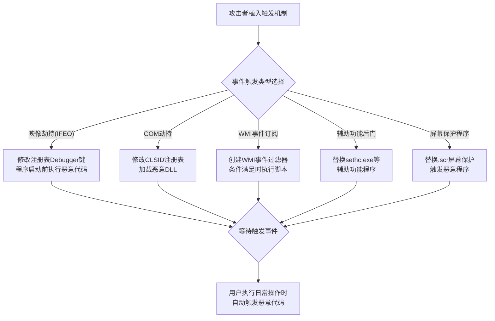

# 事件触发执行 (T1546)

## 一句话通俗理解

攻击者在系统中设置"陷阱"——当用户做某个日常操作（如打开记事本、插入U盘、登录系统）时自动触发恶意代码，就像在门把手上装了一个触发机关。

## 难度等级

⭐⭐ 中级（需要一定基础）

## 技术描述

事件触发执行（T1546）是MITRE ATT&CK框架中隐蔽战术的一种技术。

**通俗解释：**
Windows系统允许用户在特定事件发生时自动运行一个程序。比如，可以设置"每次插入U盘时自动运行这个程序"或"每次用户登录时自动启动这个软件"。攻击者利用这些功能来设置"陷阱"：他们修改注册表、创建COM对象劫持或设置WMI事件订阅，让恶意代码在日常操作发生时自动执行。用户（和安全软件）看到的是用户自己触发了操作，实际上背后有"黑手"在操控。

**技术原理：**
1. **映像劫持**（Image File Execution Options）：修改注册表，让系统在启动特定程序前先运行攻击者的代码
2. **COM劫持**：修改COM组件的CLSID注册表项，使系统加载恶意DLL
3. **WMI事件订阅**：创建WMI事件订阅，在特定条件满足时执行恶意脚本
4. **屏幕保护程序**：修改注册表，设置恶意的.scr文件为屏幕保护程序
5. **启动文件夹**：将恶意文件放入用户的启动文件夹

## 攻击流程



**步骤详解：**
1. **设置触发机制**：攻击者选择合适的事件触发方式并配置注册表或文件系统
2. **选择触发器**：选择用户日常操作（打开程序、登录、插入U盘等）作为触发条件
3. **等待触发**：恶意代码保持静默，等待用户正常操作触发
4. **执行恶意负载**：触发条件满足后，自动执行恶意代码

## 子技术列表

| 子技术ID | 中文名称 | 通俗解释 |
|----------|----------|----------|
| T1546.001 | 更改默认文件关联 | 修改.txt/.doc等文件类型的默认打开方式 |
| T1546.002 | 屏幕保护程序 | 将屏幕保护程序替换为恶意程序 |
| T1546.003 | Windows管理规范事件订阅 | 创建WMI事件，满足条件时自动执行 |
| T1546.004 | Unix Shell配置修改 | 修改.bashrc/.profile，Shell启动时执行 |
| T1546.005 | 映像劫持 | 修改程序启动路径，在程序启动前执行恶意代码 |
| T1546.006 | LD_PRELOAD | Linux下利用LD_PRELOAD加载恶意共享库 |
| T1546.007 | Netsh助手DLL | 在Netsh中添加助手DLL |
| T1546.008 | Accessibility特性 | 利用Windows辅助功能（粘滞键）后门 |
| T1546.009 | AppCert DLL | 注册AppCert DLL，进程启动时自动加载 |
| T1546.010 | AppInit DLL | 注册AppInit DLL，所有进程加载user32.dll时自动加载 |
| T1546.011 | 应用关闭 | 利用Windows关机事件执行代码 |
| T1546.012 | 图片加载 | 利用Windows图片加载机制执行代码 |
| T1546.013 | PowerShell配置文件 | 修改PowerShell配置文件，启动时自动加载 |
| T1546.014 | Emond | macOS的Event Monitor守护进程执行 |
| T1546.015 | 组件对象模型劫持 | 劫持COM对象的注册信息 |

## 真实案例

### 案例1：Emotet 使用WMI事件订阅持久化（2020-2022）

- **时间**: 2020-2022年
- **手法**: Emotet创建WMI事件订阅，在系统启动或用户登录时自动执行PowerShell脚本。
- **参考链接**: [MITRE - Emotet](https://attack.mitre.org/software/S0367/)

### 案例2：Sticky Keys 辅助功能后门（2016-2022）

- **时间**: 2016-2022年
- **手法**: 攻击者替换sethc.exe（粘滞键程序）为cmd.exe，在登录界面按5次Shift即可获得系统权限。
- **参考链接**: [LOLBAS - Sticky Keys](https://lolbas-project.github.io/)

### 案例3：TrickBot 使用COM劫持实现持久化（2019-2021）

- **时间**: 2019-2021年
- **手法**: TrickBot修改COM组件的CLSID，当系统或应用程序加载该COM组件时，自动加载恶意DLL。
- **参考链接**: [MITRE - TrickBot](https://attack.mitre.org/software/S0266/)

## 红队视角

> ⚠️ **免责声明**：以下内容仅用于合法的安全测试、渗透测试和教育目的。未经授权对他人系统进行测试是违法行为。

> ⚠️ **免责声明**：以下内容仅用于合法的安全测试、教育和研究目的。

**实战技巧：**
1. 辅助功能后门（粘滞键）是最经典的持久化方式，在登录界面也能触发
2. COM劫持的隐蔽性高于IFEO，因为COM加载链更复杂，检测难度更大
3. WMI事件订阅可以实现无文件持久化，不写入磁盘文件

**常用工具：**
- regedit.exe：注册表编辑器，用于修改触发条件
- PowerShell：创建WMI事件订阅和注册表操作
- sethc.exe/Utilman.exe：Windows辅助功能可执行文件

**注意事项：**
- IFEO劫持对64位和32位程序的注册表路径不同
- WMI事件订阅存储在WMI存储库中，需要特定工具才能查看
- 部分触发方式在Windows更新后可能会被重置

## 蓝队视角

**防御重点：**
1. **注册表监控**：重点监控IFEO、COM CLSID等关键注册表路径的修改
2. **辅助功能保护**：启用Windows受保护进程（PPL）保护辅助功能可执行文件
3. **WMI审计**：配置WMI活动审计，监控WMI事件订阅的创建

**检测要点：**
- 监控IFEO注册表键的修改（HKLM\Software\Microsoft\Windows NT\CurrentVersion\Image File Execution Options）
- 检测COM CLSID注册表项的异常修改（Event ID 4657）
- 监控WMI事件订阅的创建（Event ID 5861）
- 检查辅助功能可执行文件是否被替换

## 检测建议

### 网络层检测

**检测方法：** 监控由事件触发机制（如WMI订阅、IFEO、辅助功能劫持）导致的异常网络连接，特别是非交互式进程在特定事件触发后建立的外部通信。

**具体规则/命令示例：**
```
# 检测WMI事件订阅触发的网络连接
suricata -r traffic.pcap --rule "alert tcp $HOME_NET any -> $EXTERNAL_NET $HTTP_PORTS (msg:\"WMI Trigger Network Connection\"; content:\"scrcons.exe\"; nocase; sid:1000016;)"

# 检测辅助功能劫持后的外连
zeek -r traffic.pcap | grep -E "sethc.exe|utilman.exe|osk.exe" -A 3
```

**主机层：**
- 监控注册表中IFEO（映像劫持）键值修改（Event ID 4657）
- 检测WMI事件订阅的创建（Event ID 5861）
- 监控辅助功能可执行文件被替换（文件完整性监控）
- Sysmon事件ID 13监控COM CLSID注册表项的修改
- 检测屏幕保护程序注册表的异常修改（Event ID 4657）

**网络层：**
- 检测WMI事件订阅触发的异常网络连接
- 监控COM组件加载后的网络行为

**Sigma规则：**
```yaml
title: Image File Execution Options Injection
status: experimental
description: Detects modifications to IFEO registry keys for persistence
logsource:
    category: registry_event
    product: windows
detection:
    selection:
        EventID: 13
        TargetObject|contains: 'Image File Execution Options'
        TargetObject|endswith: 'Debugger'
    condition: selection
level: high
tags:
    - attack.t1546
```

## 缓解措施

### 优先级1：关键措施
**关键注册表路径保护：**
- 使用Windows Defender Attack Surface Reduction（ASR）规则阻止IFEO修改
- 配置注册表审计，监控IFEO、COM CLSID等关键路径的变更
- 启用PPL保护保护辅助功能可执行文件

### 优先级2：重要措施
**WMI安全加固：**
- 限制WMI事件订阅的创建权限
- 配置WMI活动审计（Event ID 5861）
- 定期检查WMI存储库中的异常订阅

### 优先级3：建议措施
**文件完整性监控：**
- 部署文件完整性监控（FIM）保护关键系统文件
- 监控启动文件夹和屏幕保护程序文件的异常修改

### MITRE ATT&CK缓解措施映射

| 缓解措施ID | 缓解措施名称 | 适用性 | 说明 |
|------------|-------------|--------|------|
| M1038 | 执行防护 | 适用 | 使用ASR规则阻止IFEO劫持 |
| M1026 | 特权账户管理 | 适用 | 限制WMI事件订阅创建权限 |
| M1040 | 防篡改 | 适用 | 启用PPL保护辅助功能可执行文件 |

## 动手实验

> ⚠️ **重要提示**：所有实验必须在隔离的实验室环境中进行，禁止对未授权的真实系统进行测试。

### 实验环境准备

**所需工具：** Windows虚拟机、Regedit、Sysmon、PowerShell

### 实验1：设置屏幕保护程序触发恶意代码（初级）

**实验步骤：**
1. 在Windows虚拟机中创建一个批处理文件`trigger.bat`，内容为`calc.exe`
2. 打开注册表编辑器，导航到`HKCU\Control Panel\Desktop`
3. 修改`SCRNSAVE.EXE`的值为`C:\trigger.bat`的完整路径
4. 将屏幕保护程序等待时间`ScreenSaveTimeOut`设置为60秒
5. 等待60秒让屏幕保护程序触发

**预期结果：** 屏幕保护程序启动时，计算器程序自动弹出运行

**学习要点：** 理解攻击者如何利用系统正常功能（屏幕保护程序）实现事件触发执行，以及如何通过监控注册表变更来发现异常

### 实验2：创建WMI事件订阅实现持久化（中级）

**实验步骤：**
1. 以管理员身份打开PowerShell
2. 创建WMI事件过滤器，监控记事本进程启动事件：
   `Register-CimIndicationEvent -Query "SELECT * FROM __InstanceCreationEvent WITHIN 10 WHERE TargetInstance ISA 'Win32_Process' AND TargetInstance.Name = 'notepad.exe'" -Action { Start-Process cmd.exe }`
3. 打开记事本程序，观察是否自动出现命令提示符窗口
4. 使用`Get-WmiObject -Namespace root\subscription -Class __EventFilter`查看已注册的事件过滤器

**预期结果：** 每次打开记事本时，命令提示符窗口自动弹出，WMI存储库中记录了该事件订阅

**学习要点：** 理解WMI事件订阅的工作原理，以及如何通过定期检查WMI存储库中的异常订阅来发现隐蔽后门

## 术语解释

| 术语 | 英文原名 | 通俗解释 |
|------|----------|----------|
| IFEO | Image File Execution Options | 映像劫持，程序启动前先执行另一个程序的注册表设置 |
| WMI | Windows Management Instrumentation | Windows管理规范，用于监控和管理系统 |
| COM | Component Object Model | Windows组件对象模型，系统组件的交互标准 |
| 粘滞键 | Sticky Keys | Windows辅助功能，按5次Shift触发 |

## 参考资料

- [MITRE ATT&CK - T1546 Event Triggered Execution](https://attack.mitre.org/techniques/T1546/)
- [LOLBAS - Accessibility Features](https://lolbas-project.github.io/)
