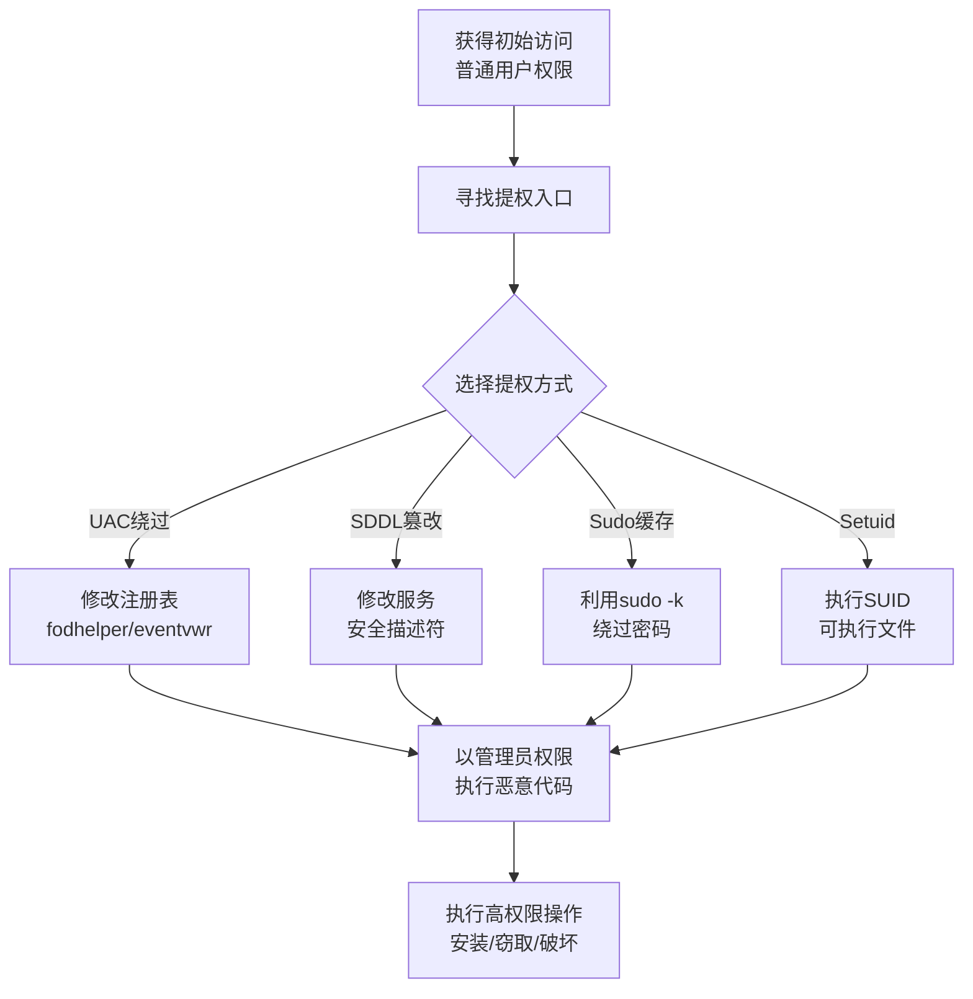

# 滥用权限提升控制机制 (T1548)

## 一句话通俗理解

攻击者绕过UAC（用户账户控制）的提示，悄悄把程序权限提升到管理员级别，就像没有钥匙却从窗户翻进房间——绕过了门禁系统。

## 难度等级

⭐⭐ 中级（需要一定基础）

## 技术描述

滥用权限提升控制机制（T1548）是MITRE ATT&CK框架中隐蔽战术的一种技术。

**通俗解释：**
Windows有一个安全机制叫UAC（用户账户控制），当程序需要管理员权限时，会弹出一个窗口让你确认。攻击者不想让这个弹窗出现（会引起用户怀疑），所以他们找到了绕过UAC的方法。通过利用系统信任的程序（如白名单程序），攻击者可以在不弹出UAC提示的情况下以管理员权限运行代码。

**技术原理：**
1. **UAC绕过**：利用系统信任的签署程序（如fodhelper.exe）来提升权限
2. **SDDL权限提升**：滥用服务的安全描述符定义语言（SDDL）提升权限
3. **Sudo缓存**：利用Linux sudo的缓存机制，在sudo超时时间内无需密码
4. **Setuid/Setgid**：利用设置了suid位的可执行文件提升权限

## 子技术列表

| 子技术ID | 中文名称 | 通俗解释 |
|----------|----------|----------|
| T1548.001 | Windows UAC绕过 | 利用系统信任的程序绕过UAC |
| T1548.002 | LC_LOAD_DYLIB添加 | macOS上利用动态库注入提升权限 |
| T1548.003 | Sudo和Sudo缓存 | 利用sudo缓存或sudo配置漏洞 |
| T1548.004 | Setuid和Setgid | 利用配置不当的suid/sgid可执行文件 |

## 攻击流程

### 典型攻击流程

```
获取低权限访问 --> 寻找提权入口 --> 执行提权操作 --> 获得高权限 --> 执行恶意操作
```



**步骤详解：**

1. **获取低权限访问**
   - 通俗描述：攻击者通过各种方式进入了系统，但权限很低
   - 技术细节：通过钓鱼获得普通用户权限，或通过漏洞利用获得有限访问
   - 常用工具：Cobalt Strike、Metasploit

2. **寻找提权入口**
   - 通俗描述：寻找可以提升权限的系统功能或漏洞
   - 技术细节：检查系统配置、寻找SUID文件、测试sudo配置、分析服务权限
   - 常用工具：`whoami /priv`、`sudo -l`、`WinPEAS`

3. **执行提权操作**
   - 通俗描述：利用找到的入口提升权限到管理员/root
   - 技术细节：修改注册表触发fodhelper、利用sudo缓存、执行SUID程序
   - 常用工具：`fodhelper.exe`、`sudo`、自定义提权脚本

## 红队视角

> ⚠️ **免责声明**：以下内容仅用于合法的安全测试、渗透测试和教育目的。未经授权对他人系统进行测试是违法行为。

### 实战技巧

1. **经典的fodhelper UAC绕过**
   Windows 10/11中最稳定的UAC绕过方法之一。在注册表`HKCU\Software\Classes\ms-settings\shell\open\command`下设置恶意命令，然后触发fodhelper.exe执行。

2. **使用CMSTP绕过UAC**
   CMSTP（Microsoft Connection Manager Profile Installer）是一个微软签名的程序，可以加载恶意INF文件绕过UAC。使用`cmstp.exe /s malicious.inf`即可在静默模式下以管理员权限运行。

3. **Linux sudo缓存利用**
   默认sudo配置会缓存密码15分钟。在这段时间内执行`sudo command`无需密码。攻击者获得低权限shell后，可以检查`sudo -n true 2>/dev/null`的返回值判断是否有有效的sudo缓存。

### 常用工具

| 工具名称 | 用途 | 平台 | 链接 |
|----------|------|------|------|
| fodhelper.exe | Windows UAC绕过 | Windows | 系统自带 |
| eventvwr.exe | UAC绕过触发程序 | Windows | 系统自带 |
| UACME | UAC绕过工具集合 | Windows | https://github.com/hfiref0x/UACME |
| WinPEAS | Windows提权枚举 | Windows | https://github.com/peass-ng/PEASS-ng |
| LinPEAS | Linux提权枚举 | Linux | https://github.com/peass-ng/PEASS-ng |
| sudo | Linux提权命令 | Linux | 系统内置 |

### 注意事项

- UAC绕过在不同的Windows版本上效果不同，需要针对目标版本测试
- 现代EDR对fodhelper、eventvwr等已知UAC绕过方法已有检测规则
- Linux提权需要注意操作系统的版本和sudo版本

## 蓝队视角

### 检测要点

1. **UAC绕过检测**
   - 日志来源：Windows Event ID 4688、Sysmon Event ID 1
   - 关注字段：`fodhelper.exe`、`eventvwr.exe`、`cmstp.exe`等程序的异常启动
   - 异常特征：由非管理员启动的fodhelper/eventvwr进程，并随后执行可疑子进程

2. **注册表修改检测**
   - 日志来源：Sysmon Event ID 13（注册表修改）
   - 关注字段：`HKCU\Software\Classes\ms-settings\shell\open\command`等注册表键的修改
   - 异常特征：非安装程序修改系统默认文件关联

3. **Linux提权检测**
   - 日志来源：auditd、/var/log/auth.log、/var/log/secure
   - 关注字段：sudo命令执行记录、SUID文件使用
   - 异常特征：非特权用户频繁尝试sudo命令

### 监控建议

- 监控fodhelper.exe、eventvwr.exe等程序的非标准调用链
- 监控注册表`HKCU\Software\Classes\ms-settings\`和`HKCU\Software\Classes\AppX\`的异常修改
- 监控Linux系统中`sudo`命令的异常使用频率

## 检测建议

### 网络层检测

**检测方法：** 监控UAC绕过工具执行后产生的异常网络连接，如fodhelper.exe或eventvwr.exe等触发提权后的进程建立出站连接。

**具体规则/命令示例：**
```
# 检测提权命令执行后的回调连接
suricata -r traffic.pcap --rule "alert tcp $HOME_NET any -> $EXTERNAL_NET $HTTP_PORTS (msg:\"Post-UAC Bypass Callback\"; flow:to_server; content:\"cmd.exe\"; nocase; sid:1000012;)"

# 检测异常的子进程网络活动
zeek -r traffic.pcap | grep -E "fodhelper|eventvwr" -A 5
```

### 主机层检测

**Windows事件ID：**
- Sysmon Event ID 1：进程创建（检测fodhelper、eventvwr启动）
- Sysmon Event ID 13：注册表修改（检测UAC绕过注册表键）
- Event ID 4688：进程创建
- Event ID 4672：分配特殊权限

**具体命令示例：**
```bash
# 检测fodhelper的异常调用
Get-WinEvent -FilterHashtable @{LogName='Microsoft-Windows-Sysmon/Operational'; ID=1} |
    Where-Object { $_.Message -match 'fodhelper.exe' }
```

### 应用层检测

**Sigma规则示例：**
```yaml
title: UAC绕过检测 - fodhelper滥用
status: experimental
description: 检测通过fodhelper.exe绕过UAC的提权行为
logsource:
    category: process_creation
    product: windows
detection:
    selection:
        ParentImage|endswith: 'fodhelper.exe'
        Image|endswith: 
            - 'cmd.exe'
            - 'powershell.exe'
            - 'wscript.exe'
            - 'cscript.exe'
    condition: selection
level: high
tags:
    - attack.t1548
    - attack.privilege_escalation
    - attack.defense_evasion
```

## 缓解措施

### 优先级1：关键措施

**措施名称：** 限制UAC绕过路径

**具体实施步骤：**
1. 监控并限制fodhelper.exe、eventvwr.exe、cmstp.exe等已知UAC绕过程序的执行
2. 使用AppLocker或WDAC限制非管理员执行脚本解释器
3. 启用UAC的最高级别（始终通知）

### 优先级2：重要措施

**措施名称：** 注册表保护

**具体实施步骤：**
1. 监控UAC绕过相关的注册表路径修改
2. 使用Windows Defender Attack Surface Reduction (ASR)规则阻止UAC绕过
3. 对关键注册表路径启用审计

### 优先级3：建议措施

**措施名称：** Linux sudo配置加固

**具体实施步骤：**
1. 配置sudo的`timestamp_timeout`为0（每次都需要密码）
2. 定期审计sudoers文件配置
3. 移除不必要的SUID可执行文件

### MITRE ATT&CK 缓解措施映射

| 缓解措施ID | 缓解措施名称 | 适用性 | 说明 |
|------------|-------------|--------|------|
| M1038 | 执行防护 | 适用 | 使用AppLocker/WDAC限制提权工具执行 |
| M1026 | 特权账户管理 | 适用 | 限制管理员权限分配 |
| M1045 | 软件限制策略 | 适用 | 限制已知UAC绕过程序的执行 |
| M1028 | 操作系统配置 | 部分适用 | 加固sudo和SUID配置 |

## 真实案例

### 案例1：UAC绕过通过fodhelper（2017-2022）

- **时间**: 2017-2022年
- **手法**: 利用Windows的fodhelper.exe（功能按需帮助程序）绕过UAC。通过修改注册表使fodhelper在启动时执行恶意命令。
- **参考链接**: [UAC Bypass - fodhelper](https://github.com/winscripting/UAC-bypass)

### 案例2：APT28 使用UAC绕过进行提权（2018-2021）

- **时间**: 2018-2021年
- **目标**: 欧美政府机构
- **攻击组织**: APT28
- **手法**: 使用多种UAC绕过技术来静默提升权限，包括eventvwr.exe和fodhelper.exe的注册表劫持。
- **参考链接**: [MITRE - APT28](https://attack.mitre.org/groups/G0007/)

## 动手实验

> ⚠️ **重要提示**：所有实验必须在隔离的实验室环境中进行，禁止对未授权的真实系统进行测试。

### 实验环境准备

**所需工具：** Windows 10/11虚拟机、Regedit、Process Monitor、Sysmon

### 实验1：利用fodhelper绕过UAC（初级）

**实验步骤：**
1. 在Windows虚拟机中以标准用户身份登录
2. 打开注册表编辑器，导航到`HKCU\Software\Classes\ms-settings\shell\open\command`
3. 将默认值设置为`cmd.exe`，并创建一个名为`DelegateExecute`的空字符串值
4. 运行`fodhelper.exe`（Windows功能按需帮助程序）
5. 观察是否以管理员权限弹出命令提示符，且没有UAC确认弹窗

**预期结果：** 命令提示符以管理员权限静默弹出，UAC提示窗口被绕过

**学习要点：** 理解fodhelper UAC绕过的原理——利用系统信任的签名程序代执行恶意命令，以及如何通过监控注册表修改和异常的进程调用链来检测

### 实验2：使用Sysmon检测UAC绕过行为（中级）

**实验步骤：**
1. 在Windows虚拟机上安装并配置Sysmon（开启命令行日志记录）
2. 执行实验1中的UAC绕过步骤
3. 打开Sysmon操作日志，过滤Event ID 1（进程创建）
4. 定位fodhelper.exe的进程创建记录，检查其父进程和子进程
5. 观察注册表修改事件（Sysmon Event ID 13）

**预期结果：** Sysmon记录显示fodhelper.exe由非管理员用户启动，且其子进程为cmd.exe或powershell.exe，形成明显的异常进程链

**学习要点：** 理解基于进程树分析（父-子进程关系）的检测方法，以及AppLocker等白名单工具如何阻止已知UAC绕过程序在非授权路径下执行

## 术语解释

| 术语 | 英文原名 | 通俗解释 |
|------|----------|----------|
| UAC | User Account Control | Windows的用户账户控制，弹窗让你确认管理员操作 |
| 提权 | Privilege Escalation | 从低权限升级到高权限 |

## 参考资料

- [MITRE ATT&CK - T1548 Abuse Elevation Control Mechanism](https://attack.mitre.org/techniques/T1548/)
