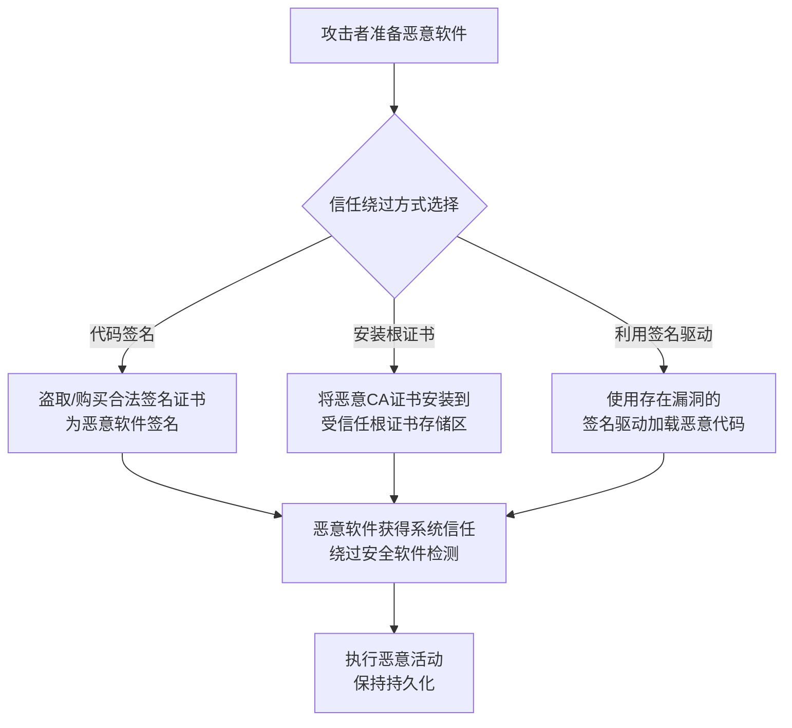

# 颠覆信任控制 (T1553)

## 一句话通俗理解

攻击者通过破解或伪造数字签名，让恶意软件看起来像是微软或谷歌等大公司的合法软件，骗过安全系统的信任检查。

## 难度等级

⭐⭐⭐ 高级（需要深入技术知识）

## 技术描述

颠覆信任控制（T1553）是MITRE ATT&CK框架中隐蔽战术的一种高级技术。

**通俗解释：**
安全软件通常信任拥有合法数字签名的程序——如果你的程序上有微软的签名，安全软件就会把它当作合法程序。攻击者发现了绕过的办法：他们可以盗取别人的签名证书、安装自签名证书到受信任的根证书存储区、或者利用某个存在漏洞的合法驱动程序来加载恶意代码。一旦获得了信任，恶意软件就可以为所欲为。

**技术原理：**
1. **代码签名**：盗取或购买合法的代码签名证书
2. **安装根证书**：将恶意自签名CA证书安装到系统受信任根证书存储区
3. **利用已签名驱动**：使用存在漏洞但拥有合法签名的驱动程序加载恶意代码（BYOVD）
4. **Portal定时器回避**：利用已签名的Portal程序执行恶意操作

## 攻击流程



**步骤详解：**
1. **选择信任绕过方式**：根据目标环境选择代码签名、根证书安装或BYOVD等方式
2. **获取信任凭证**：盗取代码签名证书、创建自签名CA证书或收集有漏洞的签名驱动
3. **植入恶意代码**：利用获得的信任加载恶意软件或驱动
4. **维持信任访问**：持续保持系统对恶意软件的信任状态

## 子技术列表

| 子技术ID | 中文名称 | 通俗解释 |
|----------|----------|----------|
| T1553.001 | 代码签名 | 为恶意软件获取合法代码签名证书 |
| T1553.002 | 安装根证书 | 将恶意的CA证书安装到系统受信任的根证书中 |
| T1553.003 | 利用被信任的身份 | 利用已签名的第三方程序执行恶意操作 |
| T1553.004 | 安全功能绕过 | 绕过Windows Defender等安全软件的特征检测 |
| T1553.005 | 利用签名驱动 | 使用合法签名的驱动加载恶意代码（BYOVD） |

## 真实案例

### 案例1：Stuxnet 使用窃取的签名证书（2010）

- **时间**: 2010年
- **目标**: 伊朗核设施
- **手法**: Stuxnet使用了从瑞昱半导体（Realtek）和JMicron等两家公司窃取的数字证书来签名恶意驱动，使其成功绕过Windows的驱动签名检查。
- **参考链接**: [Stuxnet Analysis](https://www.symantec.com/)

### 案例2：ChromeLoader 安装恶意根证书（2022-2023）

- **时间**: 2022-2023年
- **目标**: 全球用户
- **手法**: ChromeLoader将恶意CA证书安装到受信任的根证书区，使浏览器信任伪造的HTTPS证书，从而拦截和重定向受害者的搜索流量。
- **参考链接**: [Red Canary - ChromeLoader](https://redcanary.com/)

### 案例3：BYOVD 攻击使用合法签名驱动（2021-2024）

- **时间**: 2021-2024年
- **目标**: 游戏、安全产品用户
- **手法**: 攻击者利用存在漏洞但拥有微软签名的驱动程序（如Anti-rootkit或主板厂商驱动）在系统内核中执行恶意代码。Microsoft已签名的驱动可以绕过Windows的内核保护机制。
- **参考链接**: [MITRE - T1553.005](https://attack.mitre.org/techniques/T1553/005/)

### 案例4：Lazarus 使用被盗的代码签名证书（2022）

- **时间**: 2022年
- **目标**: 加密货币公司
- **攻击组织**: Lazarus
- **手法**: 使用从知名软件公司盗取的代码签名证书签名恶意应用程序。由于证书是合法的，杀毒软件对签名后的恶意可执行文件给予高信任等级。
- **参考链接**: [ESET - Lazarus](https://www.welivesecurity.com/)

## 红队视角

> ⚠️ **免责声明**：以下内容仅用于合法的安全测试、渗透测试和教育目的。未经授权对他人系统进行测试是违法行为。

> ⚠️ **免责声明**：以下内容仅用于合法的安全测试、教育和研究目的。

**实战技巧：**
1. BYOVD是最有效的信任绕过方式，利用已签名驱动可绕过内核级防护
2. 代码签名证书可以合法购买（EV证书）或从泄露的证书库中获取
3. 安装自签名根证书后，可以签发任意数量的受信任恶意软件

**常用工具：**
- SignTool：Windows代码签名工具
- MakeCert/OpenSSL：创建自签名证书
- LOLDrivers数据库：查询存在漏洞的签名驱动

**注意事项：**
- EV代码签名证书需要硬件令牌且可能被吊销
- 安装根证书到受信任存储区需要管理员权限
- BYOVD驱动可能被安全软件的驱动黑名单检测到

## 蓝队视角

**防御重点：**
1. 监控受信任根证书存储区的异常添加操作（Event ID 6423, 6424）
2. 维护并更新驱动黑名单，阻止已知漏洞驱动的加载
3. 启用Windows Defender Application Control（WDAC）限制驱动加载

**检测要点：**
- 检测系统中新安装的未经验证的可信根证书
- 监控已知存在漏洞的签名驱动加载（参考LOLDrivers列表）
- 检测非标准内容中的代码签名证书使用
- 验证所有已签名可执行文件的签名有效性和签发者

## 缓解措施

### 优先级1：关键措施

**措施名称：** 实施严格的代码签名和证书验证策略

**具体实施步骤：**
1. 配置Windows Defender Application Control（WDAC）强制代码完整性策略，仅允许经过签名的可执行文件运行
2. 启用Hypervisor-protected Code Integrity（HVCI），确保内核级驱动必须通过签名验证
3. 部署证书吊销检查，配置组策略自动检查发布者证书吊销状态
4. 定期审计受信任根证书存储区，移除不再受信任或过期的CA证书

### 优先级2：重要措施

**措施名称：** 管理驱动黑名单和证书安装权限

**具体实施步骤：**
1. 维护并定期更新已知漏洞驱动黑名单，参考LOLDrivers项目列表
2. 限制管理员权限，仅允许授权人员安装新证书到受信任根证书存储区
3. 启用Windows Event Log审计，监控证书存储区的修改操作（Event ID 6423, 6424）
4. 部署EDR解决方案监控BYOVD攻击，检测已知存在漏洞的签名驱动加载行为

**配置示例：**
```bash
# 列出受信任根证书存储区中的所有证书
certutil -store Root

# 检查特定驱动的数字签名
signtool verify /pa /v driver.sys

# 启用证书服务客户端审计
auditpol /set /subcategory:"Certification Services" /success:enable /failure:enable
```

### MITRE ATT&CK缓解措施映射

| 缓解措施ID | 缓解措施名称 | 适用性 | 说明 |
|------------|-------------|--------|------|
| M1045 | 代码签名 | 适用 | 实施代码签名策略，验证所有可执行文件的签名 |
| M1040 | 防篡改 | 适用 | 启用WDAC和HVCI保护内核完整性 |
| M1018 | 用户账户管理 | 适用 | 限制管理员权限，防止未授权的证书安装 |
| M1054 | 软件配置 | 适用 | 维护驱动黑名单，阻止已知漏洞驱动加载 |

## 检测建议

### 网络层检测

**检测方法：** 监控证书吊销状态查询和OCSP流量异常

**具体规则/命令示例：**
```bash
# Suricata检测异常的OCSP请求频率（可能指示证书探测行为）
alert tcp $HOME_NET any -> $EXTERNAL_NET 80 (msg:"Abnormal OCSP Traffic - Possible Certificate Recon"; content:"/ocsp"; http_uri; threshold:type limit, track by_src, count 50, seconds 60; sid:1001553; rev:1;)
```

### 主机层检测

**检测方法：** 监控受信任证书存储区变更、驱动加载事件和代码签名验证失败

**Windows事件ID：**
- 事件ID 6423：证书服务阻止安装证书
- 事件ID 6424：证书成功安装到存储区
- 事件ID 5038：检测驱动签名验证失败
- 事件ID 6281：Code Integrity检测到无效签名
- Sysmon Event ID 7：监控已知漏洞驱动的DLL加载

**Linux日志：**
- 日志文件：`/var/log/syslog`，`/var/log/kern.log`
- 关键字段：`module_signature`验证失败、内核模块加载告警

**具体命令示例：**
```bash
# Windows：监控受信任根证书的新增
certutil -store Root | findstr "===="

# Windows：检查已知漏洞驱动是否加载
driverquery /si | findstr "vulnerable"

# Linux：检查内核模块签名
modinfo -F signer <module_name>
```

### 应用层检测

**Sigma规则示例：**
```yaml
title: Suspicious Certificate Installed in Trusted Root Store
status: experimental
description: 检测新安装的可信根证书，可能的信任控制颠覆行为
logsource:
    category: process_creation
    product: windows
detection:
    selection:
        EventID: 6423
    condition: selection
level: medium
tags:
    - attack.t1553
```

## 动手实验

> ⚠️ **重要提示**：所有实验必须在隔离的实验室环境中进行，禁止对未授权的真实系统进行测试。

### 实验1：代码签名验证（初级）

**实验步骤：**
1. 右键查看任意Windows系统文件（如notepad.exe）的数字签名
2. 使用SignTool验证：`signtool verify /pa /v notepad.exe`

## 术语解释

| 术语 | 英文原名 | 通俗解释 |
|------|----------|----------|
| 代码签名 | Code Signing | 给软件打上"防伪标签"，证明软件没有被篡改且来自可信作者 |
| BYOVD | Bring Your Own Vulnerable Driver | 自带漏洞驱动，用合法签名的有漏洞驱动攻击系统 |
| 根证书 | Root Certificate | 证书信任链的根，位于最顶层的CA证书 |
| CA | Certificate Authority | 证书颁发机构，负责签发和验证数字证书 |

## 参考资料

- [MITRE ATT&CK - T1553 Subvert Trust Controls](https://attack.mitre.org/techniques/T1553/)
- [LOLDrivers Project](https://www.loldrivers.io/)
