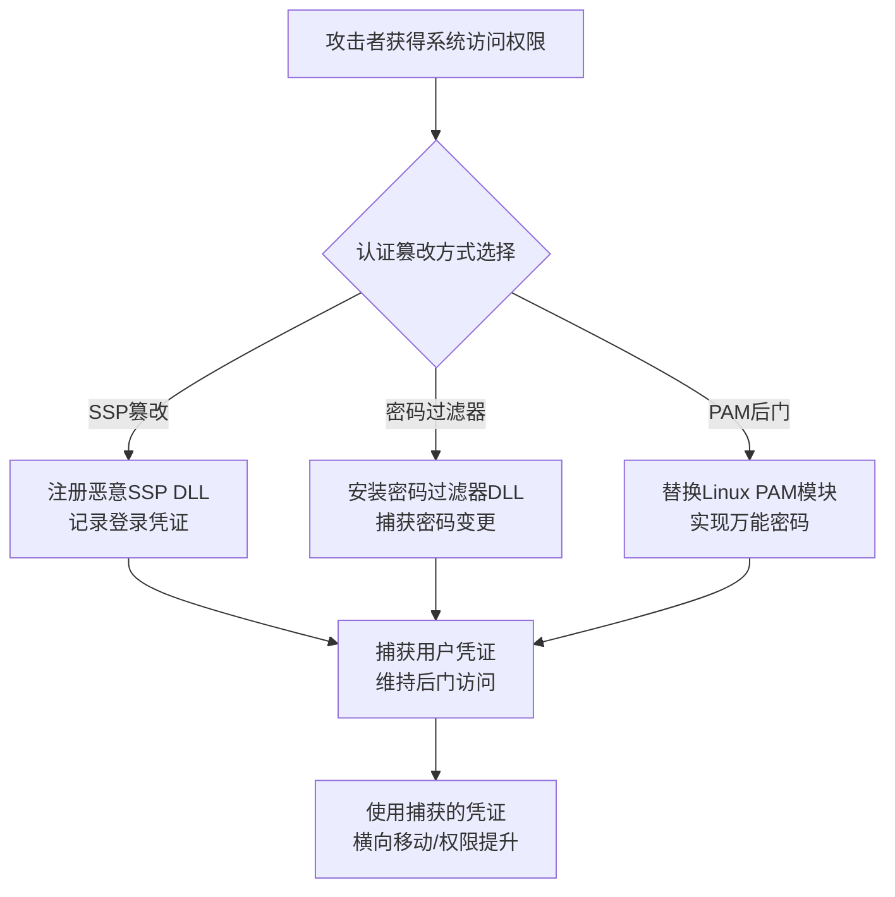

# 修改认证过程 (T1556)

## 一句话通俗理解

攻击者篡改了Windows的登录验证过程，使得无论输入什么密码都能登录，就像把指纹锁换成纸片也能打开的假锁。

## 难度等级

⭐⭐⭐ 高级（需要深入技术知识）

## 技术描述

修改认证过程（T1556）是MITRE ATT&CK框架中隐蔽战术的一种高级技术。

**通俗解释：**
当你在Windows登录界面输入密码时，系统会把密码交给LSASS进程进行验证——它检查密码是否正确，正确就让你登录，错误就拒绝。攻击者可以"替换"或"钩住"这个验证过程的某个环节，比如修改SSP（安全支持提供程序），使其在验证你的密码时，同时也将密码记录下来发送给攻击者。甚至还可以给系统安装一个"万能密码"——无论输入什么密码都能登录。

**技术原理：**
1. **认证后门**：在登录过程中安装后门（如万能密码）
2. **密码过滤器**：安装密码过滤器DLL记录密码变更
3. **域控制信任修改**：添加恶意域控制器或修改域信任关系
4. **SSP篡改**：注册恶意的安全支持提供程序
5. **混合身份认证**：修改云-本地混合认证配置

## 攻击流程



**步骤详解：**
1. **选择篡改方式**：根据操作系统类型选择SSP篡改、密码过滤器或PAM后门
2. **安装恶意组件**：注册恶意DLL或替换系统认证模块
3. **凭证捕获**：记录用户登录时输入的密码或密码变更
4. **利用凭证**：使用捕获的凭证进行横向移动和权限提升

## 子技术列表

| 子技术ID | 中文名称 | 通俗解释 |
|----------|----------|----------|
| T1556.001 | 域控制信任修改 | 添加恶意的域控制器 |
| T1556.002 | 密码过滤器DLL | 记录用户更改的新密码 |
| T1556.003 | Pluggable认证模块 | Linux下修改PAM模块实现万能密码 |
| T1556.004 | 网络设备认证 | 修改路由器/交换机的认证过程 |
| T1556.005 | 可重用凭证重用 | 重用之前捕获的凭证 |

## 真实案例

### 案例1：PAM后门（2017-2023）

- **时间**: 2017-2023年
- **目标**: Linux服务器
- **手法**: 替换PAM的unix.so模块为恶意版本，记录所有登录密码并支持万能密码。
- **参考链接**: [GitHub - PAM Backdoor](https://github.com/ANSSI-FR/pam_totp)

### 案例2：APT29 使用SSP记录域管理员密码（2020）

- **时间**: 2020年
- **目标**: 美国政府机构
- **攻击组织**: APT29
- **手法**: 在域控制器上安装恶意的SSP DLL，记录所有域管理员登录密码并写入隐藏文件。
- **参考链接**: [MITRE - APT29](https://attack.mitre.org/groups/G0016/)

### 案例3：Golden Ticket 域控制器认证绕过（2021-2023）

- **时间**: 2021-2023年
- **手法**: 使用KRBTGT Hash生成Golden Ticket，伪造任意用户身份访问域资源。
- **参考链接**: [MITRE - T1556.001](https://attack.mitre.org/techniques/T1556/001/)

## 红队视角

> ⚠️ **免责声明**：以下内容仅用于合法的安全测试、渗透测试和教育目的。未经授权对他人系统进行测试是违法行为。

> ⚠️ **免责声明**：以下内容仅用于合法的安全测试、教育和研究目的。

**实战技巧：**
1. SSP篡改是最隐蔽的Windows凭证窃取方式，重启后依然有效
2. Linux下替换PAM模块可实现万能密码和密码记录双重功能
3. 密码过滤器DLL可捕获域中所有用户的密码变更事件

**常用工具：**
- Mimikatz（misc::memssp）：内存中注册SSP
- PowerShell Invoke-ReflectivePEInjection：反射加载SSP DLL
- PAM后门脚本：修改Linux PAM配置文件

**注意事项：**
- 注册SSP需要SYSTEM权限
- 修改PAM模块可能影响系统正常登录，需要备份原文件
- 域信任关系修改需要域管理员权限

## 蓝队视角

**防御重点：**
1. 启用LSA保护，防止未授权的SSP加载
2. 监控LSASS进程的异常DLL加载（Event ID 4610, 4614）
3. 定期检查PAM模块的文件完整性和修改时间

**检测要点：**
- 检测密码过滤器DLL注册（Event ID 4614）
- 监控域信任关系的异常修改（Event ID 1645）
- 检测LSASS进程加载的非微软签名DLL
- 定期验证系统认证相关文件的数字签名和哈希值

## 缓解措施

### 优先级1：关键措施

**措施名称：** 启用LSA保护和Credential Guard

**具体实施步骤：**
1. 在域控制器和关键服务器上启用LSA保护（RunAsPPL），防止未授权的SSP加载
2. 部署Windows Defender Credential Guard，使用基于虚拟化的安全保护凭证
3. 配置组策略：计算机配置 > 管理模板 > MS Security Guide > LSASS RunAsPPL = 启用
4. 定期验证LSA保护状态，确保注册表项`HKLM\SYSTEM\CurrentControlSet\Control\Lsa\RunAsPPL`值为1

### 优先级2：重要措施

**措施名称：** 监控认证模块完整性和配置变更

**具体实施步骤：**
1. 部署文件完整性监控（FIM），监控LSASS.exe、sspisrv.dll、kerberos.dll等关键认证文件的修改
2. 启用Windows安全事件日志审计，监控密码过滤器DLL注册（Event ID 4614）和SSP加载（Event ID 4610）
3. 对于Linux系统，定期使用`aide --check`或`tripwire`检查PAM模块文件完整性
4. 配置SIEM告警规则，检测域信任关系的异常创建或修改（Event ID 1645）

**配置示例：**
```bash
# 检查LSA保护是否启用
reg query "HKLM\SYSTEM\CurrentControlSet\Control\Lsa" /v RunAsPPL

# Linux下检查PAM模块完整性
sha256sum /lib/x86_64-linux-gnu/security/pam_unix.so > /var/log/pam_baseline.txt
```

### MITRE ATT&CK缓解措施映射

| 缓解措施ID | 缓解措施名称 | 适用性 | 说明 |
|------------|-------------|--------|------|
| M1040 | 防篡改 | 适用 | 启用LSA保护和Credential Guard防止认证篡改 |
| M1026 | 特权账户管理 | 适用 | 限制拥有域管理员权限的账户数量 |
| M1018 | 用户账户管理 | 适用 | 监控和管理密码变更事件 |
| M1029 | 系统文件完整性 | 适用 | 使用文件完整性监控验证认证模块未被篡改 |

## 检测建议

### 网络层检测

**检测方法：** 监控Kerberos认证流量和域控制器复制流量异常

**具体规则/命令示例：**
```bash
# Zeek检测异常的Kerberos TGT请求频率
alert tcp $HOME_NET any -> $HOME_NET 88 (msg:"Abnormal Kerberos Traffic - Possible Golden Ticket"; flow:to_server; threshold:type limit, track by_src, count 30, seconds 60; sid:1001556; rev:1;)
```

### 主机层检测

**检测方法：** 监控LSASS进程异常行为、认证模块变更和密码过滤器注册

**Windows事件ID：**
- 事件ID 4610：检测安全支持提供程序（SSP）的加载
- 事件ID 4614：检测密码过滤器DLL的注册
- 事件ID 1645：域信任关系创建或修改
- 事件ID 4688：检测进程创建，监控LSASS的子进程启动
- Sysmon Event ID 7：检测LSASS加载的非标准DLL

**Linux日志：**
- 日志文件：`/var/log/auth.log`，`/var/log/secure`
- 关键字段：PAM模块加载错误、认证失败模式变化

**具体命令示例：**
```bash
# Windows：检查已注册的SSP
reg query "HKLM\SYSTEM\CurrentControlSet\Control\Lsa\Security Packages"

# Windows：检查已安装的密码过滤器
reg query "HKLM\SYSTEM\CurrentControlSet\Control\Lsa" /v "Notification Packages"

# Linux：检查PAM配置是否被修改
diff /etc/pam.d/common-auth /var/backups/pam/common-auth.bak
```

### 应用层检测

**Sigma规则示例：**
```yaml
title: Suspicious SSP Loaded in LSASS
status: experimental
description: 检测LSASS进程加载的非标准安全支持提供程序DLL
logsource:
    category: image_load
    product: windows
detection:
    selection:
        EventID: 7
        ImageLoaded|contains: 'ssp'
    condition: selection
level: high
tags:
    - attack.t1556
```

## 动手实验

> ⚠️ **重要提示**：所有实验必须在隔离的实验室环境中进行，禁止对未授权的真实系统进行测试。

### 实验环境准备

**所需工具：** Windows虚拟机、Process Explorer、Regedit、PowerShell、Linux虚拟机（Ubuntu）

### 实验1：检查Windows SSP和密码过滤器配置（初级）

**实验步骤：**
1. 以管理员身份在Windows虚拟机中打开PowerShell
2. 查询已注册的安全支持提供程序：`reg query "HKLM\SYSTEM\CurrentControlSet\Control\Lsa\Security Packages"`
3. 查询已安装的密码通知包：`reg query "HKLM\SYSTEM\CurrentControlSet\Control\Lsa" /v "Notification Packages"`
4. 使用Process Explorer查看LSASS.exe进程加载的DLL列表，识别已加载的SSP模块

**预期结果：** 系统默认加载kerberos.dll、msv1_0.dll、ntdll.dll等标准SSP，Notification Packages中包含msv1_0.dll等

**学习要点：** 理解Windows认证组件的正常基线配置，为检测异常的SSP加载和密码过滤器注册建立对比基准

### 实验2：配置Linux PAM认证日志记录（中级）

**实验步骤：**
1. 准备一台Ubuntu Linux虚拟机
2. 备份原始PAM配置文件：`cp /etc/pam.d/common-auth /etc/pam.d/common-auth.bak`
3. 查看当前PAM认证配置：`cat /etc/pam.d/common-auth`
4. 在common-auth中添加auth日志记录配置，记录每次认证尝试
5. 通过SSH登录测试，查看`/var/log/auth.log`中的认证记录
6. 使用`aide --check`（需先安装AIDE）验证PAM文件的完整性

**预期结果：** auth.log中记录了每次登录尝试的详细信息，AIDE能够检测到PAM配置文件的变化

**学习要点：** 理解PAM认证模块的工作原理，以及如何通过文件完整性监控（FIM）来检测PAM模块被篡改的风险

## 术语解释

| 术语 | 英文原名 | 通俗解释 |
|------|----------|----------|
| SSP | Security Support Provider | Windows安全支持提供程序，负责处理登录认证 |
| PAM | Pluggable Authentication Modules | Linux的可插拔认证模块系统 |
| Golden Ticket | Golden Ticket | 伪造的Kerberos票据，可以访问域中任何资源 |

## 参考资料

- [MITRE ATT&CK - T1556 Modify Authentication Process](https://attack.mitre.org/techniques/T1556/)
