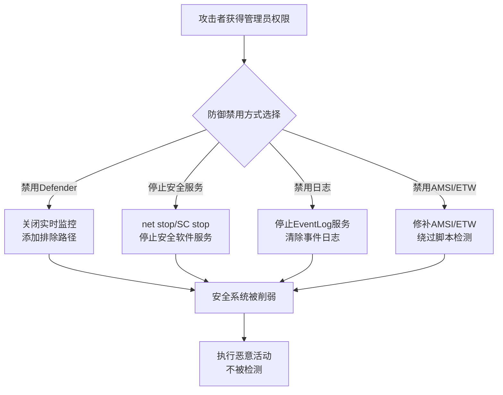

# 削弱防御 (T1562)

## 一句话通俗理解

攻击者先关掉杀毒软件和安全监控再动手，就像小偷先剪断监控摄像头电线、再翻墙进入——这样就不会被拍到。

## 难度等级

⭐⭐ 中级（需要一定基础）

## 技术描述

削弱防御（T1562）是MITRE ATT&CK框架中隐蔽战术的一种核心技术。

**通俗解释：**
攻击者在执行恶意操作之前，会先"拔掉安全系统的电源"——他们尝试关闭防病毒软件、停止安全监控服务、禁用防火墙规则或删除安全事件日志。如果安全软件还在运行，攻击者做的每一步都可能被检测到。所以第一步就是让安全系统"失明"。

**技术原理：**
1. **禁用Windows Defender**：通过PowerShell命令停止Defender服务或添加排除项
2. **停止安全服务**：使用net stop或sc stop命令停止安全软件的服务
3. **删除/清除日志**：清除Windows事件日志抹掉操作痕迹
4. **禁用安全规则**：修改防火墙规则或禁用Windows安全中心
5. **终止安全进程**：使用taskkill结束安全软件的进程
6. **删除安全注册表项**：修改注册表禁用安全功能

## 攻击流程



**步骤详解：**
1. **获取管理员权限**：削弱防御需要管理员或SYSTEM权限
2. **选择禁用目标**：根据环境选择禁用Defender、安全服务或日志系统
3. **执行禁用操作**：使用PowerShell命令或系统工具禁用安全功能
4. **执行恶意活动**：在无防御状态下执行恶意操作

## 子技术列表

| 子技术ID | 中文名称 | 通俗解释 |
|----------|----------|----------|
| T1562.001 | 禁用或修改工具 | 禁用安全软件或修改其配置 |
| T1562.002 | 禁用Windows事件记录 | 停止或禁用事件日志服务 |
| T1562.003 | Shellcode混淆 | 对Shellcode进行混淆以逃避检测 |
| T1562.004 | 禁用安全工具指示器 | 禁用安全软件的状态提示 |
| T1562.005 | 指示器阻止 | 在主机上阻止IOC相关的网络连接 |
| T1562.006 | 安全扫描指示器阻止 | 阻止EDR/XDR的安全扫描 |
| T1562.007 | 禁用云服务日志 | 禁用云环境中的审计日志 |
| T1562.008 | 禁用Windows安全中心 | 禁用或绕过Windows安全中心通知 |
| T1562.009 | 清除取证数据 | 清除内存和磁盘中的取证证据 |
| T1562.010 | 禁用AMSI | 禁用Windows的反恶意软件扫描接口 |
| T1562.011 | 禁用ETW | 禁用Windows事件追踪（ETW） |
| T1562.012 | 禁用安全工具组件 | 禁用安全工具的特定组件 |

## 真实案例

### 案例1：LockBit 勒索软件禁用Defender（2021-2024）

- **时间**: 2021-2024年
- **目标**: 全球企业
- **攻击组织**: LockBit
- **手法**: 执行前使用PowerShell命令`Stop-Service WinDefend`和`Set-MpPreference -DisableRealtimeMonitoring $true`禁用Windows Defender实时保护。同时添加Defender排除路径，使恶意文件不被扫描。
- **参考链接**: [TrendMicro - LockBit](https://www.trendmicro.com/)

### 案例2：APT29 清除安全事件日志（2020）

- **时间**: 2020年
- **目标**: 美国政府机构
- **攻击组织**: APT29
- **手法**: 使用wevtutil cl命令清除所有安全事件日志，并使用Procdump在内存中提取凭证而非写入磁盘文件。
- **参考链接**: [CISA - APT29](https://www.cisa.gov/news-events/cybersecurity-advisories/aa20-296a)

### 案例3：BlackCat 禁用AMSI和ETW（2023-2024）

- **时间**: 2023-2024年
- **目标**: 全球企业
- **攻击组织**: BlackCat (ALPHV)
- **手法**: BlackCat在加载器中通过修补AMSI和ETW的检测函数，使PowerShell脚本的恶意内容不被扫描和记录。这是为了确保后续C2通信和横向移动的PowerShell指令不被监控。
- **参考链接**: [BleepingComputer - BlackCat](https://www.bleepingcomputer.com/)

## 红队视角

> ⚠️ **免责声明**：以下内容仅用于合法的安全测试、渗透测试和教育目的。未经授权对他人系统进行测试是违法行为。

### 常用工具

| 工具名称 | 用途 | 平台 | 链接 |
|----------|------|------|------|
| SharpC2 | C2框架内置防御禁用模块 | Windows | - |
| PowerSploit | 禁用Defender和AMSI的PowerShell脚本 | Windows | https://github.com/PowerShellMafia/PowerSploit |

## 蓝队视角

### 检测要点

- 监控安全服务被停止的事件（Event ID 7036）
- 检测Windows Defender排除路径的添加（Event ID 5007）
- 监控AMSI/ETW的修补或禁用尝试
- 检测安全工具进程被强制终止

## 检测建议

### 网络层检测

**检测方法：** 监控安全工具通信心跳中断和C2流量激增（安全工具被禁用后的恶意通信）

**具体规则/命令示例：**
```bash
# Suricata检测EDR通信心跳中断后的异常外连
alert tcp $HOME_NET any -> $EXTERNAL_NET !$EDR_C2_IPS (msg:"EDR Heartbeat Lost - Possible Defense Impairment"; flow:from_client; threshold:type threshold, track by_src, count 1, seconds 300; sid:1001562; rev:1;)
```

### 主机层检测

**检测方法：** 监控安全服务状态变更、Windows Defender配置修改和AMSI/ETW补丁检测

**Windows事件ID：**
- 事件ID 7036：监控安全相关服务的启动/停止状态变更
- 事件ID 5007：Windows Defender配置修改事件（禁用实时监控、添加排除路径）
- 事件ID 4688：检测用于禁用安全工具的命令行执行（taskkill、net stop、sc stop）
- Sysmon Event ID 1：监控进程创建，检测安全工具进程被强制终止
- 事件ID 1102：安全日志被清除

**Linux日志：**
- 日志文件：`/var/log/syslog`，`/var/log/audit/audit.log`
- 关键字段：SELinux/AppArmor被禁用、iptables规则被清空、安全模块卸载

**具体命令示例：**
```bash
# Windows：检查Windows Defender实时保护状态
Get-MpPreference | Select-Object DisableRealtimeMonitoring

# Windows：检查安全服务状态
sc query WinDefend | findstr STATE

# Linux：检查SELinux状态
sestatus

# Linux：检查auditd服务状态
systemctl status auditd
```

### 应用层检测

**Sigma规则示例：**
```yaml
title: Windows Defender Realtime Monitoring Disabled
status: experimental
description: 检测实时监控被禁用或Defender服务被停止
logsource:
    product: windows
    service: security
detection:
    selection:
        EventID: 5007
        Message|contains: 'DisableRealtimeMonitoring'
    condition: selection
level: high
tags:
    - attack.t1562
---
title: Security Service Stopped via Command Line
status: experimental
description: 检测通过命令行停止安全相关服务的行为
logsource:
    category: process_creation
    product: windows
detection:
    selection:
        CommandLine|contains|all:
            - 'net stop'
            - 'WinDefend'
    condition: selection
level: high
tags:
    - attack.t1562
```

## 缓解措施

### 优先级1：关键措施

**措施名称：** 启用Windows Defender防篡改保护

**具体实施步骤：**
1. 通过Windows安全中心启用防篡改保护（Tamper Protection），防止对Defender设置的未授权修改
2. 通过Intune或组策略强制启用防篡改：`计算机配置 > 管理模板 > Windows组件 > Microsoft Defender防病毒 > 配置防篡改保护`
3. 部署EDR解决方案（如Microsoft Defender for Endpoint），启用攻击面减少规则（ASR），阻止安全工具禁用操作
4. 配置Windows Defender系统启动时扫描，确保即使被禁用也会在下次重启时恢复

### 优先级2：重要措施

**措施名称：** 限制管理员权限并监控安全配置变更

**具体实施步骤：**
1. 实施Just Enough Administration（JEA）和Privileged Access Workstations（PAW），减少拥有本地管理员权限的账户
2. 启用Windows事件日志高级审计策略，全面记录服务停止（Event ID 7036）、安全配置修改（Event ID 5007）和AMSI绕过尝试
3. 部署Sysmon并配置规则监控安全工具进程被异常终止的行为
4. 实施AMSI和ETW的完整性监控，检测内存中的修补或绕过尝试

**配置示例：**
```bash
# 通过PowerShell启用防篡改保护
Set-MpPreference -EnableTamperProtection $true

# 审计AMSI绕过检测
reg add "HKLM\SOFTWARE\Microsoft\AMSI\Providers" /v "{2781761E-28E0-4109-99FE-B9D127C57AFE}" /t REG_SZ /d "Windows Defender AMSI Provider" /f
```

### MITRE ATT&CK缓解措施映射

| 缓解措施ID | 缓解措施名称 | 适用性 | 说明 |
|------------|-------------|--------|------|
| M1040 | 防篡改 | 适用 | 启用Windows Defender防篡改保护，防止禁用安全功能 |
| M1026 | 特权账户管理 | 适用 | 限制管理员权限，降低禁用安全工具的风险 |
| M1018 | 用户账户管理 | 适用 | 监控非授权用户对安全设置的修改操作 |
| M1029 | 系统文件完整性 | 部分适用 | 监控安全工具配置文件的完整性 |

## 动手实验

> ⚠️ **重要提示**：所有实验必须在隔离的实验室环境中进行，禁止对未授权的真实系统进行测试。

### 实验1：通过PowerShell禁用Defender（中级）

**实验步骤：**
1. 在Windows VM中以管理员身份打开PowerShell
2. 执行`Get-MpPreference`查看当前配置
3. 执行`Set-MpPreference -DisableRealtimeMonitoring $true`
4. 再次执行`Get-MpPreference`确认修改
5. 实验完成后重新启用：`Set-MpPreference -DisableRealtimeMonitoring $false`

## 术语解释

| 术语 | 英文原名 | 通俗解释 |
|------|----------|----------|
| AMSI | Anti-Malware Scan Interface | Windows的反恶意软件扫描接口，在脚本执行前扫描其内容 |
| ETW | Event Tracing for Windows | Windows事件追踪，系统诊断和监控的基础框架 |
| Defander排除 | Defender Exclusion | 设置路径/文件/进程不被Defender扫描 |

## 参考资料

- [MITRE ATT&CK - T1562 Impair Defenses](https://attack.mitre.org/techniques/T1562/)
- [FireEye - AMSI Bypass](https://www.fireeye.com/blog/threat-research/)
