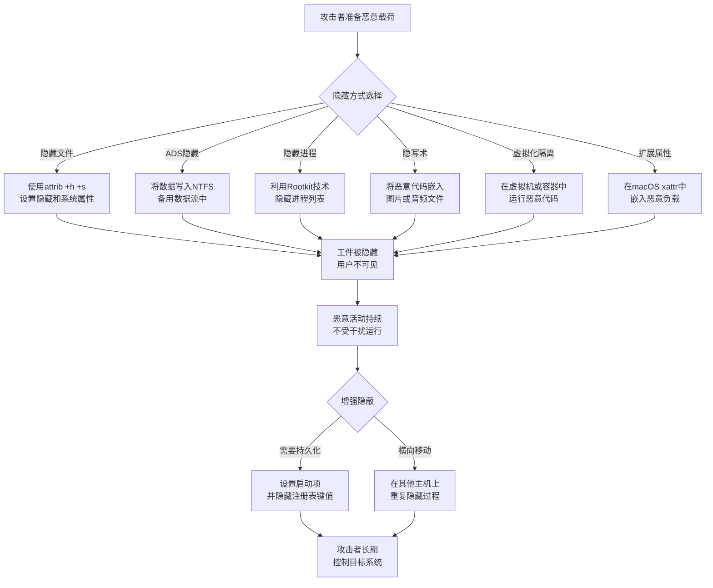

# 隐藏痕迹 (T1564)

## 一句话通俗理解

攻击者把恶意文件、进程或网络活动藏起来，让用户和安全软件看不见，就像把赃物藏在墙里——不拆墙就永远找不到。

## 难度等级

⭐⭐ 中级（需要一定基础）

## 技术描述

隐藏痕迹（T1564）是MITRE ATT&CK框架中隐蔽战术的一种核心技术。

**通俗解释：**
如果你想把一样东西藏起来，你会怎么做？藏在床底下（隐藏文件属性）、放在壁柜里（在系统目录中）、或者伪装成其他东西（修改文件扩展名）。攻击者也是这么做的：他们隐藏文件（设置隐藏+系统属性）、隐藏进程（Rootkit技术）、隐藏网络连接（使用非标准端口）、甚至把数据藏在硬盘的隐藏区域里。几乎所有操作系统都提供隐藏文件或系统对象的机制——这些功能本来是为了保护重要系统文件不被用户误删，但攻击者却利用这些功能来隐藏自己的恶意活动。

**技术原理：**
攻击者隐藏痕迹的手段多种多样，按隐藏对象可以分为以下几类：

1. **隐藏文件和目录**：使用`attrib +h +s`设置隐藏和系统文件属性，或在Linux/macOS中使用以"."开头的文件名
2. **隐藏进程**：通过Rootkit在系统内核层面劫持进程枚举函数，过滤掉恶意进程
3. **ADS隐藏**：利用NTFS的备用数据流（ADS）将数据隐藏在正常文件"后面"，不改变文件可见大小
4. **Windows文件关联**：利用Windows默认不显示文件扩展名的设置，欺骗用户双击运行恶意文件
5. **隐写术**：把恶意代码藏在图片或音频文件的冗余数据中，图像看起来完全正常
6. **注册表隐藏**：在注册表的隐藏区域存储配置和数据
7. **虚拟化隔离**：在虚拟机或容器中运行恶意代码，与主系统的安全监控工具隔离
8. **扩展属性隐藏**：在macOS/Linux的扩展文件属性（xattr）中嵌入恶意负载

**用途与影响：**
攻击者使用隐藏痕迹技术的主要目的是在不被发现的情况下维持对目标系统的访问和控制。隐藏恶意工件可以大幅延长攻击者在网络中的潜伏时间——现代APT攻击（有国家背景的高级黑客组织）的平均潜伏期超过200天，其中大部分时间依赖于各种隐藏技术来逃避检测。通过隐藏文件、进程、用户账户和网络活动，攻击者能够持续窃取数据、部署后续载荷或等待触发条件。对于防御方而言，未被发现的隐藏工件意味着攻击者可以自由地横向移动、提升权限和窃取敏感信息。在某些情况下，隐藏技术还用于掩盖勒索软件加密过程或数据窃取的痕迹，延迟事件响应团队的发现时间，给攻击者争取宝贵的操作窗口。

## 子技术列表

**该技术共有12个子技术（v20版本扩展至14个）：**

| 子技术ID | 中文名称 | 通俗解释 |
|----------|----------|----------|
| T1564.001 | 隐藏文件和目录 | 设置隐藏文件属性或文件名以"."开头让用户看不到 |
| T1564.002 | 隐藏用户 | 创建隐藏用户账号（用户名以$结尾） |
| T1564.003 | 隐藏窗口 | 运行程序时不显示窗口 |
| T1564.004 | NTFS文件属性 | 使用NTFS的特殊属性隐藏数据 |
| T1564.005 | 隐藏文件系统 | 创建隐藏的分区或文件系统 |
| T1564.006 | 运行虚拟实例 | 在虚拟机或容器中运行恶意代码以隐藏活动 |
| T1564.007 | VBA隐藏 | 在VBA宏代码中隐藏字符串 |
| T1564.008 | 邮箱隐藏规则 | 隐藏邮件规则或邮箱文件夹 |
| T1564.009 | 资源派生 | macOS上的资源派生隐藏数据 |
| T1564.010 | 进程参数欺骗 | 隐藏或伪造进程的命令行参数 |
| T1564.011 | 忽略进程中断 | 在进程列表中隐藏指定进程 |
| T1564.012 | 文件/路径排除 | 利用杀毒软件的文件排除路径隐藏恶意文件 |

> **版本说明：** T1564.011（忽略进程中断）和T1564.012（文件/路径排除）于ATT&CK v19版本（2024年）中新增。v20版本进一步扩展了T1564.013（绑定挂载）和T1564.014（扩展属性）。本表覆盖T1564.001至T1564.012共12个子技术，为当前最常用的子技术集合。

<details>
<summary><strong>展开查看各子技术详细说明</strong></summary>

各子技术详细说明请参阅独立文档：

- [T1564.001 - 隐藏文件和目录](./T1564/T1564.001-Hide-Files-and-Directories.md) — 给文件打上"隐藏"标签，让系统默认不显示。
- [T1564.002 - 隐藏用户](./T1564/T1564.002-Hide-Users.md) — 创建在用户列表中看不到的"幽灵账户"。
- [T1564.003 - 隐藏窗口](./T1564/T1564.003-Hide-Window.md) — 让恶意程序在后台运行，用户看不到任何窗口。
- [T1564.004 - NTFS文件属性](./T1564/T1564.004-NTFS-File-Attributes.md) — 利用NTFS文件系统的特殊属性隐藏信息。
- [T1564.005 - 隐藏文件系统](./T1564/T1564.005-Hidden-File-System.md) — 创建操作系统不识别或者不显示的隐藏分区。
- [T1564.006 - 运行虚拟实例](./T1564/T1564.006-Run-Virtual-Instance.md) — 在虚拟机里运行恶意操作，宿主机的安全软件看不到。
- [T1564.007 - VBA隐藏](./T1564/T1564.007-VBA-Stomping.md) — 把恶意代码隐藏在Office文档的宏代码中。
- [T1564.008 - 邮箱隐藏规则](./T1564/T1564.008-Email-Hidden-Rules.md) — 在邮箱中设置自动规则，隐藏特定邮件。
- [T1564.009 - 资源派生](./T1564/T1564.009-Resource-Fork.md) — 利用macOS系统的"资源分支"功能隐藏数据。
- [T1564.010 - 进程参数欺骗](./T1564/T1564.010-Process-Argument-Spoofing.md) — 在进程列表中显示伪造的命令行参数，掩盖真正的恶意行为。
- [T1564.011 - 忽略进程中断](./T1564/T1564.011-Ignore-Process-Interrupt.md) — 在进程管理工具中隐藏指定进程，让任务管理器看不到。
- [T1564.012 - 文件/路径排除](./T1564/T1564.012-File-Path-Exclusion-文件.md) — 把恶意文件存放在杀毒软件不会扫描的排除目录中。

</details>

## 攻击流程



**步骤详解：**

1. **选择隐藏方式**
   - 通俗描述：根据目标操作系统和隐藏对象选择合适的隐藏技术
   - 技术细节：Windows环境优先选择ADS和文件属性隐藏；macOS选择资源派生或xattr；Linux使用点文件和绑定挂载
   - 常用工具：attrib.exe、chflags、SetFileAttributes

2. **执行隐藏操作**
   - 通俗描述：使用系统命令或专用工具隐藏文件、进程或数据
   - 技术细节：执行具体的隐藏命令，如`type payload.exe > legit.txt:payload.exe`（ADS隐藏），或修改进程PEB结构
   - 常用工具：PowerShell、CreateProcess API、Rootkit驱动

3. **验证隐藏效果**
   - 通俗描述：确认被隐藏的工件在正常操作和常规安全工具下不可见
   - 技术细节：使用`dir`（不含`/a`参数）检查文件是否可见；使用任务管理器检查进程是否可见
   - 常用工具：标准系统管理工具

4. **维持隐藏状态**
   - 通俗描述：确保持续隐藏不被安全工具发现，必要时切换隐藏方式
   - 技术细节：监控安全软件的扫描行为，当发现检测风险时切换到备用隐藏方式
   - 常用工具：自定义监控脚本

5. **扩散隐藏范围**
   - 通俗描述：在横向移动过程中，在每一台新主机上重复隐藏操作
   - 技术细节：将隐藏的恶意载荷复制到新主机，使用同样的隐藏方法确保全局隐蔽
   - 常用工具：PsExec、WMI、SMB共享

## 真实案例

### 案例1：Lazarus Group 利用macOS扩展属性隐藏恶意代码（2024）

- **时间**: 2024年11月
- **目标**: macOS系统用户，加密货币交易者
- **攻击组织**: Lazarus Group（朝鲜黑客组织，又称HIDDEN COBRA）
- **手法**: Lazarus Group开发了一款名为"RustyAttr"的特洛伊木马，利用macOS的扩展属性（xattr）功能在文件元数据中隐藏恶意负载。该木马使用Tauri框架构建（结合Web前端和Rust后端），通过`xattr`命令将恶意代码写入文件的扩展属性区域——这些数据在常规文件操作中完全不可见。当恶意代码需要执行时，Tauri的内置接口命令会从扩展属性中读取并执行负载。该恶意软件在VirusTotal上完全未被检测到。这一技术类似于Windows的NTFS备用数据流（ADS），但在macOS平台上更为隐蔽，因为安全工具对扩展属性区域的扫描覆盖率较低。Group-IB的研究人员首先发现了这一活动。
- **影响**: 至少1500个系统在2024年9月至2025年1月期间被感染，加密货币钱包和交易所账户凭证被盗，经济损失估计超过3亿美元。
- **参考链接**: [Infosecurity Magazine - Lazarus Group Uses Extended Attributes for Code Smuggling in macOS](https://www.infosecurity-magazine.com/news/lazarus-extended-attributes-macos/)

### 案例2：BlackLock 勒索软件利用文件排除和隐藏属性逃避检测（2024-2025）

- **时间**: 2024年3月 - 2025年（持续活跃）
- **目标**: 跨行业组织（建筑、房地产、科技、制造业）
- **攻击组织**: BlackLock（又名El Dorado，勒索软件即服务组织）
- **手法**: BlackLock勒索软件采用多层次隐藏策略来逃避端点安全产品的检测。首先，其加密器使用`attrib +h +s`将勒索软件二进制文件和加密后的文件设置为隐藏和系统属性，使其在默认的Windows资源管理器视图中不可见。其次，BlackLock利用Microsoft Defender和第三方杀毒软件的排除路径——在受感染系统上，攻击者会在部署勒索软件前查询并利用已有的扫描排除目录，将恶意载荷直接写入这些免扫描位置。此外，BlackLock的Linux和VMware ESXi变种使用隐藏的文件系统和匿名卷挂载技术，将加密工具存放在ESXi数据存储中的隐藏目录内，使得虚拟化管理员在常规管理界面中无法发现异常文件。该勒索软件还使用进程参数欺骗技术（T1564.010），使其加密进程在任务管理器中显示为合法的系统进程名称。
- **影响**: 截至2025年初，已在全球范围内攻击超过80个组织，勒索赎金要求从50万到500万美元不等。BlackLock被预测为2025年最活跃的RaaS（勒索软件即服务）组织之一。
- **参考链接**: [Tripwire - BlackLock Ransomware: What You Need To Know](https://www.tripwire.com/state-of-security/blacklock-ransomware-what-you-need-know)

### 案例3：Turla 使用NTFS备用数据流隐藏恶意数据（2014-2022）

- **时间**: 2014-2022年
- **目标**: 政府机构和使馆
- **攻击组织**: Turla（俄罗斯APT组织）
- **手法**: Turla组织广泛使用NTFS备用数据流将恶意代码隐藏在合法系统文件的"后面"，使用`type payload > file.txt:payload`的方式将恶意载荷写入ADS。常规的文件大小检查不会显示ADS中隐藏的数据——因为`dir`命令和Windows资源管理器显示的只是主文件流的大小。Turla将C2配置信息、加密密钥和辅助模块隐藏在系统文件（如`ntoskrnl.exe`或`explorer.exe`）的ADS中。在某些变种中，攻击者还结合了文件属性隐藏（T1564.001），将包含ADS的文件也设置为隐藏和系统属性，提供双重隐蔽保护。
- **影响**: 长期潜伏于政府网络中，窃取外交和国防机密信息，影响持续超过8年。
- **参考链接**: [MITRE ATT&CK - Turla](https://attack.mitre.org/groups/G0010/)

## 红队视角

> ⚠️ **免责声明**：以下内容仅用于合法的安全测试、渗透测试和教育目的。未经授权对他人系统进行测试是违法行为。

> ⚠️ **免责声明**：以下内容仅用于合法的安全测试、教育和研究目的。

### 实战技巧

1. **多层隐藏策略**
   不要只依赖一种隐藏方式。结合ADS隐藏载荷、文件属性隐藏文件、以及隐藏窗口运行进程，提供纵深隐蔽。即使安全工具发现了其中一层，其他层仍可能保持隐蔽。

2. **利用系统信任的排除路径**
   在渗透测试中，先枚举目标系统上防病毒软件的排除路径配置（如通过PowerShell查看Defender排除项）。将这些目录作为恶意文件存放的优先选择，可以绕过大范围的扫描检测。

3. **进程参数欺骗实战**
   在Cobalt Strike等红队框架中，使用`ppid-spoof`（父进程ID欺骗）和进程参数欺骗相结合。将恶意进程的父进程设置为`explorer.exe`或`svchost.exe`等可信进程，同时伪造命令行参数使其看起来像正常的系统操作。

### 常用工具

| 工具名称 | 用途 | 平台 | 链接 |
|----------|------|------|------|
| Streams (Sysinternals) | 查看和管理NTFS备用数据流 | Windows | https://docs.microsoft.com/en-us/sysinternals/downloads/streams |
| Attrib | 设置文件隐藏和系统属性 | Windows | 系统内置 |
| PowerShell Set-ItemProperty | 修改注册表隐藏区域 | Windows | 系统内置 |
| xattr | 查看和管理macOS/Linux扩展属性 | macOS/Linux | 系统内置 |
| Minifest | 编译时隐藏Windows可执行文件 | Windows | https://github.com/liamg/minifest |
| Invoke-ADSBackdoor | PowerShell ADS隐藏和持久化脚本 | Windows | https://github.com/BC-SECURITY/Invoke-ADSBackdoor |

### 注意事项

- 隐藏文件不能完全避免被专业工具（如Sysinternals Suite、取证分析工具）检测到，在高对抗场景中需要结合其他隐蔽手段
- 某些防病毒软件和EDR会深度扫描ADS内容和扩展属性，测试前应验证目标环境的检测能力
- 创建隐藏用户账户可能在高级用户管理工具（如`lusrmgr.msc`）或PowerShell的`Get-LocalUser`命令中可见
- 在真实渗透测试中，使用隐藏技术前应获得客户明确的书面授权

## 蓝队视角

### 检测要点

1. **检测隐藏文件和ADS**
   - 日志来源：Sysmon事件ID 11（FileCreate）、Windows安全事件ID 4663
   - 关注字段：文件属性变更、包含":"符号的文件路径
   - 异常特征：系统目录中出现新增的隐藏文件，尤其是带有ADS标记的文件

2. **检测隐藏进程和参数欺骗**
   - 日志来源：Sysmon事件ID 1（ProcessCreate）、Windows事件ID 4688
   - 关注字段：命令行参数与父进程行为不匹配
   - 异常特征：`svchost.exe`或`explorer.exe`启动未知子进程，命令行中包含隐藏窗口参数（`-WindowStyle Hidden`）

3. **检测隐藏用户账户**
   - 日志来源：Windows安全事件ID 4720（用户创建）
   - 关注字段：用户名以"$"结尾、用户创建时间异常
   - 异常特征：非业务时间的账户创建活动，新创建的管理员级账户

### 监控建议

- 定期使用`dir /a`和`Get-ChildItem -Force`命令扫描关键目录（系统目录、临时目录、启动目录）中的隐藏文件
- 使用Sysinternals Streams工具定期扫描NTFS备用数据流，尤其是对系统关键文件
- 部署文件完整性监控（FIM），监控系统目录中隐藏文件的新增和修改
- 配置Sysmon规则，监控`attrib.exe`的执行（尤其是带`+h`和`+s`参数的情况）
- 定期审计本地用户和组，使用`Get-LocalUser`检查是否存在以"$"结尾的账户
- 使用安全基线配置，禁用文件夹选项中的"隐藏受保护的操作系统文件"的默认隐藏行为
- 审计防病毒软件的排除路径配置，确保没有不必要的排除目录

## 检测建议

### 主机层检测

**检测方法：** 监控文件系统操作、进程创建和注册表修改，识别隐藏工件的创建和使用行为。

**Windows事件ID：**
- 事件ID 4663：尝试访问对象（监控隐藏文件的读写操作）
- 事件ID 4656：对象句柄请求（监控对系统目录中隐藏文件的访问）
- 事件ID 4688：新进程创建（监控`attrib.exe`、`cmd.exe`的异常调用）
- Sysmon事件ID 11：文件创建（监控ADS相关操作，文件路径中包含`:`）
- Sysmon事件ID 1：进程创建（监控隐藏窗口参数）

**Linux日志：**
- 日志文件：`/var/log/syslog`、`/var/log/auth.log`
- 关键字段：以"."开头的隐藏文件操作、`chattr`命令执行

**具体命令示例：**
```bash
# 扫描Windows系统中的隐藏文件
dir /a /s C:\Windows\Temp

# PowerShell扫描ADS
Get-ChildItem -Recurse -Force | ForEach-Object { Get-Item $_.FullName -Stream * }

# macOS检测隐藏文件和xattr
ls -la ~/Library/LaunchAgents/
xattr -l /Applications/SuspiciousApp.app

# Linux检测隐藏文件和扩展属性
find / -name ".*" -type f 2>/dev/null
lsattr -R /etc/ 2>/dev/null | grep -i "i\|a"
```

### 网络层检测

**检测方法：** 监控异常的网络连接模式，检测隐藏C2通信或数据渗漏行为。

**具体规则/命令示例：**

```bash
# 监控异常出站连接
netstat -ano | findstr ESTABLISHED
```

**示例（Suricata规则）：**
```script
alert tcp $HOME_NET any -> $EXTERNAL_NET $HTTP_PORTS (msg:"T1564 - 隐藏进程产生异常HTTP通信"; flow:to_server,established; content:"POST"; http_method; content:"/api/"; http_uri; flowbits:isset;noalert; sid:1564001; rev:1;)
```

### 应用层检测

**检测方法：** 通过Sigma规则和YARA规则检测隐藏工件的创建和使用模式。

**Sigma规则示例：**
```yaml
title: Detect Hidden File Creation via Attrib
status: experimental
description: 检测使用attrib.exe设置隐藏（+h）或系统（+s）文件属性的行为
logsource:
    category: process_creation
    product: windows
detection:
    selection:
        Image|endswith: '\attrib.exe'
        CommandLine|contains:
            - '+h'
            - '+s'
    condition: selection
level: medium
tags:
    - attack.t1564
    - attack.t1564.001
```

**YARA规则示例：**
```yara
rule Detect_ADSMalware {
    meta:
        description = "检测可能存在ADS隐藏的数据"
        author = "ATTACK Knowledge Base"
        reference = "T1564.006"
    strings:
        $mz = "MZ"       // PE文件头部
        $ads_pattern = /:[a-zA-Z0-9_\-\.]+$/  // 文件名带:号
    condition:
        $mz at 0 and $ads_pattern
}
```

## 缓解措施

### 优先级1：关键措施

**措施名称：** 限制文件和目录权限

**具体实施步骤：**
1. 使用最小权限原则配置关键系统目录（`C:\Windows`、`C:\Program Files`）的访问控制列表（ACL）
2. 移除普通用户对系统目录的写入权限，阻止攻击者将隐藏文件写入受保护位置
3. 定期审计文件和文件夹权限，使用`icacls`命令检查异常权限配置

**配置示例：**
```powershell
# 移除Users组对Windows目录的写入权限
icacls C:\Windows /remove "Users:(W)"
# 设置关键目录的审核策略
auditpol /set /subcategory:"File System" /success:enable /failure:enable
```

### 优先级2：重要措施

**措施名称：** 配置和审计防病毒排除路径

**具体实施步骤：**
1. 全面审计当前防病毒软件（Microsoft Defender、第三方AV）的排除路径配置
2. 移除不再需要的排除路径，将必要的排除路径限制在最小范围
3. 定期审查排除路径日志，监控是否有新的排除项被添加

**配置示例：**
```powershell
# 查看当前Microsoft Defender排除路径
Get-MpPreference | Select-Object ExclusionPath
# 移除不必要的排除路径
Remove-MpPreference -ExclusionPath "C:\Temp"
```

**措施名称：** 启用高级审计策略

**具体实施步骤：**
1. 启用Windows高级审计策略，审计对象访问、进程创建和账户管理
2. 部署Sysmon并配置针对文件创建（事件ID 11）和进程创建（事件ID 1）的详细规则
3. 配置SIEM告警规则，关联多个异常事件

### 优先级3：建议措施

**措施名称：** 部署端点检测和响应（EDR）解决方案

**具体实施步骤：**
1. 评估并部署具备行为检测能力的EDR产品（如Microsoft Defender for Endpoint、CrowdStrike等）
2. 配置EDR策略以监控隐藏进程创建、异常文件属性和ADS使用
3. 定期进行红蓝对抗演练，验证EDR对隐藏技术的检测能力

**措施名称：** 用户账户审计和加固

**具体实施步骤：**
1. 定期使用PowerShell脚本扫描本地隐藏用户账户
2. 配置域策略，在创建域管理员账户时进行多重审批
3. 部署特权访问工作站（PAW），限制管理员账户的使用范围

### MITRE ATT&CK 缓解措施映射

| 缓解措施ID | 缓解措施名称 | 适用性 | 说明 |
|------------|-------------|--------|------|
| M1049 | 防病毒/反恶意软件 | 适用 | 限制文件排除路径范围，审计排除项变更 |
| M1022 | 限制文件权限 | 适用 | 限制关键目录的写入权限，防止ADS和隐藏文件创建 |
| M1018 | 用户账户管理 | 适用 | 监控隐藏用户账户的创建，定期审计本地用户 |
| M1029 | 系统文件完整性 | 适用 | 使用FIM监控关键系统文件属性和内容的变更 |
| M1040 | 防篡改 | 部分适用 | 启用内核防护和VBS（基于虚拟化的安全）防止Rootkit |
| M1047 | 审计 | 适用 | 定期审计虚拟机和容器环境的异常 |
| M1033 | 限制软件安装 | 部分适用 | 限制可能被滥用的隐藏桌面工具（如hVNC）的安装 |
| M1013 | 应用程序开发者指导 | 部分适用 | 开发应用程序时限制使用自定义排除路径的需求 |

## 动手实验

> ⚠️ **重要提示**：所有实验必须在隔离的实验室环境中进行，禁止对未授权的真实系统进行测试。

### 实验环境准备

**推荐靶场/实验平台：**

| 平台名称 | 类型 | 难度 | 链接 |
|----------|------|------|------|
| TryHackMe - Defense Evasion | 虚拟靶场 | 中级 | https://tryhackme.com |
| Blue Team Labs Online | 检测实验室 | 中级 | https://blueteamlabs.online |
| Atomic Red Team | 本地测试库 | 初级 | https://atomicredteam.io |

**所需工具：**
- Windows 10/11 虚拟机（或实验用Windows系统）
- Sysinternals Suite：包含Streams、Autoruns等检测工具
- Atomic Red Team：检测测试库

### 实验1：隐藏文件和ADS操作（初级）

**实验目标：** 学习创建和检测NTFS隐藏文件及备用数据流

**实验步骤：**
1. 创建普通测试文件：`echo "这是可见内容" > test.txt`
2. 在ADS中隐藏数据：`echo "这是隐藏的秘密" > test.txt:secret.txt`
3. 使用`dir`命令查看——文件大小不变，看不到隐藏内容
4. 使用Streams工具扫描：`streams.exe test.txt`
5. 读取隐藏流：`more < test.txt:secret.txt`

**预期结果：** `dir`命令不显示ADS数据，但Streams工具可以检测到隐藏流

**学习要点：** 理解NTFS备用数据流的基本原理和检测方法

### 实验2：隐藏文件和进程检测（中级）

**实验目标：** 使用Sigma规则和Sysmon检测隐藏文件创建和隐藏窗口进程启动

**实验步骤：**
1. 在Windows实验机上安装并配置Sysmon（使用SwiftOnSecurity配置）
2. 执行隐藏文件创建：`attrib +h +s test_malware.exe`
3. 启动隐藏窗口进程：`powershell.exe -WindowStyle Hidden -Command "Start-Sleep 10"`
4. 检查Sysmon事件日志中产生的事件ID 1和事件ID 11
5. 使用上述检测建议中的Sigma规则验证检测效果

**预期结果：** Sysmon捕获到`attrib.exe`的执行事件和`powershell.exe`的隐藏窗口参数

**学习要点：** 掌握Sysmon和Sigma规则在实际检测中的应用

### 实验3：跨平台扩展属性检测（高级）

**实验目标：** macOS/Linux上检测xattr扩展属性隐藏

**实验步骤：**
1. 在macOS/Linux实验机上创建测试文件
2. 使用xattr隐藏数据：`xattr -w com.test.hidden "敏感数据" target_file.txt`
3. 验证隐藏效果：`ls -l`不显示，`cat`看不到，常规操作无异常
4. 检测隐藏属性：`xattr -l target_file.txt`
5. 清除隐藏属性：`xattr -d com.test.hidden target_file.txt`

**预期结果：** `ls -l`和标准`cat`命令均不显示扩展属性中的数据

**学习要点：** 理解Unix-like系统中的扩展属性隐藏和检测方法

## 术语解释

| 术语 | 英文原名 | 通俗解释 |
|------|----------|----------|
| ADS | Alternate Data Stream | NTFS文件系统的备用数据流，可以在正常文件"后面"隐藏额外数据而不改变文件可见大小 |
| APT | Advanced Persistent Threat | 高级持续性威胁，指有国家背景的专业黑客组织，像潜伏在你家里的间谍，长期窃取信息而不被发现 |
| EDR | Endpoint Detection and Response | 端点检测与响应，安装在电脑上的高级安全软件，能监控和响应异常行为 |
| FIM | File Integrity Monitoring | 文件完整性监控，定期检查文件是否被修改的安全机制 |
| LOLBins | Living Off the Land Binaries | 利用系统自带合法工具执行恶意操作的技术 |
| PE文件 | Portable Executable | Windows可执行文件格式（如.exe、.dll），就像不同规格的集装箱装载不同货物 |
| PEB | Process Environment Block | 进程环境块，Windows中存储进程信息的结构体 |
| RaaS | Ransomware as a Service | 勒索软件即服务，开发者把勒索软件"租"给其他攻击者使用，大家按比例分成 |
| Rootkit | Rootkit | 可以隐藏自身和其他恶意活动的内核级恶意软件，像给恶意程序穿上"隐身衣" |
| Sigma规则 | Sigma Rule | 一种通用的安全检测规则格式，像通用遥控器可以控制不同品牌的电视 |
| Sysmon | System Monitor | Windows系统监控工具，记录进程创建、网络连接、文件变化等详细活动 |
| 隐写术 | Steganography | 把秘密信息藏在普通文件（图片、音频）中的技术，像用隐形墨水写字 |
| 扩展属性 | Extended Attributes (xattr) | macOS/Linux文件系统上附加在文件上的额外元数据，像文件的名片背面写着秘密信息 |
| 横向移动 | Lateral Movement | 攻击者在受感染网络中从一台电脑跳到另一台电脑的过程 |

## 参考资料

### 官方文档

- [MITRE ATT&CK - T1564 Hide Artifacts](https://attack.mitre.org/techniques/T1564/)
- [MITRE ATT&CK - T1564.001 Hidden Files and Directories](https://attack.mitre.org/techniques/T1564/001/)
- [MITRE ATT&CK - T1564.012 File/Path Exclusions](https://attack.mitre.org/techniques/T1564/012/)
- [Atomic Red Team - T1564](https://github.com/redcanaryco/atomic-red-team/blob/master/atomics/T1564/T1564.md)

### 安全报告

- [Infosecurity Magazine - Lazarus Group Uses Extended Attributes for Code Smuggling in macOS (2024)](https://www.infosecurity-magazine.com/news/lazarus-extended-attributes-macos/) - Lazarus使用macOS扩展属性隐藏恶意代码
- [Tripwire - BlackLock Ransomware: What You Need To Know (2025)](https://www.tripwire.com/state-of-security/blacklock-ransomware-what-you-need-know) - BlackLock勒索软件分析
- [Tripwire - Advanced Ransomware Evasion Techniques in 2025](https://www.tripwire.com/state-of-security/advanced-ransomware-evasion-techniques) - 2025年高级勒索软件逃避技术综述
- [DarkAtlas - Inside the World's Fastest Rising Ransomware Operator - BlackLock (2025)](https://darkatlas.io/blog/blacklock-ransomware-a-growing-threat-across-industries) - BlackLock勒索软件深度分析
- [Group-IB - Lazarus RustyAttr Malware Analysis (2024)](https://www.group-ib.com/) - Lazarus "RustyAttr"恶意软件分析报告

### 工具与资源

- [Sysinternals Streams](https://docs.microsoft.com/en-us/sysinternals/downloads/streams) - 查看和管理NTFS备用数据流
- [Sysinternals Autoruns](https://docs.microsoft.com/en-us/sysinternals/downloads/autoruns) - 检查隐藏的启动项和持久化机制
- [Atomic Red Team](https://atomicredteam.io/) - 可执行的MITRE ATT&CK检测测试库
- [Sigma Rules Repository](https://github.com/SigmaHQ/sigma) - 通用检测规则库

### 学习资料

- [Microsoft - Contextual file and folder exclusions in Defender (2024)](https://learn.microsoft.com/en-us/microsoft-365/security/defender-endpoint/configure-contextual-file-folder-exclusions-microsoft-defender-antivirus) - 配置和审计Microsoft Defender排除路径
- [Malwarebytes - Introduction to Alternate Data Streams](https://blog.malwarebytes.com/101/2015/07/introduction-to-alternate-data-streams/) - NTFS备用数据流入门
- [SentinelOne - 20 Common Tools & Techniques Used by macOS Threat Actors](https://labs.sentinelone.com/20-common-tools-techniques-used-by-macos-threat-actors-malware/) - macOS威胁行为者常用20种工具和技术
