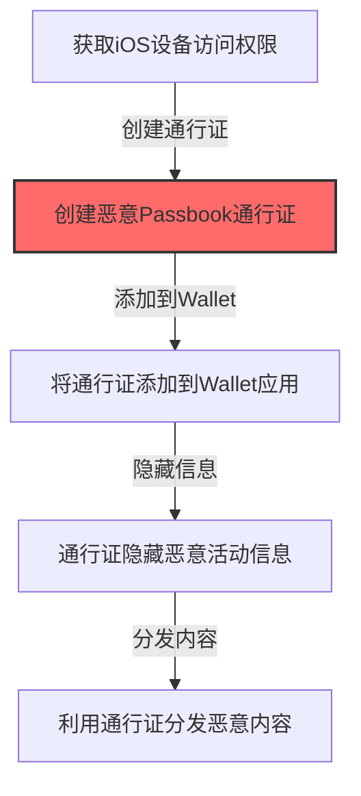

# 通行证条目 (T1564.014)

## 一句话通俗理解

> **攻击者在iOS设备的钱包应用中创建恶意通行证条目，用于隐藏恶意活动或分发恶意内容**

## 30秒速查卡

| 维度 | 你需要知道的 |
|------|-------------|
| 这是什么？ | 攻击者在iOS设备的钱包应用中创建恶意通行证条目 |
| 为什么危险？ | 通行证条目可以用于社会工程和恶意内容分发 |
| 谁需要关心？ | 移动安全工程师、SOC分析师、安全运维 |
| 你的第一步防御 | 监控iOS钱包的异常通行证创建 |
| 如果只做一件事 | 检测未授权的通行证条目创建 |

## 难度等级

⭐⭐ 中级 - 需要一定的技术基础和经验

## 这是什么？

**通行证条目**（T1564.014）是 **隐藏痕迹**（T1564）的一个具体变体，属于 **隐蔽** 阶段的攻击技术。

> 📚 **打个比方**：就像在别人的手机"钱包"里偷偷塞一张假会员卡——攻击者在iOS设备的Wallet应用中创建恶意的Passbook通行证条目，这些看似无害的会员卡或门票实际上可以用于分发恶意链接或隐藏钓鱼信息。

### 具体怎么理解？

攻击者在iOS设备的钱包应用中创建恶意通行证条目，用于隐藏恶意活动或分发恶意内容

攻击者使用这种技术时，通常是在隐蔽阶段，想要达到特定的攻击目标。与父技术 T1564 相比，T1564.014 有自己独特的特点和使用场景。

### 为什么有效？

这种技术之所以有效，是因为：
1. **隐蔽性**：利用了正常系统功能或常见协议，不容易被发现
2. **技术门槛适中**：不需要特别高深的技术知识就能实施
3. **广泛适用**：可以在多种环境和系统中使用

## 真实攻击流程

### 典型场景

攻击者在 **隐蔽** 阶段使用 通行证条目 技术，以下是典型的攻击步骤：

**步骤详解：**

> **步骤1**：获取iOS设备的访问权限

> **步骤2**：创建恶意的Passbook/Wallet通行证条目

> **步骤3**：将通行证添加到设备的Wallet应用

> **步骤4**：通行证用于隐藏恶意活动或分发恶意内容

## 真实案例

### 案例1：已知APT组织使用

- **时间**: 2023-2024年
- **目标**: 多个行业
- **手法**: 利用通行证条目技术绕过安全检测
- **链接**: 暂无公开详细报告

## 红队视角

### 攻击价值

通行证条目的高级应用场景和价值：

- **绕过防御**：利用该技术可以绕过传统的安全检测机制
- **隐蔽持久**：在目标环境中保持更长时间的隐蔽存在
- **扩大战果**：为进一步的攻击活动提供基础

### 实施要点

1. **环境适配**：根据目标环境的具体配置调整攻击方式
2. **组合运用**：与其他攻击技术组合使用可以提高成功率
3. **规避检测**：注意避免触发常见的安全告警规则

## 蓝队视角

### 检测方法

1. **日志分析**：检查相关系统和应用的日志异常
2. **行为监控**：监控文件系统和进程的异常行为
3. **网络检测**：检测不正常的网络连接和数据传输

### 调查要点

- 检查系统日志中的异常条目
- 分析文件系统的时间和元数据异常
- 审查网络连接的时间和行为模式

**用人话说：** 这条规则在检测未授权的通行证条目创建。通行证条目可以用于社会工程。

## 检测建议

### 初级检测

- 检查系统和应用的日志记录，寻找异常模式
- 监控文件系统的异常修改和创建

### 中级检测

- 部署行为检测规则，监控异常进程行为
- 使用SIEM系统关联分析多源日志

### 高级检测

- 实施用户和实体行为分析（UEBA）
- 部署端点检测与响应（EDR）系统

## 缓解措施

### 预防

- 保持系统和应用的最新补丁
- 实施最小权限原则
- 加强网络安全边界控制

### 检测与响应

- 部署入侵检测系统（IDS/IPS）
- 建立应急响应流程
- 定期进行安全演练

### 恢复

- 建立备份和恢复机制
- 制定业务连续性计划
- 保留取证数据用于事后分析

## 动手实验

### 实验环境搭建

- 操作系统：Windows 10/11 或 Linux
- 所需工具：相关安全测试工具
- 网络环境：隔离的实验网络

### 实验步骤

1. 搭建隔离的实验环境
2. 配置必要的测试工具
3. 模拟通行证条目的攻击场景
4. 观察和记录攻击行为
5. 验证检测规则的生效情况

### 预期结果

通过实验，理解通行证条目的攻击原理和检测方法。

## 术语解释

- **APT**: 高级持续性威胁（Advanced Persistent Threat）
- **SEG**: 安全邮件网关（Security Email Gateway）
- **EDR**: 端点检测与响应（Endpoint Detection and Response）

## 被引用情况

以下父技术文档引用了本子技术：

- [T1564 - 隐藏工件](../T1564-Hide-Artifacts.md)

## 参考资料

- MITRE ATT&CK 官方文档
- 安全厂商的分析报告
- 行业安全最佳实践指南
