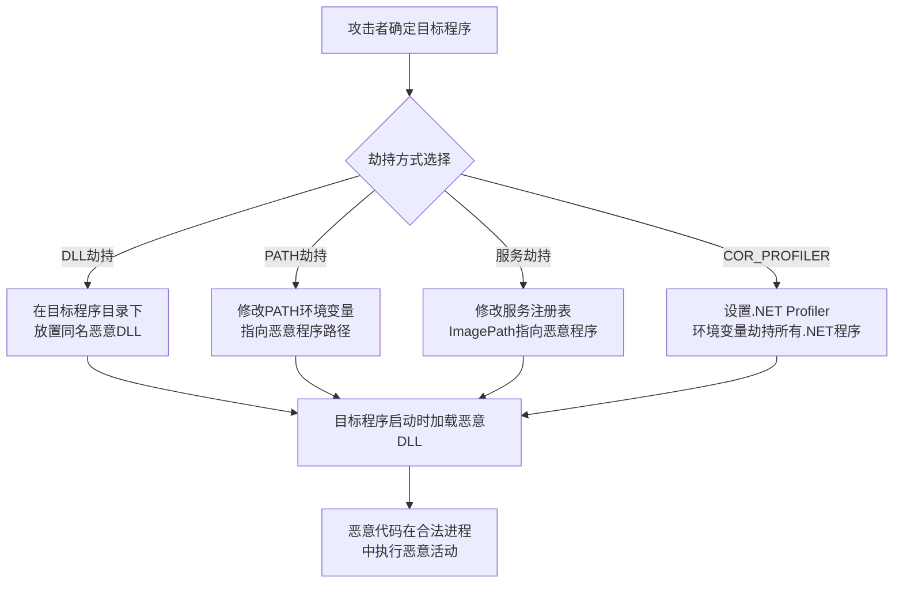

# 劫持执行流程 (T1574)

## 一句话通俗理解

攻击者篡改了程序执行时的"寻路系统"，让合法程序在运行时不自觉地加载了恶意代码，就像你导航去便利店，但导航被篡改把你带到了贼窝。

## 难度等级

⭐⭐ 中级（需要一定基础）

## 技术描述

劫持执行流程（T1574）是MITRE ATT&CK框架中隐蔽战术的一种技术。

**通俗解释：**
当一个程序运行时，它需要加载各种DLL文件来完成功能。系统有一个"寻路规则"：先看当前目录、再看系统目录、最后看环境变量中的目录。攻击者利用这个规则——在一个合法程序的旁边放一个同名的恶意DLL，程序启动时会先加载这个恶意DLL（因为系统先搜索当前目录），然后恶意DLL在执行完恶意操作后，再把控制权交给真正的程序。整个过程用户看到的只是正常程序在运行。

**技术原理：**
1. **DLL劫持**：在与目标程序相同的目录下放置恶意DLL，利用DLL搜索顺序加载
2. **DLL侧载**：利用WinSxS或Manifest机制侧载恶意DLL
3. **路径拦截**：修改PATH环境变量，让系统优先找到恶意程序
4. **服务劫持**：修改服务的ImagePath注册表项
5. **COR_PROFILER**：设置.NET Profiler环境变量劫持所有.NET程序

## 攻击流程



**步骤详解：**
1. **确定目标程序**：选择一个系统自带或用户经常使用的合法程序
2. **选择劫持方式**：根据目标程序的特性选择合适的劫持技术
3. **部署恶意组件**：将恶意DLL或程序放置在目标程序会加载的位置
4. **触发执行**：等待用户或系统启动目标程序，触发恶意代码执行

## 子技术列表

| 子技术ID | 中文名称 | 通俗解释 |
|----------|----------|----------|
| T1574.001 | 搜索顺序劫持 | 利用DLL搜索顺序加载恶意DLL |
| T1574.002 | DLL侧载 | 利用WinSxS侧载恶意DLL |
| T1574.003 | DLL劫持 | 替换程序要加载的DLL为恶意版本 |
| T1574.004 | Dylib劫持 | macOS上的动态库劫持 |
| T1574.005 | 执行流劫持 | 修改进程执行路径 |
| T1574.006 | LD_PRELOAD劫持 | Linux下利用LD_PRELOAD加载恶意库 |
| T1574.007 | PATH环境变量劫持 | 修改PATH环境变量 |
| T1574.008 | 服务劫持 | 修改服务的可执行文件路径 |
| T1574.009 | COR_PROFILER | 劫持.NET Profiler接口 |
| T1574.010 | .NET运行时修改 | 修改.NET运行时配置 |
| T1574.011 | 服务文件路径修改 | 替换服务注册表中的文件路径 |

## 真实案例

### 案例1：DLL侧载——Chrome的恶意插件（2019-2023）

- **时间**: 2019-2023年
- **手法**: 攻击者将恶意DLL放置在Chrome安装目录中，名称为Chrome依赖的合法DLL名。Chrome启动时加载恶意DLL执行后台活动。
- **参考链接**: [MITRE - T1574.002](https://attack.mitre.org/techniques/T1574/002/)

### 案例2：Squirrel ransomware DLL劫持（2020）

- **时间**: 2020年
- **手法**: 利用SysInternals工具中缺失的DLL进行劫持。在SysInternals工具目录中放置同名恶意DLL，管理员运行系统工具时自动加载恶意代码。
- **参考链接**: [BleepingComputer](https://www.bleepingcomputer.com/)

### 案例3：COR_PROFILER劫持（2021-2024）

- **时间**: 2021-2024年
- **手法**: 攻击者设置COR_PROFILER环境变量，使所有.NET应用程序启动时加载恶意的Profiler DLL。这种技术隐蔽性高，因为所有的.NET程序（包括安全软件的部分组件）都会自动加载。
- **参考链接**: [MITRE - T1574.009](https://attack.mitre.org/techniques/T1574/009/)

## 红队视角

> ⚠️ **免责声明**：以下内容仅用于合法的安全测试、渗透测试和教育目的。未经授权对他人系统进行测试是违法行为。

> ⚠️ **免责声明**：以下内容仅用于合法的安全测试、教育和研究目的。

**实战技巧：**
1. DLL劫持的成功关键在于找到目标程序依赖但可能缺失的DLL
2. COR_PROFILER劫持可以影响所有.NET应用程序，覆盖面广
3. 服务劫持因为以SYSTEM权限运行，适合权限维持和提权

**常用工具：**
- Process Monitor：分析目标程序的DLL加载行为
- Dependency Walker：查看程序依赖的DLL列表
- Microsoft Detours：用于API钩子的库

**注意事项：**
- DLL劫持在Windows 10/11上受KnownDLLs保护机制限制
- 选择低知名度或较少被监控的软件作为劫持目标
- COR_PROFILER劫持会被安全软件监控环境变量变化

## 蓝队视角

**防御重点：**
1. 监控DLL加载事件（Sysmon Event ID 7），特别是从非标准路径加载的系统DLL
2. 监控环境变量的修改，特别是COR_PROFILER和PATH变量
3. 使用Process Monitor分析异常DLL加载行为

**检测要点：**
- 检测从非标准路径加载的已知系统DLL（如ntdll.dll从应用程序目录加载）
- 监控环境变量的异常修改（Event ID 4688命令行参数异常）
- 检测服务注册表ImagePath值的异常修改
- 使用AppLocker或WDAC限制DLL加载来源

## 检测建议

### 网络层检测

**检测方法：** 跟踪SMB文件共享中的可疑DLL分发和远程加载行为

**具体规则/命令示例：**
```bash
# Zeek检测SMB共享中异常的DLL文件传输
alert tcp $HOME_NET any -> $HOME_NET 445 (msg:"Suspicious DLL Transfer via SMB - Possible Hijacking"; content:"|2e 64 6c 6c|"; within:50; sid:1001574; rev:1;)
```

### 主机层检测

**检测方法：** 监控DLL加载路径异常、环境变量修改和服务配置变更

**Windows事件ID：**
- Sysmon Event ID 7：检测DLL加载事件，重点关注非标准路径的系统DLL加载
- 事件ID 4688：检测进程创建，关注命令行中的DLL劫持迹象
- 事件ID 4657：监控注册表修改，特别是`KnownDLLs`和`ImagePath`键值
- 事件ID 7045：检测新服务安装，关注ImagePath指向非标准位置

**Linux日志：**
- 日志文件：`/var/log/syslog`，`/var/log/audit/audit.log`
- 关键字段：`LD_PRELOAD`环境变量设置、`LD_LIBRARY_PATH`异常修改

**具体命令示例：**
```bash
# Windows：检查KnownDLLs注册表，确认无异常条目
reg query "HKLM\SYSTEM\CurrentControlSet\Control\Session Manager\KnownDLLs"

# Windows：检查PATH环境变量中的非标准目录
echo %PATH% | findstr /i "Temp AppData Downloads"

# Linux：检查LD_PRELOAD环境变量
grep -r "LD_PRELOAD" /etc/environment /etc/profile /etc/bash.bashrc

# Linux：检查动态链接器缓存
ldconfig -p | grep suspicious
```

### 应用层检测

**Sigma规则示例：**
```yaml
title: DLL Hijacking via Non-Standard Path
status: experimental
description: 检测从非标准路径加载系统DLL，可能的DLL劫持行为
logsource:
    category: image_load
    product: windows
detection:
    selection:
        EventID: 7
        ImageLoaded|endswith:
            - '\\ntdll.dll'
            - '\\kernel32.dll'
            - '\\ole32.dll'
        ImageLoaded|contains:
            - '\\Temp\\'
            - '\\AppData\\'
    condition: selection
level: high
tags:
    - attack.t1574
```

## 缓解措施

### 优先级1：关键措施

**措施名称：** 启用SafeDllSearchMode和KnownDLLs保护

**具体实施步骤：**
1. 配置Windows组策略启用安全DLL搜索模式（SafeDllSearchMode），强制先搜索系统目录
2. 维护KnownDLLs注册表（`HKLM\SYSTEM\CurrentControlSet\Control\Session Manager\KnownDLLs`），确保所有已知系统DLL被列入
3. 部署AppLocker或WDAC的DLL规则，限制仅允许从受信任路径加载DLL
4. 启用Windows Defender Exploit Guard的DLL加载保护，阻止从网络共享或Temp目录加载DLL

### 优先级2：重要措施

**措施名称：** 限制环境变量修改和服务配置变更权限

**具体实施步骤：**
1. 使用组策略限制用户对环境变量（PATH、COR_PROFILER、LD_PRELOAD）的修改权限
2. 实施服务安装审批流程，监控服务ImagePath注册表的异常修改（Event ID 7045）
3. 部署Sysmon监控DLL加载事件，配置告警规则检测从Temp、AppData、Downloads等目录加载DLL
4. 定期使用Process Monitor分析关键进程的DLL加载行为，建立基线

**配置示例：**
```bash
# Windows：启用SafeDllSearchMode
reg add "HKLM\SYSTEM\CurrentControlSet\Control\Session Manager" /v SafeDllSearchMode /t REG_DWORD /d 1 /f

# 监控LD_PRELOAD设置
auditctl -w /etc/ld.so.preload -p wa -k ld_preload_hijack
```

### MITRE ATT&CK缓解措施映射

| 缓解措施ID | 缓解措施名称 | 适用性 | 说明 |
|------------|-------------|--------|------|
| M1038 | 可执行文件白名单 | 适用 | 使用AppLocker或WDAC限制DLL加载来源 |
| M1026 | 特权账户管理 | 适用 | 限制服务安装和修改权限 |
| M1018 | 用户账户管理 | 适用 | 限制用户对环境变量的修改权限 |
| M1040 | 防篡改 | 部分适用 | 启用Windows Defender防篡改保护KnownDLLs |

## 动手实验

> ⚠️ **重要提示**：所有实验必须在隔离的实验室环境中进行，禁止对未授权的真实系统进行测试。

### 实验1：创建DLL劫持实验（中级）

**实验步骤：**
1. 在Windows VM中找到目标程序的DLL依赖
2. 编写与缺失DLL同名的DLL，包含导出函数
3. 将恶意DLL放置在目标程序目录下
4. 运行目标程序，观察DLL被加载

## 术语解释

| 术语 | 英文原名 | 通俗解释 |
|------|----------|----------|
| DLL劫持 | DLL Hijacking | 让程序加载了错误的DLL而不是原来的DLL |
| DLL搜索顺序 | DLL Search Order | Windows查找DLL的规则和顺序 |
| 侧载 | Side-loading | 利用WinSxS机制加载恶意DLL |

## 参考资料

- [MITRE ATT&CK - T1574 Hijack Execution Flow](https://attack.mitre.org/techniques/T1574/)
- [DLL Hijacking Guide](https://attack.mitre.org/techniques/T1574/)
