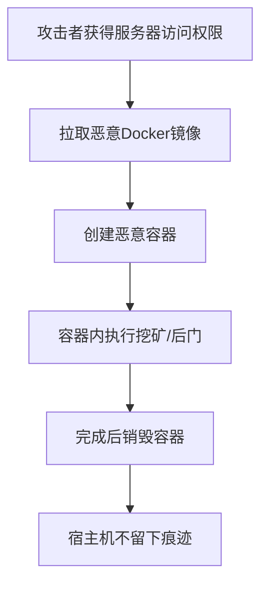

# 部署容器 (T1610)

## 一句话通俗理解

攻击者在入侵的服务器上用Docker或Kubernetes创建恶意容器来执行攻击，就像租了一间隐蔽的地下室做非法活动，即使警察来了也不容易找到。

## 难度等级

⭐⭐ 中级（需要一定基础）

## 技术描述

部署容器（T1610）是MITRE ATT&CK框架中隐蔽战术的一种技术。

**通俗解释：**
随着越来越多的公司使用Docker和Kubernetes，攻击者也跟着"上云"了。他们不再直接在你的服务器上放恶意软件，而是部署一个Docker容器。这样做的好处是：容器和宿主机是隔离的，安全软件在宿主机上很难看到容器内部的活动；而且容器部署非常快，用完可以立刻销毁。

**技术原理：**
1. **Docker容器**：使用docker run创建恶意容器，容器内运行挖矿、后门等
2. **Kubernetes Pod**：在K8s集群中创建恶意Pod，窃取集群资源
3. **容器逃逸**：从容器中逃逸到宿主机获得更高权限
4. **镜像攻击**：使用包含恶意代码的镜像部署容器

## 攻击流程



## 真实案例

### 案例1：TeamTNT Docker挖矿（2020-2022）

- **时间**: 2020-2022年
- **目标**: 全球未安全配置的Docker服务器
- **攻击组织**: TeamTNT
- **手法**: 扫描公网上开放的Docker API端口，使用合法Docker Hub镜像部署挖矿容器。使用docker rm删除容器来清除痕迹。
- **参考链接**: [Cisco Talos - TeamTNT](https://blog.talosintelligence.com/)

### 案例2：Hildegard Linux恶意挖矿（2021）

- **时间**: 2021年
- **目标**: Kubernetes集群
- **攻击组织**: TeamTNT
- **手法**: 在Kubernetes集群中创建恶意Pod，利用kubectl进行横向移动。使用K8s DaemonSet确保在所有节点上都部署挖矿容器。
- **参考链接**: [Microsoft - Hildegard](https://www.microsoft.com/security/blog/)

### 案例3：Aqua Nautilus 供应链攻击（2023）

- **时间**: 2023年
- **目标**: Docker Hub用户
- **攻击组织**: 未知
- **手法**: 在Docker Hub上发布包含挖矿恶意代码的镜像，伪装成流行开源软件的Docker镜像。用户拉取后，容器在后台自动执行挖矿。
- **参考链接**: [Aqua Security](https://www.aquasec.com/)

## 红队视角

> ⚠️ **免责声明**：以下内容仅用于合法的安全测试、渗透测试和教育目的。未经授权对他人系统进行测试是违法行为。

> ⚠️ **免责声明**：以下内容仅用于合法的安全测试、教育和研究目的。

**实战技巧：**
1. 利用公网未授权访问的Docker Daemon API直接部署容器是最快捷的方式
2. 使用合法镜像（如alpine）拉取后动态下载恶意负载，可避开镜像扫描
3. 容器使用完毕后立即销毁，可有效清除在宿主机上的活动痕迹

**常用工具：**
- Docker CLI：容器管理命令行工具
- kubectl：Kubernetes集群管理工具
- 恶意Docker Hub镜像：包含后门的容器镜像

**注意事项：**
- 容器逃逸漏洞（如CVE-2024-21626）可能导致容器权限突破到宿主机
- 容器运行时的资源消耗异常可能被监控系统发现
- 使用--rm标志自动删除容器可减少痕迹

## 蓝队视角

**防御重点：**
1. 确保Docker Daemon API不暴露在公网，使用TLS认证保护
2. 配置Kubernetes RBAC限制Pod创建和部署权限
3. 部署容器安全运行时监控（如Falco、Aqua Security）

**检测要点：**
- 监控非预期的容器创建活动，特别是来自未知镜像的容器
- 关注容器资源消耗异常（如CPU和内存突然飙升）
- 审计容器镜像来源和完整性，阻止使用不受信任的镜像
- 监控Docker Daemon API的未授权访问尝试

## 检测建议

### 网络层检测

**检测方法：** 监控容器镜像仓库访问流量和容器网络通信异常

**具体规则/命令示例：**
```bash
# Suricata检测非预期的容器镜像拉取行为
alert tcp $HOME_NET any -> $EXTERNAL_NET 443 (msg:"Suspicious Container Registry Pull - Unknown Registry"; content:"registry-1.docker.io"; http_host; threshold:type limit, track by_src, count 5, seconds 60; sid:1001610; rev:1;)

# 检测容器网络中的挖矿通信流量
alert tcp $HOME_NET any -> $EXTERNAL_NET 3333 (msg:"Suspicious Container Crypto Mining Pool Communication"; sid:1001611; rev:1;)
```

### 主机层检测

**检测方法：** 监控Docker Daemon API访问、容器创建事件和资源异常

**Windows事件ID：**
- 适用于Windows Server容器：事件ID 1000（Docker容器创建事件）
- Windows容器事件日志：`Microsoft-Windows-Containers/Operational`

**Linux日志：**
- 日志文件：`/var/log/syslog`，`/var/log/audit/audit.log`
- Docker守护进程日志：`/var/log/docker.log`
- Kubernetes审计日志：`/var/log/kube-apiserver-audit.log`
- 关键字段：`docker run`，`kubectl create pod`，`ContainerCreated`

**具体命令示例：**
```bash
# 查看Docker容器创建历史
docker ps -a --format "table {{.ID}}\t{{.Image}}\t{{.Status}}"

# 查看Kubernetes审计日志中的Pod创建事件
grep -i '"create"' /var/log/kube-apiserver-audit.log | grep -i '"Pod"'

# 检测异常容器资源消耗
docker stats --no-stream | awk '{if($3 ~ /[0-9]+%/ && int($3)+0 > 80) print $1,$2,$3}'
```

### 应用层检测

**Sigma规则示例：**
```yaml
title: Suspicious Container Creation from Untrusted Image
status: experimental
description: 检测从不受信任来源创建Docker容器的行为
logsource:
    category: process_creation
    product: linux
detection:
    selection:
        CommandLine|contains|all:
            - 'docker run'
            - '--rm'
    condition: selection
level: medium
tags:
    - attack.t1610
```

## 缓解措施

### 优先级1：关键措施

**措施名称：** 安全加固容器运行环境

**具体实施步骤：**
1. 确保Docker Daemon API不暴露在公网，使用TLS证书认证和客户端证书授权保护
2. 配置Kubernetes RBAC严格限制Pod创建、exec和部署权限，遵循最小权限原则
3. 部署容器安全运行时监控工具（如Falco、Aqua Security或Sysdig），实时检测异常容器行为
4. 启用Docker内容信任（Docker Content Trust），仅允许运行经过签名的镜像

### 优先级2：重要措施

**措施名称：** 容器镜像安全审计和网络隔离

**具体实施步骤：**
1. 建立容器镜像白名单机制，仅允许从受信任的镜像仓库拉取镜像
2. 部署镜像安全扫描工具（如Trivy、Clair），在CI/CD流水线中自动扫描镜像漏洞
3. 实施容器网络分段策略，使用Kubernetes NetworkPolicy限制Pod间通信
4. 配置资源配额（ResourceQuota）和限制范围（LimitRange），防止容器资源滥用

**配置示例：**
```bash
# 启用Docker内容信任
export DOCKER_CONTENT_TRUST=1

# Kubernetes NetworkPolicy限制Pod通信
kubectl apply -f - <<EOF
apiVersion: networking.k8s.io/v1
kind: NetworkPolicy
metadata:
  name: default-deny
spec:
  podSelector: {}
  policyTypes:
  - Ingress
  - Egress
EOF
```

### MITRE ATT&CK缓解措施映射

| 缓解措施ID | 缓解措施名称 | 适用性 | 说明 |
|------------|-------------|--------|------|
| M1042 | 审计策略 | 适用 | 启用Docker和Kubernetes审计日志记录所有容器操作 |
| M1026 | 特权账户管理 | 适用 | 限制Docker Daemon API和Kubernetes RBAC权限 |
| M1030 | 网络分段 | 适用 | 隔离容器网络，限制容器之间的横向移动 |
| M1018 | 用户账户管理 | 适用 | 限制对容器管理接口的访问用户数量 |

## 动手实验

> ⚠️ **重要提示**：所有实验必须在隔离的实验室环境中进行，禁止对未授权的真实系统进行测试。

### 实验环境准备

**所需工具：** Linux虚拟机（已安装Docker）、Docker CLI、htop工具

### 实验1：创建模拟恶意容器并监控资源消耗（初级）

**实验步骤：**
1. 在Linux虚拟机中确保Docker已安装运行：`docker ps`
2. 拉取基础镜像：`docker pull alpine`
3. 创建后台运行的模拟挖矿容器：`docker run -d --name test-miner alpine sh -c "while true; do echo 'mining...'; sleep 5; done"`
4. 查看容器列表：`docker ps -a`
5. 使用`docker stats --no-stream`查看容器的CPU和内存占用
6. 停止并删除容器：`docker stop test-miner && docker rm test-miner`

**预期结果：** 容器在后台持续运行并输出日志，docker stats显示该容器的资源使用情况

**学习要点：** 理解攻击者如何利用容器快速部署恶意负载，以及如何通过监控容器创建和资源消耗异常来检测恶意容器

### 实验2：配置Docker Daemon TLS安全加固（中级）

**实验步骤：**
1. 在Linux虚拟机上生成CA证书和服务器证书（使用openssl）
2. 创建Docker守护进程TLS配置：编辑`/etc/docker/daemon.json`，设置tlsverify、tlscacert等参数
3. 重启Docker服务：`systemctl restart docker`
4. 验证未持有客户端证书的连接被拒绝：`curl https://localhost:2375/version`
5. 使用客户端证书验证连接成功：`docker --tlsverify version`

**预期结果：** 未授权的curl请求被拒绝，持有有效证书的docker命令可以正常管理容器

**学习要点：** 理解Docker Daemon API暴露在公网的安全风险，掌握TLS加密认证的配置方法作为关键防御手段

## 术语解释

| 术语 | 英文原名 | 通俗解释 |
|------|----------|----------|
| 容器 | Container | 一种轻量级的虚拟化技术，像一个独立的小型操作系统 |
| Docker | Docker | 最流行的容器平台 |
| Kubernetes | K8s | 容器编排平台，用于管理和部署大量容器 |
| 容器逃逸 | Container Escape | 突破容器隔离，获得宿主机权限的攻击 |

## 参考资料

- [MITRE ATT&CK - T1610 Deploy Container](https://attack.mitre.org/techniques/T1610/)
- [Docker Security Best Practices](https://docs.docker.com/engine/security/)
