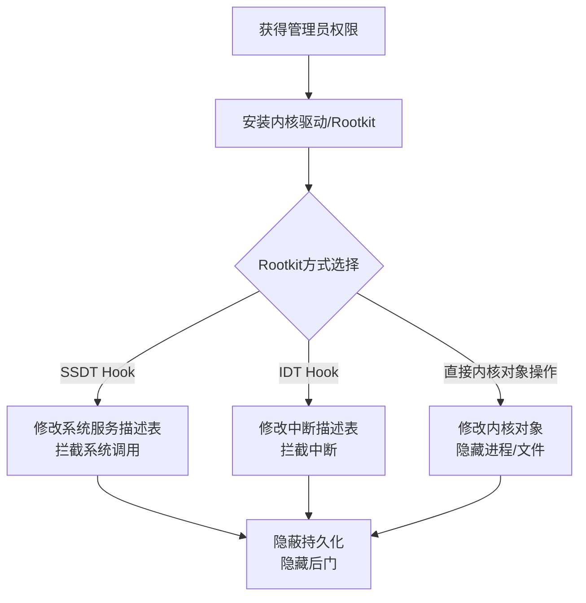

# Rootkit (T1014)

## 一句话通俗理解

> **Rootkit就是在操作系统底下挖了个地下室** -- 表面上看系统正常，但地下室里有另一套世界在运行，顶层的安全软件完全不知道。

## 难度等级

- ⭐⭐⭐ 专家级（需要较深技术基础）

需要理解操作系统内核原理、驱动开发和内存管理。

## 技术描述

Rootkit（T1014）是MITRE ATT&CK框架中防御削弱战术的技术。

**通俗解释：**
你家的房子（操作系统）表面上一切都好，有人吃饭、看电视、睡觉。但你不知道的是，你家地下五米处有一个秘密地下室（Rootkit），里面有另一群人在活动。你楼上的监控摄像头看到的只是正常生活，完全不知道地下发生了什么。Rootkit就是操作系统底下的"秘密地下室" -- 它在操作系统和应用程序之间插入了一层，截获并过滤所有信息，让上层以为一切正常。

**技术原理：**
Rootkit通过修改操作系统内核或关键系统组件的正常功能来隐藏自身和其他恶意组件：

1. **内核级Rootkit**：以内核驱动形式运行，拥有最高权限，可以Hook系统调用（SSDT Hook、IDT Hook）
2. **用户态Rootkit**：通过劫持用户态的API调用或修改进程的内存空间隐藏信息
3. **Bootkit**：在操作系统启动前加载，比内核更底层（如T1542相关）
4. **Hypervisor Rootkit**：在虚拟化管理程序中运行，是最底层的Rootkit

**核心功能：**
- **隐藏进程**：从进程列表中移除Rootkit进程
- **隐藏文件**：使Rootkit相关文件在文件系统中不可见
- **隐藏注册表项**：使Rootkit相关注册表项在Regedit中不可见
- **隐藏网络连接**：使Rootkit的网络连接在netstat中不可见
- **提供后门**：预留秘密访问通道

**用途与影响：**
Rootkit是最高级的持久化和防御削弱技术之一。传统安全软件运行在Ring 3（用户态），内核级Rootkit运行在Ring 0（内核态），安全软件很难检测到运行在更低层的Rootkit。Rootkit通常用于高价值目标的长期潜伏攻击，如APT攻击和国家支持的网络间谍活动。

## 攻击流程



**步骤详解：**
1. **获得管理员权限**：Rootkit需要管理员或SYSTEM权限才能安装
2. **安装内核驱动**：将Rootkit作为内核驱动加载到系统中
3. **Hook系统调用（可选）**：修改SSDT/Hook系统调用，过滤特定请求
4. **隐藏操作**：从用户态隐藏进程、文件、网络连接等
5. **维持访问**：通过Rootkit提供的后门持续访问系统

## 子技术列表

该技术没有官方子技术分类。

## 真实案例

### 案例1：FiveSys Rootkit通过签名驱动传播（2024-2025年）
- **时间**: 2024-2025年
- **目标**: 全球在线游戏用户
- **攻击组织**: 疑似中国网络犯罪组织
- **手法**: FiveSys Rootkit使用有效数字签名加载内核模式驱动。它修改系统代理设置，将流量重定向到攻击者控制的服务端，在操作系统内核层拦截网络流量。由于驱动拥有有效数字签名，可以绕过Windows驱动签名策略。
- **影响**: 全球数百万游戏玩家流量被劫持
- **参考链接**: [Securelist - FiveSys Rootkit](https://securelist.com/fivesys-rootkit/)

### 案例2：TrickBot的Anchor DNSSEC Rootkit（2023-2024年）
- **时间**: 2023-2024年
- **目标**: 全球金融机构
- **攻击组织**: TrickBot
- **手法**: TrickBot的Anchor DNS后门组件使用Rootkit技术隐藏C2通信。通过修改系统DNS解析过程、拦截特定域名查询、返回攻击者控制的DNS服务器IP地址实现网络层隐蔽通信。
- **影响**: Anchor DNS被用于长期潜伏攻击
- **参考**: [MITRE - TrickBot S0266](https://attack.mitre.org/software/S0266/)

### 案例3：Lazarus Group的FudModule Rootkit（2023-2024年）
- **时间**: 2023-2024年
- **目标**: 全球加密货币交易所
- **攻击组织**: Lazarus Group
- **手法**: Lazarus Group使用FudModule内核Rootkit。该Rootkit利用BYOVD技术加载有漏洞的签名驱动（如`aswSP.sys`）获取内核内存读写权限。Rootkit与C2服务器通信获取控制指令，可以加载额外内核载荷、读写任意进程内存、执行ShellCode。
- **影响**: Lazarus Group利用Rootkit隐藏后门活动
- **参考**: [AhnLab - Lazarus FudModule](https://asec.ahnlab.com/en/53739/)

### 案例4：使用bootkit技术绕过Windows Defender（2024年）

- **时间**: 2024年
- **目标**: Windows系统
- **攻击组织**: 研究人员PoC
- **手法**: BlackLotus bootkit在启动加载器（Boot Loader）阶段运行，在Windows启动之前获得代码执行能力。Bootkit作者利用CVE-2022-21894漏洞绕过Secure Boot保护，使用合法的Windows引导组件执行恶意代码。
- **影响**: bootkit让EDR产品在操作系统启动前就已经失效
- **参考链接**: [ESET - BlackLotus UEFI Bootkit](https://www.welivesecurity.com/2023/03/01/blacklotus-uefi-bootkit-myth-confirmed/)

## 红队视角

> ⚠️ **免责声明**：以下内容仅用于合法的安全测试、渗透测试和教育目的。未经授权对他人系统进行测试是违法行为。

> ⚠️ **免责声明**：以下内容仅用于合法的安全测试、教育和研究目的。

**实战技巧：**
1. Rootkit开发需要深入理解操作系统内核，建议先在分析环境中充分测试
2. BYOVD是当前最常用的内核级Rootkit加载方式，可以绕过驱动签名校验
3. 用户态Rootkit虽然权限较低，但开发和部署难度也低很多

**常用工具：**
- WinDbg：内核调试工具
- Process Hacker：进程和内核对象查看工具
- Kernel Driver Framework (WDF)：Windows驱动开发框架

**注意事项：**
- Rootkit开发需要支付微软EV签名证书费用，且可能被吊销
- 64位Windows系统强制要求驱动签名，使用BYOVD技术是最常见的方式
- 现代Windows启用内核代码完整性检查（Kernel Code Integrity）

## 蓝队视角

**防御重点：**

1. **驱动签名校验**：启用Windows Defender Application Control（WDAC）阻止未签名的内核驱动加载
2. **HVCI（Hypervisor-protected Code Integrity）**：利用硬件虚拟化保护内核完整性
3. **PPL保护**：设置关键进程为受保护进程轻量级（PPL）模式
4. **LSA保护**：启用本地安全机构（LSA）进程保护

**检测要点：**
- 检测未签名内核驱动的加载（事件ID 4673）
- 检测异常的内核模块加载（事件ID 7030）
- 使用AutoRuns检测隐藏的驱动和服务
- 启用Driver Blocklist阻止已知恶意驱动

## 检测建议

### 网络层检测

Rootkit通常在系统内核层操作，对网络层而言表现为异常的驱动通信和隐藏的网络连接。

| 检测层面 | 检测方法 | 数据来源 | 检测规则示例 |
|---------|---------|---------|-------------|
| 网络流量 | 隐藏连接检测 | NetFlow/网络会话日志 | 检测在系统层不可见但实际存在的网络连接（TCP视图与NetFlow交叉比对） |
| 网络边界 | 驱动相关通信 | DNS/HTTP日志 | 检测内核驱动对外部C2服务器的异常DNS解析 |
| 网络监控 | TDI/NDIS钩子检测 | 网络驱动堆栈分析 | 检测网络驱动栈中的异常过滤驱动（使用`netsh winhttp show proxy`和网络堆栈比对） |

**Snort/Suricata规则示例：**
```bash
# 检测已知恶意驱动下载通信
alert http $HOME_NET any -> $EXTERNAL_NET any (msg:"Potential Rootkit Payload Download"; flow:to_server; content:"|2e|sys"; http_uri; classtype:trojan-activity; sid:1000007; rev:1;)

# 检测异常的内核驱动版本信息泄露
alert tcp $HOME_NET any -> $EXTERNAL_NET any (msg:"Kernel Version Info Exfiltration"; content:"NtQuerySystemInformation|20|SystemModuleInformation"; classtype:info-leak; sid:1000008; rev:1;)
```

### 主机层检测

监控驱动加载行为、内核完整性以及异常的系统调用。

| 检测层面 | 检测方法 | 数据来源 | 检测规则示例 |
|---------|---------|---------|-------------|
| 驱动加载 | Sysmon驱动加载监控 | Sysmon Event ID 6（DriverLoad） | 监控未签名驱动的加载，特别是从非标准路径加载的驱动 |
| 内核完整性 | EDR内核扫描 | EDR内核模块检测 | 检测SSDT Hook、IDT Hook和内核代码篡改 |
| 文件系统 | 微过滤器驱动检测 | `fltmc instances`输出 | 检测异常的文件系统微过滤器驱动（如隐藏特定文件扩展名） |
| 进程 | 隐藏进程检测 | Process Explorer/Volatility | 检测在内核模式下隐藏的进程（DKOM技术） |
| 特权 | 特权服务调用 | Windows Event ID 4673 | 监控SeLoadDriverPrivilege等敏感特权的使用 |

**Windows事件检测规则：**
```powershell
# 检测未签名驱动的加载
Get-WinEvent -FilterHashtable @{LogName='Microsoft-Windows-Sysmon/Operational';ID=6} | Where-Object {$_.Message -notmatch "signed"}

# 检测内核模块加载（事件ID 7030 - 服务安装失败）
Get-WinEvent -FilterHashtable @{LogName='System';ID=7030} | Where-Object {$_.Message -match "driver"}

# 查看所有已加载的内核驱动
Get-WmiObject Win32_SystemDriver | Where-Object {$_.State -eq "Running"} | Select-Object Name, DisplayName, PathName

# 使用fltmc查看文件系统微过滤器
fltmc instances | Select-String -NotMatch "FileSystem"
```

**持久化检测：**
- 使用Autoruns检查启动项、驱动和服务中的异常条目
- 使用PowerShell查看内核模块：`Get-WindowsDriver -Online`，比对基线
- 使用Process Explorer查看系统进程的已加载DLL列表，寻找未签名的DLL

### 应用层检测

通过Sigma规则和YARA规则检测Rootkit的安装包、驱动文件特征和注册表修改。

**Sigma规则：****
```yaml
title: Unsigned Driver Loaded
status: experimental
description: Detects loading of unsigned kernel drivers
logsource:
    category: driver_load
    product: windows
detection:
    selection:
        EventID: 6
        Signed: false
    condition: selection
level: high
tags:
    - attack.t1014
```

## 缓解措施

### 优先级1：关键措施
**启用HVCI和WDAC：**
- 在Windows安全中心启用内核隔离（内存完整性）
- 使用Windows Defender Application Control限制驱动加载
- 执行驱动签名策略，阻止未签名驱动

### 优先级2：重要措施
**监控驱动加载行为：**
- 配置Sysmon监控异常驱动加载事件
- 定期使用AutoRuns扫描系统驱动
- 建立驱动加载的基线并监控异常值

### 优先级3：建议措施
**驱动管理：**
- 定期更新驱动阻止列表
- 使用Microsoft Defender for Endpoint的行为了解

### MITRE ATT&CK缓解措施映射

| 缓解措施ID | 缓解措施名称 | 适用性 | 说明 |
|------------|-------------|--------|------|
| M1040 | 防篡改 | 适用 | 启用HVCI和WDAC保护内核 |
| M1026 | 特权账户管理 | 适用 | 限制驱动安装权限 |
| M1054 | 软件配置 | 适用 | 配置驱动签名策略 |

## 动手实验

> ⚠️ **重要提示**：所有实验必须在隔离的实验室环境中进行，禁止对未授权的真实系统进行测试。

> ⚠️ **所有实验必须在隔离的实验室环境中进行**。

### 实验环境准备

**所需工具：**
- Windows 10/11企业版虚拟机，启用内核调试
- Visual Studio + WDK（Windows Driver Kit）
- WinDbg预览版

### 实验1：查看已加载的内核驱动（初级）
```powershell
# 查看所有已加载的驱动
Get-WmiObject Win32_SystemDriver | Select-Object Name, State, StartMode

# 查看已签名的驱动
Get-WindowsDriver -Online

# 使用fltmc查看文件系统微过滤器
fltmc instances
```

### 实验2：使用Sysmon监控驱动加载（中级）
1. 配置Sysmon监控驱动加载事件（EventID 6）
2. 查看驱动加载日志
3. 分析可疑驱动

### 实验3：简单用户态Rootkit概念验证（高级）
```c
// Windows用户态API挂钩概念示例（HOOK NtQuerySystemInformation）
// 在合法渗透测试框架中编写

typedef NTSTATUS(NTAPI* pNtQuerySystemInformation)(
    SYSTEM_INFORMATION_CLASS SystemInformationClass,
    PVOID SystemInformation,
    ULONG SystemInformationLength,
    PULONG ReturnLength
);

pNtQuerySystemInformation OriginalNtQuerySystemInformation = NULL;

NTSTATUS NTAPI HookedNtQuerySystemInformation(
    SYSTEM_INFORMATION_CLASS SystemInformationClass,
    PVOID SystemInformation,
    ULONG SystemInformationLength,
    PULONG ReturnLength
) {
    NTSTATUS status = OriginalNtQuerySystemInformation(
        SystemInformationClass, SystemInformation,
        SystemInformationLength, ReturnLength);
    // 从结果中移除隐藏的进程
    if (SystemInformationClass == SystemProcessInformation) {
        // 遍历进程列表，移除目标进程
    }
    return status;
}
```

## 术语解释

| 术语 | 英文原名 | 通俗解释 |
|------|----------|----------|
| SSDT | System Service Descriptor Table | 系统服务描述表，操作系统内核中系统调用的分发表 |
| IDT | Interrupt Descriptor Table | 中断描述表，硬件中断处理函数的注册表 |
| HVCI | Hypervisor-protected Code Integrity | 使用Hyper-V保护的代码完整性检查 |
| BYOVD | Bring Your Own Vulnerable Driver | 自行引入有漏洞（但已签名）的驱动攻击 |
| Bootkit | Bootkit | 在操作系统启动前运行的自启动恶意软件 |
| Ring 0/3 | Ring 0 / Ring 3 | CPU特权级别。Ring 0（内核态、高权限）；Ring 3（用户态、低权限） |

## 参考资料

### 官方文档
- [MITRE ATT&CK - T1014 Rootkit](https://attack.mitre.org/techniques/T1014/)

### 安全报告
- [Securelist - FiveSys Rootkit](https://securelist.com/fivesys-rootkit/)
- [AhnLab - Lazarus FudModule Rootkit](https://asec.ahnlab.com/en/53739/)
- [ESET - BlackLotus UEFI Bootkit](https://www.welivesecurity.com/2023/03/01/blacklotus-uefi-bootkit-myth-confirmed/)

### 学习资源
- Windows Driver Kit (WDK) 文档
- [Rootkit学习指南（Rootkit Arsenal）](https://rootkit.com/)
