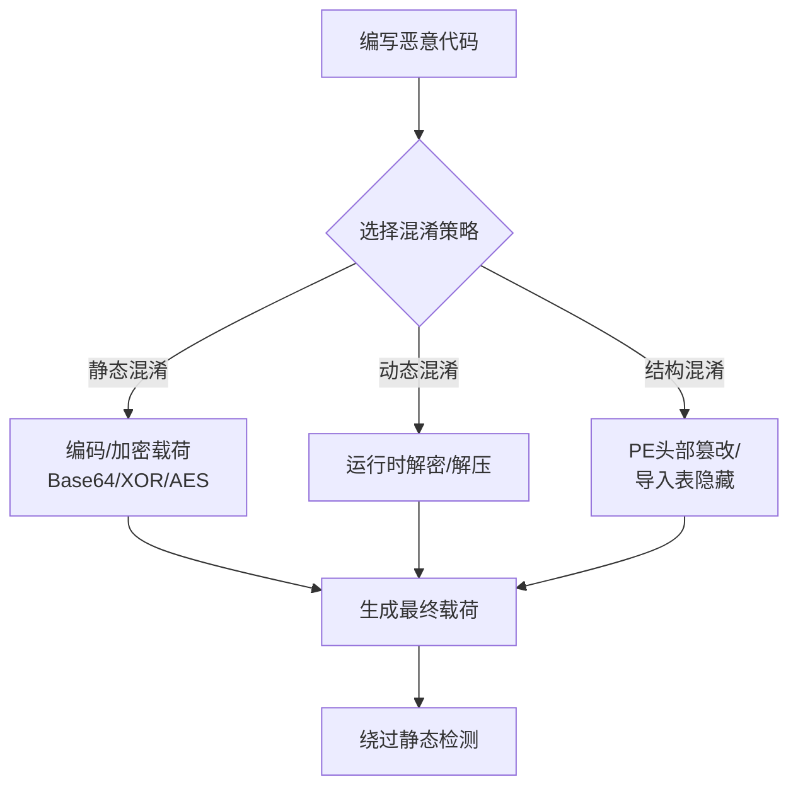

# 混淆文件或信息 (T1027)

## 一句话通俗理解

> **混淆就是把东西伪装成别的样子** -- 把信的内容用暗号写、把饮料罐改装成保险箱、把恶意软件包装得像正常软件。

## 难度等级

- ⭐⭐⭐ 高级（需要较多基础）

需要理解常见编程语言、编码技术和文件格式，部分子技术需要逆向分析能力。

## 技术描述

混淆文件或信息（Obfuscated Files or Information，T1027）是MITRE ATT&CK框架中防御削弱战术的核心技术之一，共有13个子技术。

> 📚 **打个比方**：就像你用隐形墨水写密信，看起来是一张白纸，但用火烤一下字就显出来了——混淆技术就是把恶意代码进行编码、加密、打包，静态分析看到的是一堆"无意义数据"，只有在运行时才会解密露出真面目。

**通俗解释：**
你写了一封举报信不想让别人看懂，于是用暗号写。攻击者也一样 -- 恶意软件写得再脏也没关系，只要代码在沙箱里看起来是安全的、在分析师看来是正常的就行。混淆就是"换个没人看得懂的写法"，把真正的恶意代码隐藏起来。

**技术原理：**
混淆的核心是改变可执行文件或信息的呈现方式，使其静态分析结果与真实行为不一致：

1. **代码签注**：使用编码和编码工具改变文件原始签注
2. **软件打包**：将恶意程序压缩/加密，运行时由加载器解压执行
3. **动态API解析**：运行时才解析API地址，防止静态分析看到导入表
4. **字符串加密**：将IP地址、命令等关键字符串运行时解密
5. **反虚拟化**：检测沙箱环境并改变行为

**用途与影响：**
混淆是恶意软件逃避静态检测的主要手段。几乎100%的现代化恶意软件都使用某种程度的混淆。Windows Defender等安全产品的静态检测命中率在面对混淆后的恶意软件时会大幅下降，迫使安全团队依赖动态分析。

## 子技术列表

**该技术共有 13 个子技术：**

| 子技术ID | 中文名称 | 通俗解释 |
|----------|----------|----------|
| T1027.001 | 二进制植入 | 将恶意代码隐藏在图片或合法文件中 |
| T1027.002 | 软件打包 | 用UPX等方法压缩/加密恶意程序 |
| T1027.003 | 自定义编码/加密 | 用Base64、XOR等方法编码恶意载荷 |
| T1027.004 | 编译后的HTML文件 | 利用CHM文件执行恶意脚本 |
| T1027.005 | 指示器移除 | 删除文件中的IoC特征（硬编码IP等） |
| T1027.006 | HTML Smuggling | 在HTML中编码隐藏恶意文件 |
| T1027.007 | 动态API解析 | 运行时才解析API，不让导入表暴露 |
| T1027.008 | 清空PE头部 | 清除可执行文件的PE头使分析工具解析错误 |
| T1027.009 | 嵌入的Payload | 将载荷嵌入可执行文件的其他部分 |
| T1027.010 | 命令混淆 | 使用混淆的命令行逃避日志检测 |
| T1027.011 | 文件扩展名伪装 | 修改文件扩展名绕过白名单 |
| T1027.012 | LNK文件混淆 | 使用特殊字符和技巧混淆快捷方式文件 |
| T1027.013 | 加密/编码文件 | 使用加密算法保护存储的文件内容 |

## 攻击流程



## 真实案例

### 案例1：使用文件格式混淆绕过Office & PDF安全保护（2025年）
- **时间**: 2025年
- **目标**: 全球企业用户，主要针对SMB、政府机构
- **攻击组织**: 多个APT组织（包括TA577、TA578）
- **手法**: 攻击者利用PDF格式化文本文件（PDF formatted text file）绕过传统安全检测，将恶意内容隐藏在格式化PDF中。使用复杂的编码转换和格式嵌套（例如在Rich Text Format中嵌入PDF格式），导致静态扫描引擎无法正确解析文件内容。研究表明80%以上的恶意PDF文件使用了格式混淆技术。
- **影响**: 大量企业用户遭受鱼叉钓鱼攻击，恶意PDF附件绕过安全邮件网关检测
- **参考链接**: [GBHackers - PDF Formatted Text Bypass](https://gbhackers.com/pdf-formatted-text/)

### 案例2：Akira勒索软件使用软性打包器（2024-2025年）
- **时间**: 2024-2025年
- **目标**: 全球各个行业组织，包括医疗、教育和政府
- **攻击组织**: Akira Ransomware
- **手法**: Akira使用"软性打包器"（soft packer）技术加密主要载荷。打包器本身是一个花式混淆的PE文件，运行时解密并加载主要勒索软件组件。Akira使用多种打包器变种，每个样本都需要独立分析。LockerGoga和Maze变种使用XOR、ROL等简单组合算法对自身进行编码，解密后动态解析NTAPI函数地址进行检查与反沙箱操作。
- **影响**: 超过250个组织受到Akira勒索软件攻击，损失至少4200万美元
- **参考链接**: [CISA - Akira Ransomware Advisory](https://www.cisa.gov/news-events/cybersecurity-advisories/aa24-131a)

### 案例3：Emotet使用HTML Smuggling和自定义加密（2019-2024年）
- **时间**: 2019-2024年
- **目标**: 全球政府机构和金融机构
- **攻击组织**: Emotet木马
- **手法**: Emotet的木马加载器使用HTML Smuggling技术，在HTML页面中嵌入Base64编码的JavaScript代码，JavaScript运行时在用户本地组装并释放恶意载荷。同时使用RC4和自定义算法加密C2通信内容，混淆流量分析。配合动态API解析技术，恶意载荷通过GetProcAddress和GetModuleHandle运行时定位所需API函数。
- **影响**: Emotet被认为是全球最危险的僵尸网络之一，感染数百万台设备
- **参考链接**: [CISA - Emotet Advisory](https://www.cisa.gov/news-events/cybersecurity-advisories/aa24-316a)

### 案例4：Evil Corp使用LNK文件混淆传播（2022-2024年）
- **时间**: 2022-2024年
- **目标**: 全球金融和保险行业
- **攻击组织**: Evil Corp (UNC2165)
- **手法**: Evil Corp使用特殊字符和技巧混淆LNK快捷方式文件。在LNK文件中使用非ASCII字符和长空格使系统日志中的命令行显示异常。LNK文件包含PowerShell命令的恶意载荷，运行时从远程服务器下载并执行木马程序。
- **影响**: 多个金融机构遭受数据泄露和勒索软件攻击
- **参考链接**: [CISA - Evil Corp Advisory](https://www.cisa.gov/news-events/cybersecurity-advisories/aa24-038a)

### 案例5：Black Basta RaaS运营团伙通过定制SLAUGHTERHOUSE打包器（2024-2025年）
- **时间**: 2024-2025年
- **目标**: 全球制造业和服务业
- **攻击组织**: Black Basta RaaS（开发部署勒索软件，基于Conti变体）
- **手法**: Black Basta的负载技术包含多层加密和压缩。首先使用LZNT1压缩，再用AES-128-CBC（256位密钥）加密，其次是XOR和RC4组合加密。解密过程逐步展开，最终调用系统服务（GetProcAddress、MakeSureDirectoryPathExists）释放负载。同时Black Basta还会扫描系统中所有可写驱动器和网络共享，确保在最终锁定前最大化影响范围。
- **影响**: 多个制造业企业遭受勒索攻击，运营中断
- **参考链接**: [VX Underground - Black Basta TTPs](https://vx-underground.org/)

## 红队视角

> ⚠️ **免责声明**：以下内容仅用于合法的安全测试、渗透测试和教育目的。未经授权对他人系统进行测试是违法行为。

**实战技巧：**
1. 多阶段打包器是绕过静态检测最有效的技术，轻量级加载器模块避免签名特征
2. HTML Smuggling是最有效的网络钓鱼逃逸技术之一，利用JavaScript在本地构建恶意内容
3. 动态API解析+Hook检测（检查ntdll!NtOpenProcess等关键函数前几个字节是否为断点指令0xCC）可有效检测EDR用户态Hook

### 常用工具

| 工具名称 | 用途 | 平台 | 链接 |
|----------|------|------|------|
| UPX | 可执行文件压缩（打包器） | Windows/Linux | [官网](https://upx.github.io/) |
| ConfuserEx | .NET混淆器 | Windows | [GitHub](https://github.com/yck1509/ConfuserEx) |
| PowerShell Obfuscation | PowerShell混淆工具 | Windows | [GitHub](https://github.com/danielbohannon/Invoke-Obfuscation) |
| Veil | 躲避AV的payload生成器 | Linux | [GitHub](https://github.com/Veil-Framework/Veil) |
| Shellter | 动态shellcode注入工具 | Windows | [官网](https://www.shellterproject.com/) |
| Chimera | PowerShell/C#载荷生成器 | 跨平台 | GitHub |

### 注意事项
- 过度混淆可能引起EDR行为分析告警（"可疑的混淆脚本执行"）
- 某些打包器已被安全产品标记，需要使用变种或自定义打包器
- 沙箱环境可能执行混淆的恶意软件导致检测

## 蓝队视角

**防御重点：**
- 监控常见的PowerShell混淆模式（长Base64字符串、`-EncodedCommand`参数）
- 启用Windows Defender ASR规则阻止混淆的Office宏
- 关注异常的文件打包行为（如`upx -d`解包行为）

**检测要点：**
- 命令行中出现长编码字符串是重要告警指标
- 进程创建日志显示由脚本下载并执行可执行文件
- 入口点不在PE文件正常节区（可疑入口点地址）

## 检测建议

### 网络层检测

**检测方法：** 监控网络传输中的高熵值数据、异常编码载荷和非标准加密通信

**具体规则/命令示例：**
```bash
# Snort/Suricata检测Base64编码的PowerShell命令
alert tcp $HOME_NET any -> $EXTERNAL_NET any (msg:"Potential Encoded PowerShell Payload"; content:"-EncodedCommand"; nocase; classtype:trojan-activity; sid:1000032; rev:1;)

# 检测高熵HTTP POST请求（潜在混淆数据外传）
alert tcp $HOME_NET any -> $EXTERNAL_NET any (msg:"High Entropy Data Exfiltration"; content:"POST"; http_method; pcre:"/^Content-Length:\s\d{4,}/H"; classtype:policy-violation; sid:1000033; rev:1;)
```

### 主机层检测

**检测方法：** 监控进程创建事件中的混淆参数、文件创建事件中的异常格式以及DLL加载特征

**Windows事件ID：**
- 事件ID 4688：检测使用`-EncodedCommand`、`FromBase64String`等参数的进程创建
- Sysmon事件ID 1：检测压缩工具（UPX/7-Zip）创建可执行文件
- Sysmon事件ID 7（ImageLoaded）：监控可疑DLL从非标准路径加载

**Linux日志：**
- 日志文件：`/var/log/syslog`
- 关键字段：Python/base64编码执行、混淆脚本的加载

**具体命令示例：**
```powershell
# 检测PowerShell编码执行
Get-WinEvent -FilterHashtable @{LogName='Security';ID=4688} | Where-Object {$_.Message -match '-EncodedCommand'}

# 检测Sysmon中的可疑DLL加载
Get-WinEvent -FilterHashtable @{LogName='Microsoft-Windows-Sysmon/Operational';ID=7} | Where-Object {$_.Message -notmatch 'C:\Windows\System32'}
```

### 应用层检测

**Sigma规则示例：**
```yaml
title: PowerShell Encoded Command Execution
status: experimental
description: Detects PowerShell execution with encoded command parameter
logsource:
    category: process_creation
    product: windows
detection:
    selection:
        CommandLine|contains: '-EncodedCommand'
    condition: selection
level: high
tags:
    - attack.t1027
```

## 缓解措施

### 优先级1：关键措施

**措施名称：** 部署行为分析解决方案

**具体实施步骤：**
1. 部署EDR实现对脚本引擎解码和执行的行为监测
2. 启用AMSI（反恶意软件扫描接口）集成到所有脚本解释器
3. 配置PowerShell ScriptBlock日志记录（事件ID 4104）

**配置示例：**
```xml
<GPO Configuration>
Computer Configuration > Administrative Templates > Windows Components > Windows PowerShell
    - Turn on PowerShell Script Block Logging: Enabled
    - Log script invocation to event log: Enabled
```

### 优先级2：重要措施

**措施名称：** 限制脚本执行策略

**具体实施步骤：**
1. 设置PowerShell执行策略为`Restricted`或`AllSigned`
2. 实施AppLocker或WDAC白名单策略限制未授权脚本执行
3. 配置Windows Defender ASR规则阻止混淆脚本执行

**配置示例：**
```powershell
# 设置PowerShell执行策略
Set-ExecutionPolicy -ExecutionPolicy AllSigned -Scope LocalMachine
```

### MITRE ATT&CK缓解措施映射

| 缓解措施ID | 缓解措施名称 | 适用性 | 说明 |
|------------|-------------|--------|------|
| M1047 | 审计 | 适用 | 部署EDR监控脚本引擎的解码行为 |
| M1045 | 软件限制策略 | 适用 | 限制PowerShell执行策略和AppLocker白名单 |
| M1038 | 执行防护 | 适用 | 监控混淆工具的执行日志 |
## 动手实验

> ⚠️ **重要提示**：所有实验必须在隔离的实验室环境中进行，禁止对未授权的真实系统进行测试。

### 实验1：使用Base64混淆PowerShell命令（初级）
```powershell
# 原始命令
$original = "Write-Host 'Hello, World!'"
# 编码为Base64
$encoded = [Convert]::ToBase64String([Text.Encoding]::Unicode.GetBytes($original))
# 使用编码的命令执行
powershell -EncodedCommand $encoded
```

### 实验2：使用XOR加密payload（中级）
```python
import base64

payload = b"msfvenom shellcode here"
key = 0x41
encrypted = bytes([b ^ key for b in payload])
encoded = base64.b64encode(encrypted)
print(f"Encoded payload: {encoded.decode()}")
```

### 实验3：使用打包器UPX（中级）
```bash
# 压缩
upx -9 payload.exe -o payload_packed.exe
# 解压
upx -d payload_packed.exe -o payload_unpacked.exe
```

## 术语解释

| 术语 | 英文原名 | 通俗解释 |
|------|----------|----------|
| 打包器 | Packer | 压缩/加密可执行文件的工具，运行时再解压执行 |
| 混淆 | Obfuscation | 通过变换代码形式使人类和自动化工具难以理解的过程 |
| 签注 | Signature | 基于特征的静态检测模式 |
| PE头 | Portable Executable Header | Windows可执行文件的头部信息结构 |
| HTML Smuggling | HTML Smuggling | 在HTML中编码隐藏恶意载荷，在本地组装释放的技术 |
| 动态API解析 | Dynamic API Resolution | 运行时才获取API地址的技术 |

## 参考资料

- [MITRE ATT&CK - T1027 Obfuscated Files or Information](https://attack.mitre.org/techniques/T1027/)
- [CISA - Akira Ransomware Advisory (2024)](https://www.cisa.gov/news-events/cybersecurity-advisories/aa24-131a)
- [CISA - Emotet Advisory (2024)](https://www.cisa.gov/news-events/cybersecurity-advisories/aa24-316a)
- [GBHackers - PDF Formatted Text Security Bypass (2025)](https://gbhackers.com/pdf-formatted-text/)
- [Invoke-Obfuscation - PowerShell混淆工具](https://github.com/danielbohannon/Invoke-Obfuscation)
