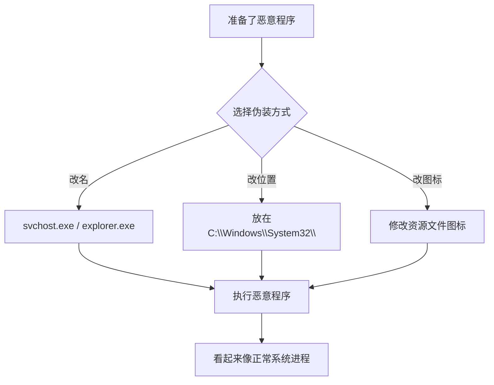

# 伪装 (T1036)

## 一句话通俗理解

> **伪装就是把恶意程序打扮成合法软件** -- 把黑客工具名字改成`svchost.exe`、图标改成PDF图标，让用户和安全软件以为是正常程序。

## 难度等级

- ⭐⭐ 中级（需要一定基础）

操作本身不复杂，但需要了解哪些系统文件不会被安全团队怀疑。

## 技术描述

伪装（Masquerading，T1036）是MITRE ATT&CK框架中防御削弱战术的重要技术。

**通俗解释：**
小偷穿上快递员的制服混进大楼，因为保安只认"穿制服的"不看人。攻击者的恶意程序也一样 -- 改一个合理的名字（`svchost.exe`、`explorer.exe`），放在合理的路径（`C:\Windows\System32`），用合法的数字签名签名，安全产品就以为它是好人。

**技术原理**
伪装基于操作系统的信任规则：

1. **文件名伪装**：将恶意程序命名为常见的系统进程名（`svchost.exe`、`rundll32.exe`）
2. **路径伪装**：将恶意程序放在系统目录中
3. **图标伪装**：修改可执行文件的图标为PDF、Word图标
4. **数字签名伪装**：通过代码签名证书给恶意程序签名，或模仿合法签名
5. **双扩展名**：`document.pdf.exe` -- Windows默认隐藏已知扩展名，用户看到的是`document.pdf`
6. **RLO反转伪装**：使用Unicode右至左覆盖字符使文件名显示异常

**用途与影响：**
伪装是最简单有效的逃逸技术。大多数安全产品依赖进程路径和文件名的白名单规则，伪装后的恶意程序可以绕过这些简单的基于签名的检测规则。

## 子技术列表

**该技术共有 8 个子技术：**

| 子技术ID | 中文名称 | 通俗解释 |
|----------|----------|----------|
| T1036.001 | 进程名伪装 | 把恶意程序改名为系统进程名字 |
| T1036.002 | 路径伪装 | 把恶意程序放在系统目录里 |
| T1036.003 | DLL伪装 | 把恶意DLL命名为系统DLL的名字 |
| T1036.004 | 任务伪装 | 把恶意计划任务命名为系统任务名 |
| T1036.005 | 服务伪装 | 把恶意服务命名为系统服务名 |
| T1036.006 | 双扩展名 | `document.pdf.exe`用户看到的是pdf文件 |
| T1036.007 | 右键菜单伪装 | 把恶意程序伪装成右键菜单项 |
| T1036.008 | 进程伪装 | 使用`CreateProcess`修改进程名称 |

## 攻击流程



## 真实案例

### 案例1：APT10使用进程名伪装（2018-2024年）
- **时间**: 2018-2024年
- **目标**: 全球航空航天、国防、科技公司
- **攻击组织**: APT10（Red Apollo）
- **手法**: APT10使用`svchost.exe`为载荷进行伪装，将恶意服务DLL重命名为`wlbsctrl.dll`并放置在`C:\Windows\System32\`目录下，使用`CreateServiceA`API创建服务，显示名称为"Microsoft Network Security Service"。
- **影响**: APT10被指控影响了全球数百家企业和政府
- **参考**: [MITRE - APT10 G0045](https://attack.mitre.org/groups/G0045/)

### 案例2：Emotet使用双扩展名伪装（2014-2024年）
- **时间**: 2014-2024年
- **目标**: 全球金融机构和政府机构
- **手法**: Emotet使用`document.pdf.exe`、`invoice.xlsx.js`等双扩展名文件命名。Windows默认隐藏已知扩展名，用户看到的是`document.pdf`，实际运行的是exe文件。
- **参考**: [MITRE - Emotet S0367](https://attack.mitre.org/software/S0367/)

### 案例3：Lazarus Group使用Apple Inc.签名伪装（2024年）
- **时间**: 2024年
- **目标**: 全球区块链和加密货币公司
- **攻击组织**: Lazarus Group
- **手法**: Lazarus Group使用通过苹果开发者企业计划获取的合法签名证书，对恶意macOS应用程序进行签名。应用伪装成流行的加密货币管理工具，图标设计模仿合法应用，使用苹果签名的应用程序可以绕过Gatekeeper保护。
- **影响**: 多个加密货币公司遭受数据泄露和资金损失
- **参考**: [CISA - Lazarus Group Advisory](https://www.cisa.gov/news-events/cybersecurity-advisories/aa24-038a)

## 红队视角

> ⚠️ **免责声明**：以下内容仅用于合法的安全测试、渗透测试和教育目的。未经授权对他人系统进行测试是违法行为。

**实战技巧：**
1. 改名是最基础但最有效的方法，但要选择目标系统上真实存在的系统进程
2. 将恶意程序放在`C:\Windows\System32\`会显著降低被怀疑的概率
3. 双扩展名需要配合"隐藏已知文件类型扩展名"设置，该设置在Windows上默认开启

### 常用工具

| 工具名称 | 用途 | 平台 | 链接 |
|----------|------|------|------|
| Resource Hacker | 修改PE文件图标资源 | Windows | [官网](http://www.angusj.com/resourcehacker/) |
| Veil | 躲避AV的payload生成器 | Linux | [GitHub](https://github.com/Veil-Framework/Veil) |

### 注意事项
- 系统进程的路径、文件大小、数字签名都是白名单检查项
- 某些EDR会校验进程的数字签名是否与其路径一致

## 蓝队视角

**防御重点：**
- 监控系统目录中的新文件创建（`C:\Windows\System32\`的新PE文件）
- 配置进程白名单，基于数字签名而非路径和名字
- 启用AppLocker或Windows Defender Application Control

**检测要点：**
- 系统目录中出现非微软签名的PE文件
- 进程名称与路径不匹配（如`C:\Temp\svchost.exe`）
- 常见的系统进程文件大小或版本异常

## 检测建议

### 网络层检测

**检测方法：** 监控异常用户代理字符串、证书信息与系统二进制不匹配的TLS通信

**具体规则/命令示例：**
```bash
# 检测用户代理与系统进程不匹配的HTTP请求
alert tcp $HOME_NET any -> $EXTERNAL_NET any (msg:"Suspicious User-Agent from System Process"; content:"User-Agent|3a|"; pcre:"/Mozilla|curl|wget/H"; classtype:policy-violation; sid:1000034; rev:1;)

# 检测TLS证书与系统二进制不符的通信
alert tcp $HOME_NET any -> $EXTERNAL_NET 443 (msg:"Unusual TLS Certificate for System Binary"; tls_sni; content:!"microsoft.com"; classtype:policy-violation; sid:1000035; rev:1;)
```

### 主机层检测

**检测方法：** 检测从非标准路径执行的常见系统进程、验证进程数字签名完整性

**Windows事件ID：**
- 事件ID 4688：检测从`%TEMP%`、`%APPDATA%`或`%PUBLIC%`启动的伪装系统进程
- Sysmon事件ID 1：监控系统进程（svchost.exe、lsass.exe等）的非标准路径执行
- 事件ID 6281：代码完整性检查失败（检测未签名或签名伪造的进程）

**Linux日志：**
- 日志文件：`/var/log/auth.log`、`/var/log/audit/audit.log`
- 关键字段：`process`、`exe`路径异常

**具体命令示例：**
```powershell
# 检测非系统目录的svchost执行
Get-WinEvent -FilterHashtable @{LogName='Security';ID=4688} | Where-Object {$_.Message -match 'svchost.exe' -and $_.Message -notmatch 'C:\Windows\System32'}
```

### 应用层检测

**Sigma规则示例：**
```yaml
title: Svchost from Non-System Path
status: experimental
description: Detects svchost.exe running from non-standard path
logsource:
    category: process_creation
    product: windows
detection:
    selection:
        Image|endswith: '\svchost.exe'
    filter:
        Image|startswith: 'C:\Windows\System32\'
    condition: selection and not filter
level: high
tags:
    - attack.t1036
```

## 缓解措施

### 优先级1：关键措施

**措施名称：** 应用程序白名单策略

**具体实施步骤：**
1. 启用AppLocker或WDAC实施应用程序白名单
2. 配置仅允许来自签名路径的可执行文件运行
3. 创建规则阻止从`%TEMP%`、`%APPDATA%`等路径启动系统进程

**配置示例：**
```powershell
# 配置AppLocker规则阻止非系统路径启动svchost
New-AppLockerPolicy -RuleType Publisher -User Everyone -Path "C:\Windows\System32\svchost.exe"
```

### 优先级2：重要措施

**措施名称：** 进程数字签名验证

**具体实施步骤：**
1. 启用Windows Defender SmartScreen验证可执行文件来源
2. 配置WDAC（Windows Defender Application Control）强制签名策略
3. 定期扫描并验证系统进程的数字签名状态

**配置示例：**
```powershell
# 验证文件签名
Get-AuthenticodeSignature -FilePath "C:\temp\svchost.exe"
```

### MITRE ATT&CK缓解措施映射

| 缓解措施ID | 缓解措施名称 | 适用性 | 说明 |
|------------|-------------|--------|------|
| M1045 | 软件限制策略 | 适用 | 启用AppLocker或WDAC白名单策略 |
| M1054 | 软件配置 | 适用 | 启用增强的文件扩展名显示 |
| M1047 | 审计 | 适用 | 监控异常进程签名和文件伪装行为 |
## 动手实验

> ⚠️ **重要提示**：所有实验必须在隔离的实验室环境中进行，禁止对未授权的真实系统进行测试。

### 实验1：进程名伪装（初级）
```powershell
# 将notepad.exe复制为svchost.exe
copy C:\Windows\System32\notepad.exe C:\temp\svchost.exe
# 运行
C:\temp\svchost.exe
# 观察任务管理器中的显示
tasklist | findstr svchost
```

### 实验2：双扩展名实验（初级）
```powershell
# 创建一个双扩展名的文件
echo "not malicious" > "document.pdf.exe"
# 在资源管理器中观察显示的文件名
```

### 实验3：签名验证（中级）
```powershell
# 检查文件签名
Get-AuthenticodeSignature C:\Windows\System32\notepad.exe
```

## 术语解释

| 术语 | 英文原名 | 通俗解释 |
|------|----------|----------|
| 伪装 | Masquerading | 通过修改程序名、路径、图标等模仿合法程序 |
| 签名 | Digital Signature | 代码的数字标识，证明发布者的身份 |
| 双扩展名 | Double Extension | 使用双重文件扩展名，利用系统设置隐藏真实扩展名 |

## 参考资料

- [MITRE ATT&CK - T1036 Masquerading](https://attack.mitre.org/techniques/T1036/)
- [MITRE - APT10 G0045](https://attack.mitre.org/groups/G0045/)
- [MITRE - Emotet S0367](https://attack.mitre.org/software/S0367/)
