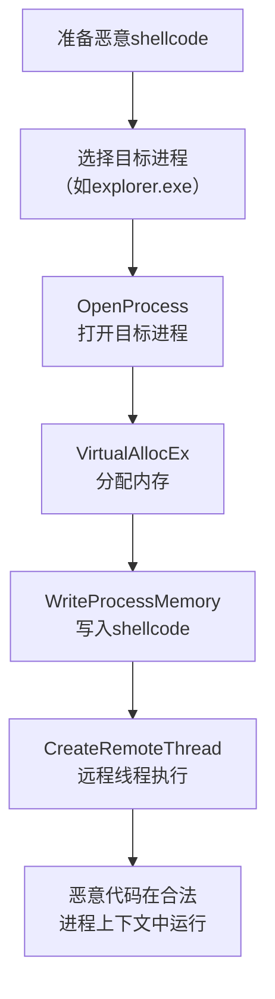

# 进程注入 (T1055)

## 一句话通俗理解

> **进程注入就是让自己的代码借别人的身体运行** -- 把你的话用别人的嘴说出来，别人挨打（被杀毒软件查杀）你也不会受伤。

## 难度等级

- ⭐⭐⭐ 高级（需要较多基础）

需要理解Windows内存管理和进程间通信机制，编程能力要求较高。

## 技术描述

进程注入（Process Injection，T1055）是MITRE ATT&CK框架中防御削弱战术的核心技术。

**通俗解释：**
你写了一张纸条（恶意代码），但不想让人发现是你写的。于是你把纸条塞到另一个人（合法进程，如notepad.exe）的口袋里，让他拿着。警察（杀毒软件）只检查这个人，发现纸条时以为是他的东西，不会查到你。这就是进程注入 -- 让恶意代码在合法进程的"身体"里运行。

**技术原理：**
进程注入的核心是利用操作系统提供的进程间内存管理API，将一个进程的代码写入另一个进程的内存空间并执行：

1. **打开目标进程**：使用`OpenProcess`获取目标进程句柄
2. **在目标进程中分配内存**：使用`VirtualAllocEx`在目标进程空间分配一段内存
3. **写入恶意代码**：使用`WriteProcessMemory`将shellcode或DLL路径写入分配的内存
4. **在目标进程中执行**：使用`CreateRemoteThread`或`SetThreadContext`在目标进程中执行注入的代码

**主要注入类型：**
- **DLL注入**：将恶意DLL加载到目标进程（最经典的方式）
- **代码注入**：直接注入shellcode（不使用DLL方式）
- **反射式DLL注入**：DLL自己把自己加载到目标进程，不依赖系统加载器
- **APC注入**：利用异步过程调用，在目标线程上下文中执行
- **Thread执行劫持**：暂停目标线程，修改其执行上下文后恢复

**用途与影响：**
进程注入是高级恶意软件的标配技术。安全产品通常只扫描进程自身的内存空间，无法检测其他进程内存中运行的恶意代码。注入到合法进程（如`explorer.exe`、`svchost.exe`）后，恶意代码享有目标进程的所有合法权限和网络访问权限。

## 子技术列表

**该技术共有 12 个子技术：**

| 子技术ID | 中文名称 | 通俗解释 |
|----------|----------|----------|
| T1055.001 | DLL注入 | 把恶意DLL加载到目标进程 |
| T1055.002 | 可移植可执行文件注入 | 把完整的PE文件写入目标进程 |
| T1055.003 | 线程执行劫持 | 暂停合法线程，替换为恶意代码再恢复执行 |
| T1055.004 | 异步过程调用 | 利用APC在目标线程中执行恶意代码 |
| T1055.005 | 线程本地存储 | 利用TLS回调在DLL加载时执行代码 |
| T1055.008 | Ptrace系统调用注入 | Linux/macOS上的`ptrace`注入 |
| T1055.009 | 进程空心化 | 创建合法进程后替换其内存为恶意代码 |
| T1055.011 | 额外窗口内存注入 | 利用Explorer的窗口内存存储恶意代码 |
| T1055.012 | 进程伪装 | 创建合法进程后修改参数伪装 |

## 攻击流程



## 真实案例

### 案例1：APT29使用DLL注入和进程空心化（2023-2024年）
- **时间**: 2023-2024年
- **目标**: 全球政府和外交部门
- **攻击组织**: APT29（Cozy Bear）
- **手法**: APT29使用多种进程注入技术，包括DLL注入到svchost.exe和explorer.exe，以及进程空心化技术。攻击者利用受信任的系统进程作为宿主运行恶意代码。
- **参考**: [CISA - APT29 Advisory](https://www.cisa.gov/news-events/cybersecurity-advisories/aa24-038a)

### 案例2：Cobalt Strike使用反射式DLL注入（2012-2024年）
- **时间**: 2012-2024年
- **目标**: 全球企业和政府机构
- **攻击组织**: 广泛使用于红队和APT组织
- **手法**: Cobalt Strike的Beacon载荷广泛使用反射式DLL注入技术，将自身的DLL注入到合法进程中。反射式DLL注入不易被监控到LoadLibrary调用，因此可以绕过基于API hook的检测。
- **参考**: [Mandiant - Cobalt Strike Analysis](https://www.mandiant.com/resources/analyzing-cobalt-strike)

### 案例3：TrickBot使用APC注入（2016-2024年）
- **时间**: 2016-2024年
- **目标**: 全球金融机构
- **攻击组织**: TrickBot
- **手法**: TrickBot广泛使用APC注入在目标进程中执行shellcode，利用NtQueueApcThread将恶意代码注入合法进程中执行。
- **参考**: [MITRE - TrickBot](https://attack.mitre.org/software/S0266/)

### 案例4：LockBit使用进程空心化和APC注入绕过检测（2024年）
- **时间**: 2024年
- **目标**: 全球企业和政府机构
- **攻击组织**: LockBit RaaS
- **手法**: LockBit在部署勒索软件前使用进程空心化技术运行loader payload。loader创建合法的notepad.exe或WerFault.exe（向该进程发送错误报告）进程后，利用NtUnmapViewOfSection卸载原始进程内存，再将勒索软件payload写入进程内存空间，最终通过APC注入恢复执行。这种利用微软错误报告进程的合法操作混淆监控与安全分析师。
- **影响**: LockBit是2022-2024年最活跃的勒索软件即服务
- **参考链接**: [CISA - LockBit Advisory](https://www.cisa.gov/news-events/cybersecurity-advisories/aa24-131a)

## 红队视角

> ⚠️ **免责声明**：以下内容仅用于合法的安全测试、渗透测试和教育目的。未经授权对他人系统进行测试是违法行为。

**实战技巧：**
1. 选择目标进程时，考虑那些通常不加载外部DLL的系统进程，流量更自然
2. 进程空心化比DLL注入更隐蔽，因为没有新DLL加载的痕迹
3. APC注入不需要创建新线程，隐蔽性更高

### 常用工具

| 工具名称 | 用途 | 平台 | 链接 |
|----------|------|------|------|
| Cobalt Strike | 后渗透框架，支持多种注入 | 跨平台 | [官网](https://www.cobaltstrike.com/) |
| Metasploit | 渗透框架，反射式DLL注入 | 跨平台 | [GitHub](https://github.com/rapid7/metasploit-framework) |
| Process Hacker | 进程管理查看工具 | Windows | [GitHub](https://github.com/processhacker/processhacker) |

### 注意事项
- 进程注入会产生明显的API调用模式（OpenProcess + VirtualAllocEx + WriteProcessMemory + CreateRemoteThread）
- 某些EDR会Hook关键API（NtOpenProcess、NtCreateThreadEx）
- x64系统上注入x86进程需要注意Wow64相关限制

## 蓝队视角

**检测要点：**
- 异常的API调用序列（OpenProcess + VirtualAllocEx + WriteProcessMemory + CreateRemoteThread）
- 进程创建后立即注入（如创建notepad.exe后马上注入代码）
- 目标进程的内存异常增长（使用VAD分析）

**防御重点：**
- 启用Sysmon监控进程创建和远程线程创建事件
- 配置Windows Defender漏洞防护（CFG、ACG）
- 监控异常的目标进程选择（如系统进程被非管理员进程打开）

## 检测建议

### 网络层检测

**检测方法：** 监控被注入进程的异常出站连接行为

**具体规则/命令示例：**
```bash
# 检测被注入的svchost或lsass进程发起异常C2通信
alert tcp $HOME_NET any -> $EXTERNAL_NET any (msg:"Potential Process Injection - C2 from System Process"; flow:to_server; content:"GET /"; http_method; classtype:trojan-activity; sid:1000036; rev:1;)

# Zeek检测非标准端口上来自系统进程的TLS握手
alert tcp $HOME_NET any -> $EXTERNAL_NET !443 (msg:"Unusual TLS from System Process"; tls_sni; content:!"windowsupdate"; classtype:policy-violation; sid:1000037; rev:1;)
```

### 主机层检测

**检测方法：** 监控远程线程创建、跨进程内存访问和异常内存分配

**Windows事件ID：**
- Sysmon事件ID 8（CreateRemoteThread）：检测远程线程创建
- Sysmon事件ID 10（ProcessAccess）：检测对敏感进程的异常访问
- Sysmon事件ID 25（ProcessTampering）：检测进程篡改（Herpaderping等）
- 事件ID 4688：监控被注入后启动的子进程

**Linux日志：**
- 日志文件：`/var/log/audit/audit.log`
- 关键字段：`ptrace`系统调用、`process_vm_writev`异常使用

**具体命令示例：**
```powershell
# 检测远程线程创建到敏感进程
Get-WinEvent -FilterHashtable @{LogName='Microsoft-Windows-Sysmon/Operational';ID=8} | Where-Object {$_.Message -match 'lsass.exe|winlogon.exe|svchost.exe'}
```

### 应用层检测

**Sigma规则示例：**
```yaml
title: Suspicious Remote Thread Created
status: experimental
description: Detects creation of remote threads in sensitive processes
logsource:
    category: create_remote_thread
    product: windows
detection:
    selection:
        EventID: 8
        TargetImage|endswith:
            - '\lsass.exe'
            - '\winlogon.exe'
            - '\svchost.exe'
    condition: selection
level: high
tags:
    - attack.t1055
```

## 缓解措施

### 优先级1：关键措施

**措施名称：** 启用Windows Defender漏洞防护

**具体实施步骤：**
1. 启用控制流保护（CFG）阻止非法控制流转移
2. 启用任意代码防护（ACG）阻止动态代码修改
3. 启用受保护进程（PPL）保护关键进程（LSASS等）

**配置示例：**
```powershell
# 启用Windows Defender Exploit Guard
Set-ProcessMitigation -System -Enable CFG, ACG
```

### 优先级2：重要措施

**措施名称：** 配置ASR规则阻止进程注入

**具体实施步骤：**
1. 启用ASR规则"阻止Office创建子进程"
2. 启用ASR规则"阻止从电子邮件客户端和Webmail中下载的可执行内容"
3. 启用ASR规则"阻止Win32 API调用从Office宏"

**配置示例：**
```powershell
# 部署ASR规则
Add-MpPreference -AttackSurfaceReductionRules_Ids "26190899-1602-49e8-8b27-eb1d0a1ce869" -AttackSurfaceReductionRules_Actions Enabled
```

### MITRE ATT&CK缓解措施映射

| 缓解措施ID | 缓解措施名称 | 适用性 | 说明 |
|------------|-------------|--------|------|
| M1040 | 防篡改 | 适用 | 启用Windows Defender漏洞防护（CFG、ACG） |
| M1045 | 软件限制策略 | 适用 | 启用PPL保护关键进程 |
| M1038 | 执行防护 | 适用 | 配置ASR规则阻止Office创建子进程 |
## 动手实验

> ⚠️ **重要提示**：所有实验必须在隔离的实验室环境中进行，禁止对未授权的真实系统进行测试。

### 实验1：C++创建远程线程注入DLL（高级）
```cpp
#include <windows.h>
#include <tlhelp32.h>

int main() {
    // 1. 打开目标进程
    HANDLE hProcess = OpenProcess(PROCESS_ALL_ACCESS, FALSE, <PID>);
    // 2. 分配内存并写入DLL路径
    LPVOID pRemoteMemory = VirtualAllocEx(hProcess, NULL, 256,
        MEM_COMMIT, PAGE_READWRITE);
    WriteProcessMemory(hProcess, pRemoteMemory, "malicious.dll", 14, NULL);
    // 3. 在目标进程中创建远程线程加载DLL
    LPTHREAD_START_ROUTINE pLoadLibrary = (LPTHREAD_START_ROUTINE)
        GetProcAddress(GetModuleHandle("kernel32.dll"), "LoadLibraryA");
    CreateRemoteThread(hProcess, NULL, 0, pLoadLibrary, pRemoteMemory, 0, NULL);
    return 0;
}
```

### 实验2：使用Sysmon监控进程注入（中级）

### 实验3：分析内存中的恶意代码（高级）

## 术语解释

| 术语 | 英文原名 | 通俗解释 |
|------|----------|----------|
| 进程注入 | Process Injection | 将恶意代码写入其他进程内存并执行的技术 |
| 进程空心化 | Process Hollowing | 创建合法进程后卸载其内存并替换为恶意代码 |
| DLL注入 | DLL Injection | 强制目标进程加载恶意DLL |
| APC注入 | APC Injection | 利用异步过程调用在目标线程中执行代码 |

## 参考资料

- [MITRE ATT&CK - T1055 Process Injection](https://attack.mitre.org/techniques/T1055/)
- [CISA - LockBit Advisory (2024)](https://www.cisa.gov/news-events/cybersecurity-advisories/aa24-131a)
- [CISA - APT29 Advisory](https://www.cisa.gov/news-events/cybersecurity-advisories/aa24-038a)
