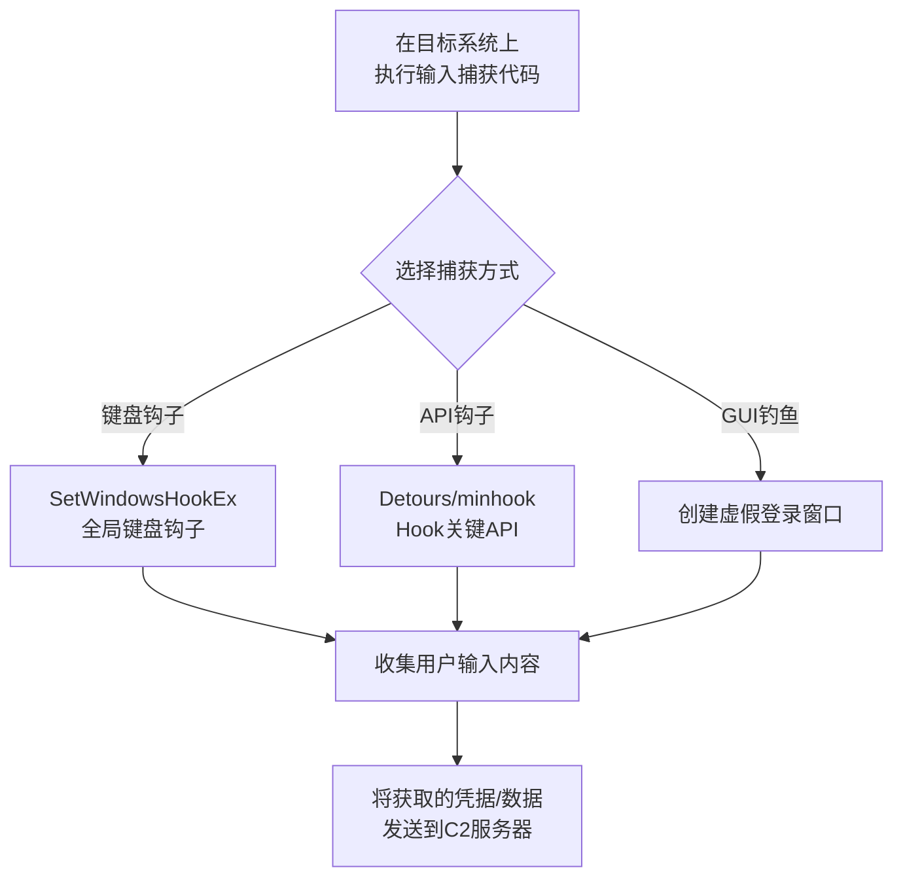

# 输入捕获 (T1056)

## 一句话通俗理解

> **输入捕获就是在门口装个针孔摄像头** -- 不偷你的保险柜，而是看你输密码时按了什么键。

## 难度等级

- ⭐⭐ 中级（需要一定基础）

部分子技术（API钩子）需要开发基础，但Web钓鱼等不需要。

## 技术描述

输入捕获（Input Capture，T1056）是MITRE ATT&CK框架中防御削弱战术的重要技术。

**通俗解释：**
小偷不直接砸你保险箱，而是在门口装了一个针孔摄像头，拍下你输密码的动作。攻击者的输入捕获也一样 -- 在操作系统层面安装一个"摄像头"，记录用户的键盘输入、鼠标点击和屏幕显示内容。

**技术原理：**
输入捕获的主要方式包括：

1. **键盘记录**：安装全局键盘钩子（`SetWindowsHookEx`），或使用应用层钩子（Detours/minhook）监控关键API
2. **屏幕捕获**：使用`GetForegroundWindow`和`PrintWindow`API捕获活动窗口内容
3. **GUI输入捕获**：创建虚假的登录窗口覆盖在真实窗口上
4. **Web表单劫持**：在浏览器中注入JavaScript捕获表单输入
5. **凭据API钩子**：Hook关键API（如`CredReadW`、`CryptUnprotectData`）捕获凭据

**用途与影响：**
输入捕获广泛用于凭据获取。键盘记录器可以捕获用户输入的密码、信用卡号、验证码等敏感信息。屏幕捕获可以获取传验证码、聊天记录等动态内容。输入捕获通常是凭据访问战术的前置技术。

## 子技术列表

**该技术共有 5 个子技术：**

| 子技术ID | 中文名称 | 通俗解释 |
|----------|----------|----------|
| T1056.001 | 键盘记录 | 记录用户按下了哪些键 |
| T1056.002 | GUI输入捕获 | 创建虚假的登录界面骗取密码 |
| T1056.003 | Web门户捕获 | 在Web登录界面拦截密码输入 |
| T1056.004 | 凭据API钩子 | Hook系统API读取内存中的凭据 |
| T1056.005 | 文本捕获 | 记录用户在应用窗口中输入的文本 |

## 攻击流程



## 真实案例

### 案例1：Raccoon Stealer使用键盘记录功能（2024年）
- **时间**: 2024年
- **目标**: 全球个人用户和企业用户
- **攻击组织**: Raccoon Stealer信息窃取木马
- **手法**: Raccoon Stealer内置键盘记录功能，使用SetWindowsHookEx设置全局键盘钩子，记录用户在浏览器和应用程序中输入的所有内容。捕获的数据包括密码、信用卡信息、加密货币钱包地址等。
- **影响**: Raccoon Stealer在全球范围内感染超过5000万台设备
- **参考**: [MITRE - Raccoon Stealer](https://attack.mitre.org/software/S0584/)

### 案例2：APT28使用GUI输入捕获（Web登录页面克隆）（2016-2024年）
- **时间**: 2016-2024年
- **目标**: 全球政府和军事目标
- **攻击组织**: APT28（Fancy Bear）
- **手法**: APT28使用Web门户捕获技术，创建与合法登录页面完全一致的克隆页面，通过鱼叉钓鱼邮件将用户引导至克隆页面，捕获用户输入的凭据。
- **参考**: [MITRE - APT28 G0007](https://attack.mitre.org/groups/G0007/)

### 案例3：Vidar Stealer捕获屏幕截图（2023-2024年）
- **时间**: 2023-2024年
- **目标**: 全球个人用户
- **手法**: Vidar信息窃取木马包含屏幕捕获功能，定期截取当前活动窗口的截图并发送到C2服务器。
- **参考**: [Malwarebytes - Vidar Stealer](https://www.malwarebytes.com/blog/threats/vidar-stealer)

## 红队视角

> ⚠️ **免责声明**：以下内容仅用于合法的安全测试、渗透测试和教育目的。未经授权对他人系统进行测试是违法行为。

**实战技巧：**
1. 键盘钩子是最直接的输入捕获方式，但安全性软件通常会监控`SetWindowsHookEx`
2. 屏幕捕获需要控制采集频率，避免产生大量流量或触发用户感知
3. GUI输入捕获（Credential UI劫持）隐蔽性更高

### 常用工具

| 工具名称 | 用途 | 平台 | 链接 |
|----------|------|------|------|
| Metasploit | 键盘记录模块 | 跨平台 | [GitHub](https://github.com/rapid7/metasploit-framework) |
| Cobalt Strike | 键盘记录功能 | 跨平台 | [官网](https://www.cobaltstrike.com/) |
| minhook | API钩子库 | Windows | [GitHub](https://github.com/TsudaKageyu/minhook) |

### 注意事项
- 键盘钩子会影响系统性能，过度使用可能被用户发现
- 屏幕截图捕获可能需要大量存储空间
- Web键盘记录器与浏览器的同源策略有关联

## 蓝队视角

**检测要点：**
- 检测异常的`SetWindowsHookEx`调用（尤其是全局钩子）
- 监控`WH_KEYBOARD_LL`和`WH_MOUSE_LL`低层钩子
- 使用ETW监控API调用

**防御重点：**
- 启用Windows Defender ASR规则阻止键盘记录相关行为
- 部署应用白名单限制钩子安装
- 使用行为检测工具分析系统API调用

## 检测建议

### 网络层检测

**检测方法：** 监控键盘记录数据的网外传输流量

**具体规则/命令示例：**
```bash
# 检测小包高频出站流量（键盘记录数据外传特征）
alert tcp $HOME_NET any -> $EXTERNAL_NET any (msg:"Keylogger Data Exfiltration - Small Packets"; flow:to_server; dsize:<100; flags:A; detection_filter:track by_dst, count 20, seconds 60; classtype:trojan-activity; sid:1000038; rev:1;)

# 检测DNS隧道类键盘记录数据外传
alert udp $HOME_NET any -> $EXTERNAL_NET 53 (msg:"DNS Tunneling for Keylogger Data"; content:"|00 00 01 00 00 01|"; offset:2; depth:6; classtype:policy-violation; sid:1000039; rev:1;)
```

### 主机层检测

**检测方法：** 监控全局键盘钩子安装、Windows消息拦截和输入API的Hook

**Windows事件ID：**
- Sysmon事件ID 10（ProcessAccess）：检测对敏感进程的访问（SetWindowsHookEx）
- 事件ID 4688：检测键盘记录工具的进程创建
- 事件ID 4673：检测LoadLibrary或SetWindowsHookEx等敏感API的特权调用

**Linux日志：**
- 日志文件：`/var/log/messages`
- 关键字段：`keylogger`特征模块加载、`xinput`异常使用

**具体命令示例：**
```powershell
# 检测SetWindowsHookEx API调用
Get-WinEvent -FilterHashtable @{LogName='Microsoft-Windows-Sysmon/Operational';ID=10} | Where-Object {$_.Message -match 'SetWindowsHookEx'}
```

### 应用层检测

**Sigma规则示例：**
```yaml
title: Suspicious Keyboard Hook Installation
status: experimental
description: Detects installation of global keyboard hooks from non-standard locations
logsource:
    category: process_access
    product: windows
detection:
    selection:
        EventID: 10
        CallTrace|contains:
            - 'SetWindowsHookEx'
            - 'GetMessage'
    condition: selection
level: high
tags:
    - attack.t1056
```

## 缓解措施

### 优先级1：关键措施

**措施名称：** 启用Windows Defender防篡改保护

**具体实施步骤：**
1. 启用Windows Defender Tamper Protection防止安全配置被修改
2. 启用受保护的进程（PPL）保护关键进程免受钩子注入
3. 启用Windows Defender Credential Guard保护认证凭据

**配置示例：**
```powershell
# 启用Tamper Protection
Set-MpPreference -DisableTamperProtection $false
```

### 优先级2：重要措施

**措施名称：** 限制键盘钩子和输入捕获

**具体实施步骤：**
1. 使用AppLocker限制键盘钩子DLL的加载来源
2. 配置仅允许签名驱动安装全局钩子
3. 限制管理员权限减少钩子安装风险

**配置示例：**
```powershell
# 限制全局钩子安装的注册表配置
reg add "HKLM\SOFTWARE\Microsoft\Windows\CurrentVersion\Policies\System" /v "EnableLUA" /t REG_DWORD /d 1 /f
```

### MITRE ATT&CK缓解措施映射

| 缓解措施ID | 缓解措施名称 | 适用性 | 说明 |
|------------|-------------|--------|------|
| M1040 | 防篡改 | 适用 | 启用Windows Defender防篡改保护 |
| M1045 | 软件限制策略 | 适用 | 限制键盘钩子DLL的加载来源 |
| M1026 | 特权账户管理 | 适用 | 限制管理员权限减少钩子安装风险 |
## 动手实验

> ⚠️ **重要提示**：所有实验必须在隔离的实验室环境中进行，禁止对未授权的真实系统进行测试。

### 实验1：C#键盘记录器（初级）
```csharp
// 使用SetWindowsHookEx设置键盘钩子
[DllImport("user32.dll")]
private static extern IntPtr SetWindowsHookEx(
    int idHook, LowLevelKeyboardProc lpfn,
    IntPtr hMod, uint dwThreadId);

private static IntPtr HookCallback(int nCode, IntPtr wParam, IntPtr lParam) {
    // 处理按键事件
    return CallNextHookEx(_hookId, nCode, wParam, lParam);
}
```

### 实验2：检测键盘钩子（中级）

## 术语解释

| 术语 | 英文原名 | 通俗解释 |
|------|----------|----------|
| 钩子 | Hook | 拦截和处理特定事件的机制 |
| 键盘记录器 | Keylogger | 记录用户键盘输入的程序 |
| GUI输入捕获 | GUI Input Capture | 通过伪造界面捕获用户输入 |

## 参考资料

- [MITRE ATT&CK - T1056 Input Capture](https://attack.mitre.org/techniques/T1056/)
- [MITRE - Raccoon Stealer S0584](https://attack.mitre.org/software/S0584/)
- [MITRE - APT28 G0007](https://attack.mitre.org/groups/G0007/)
