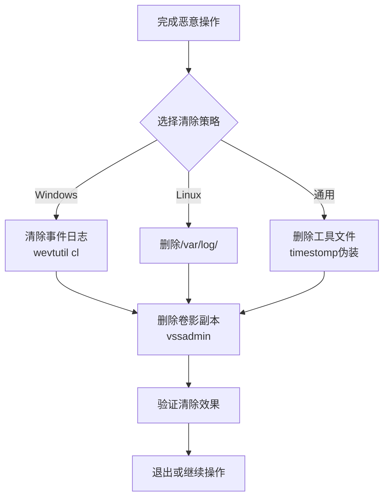

# 清除痕迹 (T1070)

## 一句话通俗理解

> **清除痕迹就是删掉监控录像和进出记录** -- 偷完东西之后把摄像头录像删了、把指纹擦了、把门禁记录清了，让警察找不到证据。

## 30秒速查卡

| 维度 | 你需要知道的 |
|------|-------------|
| 这是什么？ | 攻击者通过清除事件日志、删除文件、篡改时间戳来消除入侵证据，让安全团队无法追溯攻击路径 |
| 为什么危险？ | 成功的痕迹清除让安全团队无法还原入侵路径，延长攻击者驻留时间，增加取证难度，甚至导致完全无法发现入侵 |
| 谁需要关心？ | SOC分析师、取证调查员、系统管理员、任何负责安全事件响应的安全人员 |
| 你的第一步防御 | 将日志实时转发到外部SIEM或不可变存储，确保攻击者无法删除已收集的日志 |
| 如果只做一件事 | 对事件ID 1102（安全日志被清除）设置即时告警，这是攻击者清理痕迹的最高优先级操作 |

## 难度等级

- ⭐⭐ 中级（需要一定基础）

操作不复杂，但需要了解不同日志系统的存储位置和清除方法。

## 前置知识检查

**读这个文件需要什么？**

- [ ] 系统日志（System Logs）：操作系统记录所有事件（登录、程序执行）的日记本，攻击者要删的就是这个
- [ ] 取证痕迹（Forensic Evidence）：入侵者在系统上留下的各种"指纹"，如文件创建时间、Prefetch文件、USN Journal等
- [ ] 文件系统（File System）：操作系统用来组织和管理文件的"目录系统"，了解文件创建、修改、删除的基本概念

## 技术描述

清除痕迹（Indicator Removal，T1070）是MITRE ATT&CK框架中防御削弱战术的重要技术。

> 📚 **打个比方**：就像小偷在作案后擦掉指纹、删掉监控录像、清理掉鞋印——清除痕迹就是攻击者在完成恶意操作后，删除系统日志、清除命令历史、抹去时间戳，让安全团队无法追溯入侵过程和来源。

**通俗解释：**
小偷偷完东西会擦掉指纹、删掉监控录像。攻击者也是一样 -- 在完成恶意操作后消除入侵证据，清除各种系统日志、删除上传的工具文件、修改文件时间戳等，让安全团队无法追溯入侵过程。

**过渡段：** 上面的比喻直观地说明了痕迹清除的核心目的。现在从技术层面看：攻击者清除痕迹的手段远不止删日志——他们需要清除Windows事件日志、删除命令历史、篡改文件时间戳（timestomp）、删除卷影副本（vssadmin），甚至要处理清除操作本身产生的新日志（如事件ID 1102）。不同操作系统、不同攻击场景下，清除目标的选择和操作顺序各不相同。只有理解这些技术细节，才能制定有效的检测和防御策略。

**技术原理：**
攻击者从多个维度清除痕迹：

1. **事件日志清除**：使用`wevtutil cl`清除Windows安全/系统/应用日志，或删除Linux的`/var/log/`文件
2. **文件删除**：删除攻击者上传的工具、脚本、临时文件，使用覆写删除防止恢复
3. **时间戳篡改（Timestomp）**：修改文件的创建/修改/访问时间，伪装成系统文件
4. **命令历史清除**：删除PowerShell历史、bash_history等
5. **卷影副本删除**：使用`vssadmin delete shadows`删除系统恢复点

**用途与影响：**
清除痕迹是攻击链中"收尾"的关键步骤。成功的痕迹清除可以显著延长攻击者的驻留时间，让安全团队无法完整还原攻击路径，影响后续的取证和修复工作。

## 子技术列表

**该技术共有 10 个子技术：**

| 子技术ID | 中文名称 | 通俗解释 |
|----------|----------|----------|
| T1070.001 | 清除Windows事件日志 | 使用`wevtutil cl`清除安全/系统日志 |
| T1070.002 | 清除Linux/Mac系统日志 | 删除`/var/log/`下的日志文件 |
| T1070.003 | 清除命令历史 | 删除`.bash_history`、PowerShell历史等 |
| T1070.004 | 文件删除 | 删除攻击者上传的工具和临时文件 |
| T1070.005 | 删除网络共享连接 | 清除`net use`的连接记录 |
| T1070.006 | 时间戳篡改 | 修改文件的创建/修改时间，伪装成正常文件 |
| T1070.007 | 清除网络连接历史 | 清除ARP缓存、DNS缓存等 |
| T1070.008 | 删除邮件账户异常记录 | 删除邮件转发规则和安全告警邮件 |
| T1070.009 | 清除持久化记录 | 删除计划任务历史和启动项备份 |
| T1070.010 | 清除系统痕迹 | 清除Prefetch、USN Journal、Jump List等取证痕迹 |

## 攻击流程

### 典型攻击流程

```
完成恶意操作 --> 选择清除目标 --> 执行清除 --> 验证清除效果
```



**步骤详解：**

1. **完成恶意操作后执行清除**
   - 每个操作阶段完成后立即清除痕迹，而非最后一起清
   - 优先清除安全日志（Security Log），因为包含最多入侵证据
   - 使用覆写删除（`cipher /w`）防止文件恢复

2. **验证清除效果并处理清除本身的日志**
   - 清除操作本身也会产生日志（如事件ID 1102），需要一并处理
   - 确认日志中无恶意操作记录

## 真实案例

### 案例1：Akira勒索软件清除日志和卷影副本（2024-2025年）

- **时间**: 2024-2025年
- **目标**: 全球医疗、教育、制造行业
- **攻击组织**: Akira勒索软件
- **手法**: Akira在加密文件前执行大规模痕迹清除操作。使用`vssadmin delete shadows /all /quiet`删除所有卷影副本，使用`wevtutil cl Security && wevtutil cl System && wevtutil cl Application`清除三大系统日志，使用`bcdedit /set {default} recoveryenabled no`禁用系统恢复功能。确保即使支付赎金后，安全团队也难以分析入侵路径。
- **影响**: 受害企业无法恢复被加密文件，安全团队无法追溯攻击路径
- **参考链接**: [CISA - Akira Ransomware Advisory](https://www.cisa.gov/news-events/cybersecurity-advisories/aa24-131a)

### 案例2：Scattered Spider清除云环境日志（2024年）

- **时间**: 2024年
- **目标**: 大型企业和SaaS平台
- **攻击组织**: Scattered Spider
- **手法**: Scattered Spider在入侵云环境后，删除Azure AD登录和审核日志，禁用Microsoft 365审计日志保留策略，删除邮箱中的安全告警通知邮件。在AWS环境中，攻击者删除CloudTrail日志和VPC Flow Logs，使安全团队无法追溯数据外泄路径。
- **影响**: 云环境中的横向移动和数据外泄无法被追溯
- **参考链接**: [CrowdStrike - Scattered Spider](https://www.crowdstrike.com/blog/scattered-spider-attack-analysis/)

### 案例3：Lazarus Group使用timestomp隐藏恶意文件（2014-2024年）

- **时间**: 2014-2024年
- **目标**: 全球金融机构、加密货币交易所
- **攻击组织**: Lazarus Group
- **手法**: Lazarus广泛使用时间戳篡改（timestomp）技术，将恶意文件的时间戳修改为与合法系统文件一致，使基于时间的取证分析失效。
- **影响**: 恶意文件混在系统文件中难以被发现
- **参考链接**: [MITRE - Lazarus G0032](https://attack.mitre.org/groups/G0032/)

### 案例4：NotPetya擦除日志和MBR（2017年）

- **时间**: 2017年
- **目标**: 乌克兰政府、银行、能源企业
- **攻击组织**: NotPetya
- **手法**: NotPetya在加密前执行大规模日志清理，覆写MBR并删除卷影副本，使系统恢复和取证分析变得极为困难。
- **影响**: 攻击无法被溯源的"完美"网络武器
- **参考链接**: [MITRE - NotPetya S0368](https://attack.mitre.org/software/S0368/)

## 红队视角

> ⚠️ **免责声明**：以下内容仅用于合法的安全测试、渗透测试和教育目的。未经授权对他人系统进行测试是违法行为。

### 实战技巧

1. **分阶段清除**：每个操作阶段完成后立即清除痕迹，不要等到最后一起清
2. **优先清除安全日志**：Security Log包含最多入侵证据
3. **覆写删除**：使用`cipher /w`防止文件恢复工具找回已删除的工具
4. **清除清除本身的日志**：清除操作本身会产生日志（事件ID 1102），需要一并处理

### 常用工具

| 工具名称 | 用途 | 平台 | 链接 |
|----------|------|------|------|
| wevtutil | Windows事件日志管理工具 | Windows | 系统自带 |
| timestomp | 文件时间戳修改工具 | Windows | Metasploit内置 |
| cipher | 覆写删除工具 | Windows | 系统自带 |
| shred | Linux安全删除工具 | Linux | 系统自带 |
| Clear-EventLog | PowerShell日志清除命令 | Windows | 系统自带 |

### 注意事项

- 如果目标使用了外部SIEM或日志转发，仅清除本地日志不够
- 清除日志本身是一个强烈的IoC（入侵指标）
- Windows事件ID 1102（安全日志被清除）本身就是一个重要安全事件

## 蓝队视角

### 检测要点

1. **日志清除检测**
   - 日志来源：Windows事件ID 1102、104
   - 关注字段：清除时间、执行用户
   - 异常特征：安全日志被非预期清除

2. **文件批量删除检测**
   - 日志来源：Sysmon事件ID 23
   - 关注字段：删除文件路径、文件类型
   - 异常特征：短时间内大量文件被删除

### 监控建议

- 日志转发到外部SIEM是对抗日志清除的最有效手段
- 不可变日志存储（Immutable Logging）让攻击者无法删除已收集的日志
- 实时告警日志清除操作（事件ID 1102、104）

## 检测建议

### 网络层检测

**检测方法：** 监控日志清除前后的网络流量突变，以及在清除事件日志前通过加密通道大量传输数据的异常行为。

**具体规则/命令示例：**
```
# 检测日志清除前的异常数据外传
zeek -r traffic.pcap | awk '{print $1, $6}' | sort | uniq -c | awk '$1 > 100' 

# 检测日志服务停止后的流量静默
suricata -r traffic.pcap --rule "alert tcp $HOME_NET any -> $EXTERNAL_NET $HTTP_PORTS (msg:\"Post Log-Clear Data Exfil\"; flow:to_server; sid:1000031;)"
```

### 主机层检测

**Windows事件ID：**
- 事件ID 1102：安全日志被清除
- 事件ID 104：事件日志文件被删除
- Sysmon事件ID 23：文件删除
- Sysmon事件ID 2：文件时间戳修改

**具体命令示例：**
```powershell
# 检测日志清除事件
Get-WinEvent -FilterHashtable @{LogName='Security'; ID=1102} | Select-Object TimeCreated, Message

# 检测卷影副本删除
Get-WinEvent -FilterHashtable @{LogName='System'} | Where-Object {$_.Message -like "*vssadmin*"}
```

### Sigma规则示例：
```yaml
title: Security Log Cleared
status: experimental
description: Detects when the Windows Security event log is cleared
logsource:
    category: security
    product: windows
detection:
    selection:
        EventID: 1102
    condition: selection
level: high
tags:
    - attack.t1070
```

## 缓解措施

### 优先级1：关键措施
配置Windows Event Forwarding到外部SIEM，实施不可变日志存储。

### 优先级2：重要措施
启用审计策略监控日志清除和文件删除操作，配置日志大小策略防止日志被覆盖。

### 优先级3：建议措施
监控并限制`wevtutil`、`vssadmin`等工具的使用权限。

### MITRE ATT&CK缓解措施映射

| 缓解措施ID | 缓解措施名称 | 适用性 | 说明 |
|------------|-------------|--------|------|
| M1047 | 审计 | 适用 | 监控日志清除事件 |
| M1029 | 远程访问配置 | 部分适用 | 限制远程日志访问 |
| M1026 | 特权账户管理 | 适用 | 限制日志清除权限 |

## 动手实验

> ⚠️ **重要提示**：所有实验必须在隔离的实验室环境中进行，禁止对未授权的真实系统进行测试。

### 实验环境准备
- Windows 10/11虚拟机，管理员权限

### 实验1：查看和清除日志（初级）
```powershell
# 查看最近5条安全日志
wevtutil qe Security /c:5 /f:text
# 清除安全日志（会产生事件ID 1102）
wevtutil cl Security
```

### 实验2：时间戳篡改实验（中级）
```powershell
# 查看文件时间戳
Get-Item C:\Windows\notepad.exe | Select-Object CreationTime, LastWriteTime
# 修改文件时间戳（使用PowerShell）
(Get-Item test.txt).CreationTime = (Get-Date "01/01/2020")
```

### 实验3：配置日志转发监控（高级）
配置Windows Event Forwarding将安全日志发送到中央收集器。

## 术语解释

| 术语 | 英文原名 | 通俗解释 |
|------|----------|----------|
| IoC | Indicator of Compromise | 入侵指标，表明系统被入侵的证据 |
| SIEM | Security Information and Event Management | 安全信息与事件管理平台 |
| Timestomp | Timestomp | 修改文件时间戳的技术 |
| WORM | Write Once Read Many | 一次写入多次读取，不可变存储技术 |
| USN Journal | Update Sequence Number Journal | NTFS文件系统的变更日志 |

## 参考资料

- 📚 [MITRE ATT&CK - T1070 Indicator Removal](https://attack.mitre.org/techniques/T1070/) - 深入了解技术细节
- 📰 [CISA - Akira Ransomware Advisory (2024)](https://www.cisa.gov/news-events/cybersecurity-advisories/aa24-131a) - 真实攻击案例
- 📰 [CrowdStrike - Scattered Spider Analysis](https://www.crowdstrike.com/blog/scattered-spider-attack-analysis/) - 真实攻击案例
