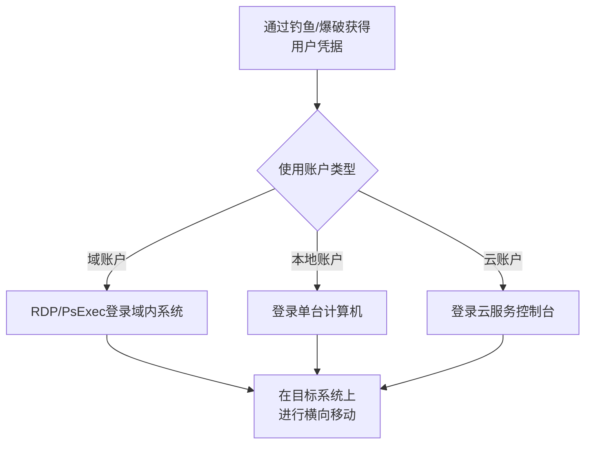

# 有效账户 (T1078)

## 一句话通俗理解

> **有效账户就是用合法钥匙开门** -- 使用偷来的门禁卡通过正门进入大楼，而不是撬锁翻窗。

## 难度等级

- ⭐ 初级（零基础可理解）

概念简单，但实战中获得有效账户需要前序技术配合。

## 技术描述

有效账户（Valid Accounts，T1078）是MITRE ATT&CK框架中防御削弱战术的重要技术。

**通俗解释：**
小偷用偷来的保安卡通过正门进大楼。攻击者也是一样 -- 使用窃取的用户名和密码登录系统，这是最简单、最难检测的攻击方式。因为从系统角度来看，登录的是一个合法用户，没有任何异常。

**技术原理：**
有效账户攻击利用的是身份认证系统本身的信任：

1. **本地账户**：使用窃取的本地管理员密码登录系统
2. **域账户**：使用窃取的域用户凭据登录域内系统
3. **云账户**：使用窃取的云服务凭据（AWS IAM用户、Azure AD账号）
4. **默认账户**：使用系统默认账户（Guest、Administrator）

**用途与影响：**
有效账户是攻击者的理想选择，因为使用合法凭据进行访问不会触发大多数安全告警。攻击者在获得有效账户后可进行横向移动、持久化、数据窃取等操作。

## 子技术列表

**该技术共有 4 个子技术：**

| 子技术ID | 中文名称 | 通俗解释 |
|----------|----------|----------|
| T1078.001 | 默认账户 | 使用系统默认的Guest、Administrator账户 |
| T1078.002 | 域账户 | 使用窃取的域用户凭据登录域内系统 |
| T1078.003 | 本地账户 | 使用窃取的本地管理员密码登录 |
| T1078.004 | 云账户 | 使用窃取的云服务凭据 |

## 攻击流程



## 真实案例

### 案例1：Scattered Spider利用云账户访问SaaS平台（2024年）
- **时间**: 2024年
- **目标**: 大型云服务提供商和SaaS平台
- **攻击组织**: Scattered Spider
- **手法**: Scattered Spider使用前期通过凭证窃取获得的云服务账户（如AWS IAM用户、Azure AD企业应用账户）访问云资源。
- **参考**: [CrowdStrike - Scattered Spider](https://www.crowdstrike.com/blog/scattered-spider-attack-analysis/)

### 案例2：CLOP勒索软件利用有效账户访问（2020-2024年）
- **时间**: 2020-2024年
- **目标**: 全球大型企业
- **攻击组织**: CLOP
- **手法**: CLOP利用购买的合法凭据登录目标的VPN网关和RDP门户，获得初始访问权限。
- **参考**: [CISA - CLOP Advisory](https://www.cisa.gov/news-events/cybersecurity-advisories/aa24-038a)

### 案例3：APT29使用合法凭据访问云环境（2020-2024年）
- **时间**: 2020-2024年
- **目标**: 全球政府和科技公司
- **攻击组织**: APT29（Cozy Bear）
- **手法**: APT29利用有效账户访问云环境，使用合法凭据登录Azure AD和Microsoft 365。
- **参考**: [CISA - APT29 Advisory](https://www.cisa.gov/news-events/cybersecurity-advisories/aa24-038a)

### 案例4：针对Microsoft 365的凭证窃取攻击（2024-2025年）
- **时间**: 2024-2025年
- **目标**: 全球大规模Microsoft 365企业用户
- **攻击组织**: 多个APT组织
- **手法**: 攻击者通过凭证窃取获得Microsoft 365用户凭据后登录账户。攻击者利用用户的有效凭据（尤其是拥有高权限的账户）访问云应用、企业邮件和SharePoint等资源。攻击者利用合法的OAuth应用程序权限进行横向移动和数据窃取。
- **影响**: 多个企业机密邮件和文档被窃取
- **参考链接**: [The Hacker News - M365 Credential Phishing](https://thehackernews.com/2025/02/m365-credential-phishing.html)

## 红队视角

> ⚠️ **免责声明**：以下内容仅用于合法的安全测试、渗透测试和教育目的。未经授权对他人系统进行测试是违法行为。

**注意事项：**
- 有效账户攻击最难检测，因为使用的是合法凭据
- 多因素认证（MFA）是有效账户攻击的主要防御手段
- 账户权限越大，被检测到的可能性和后果越严重

## 蓝队视角

**检测要点：**
- 异常的登录时间和地点
- 从未知的设备和IP地址登录
- 一个账户在短时间内登录多个系统

**防御重点：**
- 启用多因素认证（MFA）
- 实施最小权限原则（PoLP）
- 监控登录异常行为

## 检测建议

### 网络层检测

**检测方法：** 监控异常登录源IP、登录时间异常和身份验证流量模式

**具体规则/命令示例：**
```bash
# 检测非工作时间段的远程登录
alert tcp $HOME_NET any -> $HOME_NET 3389 (msg:"RDP Login Outside Business Hours"; flow:to_server; classtype:attempted-recon; sid:1000042; rev:1;)

# 检测来自异常地理位置的VPN连接
alert tcp $EXTERNAL_NET any -> $HOME_NET 443 (msg:"VPN Login from Unusual Location"; flow:to_server; classtype:policy-violation; sid:1000043; rev:1;)
```

### 主机层检测

**检测方法：** 监控登录事件中的异常账户使用模式、账户管理和权限变更

**Windows事件ID：**
- 事件ID 4624：登录成功 - 关注异常登录类型（如网络登录Type 3、远程登录Type 10）
- 事件ID 4625：登录失败 - 大量枚举尝试
- 事件ID 4672：管理员特殊权限登录 - 关注非管理员账户获得特殊权限
- 事件ID 4648：使用显式凭据尝试登录

**Linux日志：**
- 日志文件：`/var/log/auth.log`、`/var/log/secure`
- 关键字段：`sshd`登录、`su`切换、`sudo`执行

**具体命令示例：**
```powershell
# 检测异常的远程登录事件
Get-WinEvent -FilterHashtable @{LogName='Security';ID=4624} | Where-Object {$_.Message -match 'LogonType: (3|10)' -and $_.Message -notmatch '10\.|192\.168\.'}
```

### 应用层检测

**Sigma规则示例：**
```yaml
title: Suspicious Successful Login
status: experimental
description: Detects suspicious successful logon events
logsource:
    category: logon
    product: windows
detection:
    selection:
        EventID: 4624
        LogonType: 3
        IpAddress|startswith:
            - '10.'
            - '172.16.'
            - '192.168.'
    condition: selection
level: medium
tags:
    - attack.t1078
```

## 缓解措施

### 优先级1：关键措施

**措施名称：** 强制执行多因素认证（MFA）

**具体实施步骤：**
1. 对所有用户账户启用MFA，特别是管理账户和远程访问账户
2. 配置条件访问策略，基于地点、设备和应用程序要求MFA
3. 对特权账户使用无密码认证（FIDO2密钥或Windows Hello）

**配置示例：**
```powershell
# Azure AD中启用MFA
Connect-MgGraph
New-MgPolicyAuthenticationStrengthPolicy -DisplayName "Require MFA" -AllowedCombinations @("password,microsoftAuthenticatorPush")
```

### 优先级2：重要措施

**措施名称：** 实施最小权限原则

**具体实施步骤：**
1. 定期审计和清理无效或过期的用户账户
2. 使用JIT（Just-In-Time）管理员权限，避免永久管理员账户
3. 配置PAM（Privileged Access Management）保护特权账户

**配置示例：**
```powershell
# 审计管理员组成员
Get-LocalGroupMember -Group "Administrators"
```

### MITRE ATT&CK缓解措施映射

| 缓解措施ID | 缓解措施名称 | 适用性 | 说明 |
|------------|-------------|--------|------|
| M1032 | 多因素认证 | 适用 | 强制执行多因素认证（MFA） |
| M1026 | 特权账户管理 | 适用 | 实施最小权限原则 |
| M1047 | 审计 | 适用 | 定期审计账户权限和登录行为 |
## 动手实验

> ⚠️ **重要提示**：所有实验必须在隔离的实验室环境中进行，禁止对未授权的真实系统进行测试。

### 实验1：查看Windows登录事件（初级）
```powershell
# 查看最近的登录事件
Get-WinEvent -FilterHashtable @{LogName='Security'; ID=4624} -MaxEvents 10
```

### 实验2：分析登录失败（初级）
```powershell
# 查看登录失败事件
Get-WinEvent -FilterHashtable @{LogName='Security'; ID=4625} -MaxEvents 10
```

### 实验3：配置登录监控（中级）
配置Windows高级审计策略监控登录事件。

## 术语解释

| 术语 | 英文原名 | 通俗解释 |
|------|----------|----------|
| MFA | Multi-Factor Authentication | 多因素认证，需要两种以上的验证方式 |
| 凭据 | Credential | 登录账号和密码的门票 |
| 最小权限 | Principle of Least Privilege | 只给用户完成工作所需的最小权限 |

## 参考资料

- [MITRE ATT&CK - T1078 Valid Accounts](https://attack.mitre.org/techniques/T1078/)
- [The Hacker News - M365 Credential Phishing](https://thehackernews.com/2025/02/m365-credential-phishing.html)
- [CISA - APT29 Advisory](https://www.cisa.gov/news-events/cybersecurity-advisories/aa24-038a)
