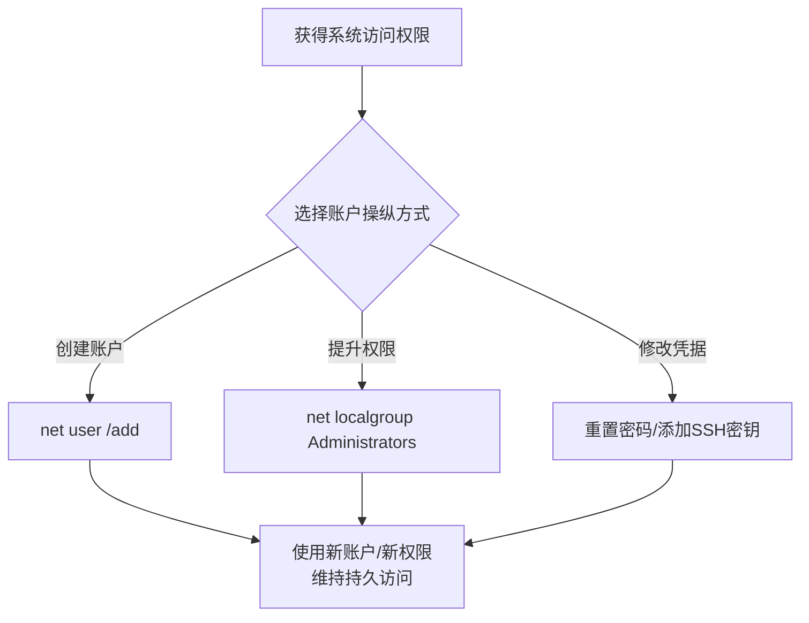

# 账户操纵 (T1098)

## 一句话通俗理解

> **账户操纵就是偷偷给自己配一把钥匙** -- 进入大楼后找管理员给自己加了一张门禁卡，以后随时可以自由出入。

## 难度等级

- ⭐⭐ 中级（需要一定基础）

需要理解系统账户管理的基本概念，操作本身使用系统管理工具即可完成。

## 技术描述

账户操纵（Account Manipulation，T1098）是MITRE ATT&CK框架中防御削弱战术的重要技术。

> 📚 **打个比方**：就像入侵者进大楼后，找管理员给自己添加了一张永久的门禁卡，还把自己的权限提升到了管理员级别——账户操纵就是攻击者在系统中创建新账户、提升权限、添加SSH密钥或修改邮箱转发规则，确保持续访问能力。

**通俗解释：**
攻击者入侵系统后，不满足于仅仅访问一台机器，而是想要长期、稳定地访问。于是攻击者会创建新账户、修改现有账户权限、添加SSH密钥、修改邮箱转发规则等，确保即使初始入侵点被清理，攻击者也有其他方式进入系统。

**技术原理：**
账户操纵的核心是修改或创建认证系统中的身份主体：

1. **创建账户**：使用`net user /add`或`New-LocalUser`创建新的本地或域账户
2. **提升权限**：将账户添加到Administrators组或Domain Admins组
3. **修改凭据**：重置现有账户密码、修改SSH密钥、添加API密钥
4. **设备注册**：在云环境中注册新的设备，绕过设备信任策略
5. **邮箱转发规则**：在邮箱中设置转发规则，将邮件转发到外部邮箱

**用途与影响：**
账户操纵攻击者确保持续性访问的最有效方式之一。即使其他持久化机制被发现和清除，攻击者仍然可以通过被操纵的账户重新进入系统。

## 子技术列表

**该技术共有 6 个子技术：**

| 子技术ID | 中文名称 | 通俗解释 |
|----------|----------|----------|
| T1098.001 | 额外云凭证 | 在云账户中添加额外的访问密钥 |
| T1098.002 | 添加SSH授权密钥 | 在Linux系统中添加SSH公钥 |
| T1098.003 | 添加Office 365统一组 | 创建或修改统一组添加成员 |
| T1098.004 | SSH授权密钥 | 利用SSH服务器配置实现持久化 |
| T1098.005 | 设备注册 | 在云环境中注册新设备 |
| T1098.006 | 容器账户添加 | 向容器中添加账户 |

## 攻击流程



## 真实案例

### 案例1：APT29通过添加OAuth应用程序实现持久化（2023-2024年）
- **时间**: 2023-2024年
- **目标**: Microsoft 365云环境
- **攻击组织**: APT29（Cozy Bear）
- **手法**: APT29在Microsoft 365环境中注册恶意的OAuth应用程序。通过添加OAuth应用程序和应用权限，攻击者可以在不使用用户密码的情况下访问邮箱和文件。这种攻击方式难以检测，因为使用的是合法OAuth令牌。
- **参考**: [Microsoft - APT29 OAuth Attack](https://www.microsoft.com/security/blog/)

### 案例2：Scattered Spider通过添加设备绕过MFA（2024年）
- **时间**: 2024年
- **目标**: 大型企业和SaaS平台
- **攻击组织**: Scattered Spider
- **手法**: Scattered Spider在Azure AD中注册受信任设备绕过MFA要求。攻击者使用前期窃取的凭据添加自己的设备到目标环境，使后续登录无需经过MFA。
- **参考**: [CISA - Scattered Spider Advisory](https://www.cisa.gov/news-events/cybersecurity-advisories/aa24-038a)

### 案例3：Exchange Online邮箱转发规则（2020-2024年）
- **时间**: 2020-2024年
- **目标**: 全球政府和企业邮箱用户
- **攻击组织**: 多个APT组织
- **手法**: 攻击者登录Exchange Online后，在收件箱中创建转发规则，将特定邮件转发到外部邮箱。规则名称通常伪装为"邮件备份"或"重要邮件归档"。
- **参考**: [CISA - Email Forwarding Rules](https://www.cisa.gov/news-events/cybersecurity-advisories/aa24-038a)

## 红队视角

> ⚠️ **免责声明**：以下内容仅用于合法的安全测试、渗透测试和教育目的。未经授权对他人系统进行测试是违法行为。

**实战技巧：**
1. 不要使用"admin"、"backup"等引人注目的用户名，利用不活动的员工账户或系统账户更隐蔽
2. 在Azure AD中添加OAuth应用程序是云环境中隐蔽的持久化方式

### 常用工具

| 工具名称 | 用途 | 平台 | 链接 |
|----------|------|------|------|
| net user | 本地账户管理（创建、删除、修改） | Windows | 系统自带 |
| net localgroup | 本地组管理 | Windows | 系统自带 |
| dsmod | Active Directory管理 | Windows | 域管理工具 |
| Azure AD PowerShell | Azure AD管理 | Windows | Microsoft |

### 注意事项
- 创建新账户会触发安全事件（事件ID 4720）
- 高权限组添加会触发告警（事件ID 4732、4728）
- 在云环境中，账户操纵会被记录在审计日志中

## 蓝队视角

**检测要点：**
- 新账户创建事件（事件ID 4720）
- 高权限组添加（事件ID 4732本地组、4728全局组）
- 大量密码重置事件
- Office 365邮箱转发规则创建

**防御重点：**
- 监控新账户创建，尤其是非工作时间的创建
- 对高权限组（如Domain Admins）的变更设置实时告警
- 启用Azure AD Identity Protection

## 检测建议

### 网络层检测

**检测方法：** 监控LDAP目录修改流量和远程管理工具的异常账户操作

**具体规则/命令示例：**
```bash
# 检测LDAP账户属性修改操作
alert tcp $HOME_NET any -> $HOME_NET 389 (msg:"LDAP Account Attribute Modification"; content:"modify"; nocase; pcre:"/sAMAccountName|userAccountControl|memberOf/Hi"; classtype:policy-violation; sid:1000044; rev:1;)

# 检测远程PowerShell账户操作
alert tcp $HOME_NET any -> $EXTERNAL_NET any (msg:"Remote Account Manipulation via WinRM"; flow:to_server; content:"Add-MsolRoleMember|Add-ADGroupMember"; nocase; classtype:trojan-activity; sid:1000045; rev:1;)
```

### 主机层检测

**检测方法：** 监控账户创建、启用、禁用和组成员变更事件

**Windows事件ID：**
- 事件ID 4720：用户账户创建
- 事件ID 4722：用户账户启用
- 事件ID 4728：成员添加到安全全局组
- 事件ID 4732：成员添加到安全本地组
- 事件ID 4738：用户账户修改
- 事件ID 4740：账户被锁定

**Linux日志：**
- 日志文件：`/var/log/auth.log`、`/var/log/secure`
- 关键字段：`useradd`、`groupadd`、`usermod`执行记录

**具体命令示例：**
```powershell
# 监控新用户创建
Get-WinEvent -FilterHashtable @{LogName='Security';ID=4720} | Format-List
```

### 应用层检测

**Sigma规则示例：**
```yaml
title: New User Account Created
status: experimental
description: Detects creation of new local user accounts
logsource:
    category: account_creation
    product: windows
detection:
    selection:
        EventID: 4720
    condition: selection
level: medium
tags:
    - attack.t1098
```

## 缓解措施

### 优先级1：关键措施

**措施名称：** 审计并限制高权限组的成员变更

**具体实施步骤：**
1. 配置实时告警，监控Administrators、Domain Admins、Enterprise Admins等组的成员变更
2. 限制谁有权执行账户创建和组成员修改操作
3. 使用特权身份管理系统（如Azure AD PIM）管理管理员操作

**配置示例：**
```powershell
# 配置账户管理审计策略
auditpol /set /subcategory:"User Account Management" /success:enable /failure:enable
```

### 优先级2：重要措施

**措施名称：** 监控账户配置和权限变更

**具体实施步骤：**
1. 启用Azure AD条件访问策略监控异常账户活动
2. 监控邮箱转发规则创建和修改事件
3. 实施JIT（Just-In-Time）管理员权限减少永久高权限账户

**配置示例：**
```powershell
# 启用Azure AD审计日志
Connect-AzureAD
Get-AzureADAuditDirectoryLogs -Filter "ActivityDateTime gt 2025-01-01"
```

### MITRE ATT&CK缓解措施映射

| 缓解措施ID | 缓解措施名称 | 适用性 | 说明 |
|------------|-------------|--------|------|
| M1026 | 特权账户管理 | 适用 | 审计并限制高权限组的成员变更 |
| M1018 | 用户账户管理 | 适用 | 启用Azure AD条件访问策略 |
| M1047 | 审计 | 适用 | 监控邮箱转发规则和账户配置变更 |
## 动手实验

> ⚠️ **重要提示**：所有实验必须在隔离的实验室环境中进行，禁止对未授权的真实系统进行测试。

### 实验1：创建本地账户（初级）
```powershell
# 创建本地账户
net user testuser P@ssw0rd /add
# 添加到管理员组
net localgroup Administrators testuser /add
```

### 实验2：监控账户创建事件（中级）
```powershell
# 查看账户创建事件
Get-WinEvent -FilterHashtable @{LogName='Security'; ID=4720}
```

### 实验3：检测邮箱转发规则（高级）
使用Exchange Online PowerShell查看邮箱规则。

## 术语解释

| 术语 | 英文原名 | 通俗解释 |
|------|----------|----------|
| OAuth | Open Authorization | 开放授权协议，允许第三方应用访问用户资源 |
| MFA | Multi-Factor Authentication | 多因素认证 |
| 条件访问 | Conditional Access | Azure AD中基于条件的访问控制策略 |

## 参考资料

- [MITRE ATT&CK - T1098 Account Manipulation](https://attack.mitre.org/techniques/T1098/)
- [CISA - Scattered Spider Advisory](https://www.cisa.gov/news-events/cybersecurity-advisories/aa24-038a)
- [Microsoft - APT29 OAuth Attack Analysis](https://www.microsoft.com/security/blog/)
