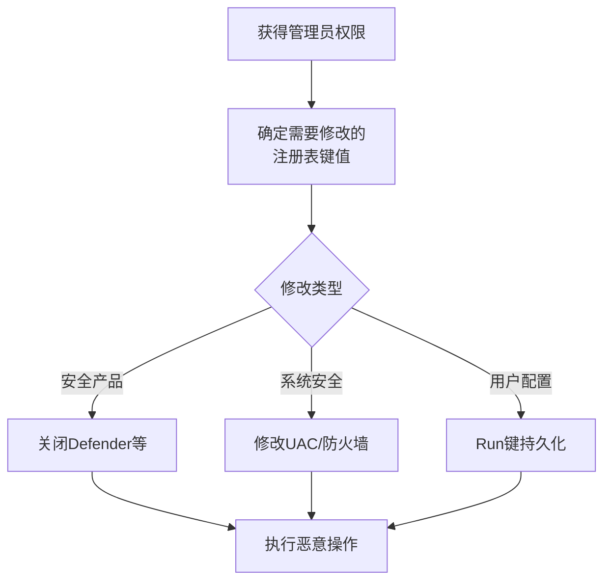

# 修改注册表 (T1112)

## 一句话通俗理解

> **修改注册表就是改系统配置文件** -- 改了Windows的"开关面板"（注册表），让杀毒软件自动关闭、让防火墙放行恶意软件、让系统每次开机都自动运行你的后门。

## 难度等级

- ⭐ 初级（零基础可理解）

注册表操作使用`reg`命令或PowerShell即可完成，是刚入门的红队成员最先上手的技能之一。

## 技术描述

修改注册表（Modify Registry，T1112）是MITRE ATT&CK框架中防御削弱战术的技术。

**通俗解释：**
Windows注册表就像一栋大楼的控制中心，上面有无数个开关：防火门的开关（防火墙）、监控系统的开关（安全软件）、门禁系统的开关（UAC）。攻击者入侵后，第一件事就是跑到控制中心，把对自己不利的开关全关了。

**技术原理：**
Windows注册表是一个分层数据库，存储操作系统和应用程序的配置。攻击者通过修改注册表中的特定键值实现：

1. **禁用安全功能**：修改`DisableRealtimeMonitoring`等键值关闭安全产品
2. **持久化**：在`Run`键下添加后门启动项
3. **修改系统行为**：修改UAC设置、点击运行设置等
4. **隐藏痕迹**：修改注册表隐藏文件、文件夹或进程

**用途与影响：**
注册表修改在众多技术中被使用。对于防御削弱而言，攻击者最常修改安全产品相关的注册表键值（如关闭Windows Defender实时保护、禁用Firewall）。

## 攻击流程



## 真实案例

### 案例1：Conti勒索软件修改注册表禁用Defender（2021-2024年）
- **时间**: 2021-2024年
- **目标**: 全球医疗、金融、政府机构
- **攻击组织**: Conti
- **手法**: Conti的自动化脚本修改大量安全产品相关注册表键值，包括`HKLM\SOFTWARE\Policies\Microsoft\Windows Defender\DisableRealtimeMonitoring`设置为`1`，禁用Windows Defender实时保护，同时修改防火墙相关键值允许恶意流量。

- **参考**: [FBI - Conti Indicators](https://www.ic3.gov/Media/News/2022/220202.pdf)

### 案例2：LockBit修改注册表禁用UAC（2022-2024年）
- **时间**: 2022-2024年
- **目标**: 全球企业
- **攻击组织**: LockBit
- **手法**: LockBit修改`HKLM\SOFTWARE\Microsoft\Windows\CurrentVersion\Policies\System\EnableLUA`为`0`，禁用用户账户控制（UAC），便于后续以更高权限执行命令。

- **参考**: [CISA - LockBit Advisory](https://www.cisa.gov/news-events/cybersecurity-advisories/aa24-131a)

### 案例3：RealBlindingEDF攻击屏蔽EDR API监控（2024年）
- **时间**: 2024年
- **目标**: 全球使用主流EDR产品的企业
- **攻击组织**: 多个勒索软件组织
- **手法**: 攻击者通过修改注册表HKLM\SOFTWARE\Microsoft\Windows NT\CurrentVersion\Image File Execution Options (IFEO)下的Debugger 键值，将CrowdStrike、SentinelOne等EDR进程的调试器设置为cmd.exe，导致EDR主进程无法正常启动。此外还修改ETW（Event Tracing for Windows）相关注册表禁用内核级事件跟踪。

- **影响**: EDR服务无法正常启动，系统失去防御能力
- **参考链接**: [The Hacker News - RealBlindingEDF](https://thehackernews.com/2024/01/researchers-uncover-new-attack-against.html)

## 红队视角

> ⚠️ **免责声明**：以下内容仅用于合法的安全测试、渗透测试和教育目的。未经授权对他人系统进行测试是违法行为。

**实战技巧：**
1. 注册表修改是最直接的防御削弱手段，操作简单高效
2. 使用`reg add`命令或`Set-ItemProperty -Path`修改键值
3. 修改后需要重启或手动启动服务才能生效

### 常用工具

| 工具名称 | 用途 | 平台 | 链接 |
|----------|------|------|------|
| reg | Windows注册表管理工具 | Windows | 系统自带 |
| regedit | 注册表编辑器 | Windows | 系统自带 |
| PowerSploit | PowerShell渗透框架 | Windows | [GitHub](https://github.com/PowerShellMafia/PowerSploit) |

### 注意事项
- 注册表修改需要管理员权限
- 某些键值修改需要SYSTEM权限

## 蓝队视角

**检测要点：**
- 注册表修改事件（事件ID 4657）
- 安全产品相关键值变更
- UAC相关键值修改

**防御重点：**
- 监控关键注册表键值的修改
- 使用Sysmon监控注册表变更
- 对注册表键值实施ACL保护

## 检测建议

### 网络层检测

**检测方法：** 监控远程注册表修改流量和通过WinRM/PSExec的注册表操作

**具体规则/命令示例：**
```bash
# 检测远程注册表修改（通过SMB）
alert tcp $HOME_NET any -> $HOME_NET 445 (msg:"Remote Registry Modification via SMB"; flow:to_server; content:"|05 00|"; depth:2; pcre:"/\x00RegSetValue|\x00RegDeleteValue/Hi"; classtype:policy-violation; sid:1000046; rev:1;)

# 检测WinRM远程注册表操作
alert tcp $HOME_NET any -> $HOME_NET 5985 (msg:"Remote Registry via WinRM"; content:"Set-ItemProperty|New-ItemProperty"; nocase; classtype:trojan-activity; sid:1000047; rev:1;)
```

### 主机层检测

**检测方法：** 监控注册表键值修改事件，重点关注安全产品相关的注册表路径

**Windows事件ID：**
- 事件ID 4657：注册表值修改（需启用注册表审计策略）
- Sysmon事件ID 13：注册表值设置
- Sysmon事件ID 12：注册表对象添加/删除

**Linux日志：**
- Linux注册表修改不适用（Linux不使用Windows注册表机制）
- 替代监控：通过Wine运行的应用修改注册表的行为

**具体命令示例：**
```powershell
# 检测Windows Defender禁用注册表修改
Get-WinEvent -FilterHashtable @{LogName='Security';ID=4657} | Where-Object {$_.Message -match 'DisableRealtimeMonitoring'}

# Sysmon检测注册表修改
Get-WinEvent -FilterHashtable @{LogName='Microsoft-Windows-Sysmon/Operational';ID=13} | Where-Object {$_.Message -match 'DisableAntiSpyware|EnableLUA|DisableRealtimeMonitoring'}
```

### 应用层检测

**Sigma规则示例：**
```yaml
title: Windows Defender Disabled via Registry
status: experimental
description: Detects disabling of Windows Defender via registry
logsource:
    category: registry_set
    product: windows
detection:
    selection:
        EventID: 13
        TargetObject|contains: 'DisableRealtimeMonitoring'
        Details|contains: 'DWORD (0x00000001)'
    condition: selection
level: high
tags:
    - attack.t1112
```

## 缓解措施

### 优先级1：关键措施

**措施名称：** 保护关键注册表键值的ACL

**具体实施步骤：**
1. 对安全产品相关注册表键值实施严格的ACL保护
2. 启用Windows Defender Tamper Protection防止安全配置被篡改
3. 使用注册表访问审计监控异常键值修改

**配置示例：**
```powershell
# 设置安全产品注册表键的ACL
$path = "HKLM:\SOFTWARE\Policies\Microsoft\Windows Defender"
$acl = Get-Acl $path
$rule = New-Object System.Security.AccessControl.RegistryAccessRule("SYSTEM","FullControl","Allow")
$acl.SetAccessRule($rule)
Set-Acl -Path $path -AclObject $acl
```

### 优先级2：重要措施

**措施名称：** 配置Sysmon监控注册表变更

**具体实施步骤：**
1. 部署Sysmon并配置监控安全产品相关注册表键
2. 启用注册表审计策略（事件ID 4657）记录所有注册表值修改
3. 将注册表变更日志关联到SIEM进行实时告警

**配置示例：**
```xml
<Sysmon>
  <EventFiltering>
    <RegistryEvent onmatch="include">
      <TargetObject name="T1112_Detection">HKLM\SOFTWARE\Policies\Microsoft\Windows Defender\*</TargetObject>
    </RegistryEvent>
  </EventFiltering>
</Sysmon>
```

### MITRE ATT&CK缓解措施映射

| 缓解措施ID | 缓解措施名称 | 适用性 | 说明 |
|------------|-------------|--------|------|
| M1022 | 权限限制 | 适用 | 对关键注册表键值实施ACL保护 |
| M1040 | 防篡改 | 适用 | 启用Windows Defender Tamper Protection |
| M1047 | 审计 | 适用 | 配置Sysmon监控安全产品相关注册表键 |
## 动手实验

> ⚠️ **重要提示**：所有实验必须在隔离的实验室环境中进行，禁止对未授权的真实系统进行测试。

### 实验1：使用reg命令修改注册表（初级）
```powershell
# 查看当前Defender状态
reg query "HKLM\SOFTWARE\Policies\Microsoft\Windows Defender" /v DisableRealtimeMonitoring
# 修改注册表（需要管理员权限）
reg add "HKLM\SOFTWARE\Policies\Microsoft\Windows Defender" /v DisableRealtimeMonitoring /t REG_DWORD /d 1 /f
```

### 实验2：使用PowerShell修改注册表（初级）
```powershell
# 修改UAC设置
Set-ItemProperty -Path "HKLM:\SOFTWARE\Microsoft\Windows\CurrentVersion\Policies\System" -Name "EnableLUA" -Value 0
```

### 实验3：监控注册表变更（中级）
```powershell
# 使用Sysmon事件监控注册表变更
Get-WinEvent -FilterHashtable @{LogName='Microsoft-Windows-Sysmon/Operational'; ID=13}
```

## 术语解释

| 术语 | 英文原名 | 通俗解释 |
|------|----------|----------|
| 注册表 | Registry | Windows系统和应用程序的配置数据库 |
| IFEO | Image File Execution Options | 映像文件执行选项，Windows中用于调试的可执行文件配置 |
| ETW | Event Tracing for Windows | Windows事件跟踪，系统级调试和性能分析框架 |

## 参考资料

- [MITRE ATT&CK - T1112 Modify Registry](https://attack.mitre.org/techniques/T1112/)
- [FBI - Conti Indicators of Compromise](https://www.ic3.gov/Media/News/2022/220202.pdf)
- [The Hacker News - RealBlindingEDF Attack (2024)](https://thehackernews.com/2024/01/researchers-uncover-new-attack-against.html)
