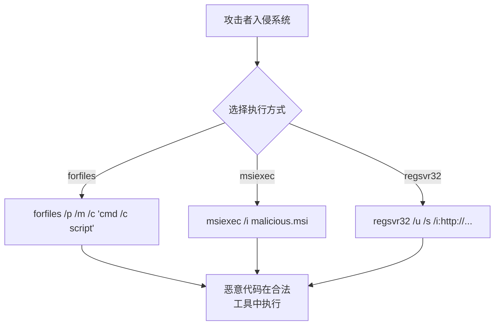

# 间接命令执行 (T1202)

## 一句话通俗理解

> **间接命令执行就是借刀杀人** -- 自己不直接动手，而是让系统自带的工具去执行你的命令，安全软件以为是"自己人"在操作。

## 难度等级

- ⭐⭐ 中级（需要一定基础）

需要了解Windows自带的管理工具和它们之间的调用关系。

## 技术描述

间接命令执行（Indirect Command Execution，T1202）是MITRE ATT&CK框架中防御削弱战术的技术。

> 📚 **打个比方**：就像你想搞破坏但不想亲自动手，于是让大楼的保安队长去替你按按钮——间接命令执行就是攻击者利用系统自带的工具（如forfiles.exe、pcalua.exe）去执行恶意代码，安全软件看到是"自己人"在操作就不会拦截。

**通俗解释：**
你不想自己动手（因为你的手一旦触碰到任何东西就会被注意到），于是你让其他人（系统合法工具）去干。攻击者使用`forfiles.exe`去执行恶意脚本、用`pcalua.exe`（程序兼容性助理）加载恶意程序、用`msiexec.exe`运行恶意MSI文件等。

**技术原理：**
Windows自带的许多管理工具可以通过不同的方式被用来执行代码：

1. **forfiles.exe**：可以遍历目录并执行命令
2. **pcalua.exe**：程序兼容性助理，可执行任意可执行文件
3. **msiexec.exe**：Windows Installer，可执行DLL和PowerShell脚本
4. **regsvr32.exe**：注册COM组件，可加载远程DLL
5. **rundll32.exe**：执行DLL中的导出函数

**用途与影响：**
间接命令执行是LOLBins策略的扩展应用。安全产品通常只监控`powershell.exe`和`cmd.exe`的执行，使用非标准工具执行命令可以绕过这些监控。

## 攻击流程



## 真实案例

### 案例1：APT29使用msiexec间接执行（2023-2024年）
- **时间**: 2023-2024年
- **目标**: 全球政府和外交部门
- **攻击组织**: APT29（Cozy Bear）
- **手法**: APT29使用msiexec.exe加载恶意的MSI安装包，MSI文件在安装过程中执行PowerShell命令下载后续载荷。由于MSI文件具有合法数字签名且msiexec是Windows组件，安全产品难以识别。

### 案例2：DarkGate使用regsvr32远程加载DLL（2023-2024年）
- **时间**: 2023-2024年
- **目标**: 全球企业
- **攻击组织**: DarkGate恶意软件
- **手法**: DarkGate通过鱼叉钓鱼邮件引导用户运行regsvr32.exe，从远程WebDAV服务器加载恶意SCT文件，使用JavaScript代码执行shellcode。
- **影响**: 隐蔽的初始访问，大量企业被入侵

### 案例3：QakBot使用forfiles.exe执行恶意脚本（2023-2024年）
- **时间**: 2023-2024年
- **目标**: 全球金融机构
- **攻击组织**: QakBot
- **手法**: QakBot通过LNK文件在命令行中利用forfiles.exe执行Base64编码的PowerShell命令，绕过基于进程创建日志的检测规则。
- **参考**: [CISA - QakBot Advisory (2025)](https://www.cisa.gov/news-events/cybersecurity-advisories/aa24-316a)

## 红队视角

> ⚠️ **免责声明**：以下内容仅用于合法的安全测试、渗透测试和教育目的。未经授权对他人系统进行测试是违法行为。

**实战技巧：**
1. 使用`forfiles.exe`遍历目录执行命令可以绕过路径白名单检查
2. `regsvr32`的SCT脚本可以逃逸大量网络检测

### 常用工具

| 工具名称 | 用途 | 平台 |
|----------|------|------|
| forfiles.exe | 目录遍历执行命令 | Windows |
| msiexec.exe | Windows Installer | Windows |
| regsvr32.exe | COM组件注册工具 | Windows |
| rundll32.exe | DLL执行工具 | Windows |

### 注意事项
- 某些间接执行工具（如regsvr32）已被安全产品重点关注
- 命令执行结果可能无法直接返回，需要配合其他工具

## 蓝队视角

**检测要点：**
- 监控`msiexec.exe`执行的来源MSI文件
- 监控`regsvr32.exe`从远程URL加载SCT文件
- 监控`forfiles.exe`执行命令

**防御重点：**
- 启用Sysmon监控进程创建和网络连接
- 监控异常的工具组合使用
- 使用WDAC阻止未经授权的脚本执行

## 检测建议

### 网络层检测

**检测方法：** 监控regsvr32、msiexec等工具从远程URL加载脚本或安装包

**具体规则/命令示例：**
```bash
# 检测regsvr32远程SCT加载
alert tcp $HOME_NET any -> $EXTERNAL_NET any (msg:"Indirect Execution - Regsvr32 Remote SCT Load"; flow:to_server; content:"regsvr32"; nocase; pcre:"/\/i\b.*http/Hi"; classtype:trojan-activity; sid:1000048; rev:1;)

# 检测msiexec远程安装
alert tcp $HOME_NET any -> $EXTERNAL_NET any (msg:"Indirect Execution - Msiexec Remote Install"; flow:to_server; content:"msiexec"; nocase; pcre:"/\/q\b.*http|http.*\/q\b/Hi"; classtype:trojan-activity; sid:1000049; rev:1;)
```

### 主机层检测

**检测方法：** 监控间接命令执行工具的进程创建及参数，重点关注非标准调用模式

**Windows事件ID：**
- 事件ID 4688 / Sysmon事件ID 1：监控regsvr32、msiexec、forfiles、rundll32、pcalua等工具的进程创建
- 重点关注：regsvr32带`/i`和`http`参数、forfiles执行cmd/powershell、msiexec远程加载

**Linux日志：**
- 日志文件：`/var/log/audit/audit.log`
- 关键字段：通过其他系统工具间接执行的shell命令

**具体命令示例：**
```powershell
# 检测regsvr32远程加载
Get-WinEvent -FilterHashtable @{LogName='Security';ID=4688} | Where-Object {$_.Message -match 'regsvr32' -and $_.Message -match 'http'}
```

### 应用层检测

**Sigma规则示例：**
```yaml
title: Regsvr32 Remote Scriptlet Load
status: experimental
description: Detects regsvr32 loading scriptlet from remote URL
logsource:
    category: process_creation
    product: windows
detection:
    selection:
        Image|endswith: '\regsvr32.exe'
        CommandLine|contains|all:
            - '/i'
            - 'http'
            - '/s'
    condition: selection
level: high
tags:
    - attack.t1202
```

## 缓解措施

### 优先级1：关键措施

**措施名称：** 启用Windows Defender ASR规则

**具体实施步骤：**
1. 启用ASR规则"阻止Office创建子进程"
2. 启用ASR规则"阻止从电子邮件客户端和Webmail中下载的可执行内容"
3. 启用ASR规则"阻止Win32 API调用从Office宏"

**配置示例：**
```powershell
# 配置ASR规则阻止Office创建子进程
Add-MpPreference -AttackSurfaceReductionRules_Ids "D4F940AB-401B-4EFC-AADC-AD5F3C50688A" -AttackSurfaceReductionRules_Actions Enabled
```

### 优先级2：重要措施

**措施名称：** 限制间接命令执行工具的网络访问

**具体实施步骤：**
1. 配置Windows防火墙阻止regsvr32、msiexec等工具的出站访问
2. 限制cmd.exe和PowerShell在非管理场景下的使用
3. 使用AppLocker或WDAC限制脚本宿主程序（wscript、cscript）的执行

**配置示例：**
```powershell
# 阻止regsvr32出站网络访问
New-NetFirewallRule -DisplayName "Block Regsvr32 Outbound" -Direction Outbound -Program "C:\Windows\System32\regsvr32.exe" -Action Block
```

### MITRE ATT&CK缓解措施映射

| 缓解措施ID | 缓解措施名称 | 适用性 | 说明 |
|------------|-------------|--------|------|
| M1038 | 执行防护 | 适用 | 启用Windows Defender ASR规则监控异常子进程 |
| M1047 | 审计 | 适用 | 配置Sysmon监控间接命令执行工具 |
| M1045 | 软件限制策略 | 适用 | 限制regsvr32、msiexec等工具的网络访问 |
## 动手实验

> ⚠️ **重要提示**：所有实验必须在隔离的实验室环境中进行，禁止对未授权的真实系统进行测试。

### 实验1：使用forfiles执行命令（初级）
```cmd
forfiles /p C:\Windows\System32 /m *.dll /c "cmd /c echo @fname"
```

### 实验2：使用msiexec远程执行（中级）

### 实验3：检测regsvr32的异常使用（中级）

## 术语解释

| 术语 | 英文原名 | 通俗解释 |
|------|----------|----------|
| SCT | Scriptlet File | Windows脚本组件文件，可由regsvr32加载执行 |
| MSI | Windows Installer Package | Windows安装包，可包含自定义安装操作 |
| LOLBins | Living off the Land Binaries | 利用系统自带的合法工具执行攻击 |

## 参考资料

- [MITRE ATT&CK - T1202 Indirect Command Execution](https://attack.mitre.org/techniques/T1202/)
- [CISA - QakBot Advisory (2025)](https://www.cisa.gov/news-events/cybersecurity-advisories/aa24-316a)
