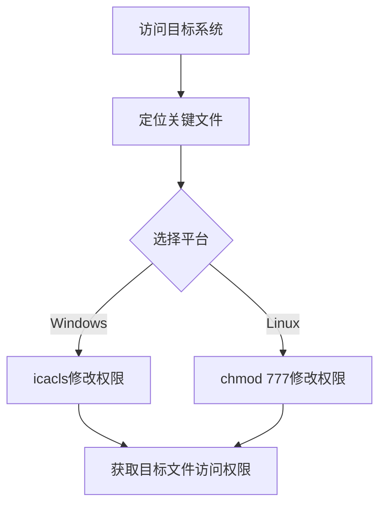

# 文件权限修改 (T1222)

## 一句话通俗理解

> **文件权限修改就是给本不该访问文件的人开门禁** -- 修改文件的安全设置，让所有人都能读取 /etc/shadow 或执行敏感脚本。

## 难度等级

- ⭐ 初级（零基础可理解）

使用`chmod`、`icacls`等系统自带命令即可完成。

## 技术描述

文件权限修改（File Permissions Modification，T1222）是MITRE ATT&CK框架中防御削弱战术的技术。

> 📚 **打个比方**：就像有人把保险柜的密码从"只有总经理知道"改为"全公司都知道"——文件权限修改就是攻击者使用chmod、icacls等命令修改关键文件或目录的访问权限，让原本受限的文件变得可读、可写或可执行。

**通俗解释：**
一份机密文件原本只有总经理能看，攻击者修改了文件的权限设置，让所有普通员工都能查看。在系统上，攻击者修改关键文件或目录的访问控制列表（ACL），使原本受限的文件变得可读、可写或可执行。

**技术原理：**
文件权限修改的方式：

1. **Linux/macOS**：使用`chmod`修改文件模式（如`chmod 777 /etc/shadow`），使用`chown`修改文件所有者
2. **Windows**：使用`icacls`修改文件和目录的ACL（访问控制列表），使用`takeown`获取文件所有权
3. **ACL修改**：添加或修改访问控制条目

**用途与影响：**
攻击者通过文件权限修改可以：访问原本无权访问的敏感文件（如凭据文件、配置文件），将原本不可执行的脚本变为可执行，使系统脚本被篡改，隐藏或保护恶意文件。

## 子技术列表

| 子技术ID | 中文名称 | 通俗解释 |
|----------|----------|----------|
| T1222.001 | Windows文件/目录权限修改 | 使用icacls修改文件权限 |
| T1222.002 | Linux/Mac文件/目录权限修改 | 使用chmod/chown修改文件权限 |

## 攻击流程



## 真实案例

### 案例1：SolarWinds攻击中修改权限（2020年）
- **时间**: 2020年
- **目标**: 全球企业、政府机构
- **攻击组织**: APT29 (Cozy Bear)
- **手法**: SolarWinds木马通过备份应用程序目录替换合法文件，修改关键文件权限允许执行恶意代码，实现了长期隐蔽驻留。
- **参考**: [CISA - SolarWinds Advisory](https://www.cisa.gov/news-events/cybersecurity-advisories/aa24-038a)

### 案例2：Linux勒索软件修改文件权限（2022-2024年）
- **时间**: 2022-2024年
- **目标**: Linux服务器、VMware ESXi
- **攻击组织**: 多个勒索软件组织（LockBit、Black Basta）
- **手法**: 勒索软件在加密Linux系统前使用`chmod 777`修改文件和目录权限，确保加密工具能读取和写入所有受保护的文件，同时修改SSH配置文件权限以便横向移动。

### 案例3：Red Teaming中使用icacls进行权限委派（2023-2024年）
- **时间**: 2023-2024年
- **手法**: 红队使用`icacls`修改文件权限以获得对关键工具和脚本的访问权限。

## 红队视角

> ⚠️ **免责声明**：以下内容仅用于合法的安全测试、渗透测试和教育目的。未经授权对他人系统进行测试是违法行为。

**实战技巧：**
- 使用`icacls`或`chmod`修改权限后应立即执行目标操作，避免权限被审计发现
- 修改后记得恢复原始权限，减少被发现的风险

### 常用工具

| 工具名称 | 用途 | 平台 |
|----------|------|------|
| icacls | Windows文件权限管理 | Windows |
| takeown | 获取文件所有权 | Windows |
| chmod | Linux文件权限修改 | Linux |
| chown | 修改文件所有者 | Linux |

## 蓝队视角

**检测要点：**
- Windows事件ID 4670（对象权限修改）
- 监控敏感文件权限的异常修改

**防御重点：**
- 配置文件完整性监控（FIM）
- 监控敏感文件和目录的权限修改
- 使用Sysmon监控文件权限变更

## 检测建议

### 网络层检测

**检测方法：** 监控远程文件共享上的权限修改操作和文件系统审计变更

**具体规则/命令示例：**
```bash
# 检测SMB远程文件权限修改
alert tcp $HOME_NET any -> $HOME_NET 445 (msg:"Remote File Permission Modification via SMB"; flow:to_server; pcre:"/\x00icacls|\x00cacls|\x00takeown/Hi"; classtype:policy-violation; sid:1000052; rev:1;)

# 检测NFS导出权限修改
alert tcp $HOME_NET any -> $HOME_NET 2049 (msg:"NFS Export Permission Modification"; flow:to_server; content:"|78 00|"; depth:2; classtype:policy-violation; sid:1000053; rev:1;)
```

### 主机层检测

**检测方法：** 监控文件权限修改工具的执行和关键系统文件的权限变更

**Windows事件ID：**
- 事件ID 4670：对象权限修改
- Sysmon事件ID 11（FileCreate）：检测ACL变更相关文件操作

**Linux日志：**
- 日志文件：`/var/log/audit/audit.log`
- 关键字段：`chmod`、`chown`、`setfacl`系统调用、关键路径（`/etc/shadow`、`/etc/passwd`、`/etc/sudoers`）的权限修改

**具体命令示例：**
```powershell
# 检测icacls权限修改
Get-WinEvent -FilterHashtable @{LogName='Security';ID=4670} | Where-Object {$_.Message -match 'icacls|cacls|takeown'}
```

### 应用层检测

**Sigma规则示例：**
```yaml
title: File Permission Modification via icacls
status: experimental
description: Detects file permission changes using icacls or similar tools
logsource:
    category: process_creation
    product: windows
detection:
    selection:
        Image|endswith:
            - '\icacls.exe'
            - '\cacls.exe'
            - '\takeown.exe'
        CommandLine|contains:
            - '/grant'
            - '/deny'
            - '/remove'
    condition: selection
level: medium
tags:
    - attack.t1222
```

## 缓解措施

### 优先级1：关键措施

**措施名称：** 配置关键文件和目录的ACL保护

**具体实施步骤：**
1. 对关键系统文件（SAM文件、/etc/shadow、LSASS进程等）配置严格的ACL
2. 使用Windows文件资源管理器或icacls限制敏感路径的访问权限
3. 在Linux系统中使用chmod和chattr保护关键配置文件

**配置示例：**
```powershell
# 设置关键文件ACL，限制非管理员访问
icacls C:\Windows\System32\config\SAM /inheritance:r /grant SYSTEM:F Administrators:F
```

### 优先级2：重要措施

**措施名称：** 启用文件完整性监控（FIM）

**具体实施步骤：**
1. 部署Azure File Integrity Monitoring或第三方FIM工具
2. 配置Windows文件服务器资源管理器（FSRM）的文件屏蔽功能
3. 在Linux上使用AIDE或Tripwire监控关键文件变更

**配置示例：**
```bash
# Linux系统初始化AIDE数据库
aide --init
mv /var/lib/aide/aide.db.new.gz /var/lib/aide/aide.db.gz
```

### MITRE ATT&CK缓解措施映射

| 缓解措施ID | 缓解措施名称 | 适用性 | 说明 |
|------------|-------------|--------|------|
| M1022 | 权限限制 | 适用 | 配置关键文件和目录的ACL限制 |
| M1054 | 软件配置 | 适用 | 启用文件完整性监控（FIM） |
| M1026 | 特权账户管理 | 适用 | 实施最小权限原则 |
## 动手实验

> ⚠️ **重要提示**：所有实验必须在隔离的实验室环境中进行，禁止对未授权的真实系统进行测试。

### 实验1：Windows icacls修改权限（初级）
```cmd
icacls C:\test.txt /grant Everyone:F
icacls C:\test.txt
```

### 实验2：Linux chmod修改权限（初级）
```bash
chmod 777 /etc/shadow
ls -la /etc/shadow
```

## 术语解释

| 术语 | 英文原名 | 通俗解释 |
|------|----------|----------|
| ACL | Access Control List | 访问控制列表，定义谁可以访问文件或目录 |
| chmod | Change Mode | Linux中修改文件权限的命令 |
| icacls | Integrity Control ACL | Windows中管理文件ACL的命令 |

## 参考资料

- [MITRE ATT&CK - T1222 File Permissions Modification](https://attack.mitre.org/techniques/T1222/)
