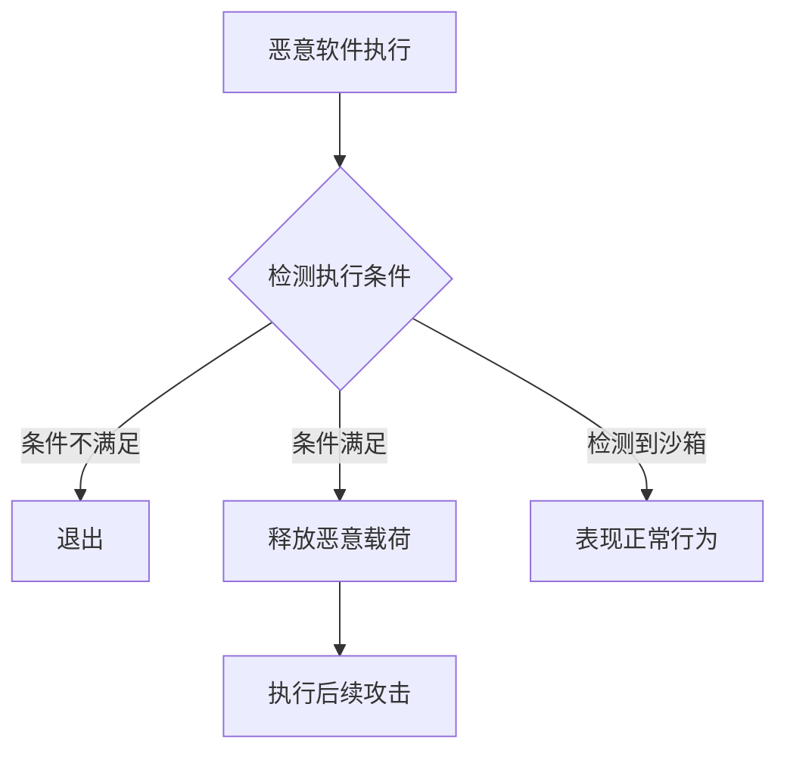

# 执行护栏 (T1480)

## 一句话通俗理解

> **执行护栏就是给武器装上保险栓** -- 只有在特定条件下才开火，防止走火（在沙箱中被分析）或误伤（被安全研究人员发现）。

## 难度等级

- ⭐⭐ 中级（需要一定基础）

需要理解环境检测和反分析技术的基本原理。

## 技术描述

执行护栏（Execution Guardrails，T1480）是MITRE ATT&CK框架中防御削弱战术的技术。

> 📚 **打个比方**：就像间谍接头需要暗号确认身份一样——执行护栏是攻击者给恶意软件设置的"环境验证"机制，只有在特定的目标系统中才会暴露恶意行为，如果在沙箱或虚拟机上运行就假装是正常程序。

**通俗解释：**
间谍接头有暗号确认身份。恶意软件也需要确认"自己是否在正确的环境中" -- 如果发现自己在沙箱中（被分析）、在虚拟机中（可能被研究）、或者在没有特定标记的系统中，就拒绝执行。这样安全研究人员就很难分析它的行为。

**技术原理：**
执行护栏通过检测环境特征决定是否执行恶意代码：

1. **域名检测**：检查当前系统的域名是否为目标企业的域名
2. **用户检测**：检查当前用户是否为目标用户
3. **文件标记**：检测特定文件、注册表键是否存在（"开关"）
4. **时间条件**：只在特定时间范围内执行
5. **地理位置**：基于IP地理位置检测

**用途与影响：**
执行护栏是高级恶意软件的标配。它使恶意软件在沙箱环境中不会暴露恶意行为，逃避动态分析。没有正确配置的目标条件就不会执行，极大降低被检测和分析的风险。

## 子技术列表

| 子技术ID | 中文名称 | 通俗解释 |
|----------|----------|----------|
| T1480.001 | 环境密钥 | 使用特定环境特征（如域名、文件）作为执行条件 |
| T1480.002 | 双向授权 | 使用双向认证确保在目标环境中执行 |

## 攻击流程



## 真实案例

### 案例1：FIN7使用环境密钥进行企业定向攻击（2015-2024年）
- **时间**: 2015-2024年
- **目标**: 全球餐饮、娱乐、金融行业
- **攻击组织**: FIN7（Carbanak）
- **手法**: FIN7的恶意软件在启动前检查目标系统的域名、默认网关和特定文件是否存在。只有检测到目标企业环境的特征后，才会释放恶意载荷。如果在分析环境或普通家庭用户系统中执行，恶意软件会直接退出。
- **参考**: [MITRE - FIN7](https://attack.mitre.org/groups/G0046/)

### 案例2：DarkGate使用目标系统特征作为Guardrail（2023-2024年）
- **时间**: 2023-2024年
- **目标**: 全球企业
- **攻击组织**: DarkGate
- **手法**: DarkGate的加载器在解压并执行实际载荷前会检测目标系统是否包含特定注册表键值和文件，只有匹配的系统中才执行后续第二阶段载荷。
- **参考**: [CISA - DarkGate Advisory](https://www.cisa.gov/news-events/cybersecurity-advisories/aa24-038a)

### 案例3：TrickBot使用系统信息作为执行闸门（2016-2024年）
- **时间**: 2016-2024年
- **目标**: 全球金融机构
- **攻击组织**: TrickBot
- **手法**: TrickBot在感染后收集系统信息，根据系统类型、安装的软件、地理位置等因素判断目标价值。只有高价值目标才会释放完整的恶意载荷。
- **参考**: [MITRE - TrickBot S0266](https://attack.mitre.org/software/S0266/)

## 红队视角

> ⚠️ **免责声明**：以下内容仅用于合法的安全测试、渗透测试和教育目的。未经授权对他人系统进行测试是违法行为。

**实战技巧：**
1. 使用目标组织的域名作为Guardrail是最通用的方式
2. 可以结合多个条件组合使用，降低误触发概率

## 蓝队视角

**检测要点：**
- 使用沙箱或虚拟机分析时，恶意软件可能不执行
- 检测到未触发条件的恶意软件样本

**防御重点：**
- 使用高级沙箱模拟更真实的环境
- 使用动态行为分析而非静态分析

## 检测建议

### 网络层检测

**检测方法：** 监控C2通信中嵌入的环境检查特征和条件性回调模式

**具体规则/命令示例：**
```bash
# 检测带条件检查的C2 beacon
alert tcp $HOME_NET any -> $EXTERNAL_NET any (msg:"Execution Guardrail - Conditional Beacon"; flow:to_server; pcre:"/(domain|username|computername|ad_joined|dns_domain)/Hi"; classtype:trojan-activity; sid:1000054; rev:1;)

# 检测长时间Sleep后的C2通信（环境检查超时）
alert tcp $HOME_NET any -> $EXTERNAL_NET any (msg:"Execution Guardrail - Delayed C2 after Sleep"; flow:to_server; classtype:policy-violity; sid:1000055; rev:1;)
```

### 主机层检测

**检测方法：** 监控系统信息收集API的异常密集调用和调试器检测API的使用

**Windows事件ID：**
- 事件ID 4688：监控执行系统信息收集命令的进程（如wmic、powershell Get-WmiObject）
- Sysmon事件ID 1：监控调试器检测API调用相关的进程创建

**Linux日志：**
- 日志文件：`/var/log/audit/audit.log`
- 关键字段：`uname`、`lscpu`、`dmidecode`、`hostname`等环境检测命令执行

**具体命令示例：**
```powershell
# 检测环境探测命令
Get-WinEvent -FilterHashtable @{LogName='Security';ID=4688} | Where-Object {$_.Message -match 'Win32_ComputerSystem|Win32_BIOS|Win32_Processor|NumberOfCores'}
```

### 应用层检测

**Sigma规则示例：**
```yaml
title: Potential Execution Guardrail - Environment Check
status: experimental
description: Detects processes checking for debugger, VM, or sandbox artifacts
logsource:
    category: process_creation
    product: windows
detection:
    selection:
        CommandLine|contains:
            - 'IsDebuggerPresent'
            - 'CheckRemoteDebuggerPresent'
            - 'NtQueryInformationProcess'
            - 'SystemParametersInfo'
    condition: selection
level: medium
tags:
    - attack.t1480
```

## 缓解措施

### 优先级1：关键措施

**措施名称：** 使用高级威胁分析平台

**具体实施步骤：**
1. 部署EDR（端点检测与响应）进行行为异常检测
2. 在沙箱分析环境中模拟更真实的环境条件（域加入、真实用户活动）
3. 使用威胁情报平台关联Guardrail相关的IoC模式

**配置示例：**
```xml
<EDR Policy>
Configure advanced sandbox environments with:
    - Real domain-joined simulation
    - Full user profile with history
    - Realistic network traffic patterns
    - Long-duration analysis (>5 minutes)
```

### 优先级2：重要措施

**措施名称：** 检测环境检查行为

**具体实施步骤：**
1. 监控对调试器、虚拟机或沙箱工件的异常检查行为
2. 检测长时间Sleep或延迟执行的恶意软件模式
3. 配置网络检测规则捕获条件性C2通信模式

**配置示例：**
```powershell
# 监控环境检查API调用
Get-WinEvent -FilterHashtable @{LogName='Security';ID=4688} | Where-Object {$_.Message -match 'IsDebuggerPresent|NtQueryInformationProcess'}
```

### MITRE ATT&CK缓解措施映射

| 缓解措施ID | 缓解措施名称 | 适用性 | 说明 |
|------------|-------------|--------|------|
| M1047 | 审计 | 适用 | 使用EDR检测异常沙箱行为 |
| M1040 | 防篡改 | 部分适用 | 保护分析环境不被识别 |
| M1029 | 远程数据存储 | 部分适用 | 在云环境中使用更真实的检测条件 |
## 动手实验

> ⚠️ **重要提示**：所有实验必须在隔离的实验室环境中进行，禁止对未授权的真实系统进行测试。

### 实验1：使用PowerShell实现简单Guardrail（初级）
```powershell
$targetDomain = "targetcorp.com"
$currentDomain = (Get-WmiObject Win32_ComputerSystem).Domain

if ($currentDomain -eq $targetDomain) {
    Write-Host "Target environment confirmed. Executing payload..."
} else {
    Write-Host "Wrong environment. Exiting..."
    exit
}
```

## 术语解释

| 术语 | 英文原名 | 通俗解释 |
|------|----------|----------|
| Guardrail | Guardrail | 执行条件限制，只有在特定条件下才执行恶意代码 |
| 沙箱 | Sandbox | 隔离的分析环境，用于安全检测恶意软件 |
| 环境密钥 | Environment Key | 作为执行条件的特定环境特征 |

## 参考资料

- [MITRE ATT&CK - T1480 Execution Guardrails](https://attack.mitre.org/techniques/T1480/)
- [MITRE - FIN7 G0046](https://attack.mitre.org/groups/G0046/)
- [MITRE - TrickBot S0266](https://attack.mitre.org/software/S0266/)
