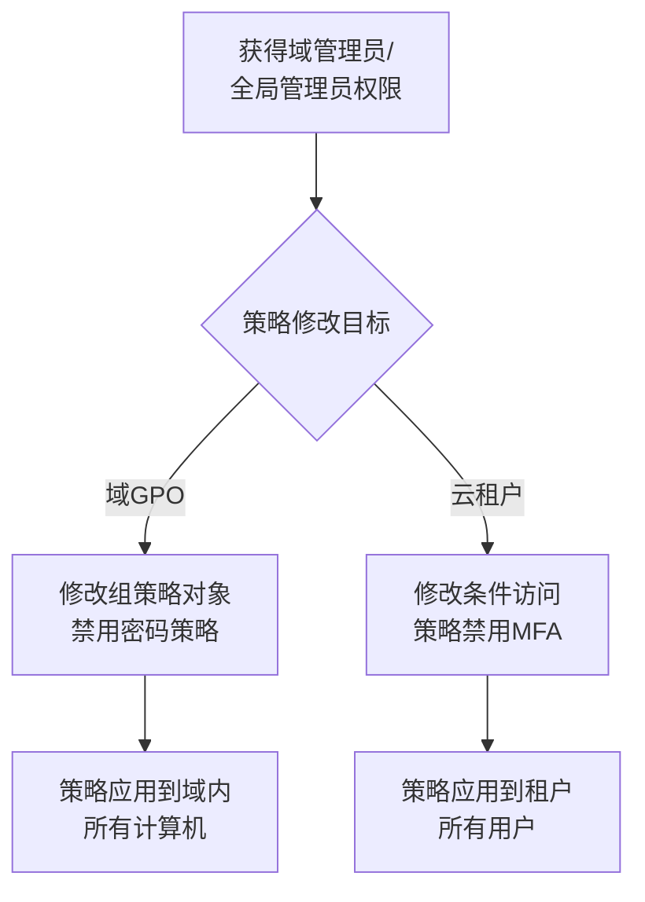

# 域或租户策略修改 (T1484)

## 一句话通俗理解

> **域策略修改就是修改大楼的管理制度** -- 搞定了大楼管理员，让他把"禁止陌生人进入"改成"任何人都能进"，让所有安全规则失效。

## 难度等级

- ⭐⭐⭐ 高级（需要较多基础）

需要理解Active Directory组策略和云租户策略的配置管理。

## 技术描述

域或租户策略修改（Domain or Tenant Policy Modification，T1484）是MITRE ATT&CK框架中防御削弱战术的技术。

**通俗解释：**
假设一栋大楼有一整套安全规章制度：需要门禁卡进入、访客需要登记、垃圾需要分类。攻击者控制了行政部后，把这些规章制度全部改了：门禁变成了常开模式、访客无需登记、垃圾可以随意处理。域或租户策略修改就是这样的操作 -- 攻击者修改Active Directory组策略或云租户的安全策略，让整个组织防线失效。

**技术原理：**

**域环境（本地）** -- 修改Active Directory组策略（GPO）：
- 禁用密码策略（允许弱密码）
- 添加新用户到域管理员组
- 配置自动脚本执行策略
- 修改防火墙规则

**云租户（Azure AD / Microsoft 365）** -- 修改云安全策略：
- 修改条件访问策略禁用MFA
- 修改登录风险策略降低告警阈值
- 禁用安全默认值
- 修改审计和日志保留策略

**用途与影响：**
域或租户策略修改的威力在于"一次修改，全网瘫痪"。攻击者只需修改一个GPO，就能同时影响域内所有计算机，使整个组织的防御体系失效。

## 子技术列表

| 子技术ID | 中文名称 | 通俗解释 |
|----------|----------|----------|
| T1484.001 | 组策略修改 | 修改Active Directory组策略 |
| T1484.002 | 信任关系修改 | 修改域信任关系 |

## 攻击流程



## 真实案例

### 案例1：NOBELIUM（APT29）修改Azure AD条件访问策略（2023-2024年）
- **时间**: 2023-2024年
- **目标**: 全球政府和科技公司
- **攻击组织**: NOBELIUM (APT29)
- **手法**: APT29在获得全局管理员权限后，修改条件访问策略禁用MFA验证要求，创建额外的管理策略允许通过其控制的IP地址段进行访问，修改审计日志保留策略使恶意行为不被记录。
- **参考**: [Microsoft - NOBELIUM](https://www.microsoft.com/security/blog/)

### 案例2：Scattered Spider禁用条件访问策略（2024年）
- **时间**: 2024年
- **目标**: 大型企业
- **攻击组织**: Scattered Spider
- **手法**: Scattered Spider在获得Azure AD管理员权限后，修改MFA条件访问策略，添加"跳过MFA"的例外用户组。
- **参考**: [CISA - Scattered Spider Advisory](https://www.cisa.gov/news-events/cybersecurity-advisories/aa24-038a)

### 案例3：Conti修改组策略进行横向移动（2021-2024年）
- **时间**: 2021-2024年
- **目标**: 全球企业
- **攻击组织**: Conti
- **手法**: Conti使用Active Directory组策略（GPO）进行横向移动。通过修改GPO配置启动脚本（Startup Script），在域内所有系统上执行恶意程序。
- **参考**: [FBI - Conti Alert](https://www.ic3.gov/Media/News/2022/220202.pdf)

## 红队视角

> ⚠️ **免责声明**：以下内容仅用于合法的安全测试、渗透测试和教育目的。未经授权对他人系统进行测试是违法行为。

**实战技巧：**
- 组策略分发需要等待域控制器同步（默认90分钟后）
- 可以使用`gpupdate /force`立即强制刷新

## 蓝队视角

**检测要点：**
- GPO修改事件（Windows事件ID 5136、5137、5141）
- 检测Azure AD条件访问策略修改

**防御重点：**
- 审计GPO修改事件
- 监控Azure AD管理员操作日志
- 启用Azure AD Privileged Identity Management (PIM)

## 检测建议

### 网络层检测

**检测方法：** 监控GPO复制流量、LDAP目录修改和Azure AD管理API调用

**具体规则/命令示例：**
```bash
# 检测GPO修改后的SYSVOL复制
alert tcp $HOME_NET any -> $HOME_NET 445 (msg:"SYSVOL Policy File Modification - Possible GPO Tampering"; flow:to_server; content:"|2e|pol"; nocase; classtype:policy-violation; sid:1000056; rev:1;)

# 检测Azure AD管理API调用
alert tcp $HOME_NET any -> $EXTERNAL_NET 443 (msg:"Azure AD Admin API Call - Policy Change"; content:"graph.windows.net"; nocase; pcre:"/conditionalAccess|identitySecurityDefaultsEnforcement/Hi"; classtype:trojan-activity; sid:1000057; rev:1;)
```

### 主机层检测

**检测方法：** 监控AD目录服务对象修改和组策略更新事件

**Windows事件ID：**
- 事件ID 5136：目录服务对象修改
- 事件ID 5141：目录服务对象删除
- 事件ID 5663：组策略对象修改操作（需启用详细审计）
- 事件ID 4670：可安全对象权限修改

**Linux日志：**
- Linux域环境（如Samba AD）：监控LDAP修改操作日志
- 日志文件：`/var/log/samba/audit.log`

**具体命令示例：**
```powershell
# 检测AD对象修改
Get-WinEvent -FilterHashtable @{LogName='Security';ID=5136} | Where-Object {$_.Message -match 'CN=Policies,CN=System'}
```

### 应用层检测

**Sigma规则示例：**
```yaml
title: GPO Modification Detection
status: experimental
description: Detects modifications to Group Policy Objects
logsource:
    service: security
    product: windows
detection:
    selection:
        EventID: 5136
        ObjectDN|contains: 'CN=Policies,CN=System'
    condition: selection
level: high
tags:
    - attack.t1484
```

## 缓解措施

### 优先级1：关键措施

**措施名称：** 启用Azure AD Privileged Identity Management (PIM)

**具体实施步骤：**
1. 启用Azure AD PIM管理所有特权管理员操作
2. 要求所有GPO、条件访问和身份安全策略修改必须经过审批
3. 配置JIT（Just-In-Time）管理员权限，避免永久高权限角色

**配置示例：**
```powershell
# 配置Azure AD PIM
Connect-MgGraph
New-MgRoleManagementDirectoryRoleEligibilityScheduleRequest -Action "AdminAssign" -PrincipalId "user@domain.com" -RoleDefinitionId "62e90394-69f5-4237-9190-012177145e10" -DirectoryScopeId "/"
```

### 优先级2：重要措施

**措施名称：** 审计GPO和Azure AD策略修改

**具体实施步骤：**
1. 启用Active Directory高级审计策略监控GPO修改（事件ID 5136）
2. 将Azure AD审计日志持续导出到SIEM系统
3. 配置实时告警提示域/租户级别策略的重要变更

**配置示例：**
```powershell
# 启用高级审计策略
auditpol /set /subcategory:"Detailed Directory Service Replication" /success:enable /failure:enable
```

### MITRE ATT&CK缓解措施映射

| 缓解措施ID | 缓解措施名称 | 适用性 | 说明 |
|------------|-------------|--------|------|
| M1026 | 特权账户管理 | 适用 | 启用Azure AD PIM管理特权操作 |
| M1047 | 审计 | 适用 | 审计GPO和Azure AD策略修改事件 |
| M1018 | 用户账户管理 | 适用 | 实施Just-In-Time管理员权限 |
## 动手实验

> ⚠️ **重要提示**：所有实验必须在隔离的实验室环境中进行，禁止对未授权的真实系统进行测试。

### 实验1：查看当前组策略（初级）
```powershell
# 查看应用的GPO
gpresult /H gpo_report.html
```

### 实验2：监控GPO修改事件（中级）

## 术语解释

| 术语 | 英文原名 | 通俗解释 |
|------|----------|----------|
| GPO | Group Policy Object | 组策略对象，集中管理系统配置 |
| 条件访问 | Conditional Access | Azure AD中基于条件的访问控制 |
| PIM | Privileged Identity Management | 特权身份管理，Azure AD中的JIT管理 |

## 参考资料

- [MITRE ATT&CK - T1484 Domain or Tenant Policy Modification](https://attack.mitre.org/techniques/T1484/)
- [CISA - Scattered Spider Advisory](https://www.cisa.gov/news-events/cybersecurity-advisories/aa24-038a)
- [Microsoft - NOBELIUM Analysis](https://www.microsoft.com/security/blog/)
