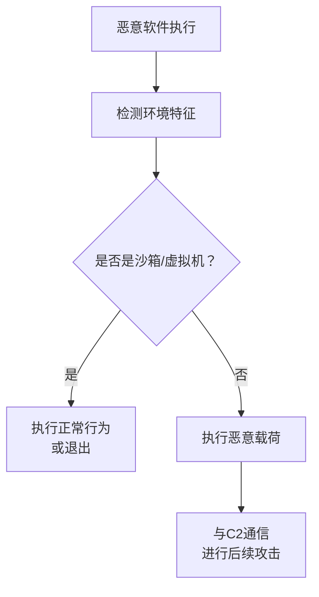

# 虚拟化/沙箱逃逸 (T1497)

## 一句话通俗理解

> **虚拟化/沙箱逃逸就是检测自己是否在笼子里** -- 如果你在动物园（沙箱），就装睡；如果在大自然（真实系统），就捕猎。

## 难度等级

- ⭐⭐⭐ 高级（需要较多基础）

需要了解虚拟化和沙箱环境与真实环境的差异。

## 技术描述

虚拟化/沙箱逃逸（Virtualization/Sandbox Evasion，T1497）是MITRE ATT&CK框架中防御削弱战术的重要技术。

**通俗解释：**
动物知道自己被关在动物园里就会装睡，不让游客看到它的真实习性。恶意软件也一样 -- 通过检测自己是否在安全沙箱中运行，如果是就不暴露恶意行为。这样安全分析师就永远看不到它的真实面目。

**技术原理：**
沙箱和虚拟化环境与真实系统有诸多差异：

1. **硬件特征检测**：检测CPU核心数（沙箱通常只有1-2核）、内存大小、硬盘大小
2. **进程检测**：检测沙箱特有的进程（如vmtoolsd.exe、procmon.exe、Wireshark）
3. **用户行为检测**：检测鼠标移动、键盘输入等真实用户行为
4. **时间检测**：检测系统运行时间（UpTime），沙箱通常刚刚启动
5. **MAC地址检测**：检测VMware/VirtualBox默认的MAC地址前缀
6. **注册表检测**：检测虚拟机工具安装的注册表键值

**用途与影响：**
虚拟化/沙箱逃逸是恶意软件逃避动态分析的关键技术。它使安全团队的分析效率大幅降低，因为大多数恶意软件在受控分析环境中不会执行恶意行为。

## 子技术列表

| 子技术ID | 中文名称 | 通俗解释 |
|----------|----------|----------|
| T1497.001 | 系统时间检测 | 检测系统运行时间，沙箱通常运行时间短 |
| T1497.002 | 用户活动检测 | 检测是否有鼠标移动等真实用户操作 |
| T1497.003 | 基于时间的逃逸 | 延迟执行等待沙箱超时释放 |

## 攻击流程



## 真实案例

### 案例1：Emotet使用沙箱检测（2014-2024年）
- **时间**: 2014-2024年
- **目标**: 全球金融机构和政府机构
- **攻击组织**: Emotet
- **手法**: Emotet在执行前会检测系统是否在分析环境中运行，包括检测常见分析工具进程、检测鼠标移动等。
- **参考**: [MITRE - Emotet S0367](https://attack.mitre.org/software/S0367/)

### 案例2：TrickBot检测虚拟机环境（2016-2024年）
- **时间**: 2016-2024年
- **目标**: 全球金融机构
- **攻击组织**: TrickBot
- **手法**: TrickBot检测VMware/VirtualBox硬件特征和常用分析工具进程。

### 案例3：QakBot使用长时间睡眠绕过沙箱分析（2023-2024年）
- **时间**: 2023-2024年
- **目标**: 全球金融、保险、法律行业
- **攻击组织**: QakBot
- **手法**: QakBot使用基于时间的逃逸技术，在下载实际载荷前执行长时间的Sleep操作（10-30分钟）。大多数沙箱分析环境的超时时间较短，在恶意软件实际执行前就已经超时释放，从而绕过动态分析检测。
- **参考**: [CISA - QakBot Advisory (2025)](https://www.cisa.gov/news-events/cybersecurity-advisories/aa24-316a)

## 红队视角

> ⚠️ **免责声明**：以下内容仅用于合法的安全测试、渗透测试和教育目的。未经授权对他人系统进行测试是违法行为。

**实战技巧：**
1. 使用Sleep/延迟执行是最简单的沙箱逃逸方法
2. 检测特定系统特征（如系统运行时间）是最可靠的方法

### 常用检测方法

| 检测目标 | 检测方法 | 绕过难度 |
|----------|----------|----------|
| 硬件特征 | CPU核心数、内存大小 | 低（沙箱可配置） |
| 进程检测 | 分析工具进程 | 中（可隐藏进程） |
| 用户行为 | 鼠标移动、系统运行时间 | 高（难以模拟） |

### 注意事项
- 沙箱可以配置模拟更多硬件资源
- 高级沙箱会模拟用户行为

## 蓝队视角

**检测要点：**
- 检测恶意软件执行前的Sleep/SleepEx调用
- 检测系统信息收集（CPU、内存、进程枚举）

**防御重点：**
- 使用更真实的沙箱环境（硬件资源、用户行为模拟）
- 延长沙箱分析时间
- 配置网络检测配合动态分析

## 检测建议

### 网络层检测

**检测方法：** 监控恶意软件在沙箱内延迟C2通信的行为（长时间Sleep后出站）

**具体规则/命令示例：**
```bash
# 检测长时间Sleep后的异常出站连接
alert tcp $HOME_NET any -> $EXTERNAL_NET any (msg:"Sandbox Evasion - Delayed C2 after Extended Sleep"; flow:to_server; classtype:trojan-activity; sid:1000058; rev:1;)

# 检测沙箱环境的DNS特征查询
alert udp $HOME_NET any -> $EXTERNAL_NET 53 (msg:"Sandbox Detection - VM Artifact DNS Query"; content:"|07|microsoft|03|com|00|"; nocase; classtype:attempted-recon; sid:1000059; rev:1;)
```

### 主机层检测

**检测方法：** 监控系统信息收集API调用模式、VM检测特征查询和长时间Sleep调用

**Windows事件ID：**
- 事件ID 4688：监控系统信息收集工具执行（wmic、systeminfo、msinfo32）
- 重点关注：收集CPU核心数、内存大小、系统运行时间、MAC地址等VM检测行为

**Linux日志：**
- 日志文件：`/var/log/audit/audit.log`
- 关键字段：`/proc/cpuinfo`、`/proc/meminfo`读取、`dmidecode -s system-uuid`执行

**具体命令示例：**
```powershell
# 检测VM检测相关WMI查询
Get-WinEvent -FilterHashtable @{LogName='Security';ID=4688} | Where-Object {$_.Message -match 'SELECT \* FROM Win32_ComputerSystem|Select \* from Win32_BIOS|NumberOfCores|TotalPhysicalMemory'}
```

### 应用层检测

**Sigma规则示例：**
```yaml
title: Sandbox Detection - System Information Gathering
status: experimental
description: Detects processes collecting system information for VM/sandbox detection
logsource:
    category: process_creation
    product: windows
detection:
    selection:
        CommandLine|contains:
            - 'SELECT * FROM Win32_ComputerSystem'
            - 'SELECT * FROM Win32_BIOS'
            - 'Get-WmiObject Win32_Processor'
            - 'NumberOfCores'
    condition: selection
level: low
tags:
    - attack.t1497
```

## 缓解措施

### 优先级1：关键措施

**措施名称：** 使用更真实的沙箱环境

**具体实施步骤：**
1. 在沙箱分析环境中模拟域加入和用户活动
2. 配置沙箱的CPU核心数、内存大小和磁盘容量接近真实用户环境
3. 设置沙箱的系统运行时间大于7天，避免短时间检测逻辑

**配置示例：**
```yaml
# 沙箱环境配置建议
sandbox:
  memory: 8GB
  cpu_cores: 4
  uptime_days: 7
  domain_joined: true
  user_activity: true
  network_simulation: true
```

### 优先级2：重要措施

**措施名称：** 配置网络检测以捕获逃逸行为

**具体实施步骤：**
1. 监控长时间Sleep后的C2通信（延迟信标检测）
2. 配置网络入侵检测系统识别环境检测工具的执行
3. 使用多个不同厂商的沙箱引擎进行交叉验证

**配置示例：**
```bash
# Suricata检测规则：长时间Sleep后的异常出站
alert tcp $HOME_NET any -> $EXTERNAL_NET any (msg:"Delayed C2 Communication - Possible Sandbox Evasion"; flow:to_server; classtype:trojan-activity; sid:1000066; rev:1;)
```

### MITRE ATT&CK缓解措施映射

| 缓解措施ID | 缓解措施名称 | 适用性 | 说明 |
|------------|-------------|--------|------|
| M1047 | 审计 | 适用 | 使用真实环境的行为分析检测逃逸行为 |
| M1040 | 防篡改 | 部分适用 | 使沙箱环境更接近真实生产环境 |
| M1031 | 网络入侵检测 | 适用 | 监控长时间Sleep后的异常C2通信 |
## 动手实验

> ⚠️ **重要提示**：所有实验必须在隔离的实验室环境中进行，禁止对未授权的真实系统进行测试。

### 实验1：检测虚拟机环境（初级）
```powershell
# 检测CPU核心数
$cpuCores = (Get-WmiObject Win32_ComputerSystem).NumberOfLogicalProcessors
# 检测内存大小
$memory = (Get-WmiObject Win32_ComputerSystem).TotalPhysicalMemory
# 检测系统运行时间
$uptime = (Get-Date) - (Get-CimInstance Win32_OperatingSystem).LastBootUpTime
```

### 实验2：简单的沙箱逃避（中级）
```c
// C语言中的时间延迟检测
Sleep(300000);  // 等待5分钟，沙箱可能超时释放
// 再执行恶意代码
```

### 实验3：检测分析工具进程（中级）
```powershell
$analysisProcesses = @("procmon", "Procmon64", "wireshark", "ProcessHacker",
                       "x64dbg", "x32dbg", "ollydbg", "ida")
$analysisProcesses | ForEach-Object {
    if (Get-Process -Name $_ -ErrorAction SilentlyContinue) {
        Write-Host "Analysis tool detected: $_"
    }
}
```

## 术语解释

| 术语 | 英文原名 | 通俗解释 |
|------|----------|----------|
| 沙箱 | Sandbox | 隔离的分析环境，用于安全检测恶意软件 |
| 逃逸 | Evasion | 绕过安全检测和分析的技术 |
| 延迟执行 | Time-based Evasion | 通过延迟执行绕过沙箱超时限制 |

## 参考资料

- [MITRE ATT&CK - T1497 Virtualization/Sandbox Evasion](https://attack.mitre.org/techniques/T1497/)
- [CISA - QakBot Advisory (2025)](https://www.cisa.gov/news-events/cybersecurity-advisories/aa24-316a)
- [MITRE - Emotet S0367](https://attack.mitre.org/software/S0367/)
