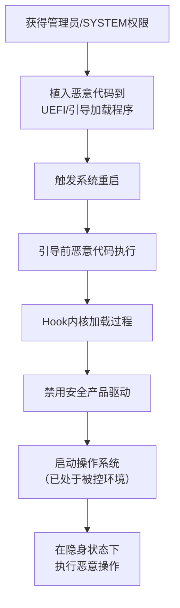

# 引导前启动 (T1542)

## 一句话通俗理解

> **引导前启动就是在系统启动前就动手脚** -- 在电脑开机还没加载操作系统之前，恶意代码就已经开始运行了，安全软件根本来不及阻止。

## 难度等级

- ⭐⭐⭐ 高级（需要深入技术知识）

需要深入理解操作系统引导机制、UEFI固件、内核驱动等底层技术，涉及Bootkit开发。

## 技术描述

引导前启动（Pre-OS Boot，T1542）是MITRE ATT&CK框架中防御削弱战术的一种高级技术。

**通俗解释：**
想象一下：你的电脑像一栋大楼，操作系统（Windows/Linux）是大楼里的保安团队。引导前启动技术相当于在小偷在大楼打地基的时候就已经进来了 -- 在保安还没上岗之前就控制了整栋大楼。无论保安多么警惕，他们都是在已经不安全的环境中工作，完全不知道大楼已经被入侵。

**技术原理：**
引导前启动技术通过在操作系统加载之前植入恶意代码，获得对系统的完全控制。攻击者可以修改引导过程的多个环节：

1. **UEFI固件感染**：将恶意代码写入主板闪存芯片，即使重装系统或更换硬盘，恶意代码仍然存在
2. **引导加载程序修改**：替换或修改Windows/Linux的引导加载程序（bootloader），在加载OS内核前注入代码
3. **MBR/VBR感染**：修改主引导记录或卷引导记录，在系统启动早期获得控制权
4. **Bootkit技术**：组合使用上述方法，在操作系统启动前植入内核级Rootkit，hook系统内核加载过程

**用途与影响：**
攻击者使用该技术可以在安全产品（EDR、防病毒、完整性监控）初始化之前获得代码执行权限，从而：
- 禁用安全产品的内核级驱动加载
- 修改安全产品的启动配置
- 隐藏恶意代码使其不被用户态安全工具检测
- 实现几乎无法被清除的持久化

## 子技术列表

**该技术共有 5 个子技术：**

| 子技术ID | 中文名称 | 通俗解释 |
|----------|----------|----------|
| T1542.001 | 系统固件 | 感染主板固件（UEFI/BIOS），在操作系统之前获得控制权 |
| T1542.002 | 组件固件 | 感染硬盘、网卡等硬件组件的固件 |
| T1542.003 | Bootkit | 安装引导工具包，在引导阶段加载内核级Rootkit |
| T1542.004 | ROMMONkit | 感染网络设备的ROMMON（ROM监控器）固件 |
| T1542.005 | 磁盘区域擦除 | 通过擦除磁盘特定区域破坏引导完整性 |

<details>
<summary><strong>展开查看各子技术详细说明</strong></summary>

### T1542.001 - 系统固件

**通俗理解：** 感染主板上存储固件的芯片，就像在房子的地基里埋了窃听器。

**详细说明：**
攻击者通过系统级或管理员权限向UEFI/BIOS固件写入恶意代码。由于固件存储在闪存芯片中，即使格式化硬盘、重装操作系统甚至更换硬盘，恶意代码仍然存在于系统中。固件级恶意软件可以hook操作系统引导过程，在每次启动时重新感染系统。

### T1542.003 - Bootkit

**通俗理解：** 在保安上班前就躲在保安室里，然后控制保安的一举一动。

**详细说明：**
Bootkit是一种特殊的引导级恶意软件，通过修改MBR、VBR或UEFI固件，在操作系统引导加载程序执行之前获得控制权。典型的Bootkit会在引导阶段hook操作系统内核的加载过程，在内核模式下注入恶意代码，使得操作系统在启动时就已经被感染。

</details>

## 攻击流程

### 典型攻击流程

```
植入固件/Bootkit --> 系统重启 --> 引导前代码执行 --> 操作系统启动 --> 安全产品失效
```



**步骤详解：**

1. **获得内核级访问权限**
   - 通俗描述：攻击者首先需要获取管理员或SYSTEM级别权限，才能访问固件和引导组件
   - 技术细节：通过漏洞利用（如BYOVD）或已获得的系统权限提升到内核级别
   - 常用工具：Mimikatz、BYOVD驱动、漏洞利用工具包

2. **植入恶意代码**
   - 通俗描述：将恶意代码写入固件芯片或引导加载程序
   - 技术细节：使用系统工具（如`fwupdate`）或自定义工具写入UEFI固件，修改MBR/VBR分区
   - 常用工具：Grub2、Refind、自定义Bootkit工具

3. **触发系统重启**
   - 通俗描述：等待或主动触发目标系统重启
   - 技术细节：可立即执行`shutdown /r /t 0`或等待用户正常重启
   - 常用工具：系统自带重启命令

4. **引导前代码执行**
   - 通俗描述：在操作系统加载前，恶意代码开始执行
   - 技术细节：固件中的恶意代码在UEFI DXE阶段执行，hook引导流程
   - 常用工具：UEFI DXE驱动、Bootkit载荷

5. **Hook内核加载过程**
   - 通俗描述：恶意代码拦截操作系统的加载过程，注入自己的代码
   - 技术细节：hook NtLoadDriver或修改引导配置文件（BCD），注入恶意内核驱动
   - 常用工具：自定义内核驱动、BCEdit

6. **安全产品失效**
   - 通俗描述：安全软件在一个已经被恶意代码控制的环境中启动，无法检测到异常
   - 技术细节：恶意驱动的SSDT hook隐藏恶意活动，使EDR/AV无法发现
   - 常用工具：内核Rootkit组件

## 真实案例

### 案例1：BlackLotus UEFI Bootkit绕过Secure Boot（2023年）

- **时间**: 2023年
- **目标**: 广泛目标（Windows系统用户）
- **攻击组织**: 未知（商业恶意软件）
- **手法**: BlackLotus是首个已知能在野外绕过UEFI Secure Boot的Bootkit。攻击者利用已撤销证书签名的引导加载程序漏洞（CVE-2022-21894），在系统引导阶段绕过Secure Boot保护。一旦系统启动，BlackLotus部署的内核驱动程序可以禁用安全产品、停止安全服务并阻止检测机制的加载。攻击者在操作系统的信任根（Secure Boot）层面削弱了系统防御，使得所有基于操作系统的安全控制在其面前均告失效。BlackLotus通过合法的Windows引导加载程序（bootmgfw.efi）加载其恶意载荷，在操作系统内核启动之前获得代码执行。
- **影响**: 受影响的系统完全失去安全保护，攻击者可以隐藏任何恶意活动
- **参考链接**: [Microsoft - BlackLotus Bootkit Analysis](https://www.microsoft.com/en-us/security/blog/2023/03/01/blacklotus-uefi-bootkit-myth-or-reality/)

### 案例2：TrickBot使用UEFI Bootkit削弱系统防御（2020年）

- **时间**: 2020年
- **目标**: 金融机构
- **攻击组织**: TrickBot组织
- **手法**: TrickBot银行木马的变种使用了UEFI Bootkit来在操作系统加载前获得代码执行。攻击者的Bootkit被植入到UEFI固件中，在操作系统引导加载程序启动之前执行。一旦执行，Bootkit可以hook操作系统内核的加载过程，禁用安全产品的内核级驱动加载，或者修改安全产品的启动配置。由于Bootkit在EDR和防病毒软件启动之前已经激活，这些安全产品在启动时已经运行在被篡改了的环境中，无法检测到Bootkit的存在。用户即使重装操作系统也无法清除这种感染。
- **影响**: 银行用户凭证被窃取，金融机构遭受重大经济损失
- **参考链接**: [Microsoft - TrickBot Evolving](https://www.microsoft.com/en-us/security/blog/2020/10/15/trickbot-banking-malware-evolves-with-new-modules-and-techniques/)

### 案例3：LoJax通过UEFI固件持久化并削弱防御（2018年）

- **时间**: 2018年
- **目标**: 欧洲政府机构
- **攻击组织**: APT28 (Fancy Bear / Sednit)
- **手法**: LoJax是首个在野外观察到的UEFI Bootkit。攻击者将恶意代码写入系统UEFI固件中，确保即使在操作系统重装或硬盘更换后，恶意代码仍然存在于系统中。由于恶意代码在UEFI固件层面运行，操作系统级别的安全产品无法扫描或删除它。LoJax在操作系统启动的早期阶段加载一个内核级Rootkit，用于隐藏其进程并禁用安全产品。这种固件级别的持久化和防御削弱技术使LoJax被认为是最隐蔽的威胁之一。ESET研究人员在发现该恶意软件后，花了大量时间才确认其感染来源是UEFI固件。
- **影响**: 欧洲政府机构长期遭受间谍活动，敏感信息被窃取
- **参考链接**: [ESET - LoJax UEFI Rootkit](https://www.welivesecurity.com/2018/09/27/lojax-first-uefi-rootkit-found-wild-courtesy-sednit-group/)

### 案例4：FinFisher使用Bootkit绕过操作系统安全控制

- **时间**: 2017-2020年
- **目标**: 人权活动家、记者的计算机
- **攻击组织**: 间谍软件供应商
- **手法**: FinFisher（也叫FinSpy）是一款商业间谍软件，其Bootkit组件在Windows引导阶段加载。它在MBR层面感染系统，在操作系统启动前加载其内核驱动，使其能够绕过Windows的安全启动机制和内核级保护。FinFisher的Bootkit可以将恶意代码注入到Windows内核中，禁用安全产品的内核级检测功能。
- **影响**: 目标用户的计算机被完全监视
- **参考链接**: [MITRE ATT&CK - T1542](https://attack.mitre.org/techniques/T1542/)

## 红队视角

> ⚠️ **免责声明**：以下内容仅用于合法的安全测试、渗透测试和教育目的。未经授权对他人系统进行测试是违法行为。

### 实战技巧

1. **使用BYOVD获取内核访问权限**
   通过加载存在漏洞的签名驱动（如RTCore64.sys）获取内核级读写能力，为植入引导前载荷做准备。

2. **利用管理工具写入固件**
   在获得管理员权限后，使用系统自带的固件管理工具（如`fwupdate`、`UEFITool`）或OEM提供的固件更新工具写入恶意固件。

3. **Bootkit与Rootkit配合使用**
   仅植入引导加载程序而不做持久hook，减少被发现的概率。Bootkit在引导阶段植入轻量级内核模块，该模块再下载完整的恶意负载。

### 常用工具

| 工具名称 | 用途 | 平台 | 链接 |
|----------|------|------|------|
| UEFITool | UEFI固件分析和修改工具 | Windows/Linux | [GitHub](https://github.com/LongSoft/UEFITool) |
| Chipsec | 固件安全分析框架 | Windows/Linux | [GitHub](https://github.com/chipsec/chipsec) |
| RWEverything | 硬件底层读写工具 | Windows | [官网](http://rweverything.com/) |
| BCDEdit | Windows引导配置编辑工具 | Windows | 系统自带 |
| Grub2 | Linux引导加载程序 | Linux | [官网](https://www.gnu.org/software/grub/) |

### 注意事项

- 引导前感染可能导致系统无法启动，需在测试环境中充分验证
- 固件写入操作存在硬件损坏风险（brick设备）
- 现代系统有Secure Boot和TPM保护，增加了攻击难度
- 固件级感染在取证分析中更容易被发现（如通过SPI闪存读取出）

## 蓝队视角

### 检测要点

1. **UEFI固件修改检测**
   - 日志来源：硬件安全审计日志、固件管理事件
   - 关注字段：UEFI固件版本、写入操作时间
   - 异常特征：非预期的固件更新操作、固件版本异常回退

2. **引导配置异常**
   - 日志来源：Windows事件日志（Event ID 12 - OS启动）
   - 关注字段：BCD配置修改、引导加载程序路径
   - 异常特征：BCEdit命令在非维护时间的执行

3. **内核驱动加载异常**
   - 日志来源：Sysmon事件ID 6（驱动加载），Windows事件ID 7045
   - 关注字段：驱动名称、签名状态、文件路径
   - 异常特征：未签名的内核驱动加载、来自非标准路径的驱动

### 监控建议

- 启用Secure Boot并正确配置签名数据库
- 启用TPM和Measured Boot进行引导完整性验证
- 监控BIOS/UEFI固件配置的修改事件
- 定期使用硬件安全工具扫描固件完整性
- 监控BCEdit工具的使用，特别是引导加载程序和内核调试设置

## 检测建议

### 网络层检测

**检测方法：** 引导前攻击通常不产生网络流量，但可检测后续C2通信

**具体规则/命令示例：**
```
# 监控Bootkit的C2通信流量
# 关注异常时段的DNS查询和HTTPS连接
```

### 主机层检测

**检测方法：** 监控引导组件完整性和驱动加载

**Windows事件ID：**
- 事件ID 5136：目录服务对象修改（可检测GPO修改）
- 事件ID 12：操作系统启动时间
- 事件ID 7045：服务安装（可检测驱动加载）
- Sysmon事件ID 6：驱动加载事件

**Linux日志：**
- 日志文件：`/var/log/messages`、`/var/log/kern.log`
- 关键字段：`dmesg`输出中的异常模块加载

**具体命令示例：**
```bash
# 检查Secure Boot状态
Confirm-SecureBootUEFI

# 检查已加载的内核驱动
driverquery /v | findstr Kernel

# 检查MBR完整性（Linux）
dd if=/dev/sda bs=512 count=1 | sha256sum
```

### 应用层检测

**Sigma规则示例：**
```yaml
title: BCDEdit Modification for Bootkit
status: experimental
description: Detects BCDEdit commands used to modify boot configuration for bootkit installation
logsource:
    category: process_creation
    product: windows
detection:
    selection:
        Image|endswith: '\bcdedit.exe'
        CommandLine|contains:
            - '/set'
            - 'bootstatuspolicy'
            - 'recoveryenabled'
    condition: selection
level: high
tags:
    - attack.t1542
```

## 缓解措施

### 优先级1：关键措施

**措施名称：** 启用Secure Boot和TPM

**具体实施步骤：**
1. 进入UEFI/BIOS设置启用Secure Boot
2. 配置正确的签名数据库（db/dbx）
3. 启用TPM 2.0并配置Measured Boot
4. 验证配置：`Confirm-SecureBootUEFI`和`Get-Tpm`

**配置示例：**
```powershell
# 验证Secure Boot状态
Confirm-SecureBootUEFI

# 验证TPM状态
Get-Tpm
```

### 优先级2：重要措施

**措施名称：** 配置UEFI管理员密码和启动策略

**具体实施步骤：**
1. 在UEFI设置中设置管理员密码防止未授权修改
2. 禁用从可移动介质引导的功能
3. 设置启动顺序固定为硬盘优先

### 优先级3：建议措施

**措施名称：** 定期固件安全审计

**具体实施步骤：**
1. 定期应用OEM固件安全更新
2. 使用Chipsec等工具定期扫描固件配置
3. 实施硬件Root of Trust架构（Intel Boot Guard / AMD PSP）

### MITRE ATT&CK缓解措施映射

| 缓解措施ID | 缓解措施名称 | 适用性 | 说明 |
|------------|-------------|--------|------|
| M1047 | 审计 | 适用 | 监控引导配置修改事件 |
| M1053 | 数据执行防护 | 适用 | 启用硬件DEP保护 |
| M1045 | 代码签名 | 适用 | 验证所有内核驱动和引导组件的签名 |
| M1026 | 特权账户管理 | 适用 | 限制可修改UEFI/引导配置的管理员权限 |
| M1018 | 用户账户管理 | 部分适用 | 限制标准用户修改系统引导配置 |

## 动手实验

> ⚠️ **重要提示**：所有实验必须在隔离的实验室环境中进行，禁止对未授权的真实系统进行测试。

### 实验环境准备

**推荐靶场/实验平台：**

| 平台名称 | 类型 | 难度 | 链接 |
|----------|------|------|------|
| Windows 10/11虚拟机 | 虚拟化 | 初级 | 使用Hyper-V或VMware |
| Kali Linux | 渗透测试OS | 中级 | [官网](https://www.kali.org/) |

**所需工具：**
- Windows 10/11虚拟机（建议使用快照功能）
- Sysinternals Suite（包含Sigcheck、Autoruns等）
- Chipsec固件安全分析工具

**环境搭建：**
```powershell
# 安装Sysinternals工具
winget install Microsoft.Sysinternals

# 下载Chipsec
git clone https://github.com/chipsec/chipsec.git
```

### 实验1：查看启动配置和安全状态（初级）

**实验目标：** 学习查看系统的引导配置和安全功能状态

**实验步骤：**
1. 以管理员身份打开PowerShell
2. 运行 `Confirm-SecureBootUEFI` 检查Secure Boot状态
3. 运行 `Get-Tpm` 检查TPM配置
4. 运行 `bcdedit /enum` 查看所有启动配置
5. 运行 `driverquery /v` 查看已加载的内核驱动列表

**预期结果：** 可以看到系统安全引导功能的配置状态和当前加载的驱动程序

**学习要点：** 了解系统引导安全的基础配置

### 实验2：异常驱动加载检测实验（中级）

**实验目标：** 配置Sysmon监控内核驱动加载事件

**实验步骤：**
1. 下载并安装Sysmon（使用默认配置或自定义配置文件）
2. 查看Sysmon事件ID 6（驱动加载）的日志：`Get-WinEvent -FilterHashtable @{LogName="Microsoft-Windows-Sysmon/Operational"; ID=6} | Select-Object -First 10`
3. 使用Chipsec扫描固件配置：`python chipsec_main.py`
4. 检查MBR/VBR完整性：使用 `Get-FileHash` 计算引导分区的哈希值

**预期结果：** Sysmon记录所有内核驱动加载事件，Chipsec报告固件安全状态

**学习要点：** 掌握内核驱动和固件的安全监控方法

### 实验3：模拟Bootkit攻击与检测（高级）

**实验目标：** 在隔离环境中模拟Bootkit攻击并检测其行为

**实验步骤：**
1. 创建一个快照保护的Windows 10虚拟机
2. 使用BCEdit修改引导配置模拟Bootkit行为：`bcdedit /set {default} bootstatuspolicy ignoreallfailures`
3. 观察事件日志中的引导配置修改记录
4. 使用Sysmon监控驱动加载变化
5. 恢复虚拟机快照

**预期结果：** 系统记录引导配置修改事件，安全监控工具能够检测到异常

**学习要点：** 理解Bootkit攻击的入口点和检测方法

## 术语解释

| 术语 | 英文原名 | 通俗解释 |
|------|----------|----------|
| UEFI | Unified Extensible Firmware Interface | 统一可扩展固件接口，现代计算机的固件标准，替代了传统的BIOS |
| Secure Boot | Secure Boot | 安全引导，UEFI的一项功能，确保只有经过签名的、可信的引导加载程序可以运行 |
| Bootkit | Bootkit | 引导工具包，一种恶意软件，在操作系统加载前获取控制权 |
| TPM | Trusted Platform Module | 可信平台模块，一种安全芯片，用于存储加密密钥和验证系统完整性 |
| MBR | Master Boot Record | 主引导记录，硬盘的第一个扇区，包含引导加载程序 |
| VBR | Volume Boot Record | 卷引导记录，分区中的引导扇区 |
| BCD | Boot Configuration Data | Windows引导配置数据，存储启动选项 |
| Measured Boot | Measured Boot | 度量引导，TPM记录引导过程的每个组件哈希值 |
| DXE | Driver Execution Environment | UEFI的驱动执行环境阶段，固件初始化过程中的一个阶段 |
| HVCI | Hypervisor-protected Code Integrity | Hypervisor保护的代码完整性，防止未签名驱动加载 |

## 参考资料

### 官方文档

- [MITRE ATT&CK - T1542 Pre-OS Boot](https://attack.mitre.org/techniques/T1542/)

### 安全报告

- [ESET - LoJax UEFI Rootkit Analysis](https://www.welivesecurity.com/2018/09/27/lojax-first-uefi-rootkit-found-wild-courtesy-sednit-group/)
- [Microsoft - BlackLotus Bootkit Analysis](https://www.microsoft.com/en-us/security/blog/2023/03/01/blacklotus-uefi-bootkit-myth-or-reality/)
- [CVE-2022-21894 - Secure Boot Bypass](https://msrc.microsoft.com/update-guide/vulnerability/CVE-2022-21894)

### 工具与资源

- [Chipsec固件安全分析框架](https://github.com/chipsec/chipsec)
- [UEFITool固件分析工具](https://github.com/LongSoft/UEFITool)
- [LOLDrivers - 漏洞驱动数据库](https://www.loldrivers.io/)

### 学习资料

- [UEFI Secure Boot入門](https://docs.microsoft.com/en-us/windows-hardware/design/device-experiences/oem-secure-boot)
- [Windows Boot Process - Microsoft Docs](https://docs.microsoft.com/en-us/windows-hardware/drivers/bringup/boot-and-uefi)
