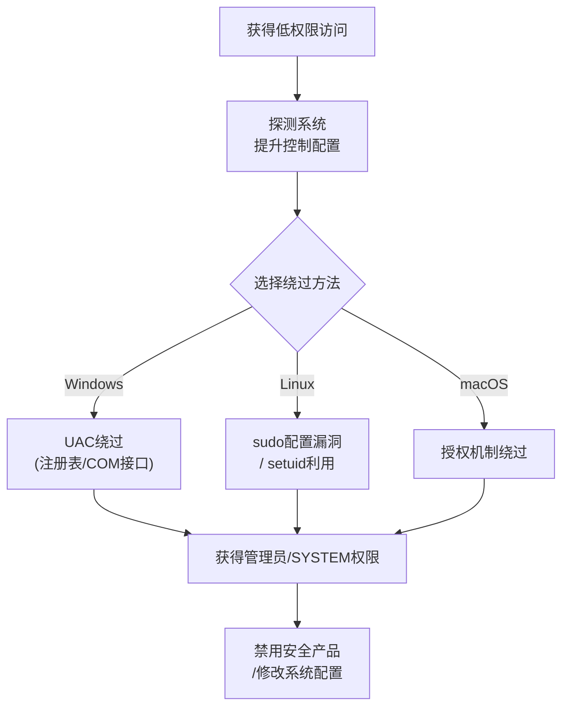

# 滥用提升控制机制 (T1548)

## 一句话通俗理解

> **滥用提升控制机制就是绕过权限检查直接提权** -- 本来需要管理员密码才能做的事情，攻击者找到了一条"秘密通道"，不需要密码就能以管理员身份执行。

## 难度等级

- ⭐⭐ 中级（需要一定基础）

需要了解操作系统的权限提升控制机制（UAC、sudo、setuid）和绕过方法。

## 技术描述

滥用提升控制机制（Abuse Elevation Control Mechanism，T1548）是MITRE ATT&CK框架中防御削弱战术的一种技术。

> 📚 **打个比方**：就像保险库需要两把钥匙同时开，但攻击者发现了一个漏洞——用一把钥匙尝试三次错误后，保险库会自动切换到"单钥匙模式"——滥用提升控制机制就是攻击者利用UAC、sudo等权限控制机制的设计缺陷或配置漏洞，绕过验证直接以最高权限执行操作。

**通俗解释：**
想象一下：公司的保险库需要经理和保安同时用钥匙才能打开（双人控制）。小偷偷偷发现了一个漏洞 -- 如果他用经理的钥匙试三次错误后，系统会自动切换到"单钥匙模式"。于是他只要偷到经理的钥匙就能打开保险库。这就是绕过提升控制机制 -- 不是硬碰硬，而是找到安全机制的漏洞。

**技术原理：**
操作系统设计了多种权限提升控制机制来防止未授权的管理员操作：

1. **Windows UAC（用户账户控制）**：即使以管理员账户登录，大多数操作也以标准用户权限运行，需要用户确认才能执行需要管理员权限的操作
2. **Linux/macOS sudo**：允许授权用户以其他用户（通常是root）身份执行命令，需要输入密码验证
3. **setuid/setgid**：允许可执行文件以文件所有者的权限运行

攻击者利用这些机制的设计缺陷或配置漏洞来绕过控制：

1. **UAC绕过**：利用自动提升的COM接口（如`fodhelper.exe`）、修改注册表禁用UAC或使用进程注入到已提升的进程
2. **sudo配置漏洞**：利用`NOPASSWD`配置、sudo缓存机制（`sudo -k`）或sudoers中的通配符漏洞
3. **setuid滥用**：利用存在漏洞的setuid二进制文件（如CVE-2021-4034 PwnKit）进行提权

**用途与影响：**
攻击者通过绕过提升控制机制获得管理员/root权限后，可以执行禁用安全产品、修改系统配置、关闭审计日志等防御削弱操作。

## 子技术列表

**该技术共有 6 个子技术：**

| 子技术ID | 中文名称 | 通俗解释 |
|----------|----------|----------|
| T1548.001 | Windows UAC绕过 | 找到不需要弹窗确认就能以管理员身份运行的方法 |
| T1548.002 | 绕过sudo | 利用sudo配置漏洞不需要密码就获得root权限 |
| T1548.003 | Sudo和Sudo缓存 | 利用sudo的凭据缓存机制，在超时时间内免密执行 |
| T1548.004 | setuid和setgid | 利用存在setuid漏洞的二进制文件提权 |
| T1548.005 | 临时提升控制 | 利用系统提供的临时提权机制获得更高权限 |
| T1548.006 | 通过策略绕过提升控制 | 利用组策略或安全策略配置漏洞绕过权限控制 |

<details>
<summary><strong>展开查看各子技术详细说明</strong></summary>

各子技术详细说明请参阅独立文档：

- [T1548.001 - Windows UAC绕过](./T1548/T1548.001-Bypass-User-Account-Control.md) — 找到一个不需要点击"是"就能偷偷用管理员权限执行程序的方法。
- [T1548.003 - Sudo和Sudo缓存](./T1548/T1548.003-Sudo-and-Sudo-Caching.md) — 使用sudo输入一次密码后，短时间内再使用sudo就不需要再输密码了，攻击者可以利用这个时间窗口。

</details>

## 攻击流程

### 典型攻击流程

```
获取低权限访问 --> 探测提升控制配置 --> 选择绕过方法 --> 执行提权 --> 以高权限执行操作
```



**步骤详解：**

1. **获得低权限访问**
   - 通俗描述：攻击者先通过钓鱼或漏洞获得一个普通用户权限
   - 技术细节：通过鱼叉式钓鱼邮件、漏洞利用或窃取的凭证获得低权限shell
   - 常用工具：Cobalt Strike、Metasploit

2. **探测提升控制配置**
   - 通俗描述：查看当前用户有哪些权限和哪些绕过机会
   - 技术细节：检查UAC级别、sudoers配置、寻找SUID二进制文件
   - 常用工具：`whoami /all`、`sudo -l`、`find / -perm -4000`

3. **选择并执行绕过方法**
   - 通俗描述：找到最适合当前系统的提权方法并使用它
   - 技术细节：执行UAC绕过命令或利用sudo配置漏洞
   - 常用工具：UACME工具包、`sudo -u root whoami`

4. **以高权限执行操作**
   - 通俗描述：获得管理员权限后立即执行目标操作
   - 技术细节：禁用安全产品、修改系统配置、关闭审计日志
   - 常用工具：`sc stop`、`Set-MpPreference`、`systemctl stop`

## 真实案例

### 案例1：Emotet使用UAC绕过削弱防御配置（2021年）

- **时间**: 2021年
- **目标**: 全球企业和政府
- **攻击组织**: Emotet/TA542
- **手法**: Emotet恶意软件利用UAC绕过技术（T1548.001）以高权限执行代码而不触发UAC提示。攻击者使用已知的UAC绕过方法（通过`fodhelper.exe`的自动提升COM接口）来启动以管理员权限运行的PowerShell命令。一旦获得静默的管理员权限，Emotet执行命令来禁用Windows Defender实时保护、添加防病毒排除路径和修改防火墙规则。通过绕过程序的UAC提升提示，Emotet在用户不知情的情况下削弱了系统的防御配置。
- **影响**: 企业网络大规模感染，数据泄露
- **参考链接**: [CISA - Emotet Malware](https://www.cisa.gov/news-events/alerts/2021/07/19/emotet-malware)

### 案例2：Raspberry Robin通过UAC绕过提升权限（2022年）

- **时间**: 2022年
- **目标**: 全球多个行业
- **攻击组织**: Raspberry Robin
- **手法**: Raspberry Robin蠕虫利用UAC绕过技术以管理员权限执行恶意代码。攻击者通过修改注册表中的`HKLM\SOFTWARE\Microsoft\Windows\CurrentVersion\Policies\System\EnableLUA`值或使用自动提升的COM调用绕过UAC提示。提升到管理员权限后，Raspberry Robin能够修改系统安全设置、停止Windows Defender服务并部署第二阶段恶意负载（如Clop勒索软件部署组件）。UAC绕过使Raspberry Robin能够在不需要管理员密码交互的情况下获得静默的高权限执行。
- **影响**: 全球多个企业网络被入侵，部分发展为勒索软件攻击
- **参考链接**: [Red Canary - Raspberry Robin](https://redcanary.com/blog/raspberry-robin/)

### 案例3：APT41使用sudo缓存提升Linux权限（2019-2021年）

- **时间**: 2019-2021年
- **目标**: 全球医疗、科技行业
- **攻击组织**: APT41 (Winnti Group)
- **手法**: APT41在入侵Linux服务器后利用sudo缓存（T1548.003）来提升权限。攻击者在获得非特权shell后，检查当前用户的sudo权限配置（`/etc/sudoers`），发现sudo配置为`NOPASSWD`或以缓存了凭据。利用sudo缓存，APT41可以以root权限执行命令来削弱系统防御，包括修改iptables规则以允许出站连接、停止审计服务（auditd）和禁用SELinux。通过利用sudo配置漏洞，APT41从标准用户权限提升到完全的root权限来禁用系统防御。
- **影响**: 多个医疗和科技公司遭受高级持续性威胁攻击
- **参考链接**: [Google Cloud - APT41 Analysis](https://cloud.google.com/blog/topics/threat-intelligence/apt41-arisen-from-dust)

### 案例4：PwnKit（CVE-2021-4034）setuid提权漏洞

- **时间**: 2022年（公开披露）
- **目标**: 所有Linux系统（广泛目标）
- **攻击组织**: 多个APT组织和勒索软件团伙
- **手法**: PwnKit是pkexec（一个setuid二进制文件）中的内存损坏漏洞，允许任何标准用户在默认配置的Linux系统上获得完整的root权限。攻击者只需在受影响系统上运行一个利用脚本即可将权限从标准用户提升到root。获得root后，攻击者可以禁用auditd日志、修改iptables规则、卸载防病毒软件。
- **影响**: 几乎所有Linux发行版受影响，漏洞利用简单
- **参考链接**: [CVE-2021-4034 PwnKit](https://access.redhat.com/security/cve/cve-2021-4034)

## 红队视角

> ⚠️ **免责声明**：以下内容仅用于合法的安全测试、渗透测试和教育目的。未经授权对他人系统进行测试是违法行为。

### 实战技巧

1. **UAC绕过优先级**
   推荐使用`fodhelper.exe`和`computerdefaults.exe`绕过方法，因为它们在大多数Windows版本上有效且不需要交互。UACME项目维护了多种绕过方法列表。

2. **sudo配置检查清单**
   获得标准用户shell后立即检查：`sudo -l`查看允许的命令；检查`/etc/sudoers`中的通配符漏洞（如`/usr/bin/vim *`允许任何文件编辑）；利用`sudo -k`清除缓存的技巧。

3. **setuid提权自动化**
   使用`linpeas.sh`或`GTFOBins`快速寻找可用的setuid二进制文件。优先检查已知漏洞（如PwnKit、CVE-2023-32233）。

### 常用工具

| 工具名称 | 用途 | 平台 | 链接 |
|----------|------|------|------|
| UACME | Windows UAC绕过工具集合 | Windows | [GitHub](https://github.com/hfiref0x/UACME) |
| LinPEAS | Linux权限提升枚举脚本 | Linux | [GitHub](https://github.com/carlospolop/PEASS-ng) |
| WinPEAS | Windows权限提升枚举脚本 | Windows | [GitHub](https://github.com/carlospolop/PEASS-ng) |
| GTFOBins | Unix二进制文件提权利用库 | Linux/macOS | [官网](https://gtfobins.github.io/) |
| PowerSploit | PowerShell渗透框架 | Windows | [GitHub](https://github.com/PowerShellMafia/PowerSploit) |

### 注意事项

- UAC绕过需要在管理员账户上下文中执行，普通账户无法绕过UAC
- sudo缓存在某些系统上可能被禁用或配置为0超时
- 提权操作会在Windows安全事件ID 4672（特殊权限登录）和Linux auth.log中留下记录

## 蓝队视角

### 检测要点

1. **UAC绕过行为检测**
   - 日志来源：Windows事件日志（Event ID 4688），Sysmon
   - 关注字段：父进程-子进程关系、命令行参数
   - 异常特征：`fodhelper.exe`、`cmstp.exe`等自动提升程序执行非标准子进程（如PowerShell、cmd.exe）

2. **sudo异常使用**
   - 日志来源：Linux `/var/log/auth.log`，`/var/log/secure`
   - 关注字段：sudo命令、执行用户、目标用户、PTS终端
   - 异常特征：非标准时间段的sudo执行、从未见到的终端执行sudo

3. **setuid滥用检测**
   - 日志来源：文件完整性监控（FIM），auditd
   - 关注字段：setuid权限的二进制文件、异常进程创建
   - 异常特征：标准用户执行不常用的setuid二进制文件

### 监控建议

- 配置UAC为最高级别（始终通知），强制所有提权操作需要管理员批准
- 实施应用程序控制策略限制UAC绕过工具的使用
- 使用标准用户账户而非管理员账户进行日常工作
- 配置sudo要求每次都输入密码（`Defaults timestamp_timeout=0`）
- 定期审计sudoers配置，确保没有不合理的权限配置
- 限制setuid二进制文件的创建和使用

## 检测建议

### 网络层检测

**检测方法：** 提权行为本身不产生网络流量，但提权后的操作（如下载工具、C2通信）可被检测

**具体规则/命令示例：**
```
# 监控提权后的异常网络连接
```

### 主机层检测

**检测方法：** 监控进程创建关系和提权事件

**Windows事件ID：**
- 事件ID 4672：为新登录分配特殊权限（管理员登录成功）
- 事件ID 4688：新进程创建（监控父进程为常见UAC绕过工具）
- 事件ID 5379：凭据管理器被读取

**Linux日志：**
- 日志文件：`/var/log/auth.log`、`/var/log/secure`
- 关键字段：`sudo`命令执行记录、`su`命令记录

**具体命令示例：**
```bash
# Windows: 查看UAC级别
Get-ItemProperty -Path "HKLM:\SOFTWARE\Microsoft\Windows\CurrentVersion\Policies\System" -Name "EnableLUA"

# Linux: 检查sudo配置
sudo -l

# Linux: 查找setuid文件
find / -perm -4000 -type f 2>/dev/null
```

### 应用层检测

**Sigma规则示例：**
```yaml
title: UAC Bypass via Fodhelper
status: experimental
description: Detects UAC bypass attempts using fodhelper.exe
logsource:
    category: process_creation
    product: windows
detection:
    selection:
        ParentImage|endswith: '\fodhelper.exe'
        Image|endswith:
            - '\powershell.exe'
            - '\cmd.exe'
    condition: selection
level: high
tags:
    - attack.t1548
```

## 缓解措施

### 优先级1：关键措施

**措施名称：** 配置UAC最高保护级别

**具体实施步骤：**
1. 通过组策略设置UAC级别：`Security Settings > Local Policies > Security Options > User Account Control: Behavior of the elevation prompt for administrators in Admin Approval Mode`设置为"提示凭据"
2. 禁用自动提升：设置`EnableLUA`为1，`ConsentPromptBehaviorAdmin`为2
3. 使用标准用户账户进行日常工作

**配置示例：**
```
# 组策略方式
计算机配置 > Windows设置 > 安全设置 > 本地策略 > 安全选项
用户账户控制：管理员批准模式中管理员的提升权限提示的行为 - 设置为"提示凭据"
```

### 优先级2：重要措施

**措施名称：** sudo安全强化

**具体实施步骤：**
1. 设置sudo超时：`Defaults timestamp_timeout=0`
2. 禁用root登录：`PermitRootLogin no`
3. 最小化sudoers权限，避免使用通配符
4. 定期审计sudoers文件

### 优先级3：建议措施

**措施名称：** 定期权限审计

**具体实施步骤：**
1. 定期扫描setuid/setgid文件，审计其必要性
2. 监控并审计管理员组和sudo用户列表的变更
3. 实施Just-In-Time (JIT)管理访问控制

### MITRE ATT&CK缓解措施映射

| 缓解措施ID | 缓解措施名称 | 适用性 | 说明 |
|------------|-------------|--------|------|
| M1047 | 审计 | 适用 | 监控提升控制机制的绕过尝试 |
| M1026 | 特权账户管理 | 适用 | 限制高权限账户的使用场景 |
| M1018 | 用户账户管理 | 适用 | 用户和组权限的合理配置 |
| M1028 | 操作系统配置 | 适用 | UAC和sudo的安全配置 |

## 动手实验

> ⚠️ **重要提示**：所有实验必须在隔离的实验室环境中进行，禁止对未授权的真实系统进行测试。

### 实验环境准备

**推荐靶场/实验平台：**

| 平台名称 | 类型 | 难度 | 链接 |
|----------|------|------|------|
| Windows 10/11虚拟机 | 虚拟化 | 初级 | 使用Hyper-V或VMware |
| Kali Linux | 渗透测试OS | 中级 | [官网](https://www.kali.org/) |
| HackTheBox | 在线CTF | 中级 | [官网](https://www.hackthebox.com/) |

**所需工具：**
- Windows虚拟机（管理员权限）
- Linux虚拟机（标准用户权限）

**环境搭建：**
```powershell
# Windows环境准备
# 1. 创建一个标准用户账户
New-LocalUser -Name "TestUser" -Password (ConvertTo-SecureString "Password123!" -AsPlainText -Force)
Add-LocalGroupMember -Group "Users" -Member "TestUser"

# 2. 查看当前UAC级别
Get-ItemProperty -Path "HKLM:\SOFTWARE\Microsoft\Windows\CurrentVersion\Policies\System"
```

### 实验1：查看UAC配置和学习UAC绕过原理（初级）

**实验目标：** 了解UAC的配置和常见的UAC绕过技术原理

**实验步骤：**
1. 使用管理员账户登录虚拟机
2. 运行 `reg query "HKLM\SOFTWARE\Microsoft\Windows\CurrentVersion\Policies\System"` 查看UAC相关注册表
3. 查看 `EnableLUA`、`ConsentPromptBehaviorAdmin`、`PromptOnSecureDesktop` 的值
4. 使用Process Explorer查看"自动提升"系统进程的属性
5. 测试运行需要管理员权限的命令，观察UAC弹窗

**预期结果：** 了解UAC的工作机制和注册表配置项

**学习要点：** UAC不是安全边界，但它提高了攻击门槛

### 实验2：Linux sudo配置审计（中级）

**实验目标：** 学习检查sudo配置和发现配置漏洞

**实验步骤：**
1. 以标准用户登录Linux虚拟机
2. 运行 `sudo -l` 查看当前用户可执行的sudo命令
3. 查看 `/etc/sudoers` 文件：`cat /etc/sudoers`
4. 查看 `/etc/sudoers.d/` 目录下的自定义配置
5. 测试绕过`NOPASSWD`配置：如果有`NOPASSWD: ALL`，直接执行 `sudo whoami`

**预期结果：** 发现sudo配置中的潜在安全问题

**学习要点：** sudoers配置中的常见安全风险和审计方法

### 实验3：使用setuid文件提权实验（高级）

**实验目标：** 模拟利用setuid二进制文件进行权限提升

**实验步骤：**
1. 在Linux虚拟机中创建测试文件：`touch /tmp/test.sh`
2. 设置setuid位：`chmod 4755 /tmp/test.sh`
3. 查看文件权限：`ls -la /tmp/test.sh`（注意是`-rwsr-xr-x`）
4. 使用GTFOBins查找可提权的setuid二进制文件
5. 尝试运行存在已知漏洞的提权利用（如CVE-2021-4034 PwnKit）

**预期结果：** 理解setuid权限提升的原理和风险

**学习要点：** setuid二进制文件是Linux权限提升的主要攻击面

## 术语解释

| 术语 | 英文原名 | 通俗解释 |
|------|----------|----------|
| UAC | User Account Control | 用户账户控制，Windows的安全功能，防止未授权的管理操作 |
| sudo | superuser do | Linux/Unix中以其他用户身份执行命令的工具 |
| setuid | Set User ID | Linux/Unix权限位，允许文件以所有者身份运行 |
| setgid | Set Group ID | Linux/Unix权限位，允许文件以所属组身份运行 |
| Auto-elevate | Auto Elevation | Windows中某些签名程序自动提升权限的机制 |
| COM | Component Object Model | Windows组件对象模型，一种程序通信标准 |
| sudoers | Sudoers File | sudo的配置文件，定义谁可以执行什么命令 |
| PwnKit | PwnKit (CVE-2021-4034) | pkexec中的本地提权漏洞，影响几乎所有Linux发行版 |
| JIT | Just-In-Time | 即时访问权限管理，临时授予高权限 |

## 参考资料

### 官方文档

- [MITRE ATT&CK - T1548 Abuse Elevation Control Mechanism](https://attack.mitre.org/techniques/T1548/)
- [MITRE ATT&CK - T1548.001 UAC Bypass](https://attack.mitre.org/techniques/T1548/001/)

### 安全报告

- [Red Canary - UAC Bypass Techniques](https://redcanary.com/blog/uac-bypass-techniques/)
- [Google Cloud - APT41 Analysis](https://cloud.google.com/blog/topics/threat-intelligence/apt41-arisen-from-dust)
- [CVE-2021-4034 PwnKit Analysis](https://access.redhat.com/security/cve/cve-2021-4034)

### 工具与资源

- [UACME UAC绕过工具集](https://github.com/hfiref0x/UACME)
- [GTFOBins - Unix提权利用库](https://gtfobins.github.io/)
- [PEASS-ng - 权限提升枚举套件](https://github.com/carlospolop/PEASS-ng)

### 学习资料

- [Windows UAC 技术深度分析](https://docs.microsoft.com/en-us/windows/security/identity-protection/user-account-control/user-account-control-overview)
- [Linux sudo 配置指南](https://www.sudo.ws/docs/man/sudoers.man/)
