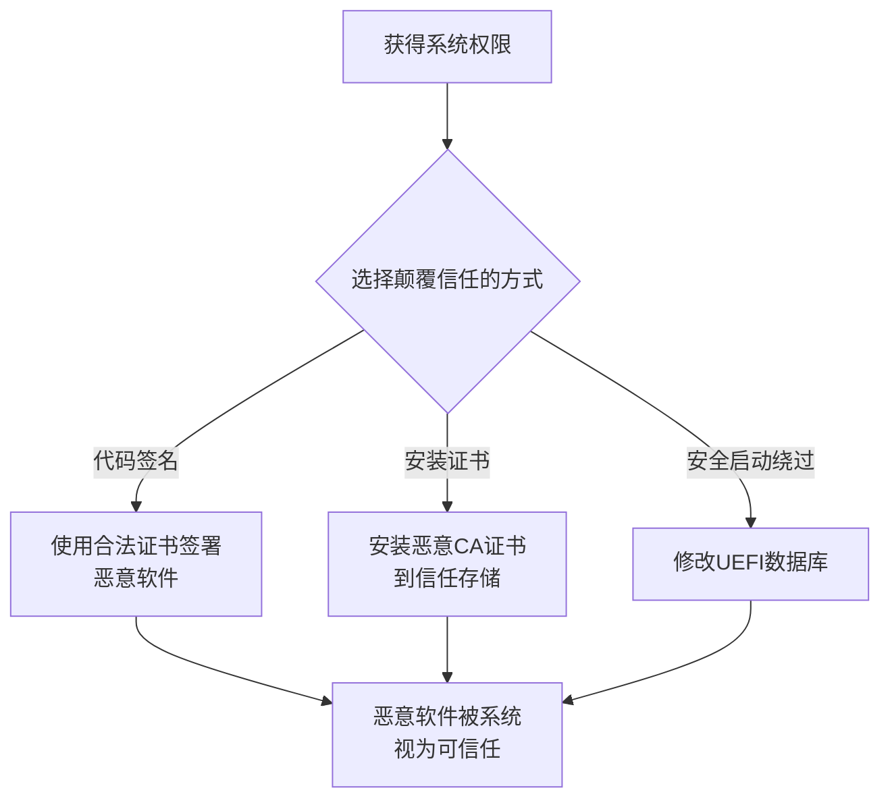

# 颠覆信任控制 (T1553)

## 一句话通俗理解

> **颠覆信任控制就是伪造身份证或贿赂安检** -- 让系统以为你是可信的，实际上你是假冒的。

## 难度等级

- ⭐⭐⭐ 高级（需要较多基础）

需要理解代码签名、证书管理和操作系统信任机制。

## 技术描述

颠覆信任控制（Subvert Trust Controls，T1553）是MITRE ATT&CK框架中防御削弱战术的技术。

**通俗解释：**
机场安检：你的登机牌需要验证、你的身份证需要核验、你还需要过安检门。攻击者要做的，就是让所有这些验证都说"OK" -- 伪造签名、篡改证书信任列表、关闭安全启动验证，这样任何恶意代码都能畅行无阻。

**技术原理：**
操作系统有多种信任验证机制，攻击者通过颠覆这些机制绕过安全检测：

1. **代码签名**：使用窃取或购买的合法代码签名证书签署恶意软件
2. **数字证书验证**：在本地安装自签名的CA证书，使签名验证通过
3. **安全启动**：篡改UEFI安全启动的数据库，允许加载未签名驱动
4. **安装根证书**：在目标机构中安装攻击者控制的根证书

**用途与影响：**
颠覆信任控制是最高级的防御削弱技术之一。一旦破坏了信任链，攻击者的恶意软件可以像合法软件一样运行，安全产品无法通过数字签名区分。

## 子技术列表

| 子技术ID | 中文名称 | 通俗解释 |
|----------|----------|----------|
| T1553.001 | 代码签名 | 给恶意程序签上有序的数字签名 |
| T1553.002 | 安装根证书 | 在受信任的根证书颁发机构中安装攻击者控制的证书 |
| T1553.003 | SIP信任提供方劫持 | 劫持Windows软件完整性策略（SIP）信任提供方 |
| T1553.004 | 安全启动绕过 | 篡改UEFI安全启动数据库允许加载未签名驱动 |
| T1553.005 | 安装根证书 | 安装额外的根证书颁发机构以通过签名验证 |

## 攻击流程



## 真实案例

### 案例1：APT41使用合法证书签署恶意驱动（2024年）
- **时间**: 2024年
- **目标**: 全球技术公司和游戏公司
- **攻击组织**: APT41
- **手法**: APT41使用窃取的合法代码签名证书签署其内核驱动和用户态工具。签署的恶意驱动被加载到受保护的系统进程中，由于数字签名有效，可以绕过Windows驱动签名策略和WDAC限制。
- **参考**: [Mandiant - APT41](https://www.mandiant.com/resources/apt41-global-activity)

### 案例2：Lazarus使用Apple Developer证书（2024年）
- **时间**: 2024年
- **目标**: 加密货币公司、区块链开发者
- **攻击组织**: Lazarus Group
- **手法**: Lazarus集团利用苹果企业开发者计划获取合法企业签名证书，签署macOS恶意软件。
- **参考**: [CISA - Lazarus Advisory](https://www.cisa.gov/news-events/cybersecurity-advisories/aa24-038a)

### 案例3：BlackLotus UEFI Bootkit绕过安全启动（2023年）
- **时间**: 2023年
- **目标**: Windows系统
- **攻击组织**: BlackLotus
- **手法**: BlackLotus bootkit利用CVE-2022-21894漏洞绕过UEFI安全启动。攻击者修改安全启动的数据库，添加恶意引导加载器的哈希值，使未签名的恶意组件在系统启动过程中被信任。

- **参考**: [ESET - BlackLotus UEFI Bootkit](https://www.welivesecurity.com/2023/03/01/blacklotus-uefi-bootkit-myth-confirmed/)

### 案例4：Pupy RAT使用签名的可执行文件安装根证书（2023年）
- **时间**: 2023年
- **目标**: 全球企业
- **攻击组织**: 多个APT组织
- **手法**: 攻击者使用合法签名安装攻击者控制的根证书到目标系统。通过在目标系统的信任存储中添加攻击者的CA证书，使后续签署的所有恶意软件都被系统视为可信。

## 红队视角

> ⚠️ **免责声明**：以下内容仅用于合法的安全测试、渗透测试和教育目的。未经授权对他人系统进行测试是违法行为。

**实战技巧：**
1. 代码签名证书是最有价值的资源，需要谨慎使用
2. 安装根证书可以在目标系统上建立持久的信任基础

### 常用工具

| 工具名称 | 用途 | 平台 |
|----------|------|------|
| signtool | 代码签名工具 | Windows |
| certutil | 证书管理工具 | Windows |
| MakeCert | 创建测试证书 | Windows |

### 注意事项
- 窃取或购买的签名证书可能被吊销
- 安装根证书需要管理员权限

## 蓝队视角

**检测要点：**
- 监控系统信任存储中的证书添加事件
- 监控使用已知被盗签名证书的软件
- 检测安全启动数据库修改

**防御重点：**
- 启用Windows Defender Application Control（WDAC）
- 监控证书信任列表的修改
- 使用证书吊销列表（CRL）检查

## 检测建议

### 网络层检测

**检测方法：** 监控证书吊销检查绕过、证书透明度异常和TLS证书异常

**具体规则/命令示例：**
```bash
# 检测证书吊销检查绕过
alert tcp $HOME_NET any -> $EXTERNAL_NET any (msg:"Certificate Trust Subversion - CRL Check Bypass"; flow:to_server; content:"certutil -urlfetch"; nocase; classtype:policy-violation; sid:1000060; rev:1;)

# 检测自签名或异常证书的TLS通信
alert tcp $HOME_NET any -> $EXTERNAL_NET any (msg:"Unusual TLS Certificate - Self-Signed"; tls_store; ssl_version; classtype:policy-violation; sid:1000061; rev:1;)
```

### 主机层检测

**检测方法：** 监控证书信任存储修改、驱动签名绕过和代码完整性绕过

**Windows事件ID：**
- 事件ID 4688：检测certutil、certmgr等证书管理工具的执行
- Sysmon事件ID 6（DriverLoad）：监控未签名驱动的加载
- 事件ID 6423：WDAC(Windows Defender Application Control)阻止未授权程序执行
- 事件ID 6281：代码完整性检查失败

**Linux日志：**
- 日志文件：`/var/log/audit/audit.log`
- 关键字段：`modprobe`加载未签名内核模块、`update-ca-certificates`修改证书信任

**具体命令示例：**
```powershell
# 检测证书存储修改
Get-WinEvent -FilterHashtable @{LogName='Security';ID=4688} | Where-Object {$_.Message -match 'certutil -addstore|certmgr|TrustedPublisher'}
```

### 应用层检测

**Sigma规则示例：**
```yaml
title: Certificate Trust Store Modification
status: experimental
description: Detects modifications to certificate trust stores
logsource:
    service: security
    product: windows
detection:
    selection:
        EventID: 4688
        CommandLine|contains:
            - 'certutil -addstore'
            - 'certmgr'
            - 'TrustedPublisher'
            - 'Root\LocalMachine'
    condition: selection
level: high
tags:
    - attack.t1553
```

## 缓解措施

### 优先级1：关键措施

**措施名称：** 部署WDAC审核和强制策略

**具体实施步骤：**
1. 启用Windows Defender Application Control（WDAC）强制策略
2. 配置仅允许经过签名的驱动和可执行文件运行
3. 启用HVCI（Hypervisor-protected Code Integrity）保护内核完整性

**配置示例：**
```powershell
# 配置WDAC策略
New-CIPolicy -FilePath "C:\Policy.xml" -Level Publisher -ScanPath "C:\Windows\System32"
ConvertFrom-CIPolicy -XmlFilePath "C:\Policy.xml" -BinaryFilePath "C:\Policy.bin"
```

### 优先级2：重要措施

**措施名称：** 实施严格的证书管理策略

**具体实施步骤：**
1. 限制谁有权将证书添加到受信任的根存储
2. 定期审计证书信任存储中的异常证书
3. 启用证书透明度（CT）监控异常证书签发

**配置示例：**
```powershell
# 查看受信任的根证书
Get-ChildItem -Path "Cert:\LocalMachine\Root" | Format-Table Subject, Thumbprint, NotAfter
```

### MITRE ATT&CK缓解措施映射

| 缓解措施ID | 缓解措施名称 | 适用性 | 说明 |
|------------|-------------|--------|------|
| M1054 | 软件配置 | 适用 | 部署WDAC审核和强制策略 |
| M1040 | 防篡改 | 适用 | 启用HVCI保护代码完整性 |
| M1026 | 特权账户管理 | 适用 | 实施严格的证书管理策略 |
## 动手实验

> ⚠️ **重要提示**：所有实验必须在隔离的实验室环境中进行，禁止对未授权的真实系统进行测试。

### 实验1：使用MakeCert创建测试证书（初级）
```powershell
# 创建测试证书
New-SelfSignedCertificate -Type CodeSigningCert -Subject "CN=Test" `
    -CertStoreLocation "Cert:\CurrentUser\My"
```

### 实验2：验证文件签名（初级）
```powershell
# 检查文件签名状态
Get-AuthenticodeSignature C:\Windows\System32\notepad.exe
```

### 实验3：安装测试根证书（中级）
```powershell
# 将自签名证书添加到"受信任的根证书颁发机构"存储
certutil -addstore Root test.cer
```

## 术语解释

| 术语 | 英文原名 | 通俗解释 |
|------|----------|----------|
| 代码签名 | Code Signing | 给软件添加数字签名，证明发布者的身份 |
| 安全启动 | Secure Boot | UEFI的启动安全机制，只允许签名的启动加载器 |
| HVCI | Hypervisor-protected Code Integrity | 使用Hyper-V保护的代码完整性检查 |
| WDAC | Windows Defender Application Control | Windows应用控制策略 |

## 参考资料

- [MITRE ATT&CK - T1553 Subvert Trust Controls](https://attack.mitre.org/techniques/T1553/)
- [ESET - BlackLotus UEFI Bootkit](https://www.welivesecurity.com/2023/03/01/blacklotus-uefi-bootkit-myth-confirmed/)
- [CISA - Lazarus Group Advisory](https://www.cisa.gov/news-events/cybersecurity-advisories/aa24-038a)
