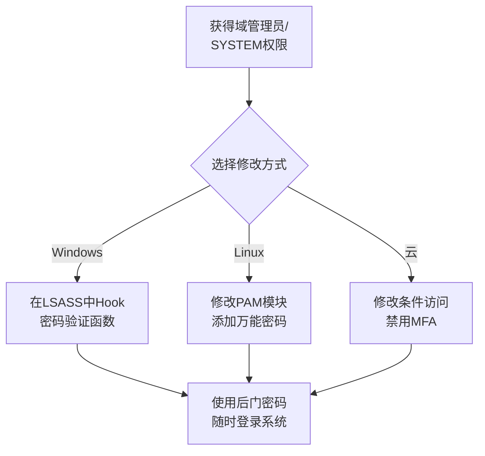

# 修改认证过程 (T1556)

## 一句话通俗理解

> **修改认证过程就是给门禁系统加装后门** -- 修改了大门的验证系统，让管理员输入特定"暗号"也能开门。

## 难度等级

- ⭐⭐⭐ 高级（需要较多基础）

需要了解Windows认证机制和系统级编程。

## 技术描述

修改认证过程（Modify Authentication Process，T1556）是MITRE ATT&CK框架中防御削弱战术的重要技术。

> 📚 **打个比方**：就像攻击者在门禁系统的验证逻辑上动了手脚——现在不仅管理员能开门，任何人输入"12345"这个暗号也能通过验证。修改认证过程就是攻击者篡改LSASS、PAM等身份认证组件，植入后门密码或绕过认证检查。

**通俗解释：**
大楼的门禁系统验证你的身份后才会开门。攻击者入侵后修改了门禁系统的逻辑：现在不仅管理员能开门，任何人输入"12345"都能开门 -- 这就是后门密码。攻击者修改系统的身份认证过程（如LSASS、PAM等），使特定的"暗号"也能通过认证。

**技术原理：**
Windows认证过程中的关键组件：

1. **LSASS（Local Security Authority Subsystem Service）**：Windows安全认证核心，处理登录验证
2. **Kerberos**：域身份认证协议
3. **NTLM**：Windows NT LAN Manager认证协议
4. **PAM（Pluggable Authentication Modules）**：Linux可插拔认证模块

**主要攻击方法：**

- **LSASS Hook**：在LSASS进程中Hook密码验证函数，记录密码或添加后门
- **域控制器DCSync**：通过复制域控凭据获得所有域账户哈希
- **Golden Ticket/Silver Ticket**：伪造Kerberos票证冒充任意用户
- **SSH后门**：修改SSH服务器验证逻辑或添加授权密钥
- **PAM后门**：在Linux系统中修改PAM模块添加后门密码

**用途与影响：**
修改认证过程是最隐蔽的后门技术之一。攻击者植入后门后，可以使用特定的"万能密码"登录任何系统，无需担心密码更改或账户禁用。

## 子技术列表

| 子技术ID | 中文名称 | 通俗解释 |
|----------|----------|----------|
| T1556.001 | 域控制器认证 | 修改域控制器上的认证过程 |
| T1556.002 | 密码过滤器DLL | 通过密码过滤器记录用户密码 |
| T1556.003 | 网络安全服务DLL | 修改网络认证服务 |
| T1556.004 | 网络设备认证 | 修改网络设备的认证过程 |
| T1556.005 | 基于PAM的认证 | 修改Linux PAM模块添加后门 |
| T1556.006 | 多因素认证操作 | 绕过或禁用MFA验证 |

## 攻击流程



## 真实案例

### 案例1：Emotet LSASS凭据窃取（2014-2024年）
- **时间**: 2014-2024年
- **目标**: 全球金融机构和政府
- **攻击组织**: Emotet
- **手法**: Emotet通过LSASS进程中的凭据Dumping获取用户凭据。

### 案例2：APT29修改LSASS配置进行凭据转储（2023-2024年）
- **时间**: 2023-2024年
- **目标**: 全球政府、外交部门
- **攻击组织**: APT29（Cozy Bear）
- **手法**: APT29利用Mimikatz在LSASS进程中执行操作，通过Hook认证API获取用户明文密码。

### 案例3：Scattered Spider通过MFA疲劳攻击禁用认证保护（2024年）
- **时间**: 2024年
- **目标**: 大型企业
- **攻击组织**: Scattered Spider
- **手法**: Scattered Spider通过MFA疲劳攻击（不断发送MFA申请，直到用户疲劳接受）获得目标会话的认证访问权限。获取初始访问权限后，攻击者在Azure AD中修改条件访问策略，直接禁用了针对某些用户的MFA要求。
- **影响**: 攻击者可以绕过MFA保护访问云应用
- **参考**: [CISA - Scattered Spider Advisory](https://www.cisa.gov/news-events/cybersecurity-advisories/aa24-038a)

### 案例4：mimikatz万能密码（2014-2024年）
- **时间**: 2014-2024年
- **目标**: 全球范围
- **手法**: 通过修改LSASS创建一个万能密码（master password），允许攻击者使用任何用户名组合该密码进行身份验证。

## 红队视角

> ⚠️ **免责声明**：以下内容仅用于合法的安全测试、渗透测试和教育目的。未经授权对他人系统进行测试是违法行为。

**实战技巧：**
- Mimikatz的`misc::skeleton`可以在域控上注入万能密码

### 常用工具

| 工具名称 | 用途 | 平台 |
|----------|------|------|
| Mimikatz | LSASS凭据提取和后门 | Windows |
| Responder | LLMNR/NBT-NS欺骗 | Windows/Linux |
| PAM后门 | Linux认证后门 | Linux |

## 蓝队视角

**检测要点：**
- 检测LSASS行为的异常（事件ID 4688）
- 检测PAM模块文件的修改
- 监控认证过程中的异常行为

**防御重点：**
- 启用LSA保护（RunAsPPL）
- 使用Credential Guard保护凭据
- 监控PAM模块的修改

## 检测建议

### 网络层检测

**检测方法：** 监控认证协议降级流量、新认证提供者的网络指纹

**具体规则/命令示例：**
```bash
# 检测NTLM降级攻击（Kerberos禁用）
alert tcp $HOME_NET any -> $HOME_NET 88 (msg:"Kerberos Authentication Disabled - Potential Downgrade"; flow:to_server; classtype:policy-violation; sid:1000062; rev:1;)

# 检测恶意认证代理安装后的异常验证请求
alert tcp $HOME_NET any -> $EXTERNAL_NET any (msg:"Credential Provider - Outbound Authentication"; flow:to_server; classtype:trojan-activity; sid:1000063; rev:1;)
```

### 主机层检测

**检测方法：** 监控LSASS保护配置修改、新凭据提供程序安装和认证DLL加载

**Windows事件ID：**
- 事件ID 4688：监控LSASS子进程创建（异常情况）
- Sysmon事件ID 10（ProcessAccess）：监控对LSASS进程的异常访问
- 事件ID 4657：监控注册表路径`HKLM\SYSTEM\CurrentControlSet\Control\Lsa`的关键键值修改
- 事件ID 4610：安全包加载事件（检测新认证包的注册）

**Linux日志：**
- 日志文件：`/var/log/auth.log`、`/var/log/audit/audit.log`
- 关键字段：`pluggable authentication module`（PAM）修改、`/etc/pam.d/`配置文件变更

**具体命令示例：**
```powershell
# 检查LSASS保护配置
Get-WinEvent -FilterHashtable @{LogName='Security';ID=4657} | Where-Object {$_.Message -match 'RunAsPPL|DisableRestrictedAdmin'}
```

### 应用层检测

**Sigma规则示例：**
```yaml
title: LSASS Protection Configuration Modified
status: experimental
description: Detects modifications to LSASS protection settings (RunAsPPL)
logsource:
    service: security
    product: windows
detection:
    selection:
        EventID: 4657
        ObjectName|contains: 'HKLM\SYSTEM\CurrentControlSet\Control\Lsa'
        ObjectValueName|contains:
            - 'RunAsPPL'
            - 'DisableRestrictedAdmin'
    condition: selection
level: high
tags:
    - attack.t1556
```

## 缓解措施

### 优先级1：关键措施

**措施名称：** 启用LSA保护（RunAsPPL）

**具体实施步骤：**
1. 启用LSA（Local Security Authority）保护配置RunAsPPL
2. 启用Windows Defender Credential Guard保护凭据
3. 启用Windows Defender Remote Credential Guard防止远程凭据窃取

**配置示例：**
```powershell
# 启用LSA保护
New-ItemProperty -Path "HKLM:\SYSTEM\CurrentControlSet\Control\Lsa" -Name "RunAsPPL" -Value 00000001 -PropertyType DWORD

# 启用Credential Guard
# 通过组策略启用基于虚拟化的安全
```

### 优先级2：重要措施

**措施名称：** 限制对LSASS进程的调试权限

**具体实施步骤：**
1. 配置调试权限仅对系统和管理员可用
2. 监控对LSASS进程的异常访问（Sysmon事件ID 10）
3. 在非必要时禁用WDigest、NTLM等旧认证协议

**配置示例：**
```powershell
# 配置Debug权限限制
secedit /export /cfg C:\secpol.cfg
# 编辑C:\secpol.cfg: 在Privilege Rights中移除Users组的SeDebugPrivilege
secedit /configure /db C:\secpol.sdb /cfg C:\secpol.cfg
```

### MITRE ATT&CK缓解措施映射

| 缓解措施ID | 缓解措施名称 | 适用性 | 说明 |
|------------|-------------|--------|------|
| M1045 | 软件限制策略 | 适用 | 启用LSA保护（RunAsPPL） |
| M1040 | 防篡改 | 适用 | 启用Windows Defender Credential Guard |
| M1026 | 特权账户管理 | 适用 | 限制对LSASS进程的调试权限 |
## 动手实验

> ⚠️ **重要提示**：所有实验必须在隔离的实验室环境中进行，禁止对未授权的真实系统进行测试。

### 实验1：检查LSASS保护状态（初级）
```powershell
# 检查LSA保护是否启用
Get-ItemProperty -Path "HKLM:\SYSTEM\CurrentControlSet\Control\Lsa" -Name "RunAsPPL"
```

### 实验2：检查对LSASS进程的访问（中级）
```powershell
# 查看对LSASS的访问日志
Get-WinEvent -FilterHashtable @{LogName='Security'; ID=4688}
```

### 实验3：启用LSA保护（中级）
```powershell
# 启用LSA保护
New-ItemProperty -Path "HKLM:\SYSTEM\CurrentControlSet\Control\Lsa" -Name "RunAsPPL" -Value 2 -PropertyType DWORD
```

## 术语解释

| 术语 | 英文原名 | 通俗解释 |
|------|----------|----------|
| LSASS | Local Security Authority Subsystem Service | Windows安全认证核心服务 |
| PAM | Pluggable Authentication Modules | Linux可插拔认证模块 |
| MFA | Multi-Factor Authentication | 多因素认证 |
| PPL | Protected Process Light | Windows进程保护机制 |

## 参考资料

- [MITRE ATT&CK - T1556 Modify Authentication Process](https://attack.mitre.org/techniques/T1556/)
- [CISA - Scattered Spider Advisory](https://www.cisa.gov/news-events/cybersecurity-advisories/aa24-038a)
- [Mimikatz - 官方仓库](https://github.com/gentilkiwi/mimikatz)
