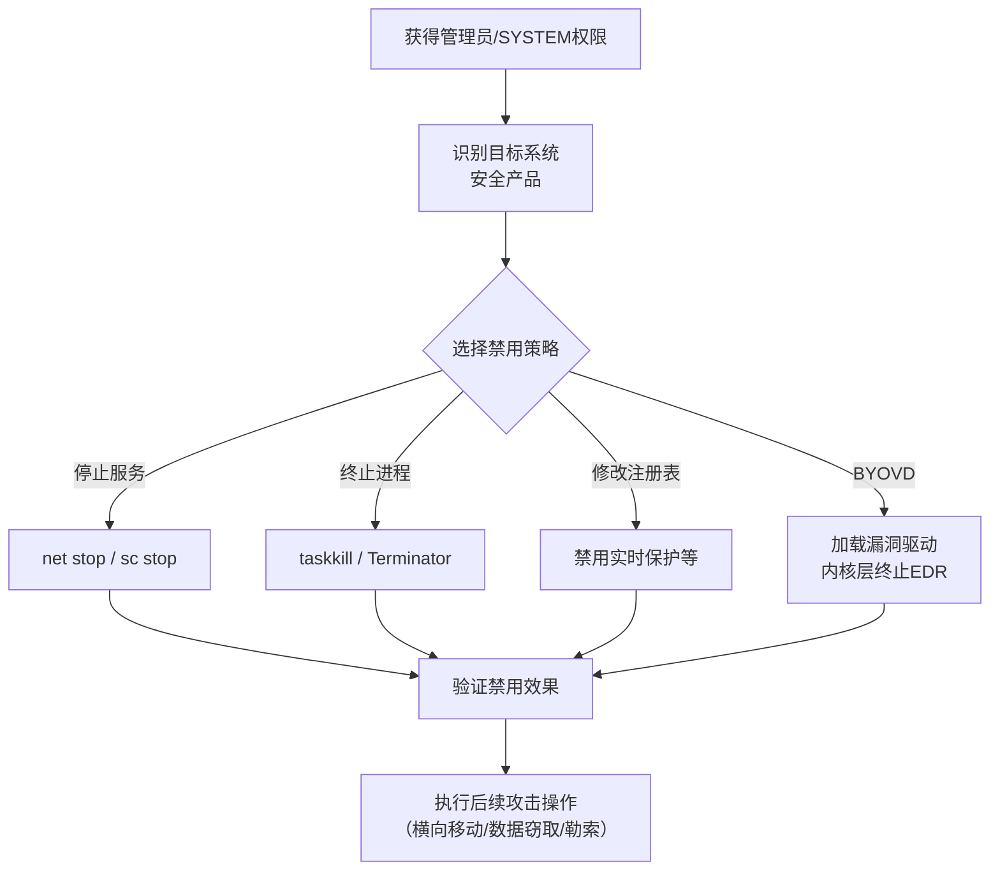

# 削弱防御 (T1562)

## 一句话通俗理解

> **削弱防御就是直接关掉保安系统** -- 停掉监控、关掉报警器、拔掉门禁电源，让保安变成摆设。

## 难度等级

- ⭐⭐ 中级（需要一定基础）

需要管理员权限，但操作本身不复杂，使用系统命令即可完成。

## 技术描述

削弱防御（Impair Defenses，T1562）是MITRE ATT&CK框架中防御削弱战术的核心技术，也是该战术下子技术最多的技术之一。

> 📚 **打个比方**：就像小偷进门前先把摄像头电源拔了、把报警器电池卸了——削弱防御就是攻击者直接停止安全服务、关闭防火墙、禁用日志记录，让安全产品彻底变成摆设，后续所有攻击行为都不会被发现。

**通俗解释：**
你家安装了智能安防系统（摄像头、门磁、烟雾报警器），小偷要进来偷东西，最简单的办法不是绕过这些设备，而是直接把电源拔了、把摄像头转个方向、把报警器的电池卸了。T1562就是这个思路 -- 不是想方设法瞒过安全产品，而是直接让它不能工作。

**技术原理：**
攻击者通常在获得管理员或SYSTEM权限后立即执行防御削弱操作。主要方法包括：

1. **停止安全服务**：使用`net stop`、`sc stop`或`taskkill`终止安全产品的进程和服务
2. **修改配置**：通过注册表、组策略或配置文件禁用安全功能（如实时保护、行为监控）
3. **删除或修改安全工具文件**：删除安全产品的驱动文件或修改其运行权限
4. **BYOVD内核级终止**：利用有漏洞的签名驱动从内核层终止EDR进程
5. **禁用日志**：关闭Windows事件日志、修改云日志配置（如禁用AWS CloudTrail）

**用途与影响：**
防御削弱是攻击链中最关键的步骤之一。如果没有有效的防御削弱，攻击者的每一步操作都可能触发告警。成功的防御削弱的系统上，安全产品可能报告"正常运行"，但实际上已经失去了检测能力。

## 子技术列表

**该技术共有 11 个子技术：**

| 子技术ID | 中文名称 | 通俗解释 |
|----------|----------|----------|
| T1562.001 | 禁用或修改工具 | 直接停止/卸载安全产品（如`net stop WinDefend`） |
| T1562.002 | 禁用Windows事件日志 | 关闭日志记录，让操作不留痕迹 |
| T1562.003 | 禁用或修改系统防火墙 | 放开网络限制，允许恶意流量通过 |
| T1562.004 | 禁用或修改日志转发 | 阻止日志发送到SIEM，让安全团队看不到告警 |
| T1562.006 | 指标阻止 | 阻止已知威胁指标被检测系统识别 |
| T1562.007 | 禁用或修改代码签名策略 | 允许未签名的恶意代码被执行 |
| T1562.008 | 禁用或修改云日志 | 关闭AWS CloudTrail等云审计日志 |
| T1562.009 | 禁用或修改网络流量分析 | 干扰IDS/IPS等网络检测设备 |
| T1562.010 | 禁用或修改启动完整性验证 | 破坏Secure Boot等启动安全机制 |
| T1562.011 | 禁用或修改云实例元数据服务 | 利用云元数据服务进行凭据窃取 |

<details>
<summary><strong>展开查看各子技术详细说明</strong></summary>

各子技术详细说明请参阅独立文档：

- [T1562.001 - 禁用或修改工具](./T1562/T1562.001-Disable-or-Modify-Tools.md) — 直接把安全软件关掉。
- [T1562.008 - 禁用或修改云日志](./T1562/T1562.008-Disable-or-Modify-Cloud-Logs.md) — 关掉云服务商的监控录像。

</details>

## 攻击流程

### 典型攻击流程

```
获得管理员权限 --> 识别安全产品 --> 选择禁用策略 --> 执行禁用 --> 验证效果并执行攻击
```



**步骤详解：**

1. **获得管理员权限**
   - 通俗描述：攻击者首先需要获得系统的高权限
   - 技术细节：通过漏洞利用、凭据窃取或提权获得管理员/SYSTEM权限
   - 常用工具：Mimikatz、提权漏洞利用

2. **识别安全产品**
   - 通俗描述：查看目标系统装了哪些安全软件
   - 技术细节：通过WMI查询、服务列表、进程列表枚举安全产品
   - 常用工具：`sc query`、`tasklist`、WMI

3. **选择并执行禁用策略**
   - 通俗描述：根据目标上的安全产品类型选择合适的禁用方法
   - 技术细节：使用服务停止命令、注册表修改或BYOVD技术
   - 常用工具：`net stop`、`Set-MpPreference`、EDRKillShifter

4. **验证禁用效果**
   - 通俗描述：确认安全产品已被成功禁用
   - 技术细节：检查服务状态、尝试运行恶意文件测试
   - 常用工具：`sc query WinDefend`

5. **执行后续攻击**
   - 通俗描述：安全产品失效后，放心地进行后续操作
   - 技术细节：横向移动、凭据窃取、数据加密等
   - 常用工具：根据目标选择

## 真实案例

### 案例1：Qilin和Warlock使用BYOVD中断EDR保护（2025-2026年）

- **时间**: 2025-2026年
- **目标**: 全球企业（制造业、金融服务）
- **攻击组织**: Qilin RaaS / Warlock (Water Manaul)
- **手法**: Qilin和Warlock两个勒索软件团伙使用BYOVD技术部署内核级EDR终止工具，可终止超过300种EDR驱动。Qilin通过DLL sideloading加载msimg32.dll，经过四阶段loader安装两个内核驱动（rwdrv.sys和hlpdrv.sys）清除EDR。Warlock利用Active Directory GPO分发自定义NSecKrnl.sys驱动到整个域内系统。统计显示约25%的勒索软件攻击在2024-2025年期间使用了BYOVD方法。
- **影响**: 多个大型企业遭受勒索软件攻击，造成重大经济损失
- **参考链接**: [Cybersec Sentinel - BYOVD Ransomware](https://cybersecsentinel.com/byovd-ransomware-attacks-now-capable-of-defeating-every-major-edr-product)

### 案例2：RansomHub使用EDRKillShifter禁用EDR（2024年）

- **时间**: 2024-2025年
- **目标**: 全球医疗、制造、金融行业
- **攻击组织**: RansomHub
- **手法**: RansomHub操作员使用BYOVD技术加载RTCore64.sys漏洞驱动获得内核级内存读写能力，直接终止EDR进程。RansomHub还开发了EDRKillShifter工具实现自动化。Cisco Talos报告称在2024年处理的案例中，大多数勒索软件操作尝试禁用EDR，成功率约48%。
- **影响**: 全球数百家企业遭受勒索软件加密
- **参考链接**: [CISA - RansomHub Advisory](https://www.cisa.gov/news-events/cybersecurity-advisories/aa24-295a)

### 案例3：Volt Typhoon使用LOLBins隐蔽禁用防御（2024-2025年）

- **时间**: 2024-2025年
- **目标**: 美国关键基础设施（通信、能源、水务）
- **攻击组织**: Volt Typhoon
- **手法**: Volt Typhoon几乎不使用自定义恶意软件，完全依赖系统自带工具（PowerShell、WMI、cmd.exe）执行防御削弱操作。攻击者使用PowerShell修改Windows Defender配置、修改审计策略降低日志级别、清除事件日志。所有操作都使用系统自带的合法工具，安全产品难以区分正常管理操作和恶意活动，在某些网络中维持了长达5年的持久访问。
- **影响**: 美国关键基础设施长期遭受间谍活动
- **参考链接**: [CISA - Volt Typhoon Advisory](https://www.cisa.gov/news-events/cybersecurity-advisories/aa24-038a)

### 案例4：Conti勒索软件批量禁用安全服务（2021年）

- **时间**: 2021年
- **目标**: 全球医疗机构及企业
- **攻击组织**: Conti
- **手法**: Conti使用名为`kill.bat`的脚本，包含超过100条命令，针对Windows Defender、Kaspersky、ESET、BitDefender等主流安全产品，通过`sc stop`、`sc delete`、`taskkill`和注册表修改等方式永久禁用防御。
- **影响**: 医疗机构服务中断，数据被加密
- **参考链接**: [MITRE - Conti (S0575)](https://attack.mitre.org/software/S0575/)

## 红队视角

> ⚠️ **免责声明**：以下内容仅用于合法的安全测试、渗透测试和教育目的。未经授权对他人系统进行测试是违法行为。

### 实战技巧

1. **BYOVD优先策略**
   BYOVD技术可从内核层终止EDR，比用户态`net stop`更隐蔽。优先从LOLDrivers数据库查找可用的漏洞驱动。

2. **分步禁用策略**
   不要一次性禁用所有安全产品，会被安全团队立即发现。先在边缘系统上测试，确认有效后再扩大范围。

3. **配合日志清除**
   禁用安全产品会产生日志事件，需要配合T1070（清除痕迹）使用。在禁用前后都要清除相关日志。

### 常用工具

| 工具名称 | 用途 | 平台 | 链接 |
|----------|------|------|------|
| EDRKillShifter | 自动化EDR终止工具 | Windows | 暗网 |
| Terminator | EDR终止工具 | Windows | 暗网 |
| LOLDrivers | 漏洞驱动数据库 | 网站 | [官网](https://www.loldrivers.io/) |
| Process Hacker | 进程管理工具 | Windows | [GitHub](https://github.com/processhacker/processhacker) |
| PowerSploit | PowerShell渗透框架 | Windows | [GitHub](https://github.com/PowerShellMafia/PowerSploit) |

### 注意事项

- 禁用安全产品会产生明显的日志事件（事件ID 7036服务状态变更）
- 某些EDR有防篡改保护（Tamper Protection），需要先绕过
- 云环境中禁用日志的操作会被记录在控制台审计日志中

## 蓝队视角

### 检测要点

1. **安全服务异常停止**
   - 日志来源：Windows事件ID 7036（服务状态变更）
   - 关注字段：服务名称、新状态、旧状态
   - 异常特征：安全产品服务在非维护时间被停止

2. **安全注册表修改**
   - 日志来源：注册表审计（事件ID 4657）
   - 关注字段：注册表路径、修改的值名称
   - 异常特征：`DisableRealtimeMonitoring`等安全相关键值被修改

3. **EDR心跳丢失**
   - 日志来源：SIEM/EDR集中管理平台
   - 关注字段：最后心跳时间、端点状态
   - 异常特征：多个端点同时丢失心跳

### 监控建议

- 安全产品的防篡改保护是第一道防线，必须启用
- 管理员权限的严格控制是关键
- 日志转发到外部SIEM是最后的防线

## 检测建议

### 网络层检测

**检测方法：** 监控安全产品禁用后的异常流量

**具体规则/命令示例：**
```
# 监控EDR心跳丢失告警
```

### 主机层检测

**检测方法：** 监控服务状态变更和安全配置修改

**Windows事件ID：**
- 事件ID 7036：服务状态变更
- 事件ID 4657：注册表值修改
- 事件ID 4688：新进程创建（监控`sc stop`、`net stop`执行）
- Sysmon事件ID 1：进程创建

**具体命令示例：**
```powershell
# 查看安全服务状态变更
Get-WinEvent -FilterHashtable @{LogName='System'; ID=7036} | Where-Object {$_.Message -like "*Defender*" -or $_.Message -like "*Security*"}

# 检查Windows Defender状态
Get-MpPreference
```

### 应用层检测

**Sigma规则示例：**
```yaml
title: Security Service Stopped
status: experimental
description: Detects stopping of security-related services
logsource:
    category: service_stop
    product: windows
detection:
    selection:
        EventID: 7036
        ServiceName|contains:
            - 'WinDefend'
            - 'SecurityHealth'
            - 'CrowdStrike'
            - 'SentinelAgent'
    condition: selection
level: high
tags:
    - attack.t1562
```

## 缓解措施

### 优先级1：关键措施

**措施名称：** 启用安全产品的防篡改保护

**具体实施步骤：**
1. 启用Windows Defender Tamper Protection
2. 配置受保护的进程（PPL）保护EDR进程
3. 启用Microsoft Vulnerable Driver Blocklist

**配置示例：**
```powershell
# 启用Windows Defender防篡改
Set-MpPreference -DisableTamperProtection $false
```

### 优先级2：重要措施

**措施名称：** 部署日志转发和不可变日志存储

**具体实施步骤：**
1. 配置Windows Event Forwarding (WEF)到中央SIEM
2. 实施不可变日志存储（WORM存储或Azure Sentinel不可变存储）
3. 配置安全产品的日志心跳告警

### 优先级3：建议措施

**措施名称：** 严格权限管控

**具体实施步骤：**
1. 实施最小权限原则
2. 限制管理员权限的使用场景
3. 对安全产品注册表键实施ACL保护

### MITRE ATT&CK缓解措施映射

| 缓解措施ID | 缓解措施名称 | 适用性 | 说明 |
|------------|-------------|--------|------|
| M1040 | 防篡改 | 适用 | 启用安全产品的防篡改保护 |
| M1047 | 审计 | 适用 | 监控安全产品状态变更 |
| M1018 | 用户账户管理 | 适用 | 限制管理员权限 |
| M1026 | 特权账户管理 | 适用 | 严格管理高权限账户 |
| M1030 | 网络分段 | 部分适用 | 限制攻击面 |

## 动手实验

> ⚠️ **重要提示**：所有实验必须在隔离的实验室环境中进行，禁止对未授权的真实系统进行测试。

### 实验环境准备

**推荐靶场/实验平台：**

| 平台名称 | 类型 | 难度 | 链接 |
|----------|------|------|------|
| Windows 10/11虚拟机 | 虚拟化 | 初级 | 使用Hyper-V或VMware |

**所需工具：**
- Windows 10/11虚拟机（管理员权限，使用快照保护）

**环境搭建：**
创建一个Windows虚拟机并拍摄快照，以便实验后恢复。

### 实验1：查看安全服务状态和学习禁用命令（初级）

**实验目标：** 学习查看和管理安全服务

**实验步骤：**
1. 打开PowerShell（管理员）
2. 运行 `Get-Service | Where-Object {$_.DisplayName -like "*Defender*" -or $_.DisplayName -like "*Security*"}` 查看安全相关服务
3. 运行 `sc query WinDefend` 查看Windows Defender服务状态
4. 运行 `Get-MpPreference` 查看Defender配置

**预期结果：** 可以查看安全服务的运行状态和配置

**学习要点：** 了解安全产品的服务管理和配置查看方法

### 实验2：模拟防御禁用并观察日志（中级）

**实验目标：** 模拟禁用安全产品并观察产生的日志

**实验步骤：**
1. 拍摄虚拟机快照
2. 运行 `Set-MpPreference -DisableRealtimeMonitoring $true`（禁用实时保护）
3. 查看事件日志中的相关记录：`Get-WinEvent -FilterHashtable @{LogName='Microsoft-Windows-Windows Defender/Operational'}`
4. 使用 `reg query` 查看被修改的注册表项
5. 恢复实时保护：`Set-MpPreference -DisableRealtimeMonitoring $false`

**预期结果：** 观察到禁用操作产生了注册表修改和服务状态变更事件

**学习要点：** 理解禁用操作在日志中的表现

### 实验3：配置防篡改保护和日志转发（高级）

**实验目标：** 配置安全产品的防篡改功能和日志监控

**实验步骤：**
1. 使用组策略启用Windows Defender Tamper Protection
2. 配置Windows事件日志转发（WEF）到收集器服务器
3. 创建自定义事件查看器订阅，监控安全服务状态变更
4. 测试禁用操作是否被防篡改保护阻止
5. 验证日志转发是否正常工作

**预期结果：** 防篡改保护阻止了禁用操作，日志转发将事件发送到中央收集器

**学习要点：** 掌握防御削弱攻击的关键防御措施

## 术语解释

| 术语 | 英文原名 | 通俗解释 |
|------|----------|----------|
| EDR | Endpoint Detection and Response | 端点检测与响应，监控终端安全的高级产品 |
| BYOVD | Bring Your Own Vulnerable Driver | 自带漏洞驱动，利用合法签名但有漏洞的驱动攻击 |
| Tamper Protection | Tamper Protection | 防篡改保护，阻止安全产品的配置被恶意修改 |
| PPL | Protected Process Light | Windows的进程保护机制，阻止非授权进程终止受保护进程 |
| LOLBins | Living off the Land Binaries | 生存于土地的二进制文件，系统自带的合法工具 |
| SIEM | Security Information and Event Management | 安全信息与事件管理平台 |
| WEF | Windows Event Forwarding | Windows事件转发，将日志实时发送到中央收集器 |

## 参考资料

### 官方文档

- [MITRE ATT&CK - T1562 Impair Defenses](https://attack.mitre.org/techniques/T1562/)

### 安全报告

- [CISA - RansomHub Advisory (2024)](https://www.cisa.gov/news-events/cybersecurity-advisories/aa24-295a)
- [CISA - Volt Typhoon Advisory (2024)](https://www.cisa.gov/news-events/cybersecurity-advisories/aa24-038a)
- [Conti Ransomware Analysis](https://attack.mitre.org/software/S0575/)

### 工具与资源

- [LOLDrivers - 漏洞驱动数据库](https://www.loldrivers.io/)
- [EDRSandblast - EDR绕过工具](https://github.com/wavestone-cdt/EDRSandblast)

### 学习资料

- [Windows Defender 防篡改保护配置](https://docs.microsoft.com/en-us/microsoft-365/security/defender-endpoint/prevent-changes-to-security-settings-with-tamper-protection)
