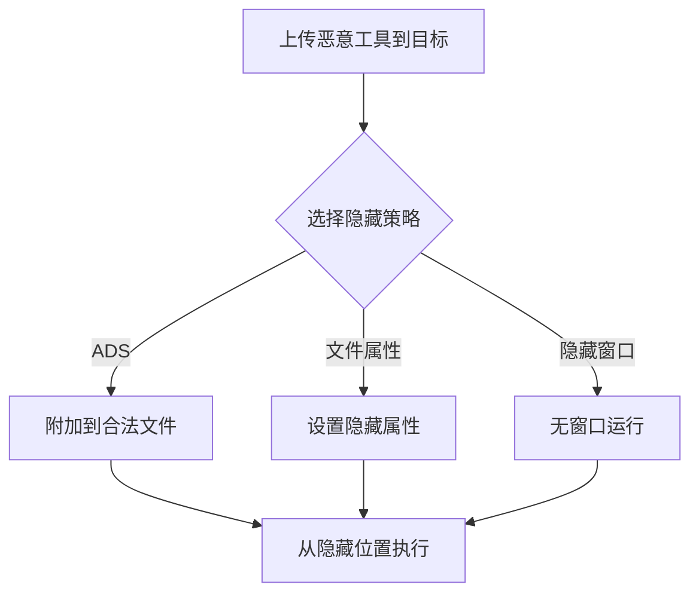

# 隐藏工件 (T1564)

## 一句话通俗理解

> **隐藏工件就是把东西藏在看不见的地方** -- 把违禁品藏在夹层里、把文件藏在系统隐藏目录中、把恶意代码附加在正常文件后面。

## 难度等级

- ⭐⭐ 中级（需要一定基础）

需要了解操作系统隐藏机制，但大部分操作使用系统原生功能即可完成。

## 技术描述

隐藏工件（Hide Artifacts，T1564）是MITRE ATT&CK框架中防御削弱战术的重要技术。

**通俗解释：**
就像小偷会把偷来的珠宝藏在墙缝里而不是放在桌面上，攻击者也会把恶意文件、后门程序、窃取的数据等藏在系统中不容易被发现的地方。操作系统本身提供了很多"隐藏角落"，攻击者充分利用这些特性来逃避检测。

**技术原理：**
攻击者利用操作系统的多种隐藏机制：

1. **文件隐藏**：使用`attrib +h`（Windows）或点前缀`.`（Linux）设置文件隐藏属性
2. **备用数据流（ADS）**：NTFS文件系统特有功能，允许将数据"附加"到现有文件后面，普通工具不会扫描ADS
3. **隐藏窗口**：使用`-WindowStyle Hidden`参数启动无窗口的恶意进程
4. **VBA Stomping**：修改Office宏文档，使防病毒引擎看到的是无害的源代码，但实际执行的是修改后的恶意P-code
5. **隐藏文件系统**：在VHD/ISO容器中存储恶意文件

**用途与影响：**
隐藏技术使恶意组件在常规检查和扫描中不可见，显著增加了检测难度。攻击者可以在目标系统上长期驻留而不被发现。

## 子技术列表

**该技术共有 10 个子技术：**

| 子技术ID | 中文名称 | 通俗解释 |
|----------|----------|----------|
| T1564.001 | 隐藏文件和目录 | 使用`attrib +h`或点前缀隐藏文件 |
| T1564.002 | 隐藏窗口 | 使用`-WindowStyle Hidden`隐藏程序窗口 |
| T1564.003 | 备用数据流(ADS) | 将恶意数据附加到NTFS文件的备用数据流 |
| T1564.004 | NTFS文件属性 | 利用压缩、加密等属性隐藏文件 |
| T1564.005 | 隐藏文件系统 | 在VHD/ISO映像中存储恶意文件 |
| T1564.006 | 运行虚拟实例 | 在虚拟机中运行恶意代码 |
| T1564.007 | VBA Stomping | 修改Office宏的P-code隐藏恶意逻辑 |
| T1564.008 | 邮件隐藏规则 | 创建邮件规则隐藏安全告警邮件 |
| T1564.009 | 资源分支 | 利用macOS资源分支隐藏数据 |
| T1564.010 | 进程参数欺骗 | 修改进程命令行参数伪装为合法进程 |

## 攻击流程



## 真实案例

### 案例1：Medusa勒索软件使用隐藏目录和ADS（2024-2025年）
- **时间**: 2024-2025年
- **目标**: 全球医疗、教育、政府机构
- **攻击组织**: Medusa勒索软件
- **手法**: Medusa将加密器和配置文件存储在NTFS备用数据流(ADS)中，附加在合法系统文件上（如`svchost.exe:config.dat`）。使用`attrib +h +s`设置隐藏和系统属性，使文件在资源管理器中不可见。
- **参考**: [CISA - Medusa Advisory](https://www.cisa.gov/news-events/cybersecurity-advisories/aa24-317a)

### 案例2：APT32使用VBA Stomping（2018-2024年）
- **时间**: 2018-2024年
- **目标**: 东南亚政府和媒体
- **攻击组织**: APT32 (OceanLotus)
- **手法**: APT32使用VBA Stomping隐藏文档宏中的恶意代码，使防病毒引擎看到的是无害的源代码，而实际执行的是修改后的恶意P-code。
- **参考**: [MITRE - APT32](https://attack.mitre.org/groups/G0050/)

### 案例3：Emotet使用隐藏窗口和ADS
- **时间**: 2014-2024年
- **目标**: 全球政府、金融机构
- **手法**: Emotet的PowerShell加载器使用`-WindowStyle Hidden`隐藏窗口执行下载脚本，配置数据存储在ADS中。
- **参考**: [MITRE - Emotet S0367](https://attack.mitre.org/software/S0367/)

## 红队视角

> ⚠️ **免责声明**：以下内容仅用于合法的安全测试、渗透测试和教育目的。未经授权对他人系统进行测试是违法行为。

**实战技巧：**
1. ADS是最常用的隐藏技术之一，大多数安全工具不会扫描ADS
2. 隐藏窗口（`-WindowStyle Hidden`）可以避免用户看到恶意操作的弹窗
3. VBA Stomping可以绕过大量基于宏源代码分析的检测规则

### 常用工具

| 工具名称 | 用途 | 平台 | 链接 |
|----------|------|------|------|
| streams.exe | ADS扫描工具 | Windows | Sysinternals |
| attrib | 文件属性管理 | Windows | 系统自带 |

### 注意事项
- Sysmon事件ID 15可以检测ADS创建
- 某些EDR产品会扫描ADS内容

## 蓝队视角

**防御重点：**
- 启用"显示隐藏文件和系统文件"策略
- 使用Sysmon监控ADS创建事件
- 定期扫描关键目录的ADS内容

## 检测建议

### 网络层检测

**检测方法：** 监控ADS（备用数据流）数据的网外传输和隐藏通道通信

**具体规则/命令示例：**
```bash
# 检测通过ADS隐藏的数据外传
alert tcp $HOME_NET any -> $EXTERNAL_NET any (msg:"ADS Data Exfiltration - Suspicious Stream Transfer"; flow:to_server; classtype:trojan-activity; sid:1000064; rev:1;)

# 检测隐蔽的ICMP隧道（隐藏命令和控制）
alert icmp $HOME_NET any -> $EXTERNAL_NET any (msg:"Covert Channel - Abnormal ICMP Payload"; dsize:>64; itype:8; classtype:policy-violity; sid:1000065; rev:1;)
```

### 主机层检测

**检测方法：** 监控ADS创建、隐藏文件操作和隐藏窗口/进程技术

**Windows事件ID：**
- Sysmon事件ID 15（FileCreateStreamHash）：监控NTFS备用数据流创建
- 事件ID 4688：检测`attrib +h`隐藏文件命令的执行
- PowerShell事件ID 4104：检测`-WindowStyle Hidden`或`-WindowStyle Minimized`参数

**Linux日志：**
- 日志文件：`/var/log/audit/audit.log`
- 关键字段：以`.`开头的隐藏文件/目录创建、`chattr +i`或`chattr +h`命令执行

**具体命令示例：**
```powershell
# 检测ADS创建
Get-WinEvent -FilterHashtable @{LogName='Microsoft-Windows-Sysmon/Operational';ID=15}

# 检测attrib隐藏文件操作
Get-WinEvent -FilterHashtable @{LogName='Security';ID=4688} | Where-Object {$_.Message -match 'attrib' -and $_.Message -match '\+h'}
```

### 应用层检测

**Sigma规则示例：**
```yaml
title: ADS Creation via Sysmon
status: experimental
description: Detects NTFS alternate data stream creation
logsource:
    category: file_event
    product: windows
detection:
    selection:
        EventID: 15
    condition: selection
level: medium
tags:
    - attack.t1564
```

## 缓解措施

### 优先级1：关键措施

**措施名称：** 启用Windows资源管理器的显示隐藏文件和系统文件

**具体实施步骤：**
1. 通过组策略启用"显示隐藏文件、文件夹和驱动器"
2. 禁用"隐藏已知文件类型的扩展名"
3. 配置Windows资源管理器显示受保护的操作系统文件

**配置示例：**
```powershell
# 配置资源管理器显示隐藏文件
Set-ItemProperty -Path "HKCU:\Software\Microsoft\Windows\CurrentVersion\Explorer\Advanced" -Name "Hidden" -Value 1
Set-ItemProperty -Path "HKCU:\Software\Microsoft\Windows\CurrentVersion\Explorer\Advanced" -Name "ShowSuperHidden" -Value 1
```

### 优先级2：重要措施

**措施名称：** 配置Office安全策略和ASR规则

**具体实施步骤：**
1. 配置Office安全策略禁用宏执行
2. 启用Windows Defender ASR规则阻止Office创建子进程
3. 监控Sysmon事件ID 15检测ADS创建行为

**配置示例：**
```powershell
# 配置Office禁用所有宏
Set-ItemProperty -Path "HKLM:\SOFTWARE\Microsoft\Office\16.0\Common\Security" -Name "VBAWarnings" -Value 4
```

### MITRE ATT&CK缓解措施映射

| 缓解措施ID | 缓解措施名称 | 适用性 | 说明 |
|------------|-------------|--------|------|
| M1054 | 软件配置 | 适用 | 启用Windows资源管理器的显示隐藏文件设置 |
| M1045 | 软件限制策略 | 适用 | 配置Office安全策略禁用宏执行 |
| M1038 | 执行防护 | 适用 | 启用Windows Defender ASR规则阻止Office创建子进程 |
## 动手实验

> ⚠️ **重要提示**：所有实验必须在隔离的实验室环境中进行，禁止对未授权的真实系统进行测试。

### 实验1：创建和查看ADS（初级）
```powershell
# 创建ADS
echo "secret data" > C:\temp\normal.txt:hidden.txt
# 查看ADS
more < C:\temp\normal.txt:hidden.txt
# 检测ADS
dir /r C:\temp\
```

### 实验2：隐藏窗口执行（中级）
```powershell
powershell -WindowStyle Hidden -Command "Start-Process notepad"
```

## 术语解释

| 术语 | 英文原名 | 通俗解释 |
|------|----------|----------|
| ADS | Alternate Data Streams | 备用数据流，NTFS文件系统的特性，允许一个文件关联多个数据流 |
| VBA Stomping | VBA Stomping | 修改Office文档的P-code使其与源代码不一致的技术 |
| P-code | P-code | 编译后的伪代码，Office VBA的实际执行形式 |

## 参考资料

- [MITRE ATT&CK - T1564 Hide Artifacts](https://attack.mitre.org/techniques/T1564/)
- [CISA - Medusa Ransomware Advisory (2024)](https://www.cisa.gov/news-events/cybersecurity-advisories/aa24-317a)
